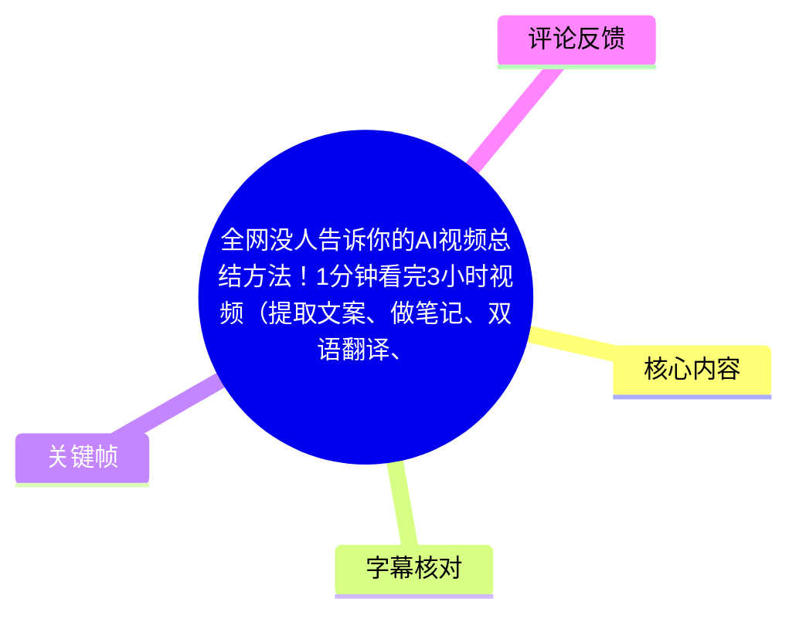
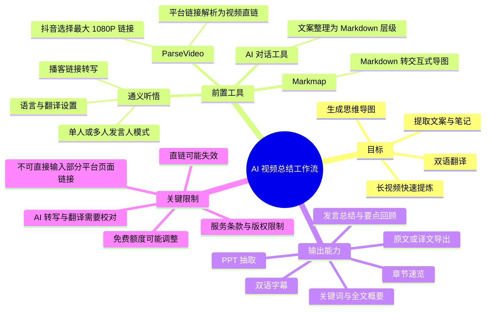
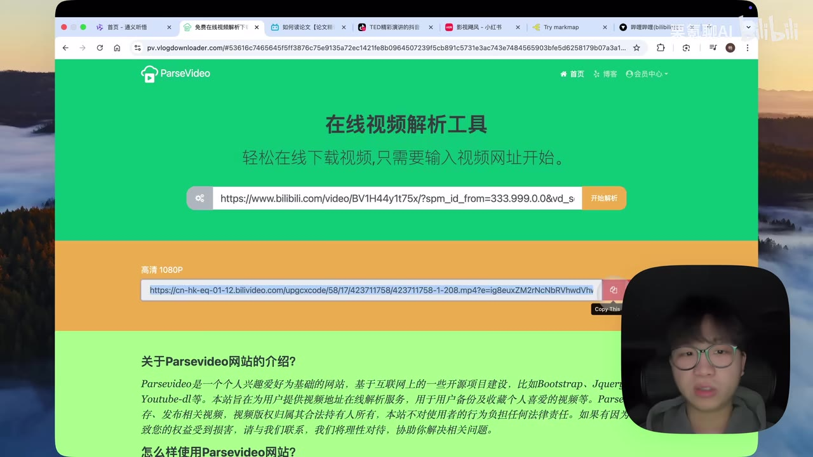
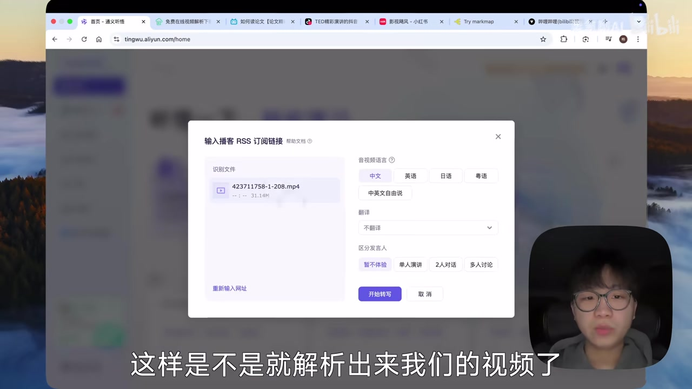
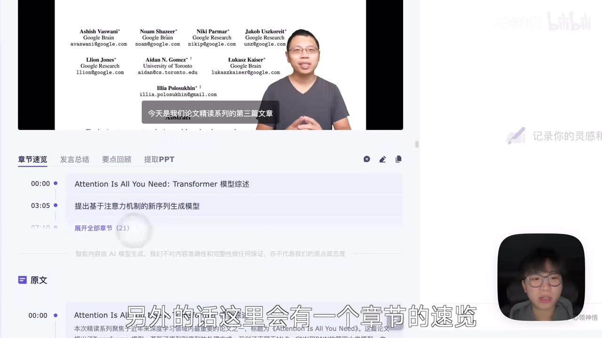

# 全网没人告诉你的AI视频总结方法！1分钟看完3小时视频（提取文案、做笔记、双语翻译、思维导图全搞定!）

> 来源：[Bilibili 视频](https://www.bilibili.com/video/BV1Fsi6Y1EHU)  
> UP 主：栗氪聊AI｜发布时间：2024-12-06｜视频时长：5 分 56 秒  
> 本文将视频中提到的工具名称按画面与上下文校正为：**ParseVideo、通义听悟、Markmap**。这些服务的功能、可用平台、免费额度与链接解析政策均可能已经变化。

## 小结

视频提出了一条“**平台链接 → 视频直链 → AI 转写总结 → 文案/翻译/PPT → Markdown 思维导图**”的工作流。核心并不是直接把 Bilibili、抖音或小红书的页面链接交给总结工具，而是先借助 **ParseVideo** 解析出可访问的视频地址，再由 **通义听悟**的“播客链接转写”功能处理。

UP 主将该方法定位为面向网课、知识视频、英语演讲等长视频场景的效率工具：通义听悟可产出关键词、全文概要、章节速览、发言总结、要点回顾、PPT 抽取和原文摘取；对于外语视频，还可选择原语言识别并翻译为中文，从而获得双语字幕和译文。

视频特别演示了一个常见失败点：**直接粘贴 Bilibili 页面链接无法解析**；只有经 ParseVideo 取得视频直链后，才在演示中成功导入通义听悟。对于抖音，解析结果可能出现多个不同分辨率的直链，视频建议选择最大的 **1080P** 链接。

进阶环节把“视频总结”延伸到知识整理：复制通义听悟导出的文案，要求任意 AI 对话工具将其组织成层级式 Markdown，再粘贴到 **Markmap**，即可生成可展开、收起、编辑、下载的思维导图；视频称可导出图片或交互式网页。

需要谨慎看待视频中的“支持任何平台”“无需下载”“免费可用”等表述。这是 2024 年发布时的演示结论，而热评中已有用户反馈通义听悟后来提示因服务条款限制，不能直接解析包括 Bilibili、抖音等平台的链接。即使采用“直链中转”方式，也可能受到版权、跨域、登录、地区、链接时效、平台反爬与服务政策影响。

## 思维导图





## 目录

- [问题与工具链](#问题与工具链)
- [Bilibili：从页面链接到视频总结](#bilibili从页面链接到视频总结)
- [通义听悟的输出与文案、PPT提取](#通义听悟的输出与文案ppt提取)
- [抖音英语视频：分辨率选择与双语翻译](#抖音英语视频分辨率选择与双语翻译)
- [小红书视频的同类操作](#小红书视频的同类操作)
- [把文案变成可交互思维导图](#把文案变成可交互思维导图)
- [参数、额度与适用边界](#参数额度与适用边界)
- [可复用操作清单](#可复用操作清单)
- [字幕比对](#字幕比对)
- [评论分析](#评论分析)
- [处理记录](#处理记录)

## [问题与工具链](https://www.bilibili.com/video/BV1Fsi6Y1EHU?t=0)

视频开头称，此方法可用于 Bilibili、抖音、小红书等平台的视频，目标是减少手动记笔记的工作量，并将视频内容自动转化为文案、章节和翻译结果。UP 主此前测试过四个 AI 视频总结工具，但称它们存在两类限制：

1. 只能处理本来就带字幕的视频；
2. 需要先将视频下载到本地。

本期方案试图绕过上述流程：用在线视频解析网站先取得媒体直链，再将直链提交给转写总结服务。视频明确使用两个主要工具：

| 工具 | 视频中承担的角色 | 关键输入/输出 |
| --- | --- | --- |
| ParseVideo | 从平台页面链接解析出视频地址 | 输入平台链接，输出视频直链及可能的多分辨率版本 |
| 通义听悟 | 视频转写、总结、翻译和结构化提取 | 输入视频直链，输出转写、摘要、章节、PPT、原文/译文等 |
| AI 对话工具 | 将长文本重组为 Markdown 大纲 | 输入提取的文案，输出层级式 Markdown |
| Markmap | 将 Markdown 可视化为导图 | 输入 Markdown，输出交互式思维导图 |

视频中的“任何平台”“几乎所有网站”属于 UP 主的使用判断，不应理解为对所有平台、所有视频均稳定可用的保证。

## [Bilibili：从页面链接到视频总结](https://www.bilibili.com/video/BV1Fsi6Y1EHU?t=14)

### [步骤 1：复制 Bilibili 视频页面链接并在 ParseVideo 解析](https://www.bilibili.com/video/BV1Fsi6Y1EHU?t=14)

操作从一个 Bilibili 视频页面开始：

1. 复制待总结视频的页面链接；
2. 打开 ParseVideo；
3. 将页面链接粘贴至输入框；
4. 点击“开始解析”；
5. 从解析结果中复制生成的视频地址。



> 图：画面显示 ParseVideo 页面上方输入的是 Bilibili 链接，下方出现“高清 1080P”及一条可复制的媒体地址。这张图直接说明了本方法的中间产物是“视频直链”，而非原平台页面 URL。

### [步骤 2：不要把 Bilibili 页面地址直接粘到通义听悟](https://www.bilibili.com/video/BV1Fsi6Y1EHU?t=37)

视频以失败示例强调：在通义听悟中直接输入 Bilibili 网站地址、点击解析，演示结果为无法解析。随后，将 ParseVideo 输出的视频地址复制到通义听悟，才得到可处理的视频。

因此，视频给出的关键操作条件是：

- **错误输入**：`https://www.bilibili.com/video/...` 等页面链接；
- **演示成功的输入**：由 ParseVideo 生成、指向视频文件的直链；
- **通义听悟入口**：画面中称为“播客链接转写”。



> 图：窗口显示已识别的视频文件，并提供“中文、英语、日语、粤语”等语言选项、翻译选项、发言人区分方式与“开始转写”按钮。这一帧补足了文字中涉及的具体设置项。

### [步骤 3：设置语言、翻译和发言人模式](https://www.bilibili.com/video/BV1Fsi6Y1EHU?t=61)

在将视频直链导入通义听悟后，视频展示了以下配置：

| 配置项 | 视频说明 | 实践含义 |
| --- | --- | --- |
| 音视频语言 | 中文、英语、日语、粤语 | 应按原视频实际语言选择，否则识别质量可能下降 |
| 翻译 | 可选择是否翻译 | 外语学习、跨语言阅读时启用；中文原视频未必需要 |
| 发言人区分 | 单人演讲、多人对话等 | 多人访谈、讨论类视频宜选择多人模式，以便归纳不同发言人内容 |
| 开始转写 | 提交任务 | 之后进入转写与总结结果页面 |

视频并未给出各语言、各人数模式下的识别准确率、最大时长或文件大小上限，因此这些参数不能据此推断。

## [通义听悟的输出与文案、PPT提取](https://www.bilibili.com/video/BV1Fsi6Y1EHU?t=85)

### [总结页面包含哪些内容](https://www.bilibili.com/video/BV1Fsi6Y1EHU?t=85)

视频称任务完成后，通义听悟会给出多层次结果：

- **关键词**：快速标示视频主题；
- **全文概要**：对整段视频做概括；
- **章节速览**：按视频内容划分章节，并为各章节生成主题与摘要；
- **播放器上方的章节信息**：方便跳转到不同主题；
- **发言总结**：归纳发言人内容；
- **要点回顾**：汇总整段视频的核心信息。



> 图：画面中的结果区可见“章节速览、发言总结、要点回顾、提取PPT”等标签，章节列表带有时间点。这能说明视频所说的总结并非单一摘要，而包含带时间定位的结构化结果。

视频展示的样例是与 Transformer 论文解读有关的视频；样例章节标题包括“Attention Is All You Need: Transformer 模型综述”等。它只是被总结的样本内容，不是本视频本身的教学主题。

### [PPT 抽取功能](https://www.bilibili.com/video/BV1Fsi6Y1EHU?t=113)

UP 主认为“提取 PPT”对于刷网课尤其有用。操作逻辑是：

1. 在通义听悟结果页点击“提取 PPT”；
2. 系统根据视频画面变化提取疑似幻灯片画面；
3. 可导出当前图片；
4. 也可导出全部提取结果，并合成为 PDF。

这是一种依据画面变化进行的抽帧整理，而不是对每一页课件进行人工校对。因此，快速切镜、动画、讲师遮挡、屏幕录制压缩或非 PPT 画面，都可能影响提取结果。导出前应检查重复页、漏页与文字清晰度。

### [提取完整文案](https://www.bilibili.com/video/BV1Fsi6Y1EHU?t=137)

若目标是获取整段视频文本，视频建议在结果页点击“摘取原文”。在弹窗中可选择是否保留：

- 发言人信息；
- 时间戳信息。

UP 主示范的需求是“只要视频文案”，因此不保留上述附加信息，确认后取得完整文本。实际使用时可按用途选择：

| 使用目的 | 建议保留项 |
| --- | --- |
| 只做内容再加工、喂给 AI 整理 | 可不保留发言人与时间戳，以减少文本噪声 |
| 校对原视频、制作引用笔记 | 保留时间戳 |
| 访谈纪要、会议记录 | 保留发言人和时间戳 |
| 课程复盘 | 至少保留时间戳，便于回看原片 |

## [抖音英语视频：分辨率选择与双语翻译](https://www.bilibili.com/video/BV1Fsi6Y1EHU?t=137)

### [抖音直链可能有多个版本](https://www.bilibili.com/video/BV1Fsi6Y1EHU?t=161)

抖音的操作路径与 Bilibili 相同：复制平台链接，在 ParseVideo 解析，再将视频直链提交至通义听悟。不同之处在于，视频称抖音解析后可能出现多个链接，分别对应不同分辨率。

视频给出的选择建议是：**选择最大的 1080P 链接**。更高分辨率通常更有利于 PPT 抽取和画面中文字识别，但也可能带来更大的网络传输量、加载失败风险或服务端处理限制；视频没有对这些性能差异作量化测试。

### [英语识别与中文翻译](https://www.bilibili.com/video/BV1Fsi6Y1EHU?t=161)

演示中的抖音样例为英语演讲视频，设置为：

1. 音视频语言选择**英语**；
2. 翻译目标选择**中文**；
3. 点击“开始转写”。

视频称，几分钟的视频“基本上就是 5 秒”可完成转写。这是 UP 主演示时的观察值，并非稳定服务承诺；实际耗时受视频时长、并发、清晰度、网络、账号权限和服务负载影响。

### [双语结果与原文、译文的区别](https://www.bilibili.com/video/BV1Fsi6Y1EHU?t=186)

转写完成后，视频展示：

- 章节速览为中文；
- 发言总结与要点回顾可用；
- 视频播放区域出现双语字幕；
- 即便原视频本身没有字幕，也可在结果页面查看生成的双语文本。

导出文本时，视频区分两种结果：

| 操作 | 得到的文本 |
| --- | --- |
| 摘取原文 | 英语原始转写文本 |
| 摘取翻译结果 | 英语内容被译为中文后的文本 |

注意，“原文”在这里更准确地说是 AI 对原始语音的转写，不必然等同于演讲者预先准备的官方逐字稿。专名、数字、术语、口音和断句仍应抽查。

## [小红书视频的同类操作](https://www.bilibili.com/video/BV1Fsi6Y1EHU?t=210)

视频用一个小红书中的“影视飓风”样例说明，流程没有发生本质变化：

1. 在小红书视频页面复制链接；
2. 在 ParseVideo 粘贴链接并开始解析；
3. 复制解析后的视频地址；
4. 进入通义听悟，选择“播客链接转写”；
5. 输入视频直链并开始解析/转写；
6. 在结果页查看总结。

UP 主称该样例已成功总结完成。这里应区分“该次演示可用”与“所有小红书视频均可用”：公开视频的可访问性、反爬规则、登录限制、内容权限和直链有效期都会影响复现。

## [把文案变成可交互思维导图](https://www.bilibili.com/video/BV1Fsi6Y1EHU?t=258)

### [先让 AI 把长文案整理成 Markdown 层级](https://www.bilibili.com/video/BV1Fsi6Y1EHU?t=258)

视频的导图生成不是直接由通义听悟完成，而是多一步文本结构化：

1. 从通义听悟复制提取出来的视频文案；
2. 打开任意 AI 对话软件；
3. 输入类似提示词：  
   > 帮我将以下内容整理成 Markdown 格式的层级思维导图
4. 在提示词下粘贴视频文案；
5. 等待 AI 输出 Markdown 格式的大纲。

为提高导图质量，可在不改变原意的前提下补充约束，例如：

```text
请将以下视频文案整理为 Markdown 格式的层级思维导图。
要求：
1. 保留原文的事实、步骤、参数与限制；
2. 一级标题不超过 6 个；
3. 每个节点尽量短；
4. 不要补充原文没有的信息；
5. 将“风险/限制/待验证项”单列。
```

视频未展示不同 AI 模型的效果差异。对于长文案，应防范 AI 漏掉限定条件、将例子误写为结论，或把转写错误进一步固化到导图中。

### [在 Markmap 中生成、编辑与导出](https://www.bilibili.com/video/BV1Fsi6Y1EHU?t=266)

获得 Markdown 后，视频将其复制到 Markmap。Markmap 会把左侧的 Markdown 文本即时转换为右侧的思维导图。

视频展示的能力包括：

- 点击节点以展开或收起；
- 在左侧直接修改 Markdown；
- 修改后右侧导图随之变化；
- 下载为图片；
- 下载为交互式网页。

视频以“实验与结果”为例：在左侧删去“与结果”后，右侧节点同步改为“实验”。这表明 Markdown 是导图的源数据，结构编辑应优先在 Markdown 文本中进行。

## [参数、额度与适用边界](https://www.bilibili.com/video/BV1Fsi6Y1EHU?t=308)

### [视频中声称的免费额度](https://www.bilibili.com/video/BV1Fsi6Y1EHU?t=332)

视频发布时，UP 主给出的额度说法如下：

| 服务 | 视频中的说法 | 时效性判断 |
| --- | --- | --- |
| 通义听悟 | 每天登录赠送 **10 小时**总结时长 | 账户政策，可能随地区、账号、活动或产品版本调整 |
| ParseVideo | 每天免费解析 **10 个网站/视频** | 网站限额和可解析站点可能变化 |
| 其他同类解析站 | 可寻找免费替代品，如“BBT 视频下载”等 | 视频未给出稳定性、隐私与合规验证 |

这些是视频中的历史陈述，不能视为当前仍有效的官方资费说明。使用前应以工具官网页面、账号实际额度和最新服务条款为准。

### [方法的现实限制与风险](https://www.bilibili.com/video/BV1Fsi6Y1EHU?t=332)

1. **平台链接限制**：视频本身已证明，至少在演示场景里，Bilibili 页面链接不能直接提交通义听悟。
2. **直链时效性**：解析出的媒体链接可能携带签名、过期时间或访问限制，复制后未必长期有效。
3. **版权和条款**：平台与第三方工具可能限制对受版权保护内容的解析、下载或再处理。应仅处理具有访问与使用权限的内容。
4. **隐私与数据安全**：上传或提交直链意味着内容可能被第三方服务处理。会议、课程、商业资料、个人视频等含敏感信息的内容，应先评估数据处理政策。
5. **转写和翻译误差**：自动字幕可能误识别术语、数字、人名、英文缩写和说话人归属；重要学习、研究或工作材料必须回看原视频校验。
6. **PPT 抽取不是原课件**：它依赖画面变化抽帧，无法保证获得完整、无重复、无压缩损失的原始幻灯片。
7. **“无需下载”不等于不产生副本**：虽然用户不必手动下载，但解析服务与转写服务可能仍在服务端获取、缓存或处理媒体数据；具体机制视频未说明。
8. **免费额度不可依赖**：每日额度、解析速度与支持站点均可能调整，不能把视频中的额度当作长期生产流程的固定前提。

## [可复用操作清单](https://www.bilibili.com/video/BV1Fsi6Y1EHU?t=14)

以下清单按视频实际演示顺序整理，适合在具备内容访问权限时执行：

1. **确定目标**：是要快速摘要、逐字文案、双语学习、PPT 图片，还是导图。
2. **复制平台视频链接**：可来自 Bilibili、抖音、小红书等视频页面。
3. **在 ParseVideo 解析链接**：获取视频直链；若有多档分辨率，视频针对抖音建议选 1080P。
4. **复制视频直链**：不要将原平台页面链接直接代替直链提交给通义听悟。
5. **进入通义听悟的“播客链接转写”**：粘贴直链。
6. **设置识别参数**：
   - 按原视频选择中文、英语、日语或粤语；
   - 需要跨语言阅读时开启翻译；
   - 按单人演讲或多人对话选择发言人模式。
7. **开始转写并检查结果**：
   - 看关键词、全文概要、章节速览；
   - 需要追踪不同说话人时查看发言总结；
   - 需要复习时查看要点回顾。
8. **按目的导出**：
   - 提取 PPT：导出当前页或整套 PDF；
   - 摘取原文：按需保留时间戳和发言人；
   - 摘取译文：获取翻译后的文本。
9. **制作导图**：
   - 将文案交给 AI 对话工具整理为 Markdown 层级；
   - 将 Markdown 粘贴进 Markmap；
   - 编辑节点后导出图片或交互式网页。
10. **最后校验**：对重要结论、数字、术语和引用片段回看原视频；确认所用链接、工具政策和版权条件仍有效。

## 字幕比对

本次素材中存在两套互相冲突的字幕。已检查本次 ASR；ASR 诊断未标记 `noAudioStream=true`，并且音频时长约为 355.95 秒、语音覆盖率为 97.75%，说明源视频**存在音轨**，不属于“无音轨视频”。

| 字幕来源 | 完整性 | 专有名词 | 时间轴 | 主要问题 |
| --- | --- | --- | --- | --- |
| Bilibili 站内字幕 `p01-ai-zh.srt` | 与本视频主题严重不符，内容约在 4 分 17 秒结束 | 出现“魔镜”“反诈”“打劫”等与 AI 视频总结无关的词 | 分段时间本身完整，但对应的是错误内容 | 疑似错配至另一条剧情/反诈类视频，不能用于正文 |
| 本次 ASR `asr/transcript.srt` | 覆盖 00:00–05:55.880，19 段，语音覆盖率 97.75% | 工具名存在音近误识别，如“通译听物”“pass video”“Markmap”相关文本不稳定 | 含有效起止时间，且与视频时长 356 秒一致 | 自动识别有较多错别字、断词和同音替换，需结合画面校正 |

### 最终字幕选择与校正

正文以**本次 ASR 的时间轴**为准，因为它与本视频主题、时长和演示流程一致；再依据关键帧中的页面文字和上下文对以下名称进行校正：

| ASR 常见误识别 | 正文采用写法 | 校正依据 |
| --- | --- | --- |
| “通译听物”“通语听物”“通议厅务” | 通义听悟 | 视频画面浏览器页面与产品语境 |
| “pass video”“Past video”“ParseVideo”混用 | ParseVideo | 关键帧页面左上角明确显示 `ParseVideo` |
| “Markmap”附近出现不稳定识别 | Markmap | 视频口述“Markdown 转思维导图”及浏览器标签上下文 |
| “播客铈接转线”等 | 播客链接转写 | 通义听悟功能语境与设置窗口 |
| “BBT 视频下载”等替代工具名称 | 保留为视频口述的近似名称，不作额外验证 | ASR 不够清晰，视频未展示其完整网址与产品信息 |

站内字幕虽具有真实时间戳，但内容并不属于本视频，故未用于章节定位或事实提取。

## 评论分析

以下仅分析可获取的热评前三条；评论是用户反馈或二次整理，不等同于已验证事实。

1. **不言放弃的老蜗（180 赞）**  
   评论内容为“我发布了一篇笔记，快来看看吧~”，没有提供具体方法、故障说明或可核验信息。它表明该用户可能将视频内容另行整理，但由于未附笔记正文，无法用于补充视频事实。

2. **Betty熙和（190 赞）**  
   评论反馈通义听悟后来先显示“由于服务条款限制，无法支持对优酷、抖音、爱奇艺、腾讯视频、哔哩哔哩等网站链接的直接解析”，后又提示可能涉及版权、跨境访问、链接过期或链接不存在。  
   这与视频“先解析直链、再转写”的思路并不完全矛盾：评论明确说的是**直接解析平台链接**受限，但也提示工具的政策和可用性已变化。该反馈未经本任务环境实际复测，不能断言当前所有直链方案都失效；不过它是判断本教程时效性的重要风险信号。

3. **peacekeeeper97（95 赞）**  
   评论以 Markdown 复述了视频流程，涵盖平台链接、ParseVideo 解析、通义听悟转写、摘要/PPT/原文导出以及 Markdown 导图步骤，整体与本视频 ASR 内容高度一致。  
   但评论中将导图网站写作“MarkArt 等”，而视频口述和上下文指向 **Markmap**；因此该评论适合作为流程复盘，工具名细节仍应以视频画面和实际网站为准。其“几乎所有带视频的网站”“免费可用”等总结，同样应受版权、服务条款与额度变化限制。

## 处理记录

- Worker ID：`worker-mrph3ry8-07ea3483`
- 模型：`gpt-5.6-terra`
- 素材与工具产物：视频元数据、站内 SRT、`asr/transcript.srt`、`asr/asr-result.json`、关键帧目录、热评 JSON。
- 本次 ASR 检查：已检查。ASR 模型标记为 `medium`，语言识别为中文（置信度 `0.9990234375`），音频时长约 `355.9467` 秒，语音覆盖率 `0.9775`；未见 `noAudioStream=true` 标记。
- 字幕选择：弃用与视频内容明显错配的 Bilibili 站内字幕；采用本次 ASR 的有效时间轴，并基于关键帧与上下文校正工具名称和明显错别字。
- 关键帧选择依据：
  - `frames/frame-002.jpg`：展示 ParseVideo 输入平台链接并输出 1080P 视频直链，是工作流的关键中转步骤；
  - `frames/frame-003.jpg`：展示通义听悟的语言、翻译、发言人和开始转写设置；
  - `frames/frame-004.jpg`：展示通义听悟章节速览与结果模块，支撑对输出能力的说明。
- 评论范围：只处理可获取热评前三条，未扩展至其他评论或评论回复。
- 缓存清理：素材未提供缓存清理执行记录；无法确认是否已清理下载视频、音频、ASR 中间文件或帧缓存。
- 未解决问题：
  - 未提供工具官网的实时政策、价格、可支持站点和隐私条款，无法验证视频发布后是否仍可复现；
  - ParseVideo、通义听悟及替代解析站的直链有效期、版权限制、地域限制与当前可用性未在素材中实测；
  - 部分 ASR 专有名词存在误识别，已仅对能由画面和上下文支持的名称作校正。
