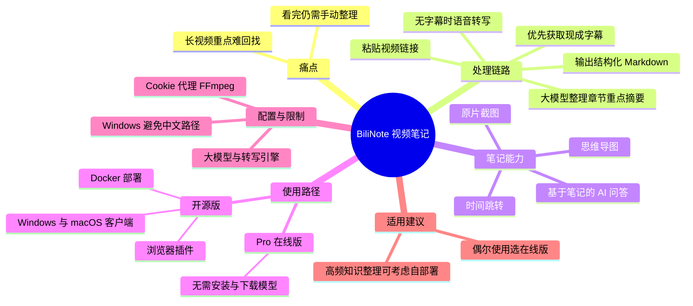
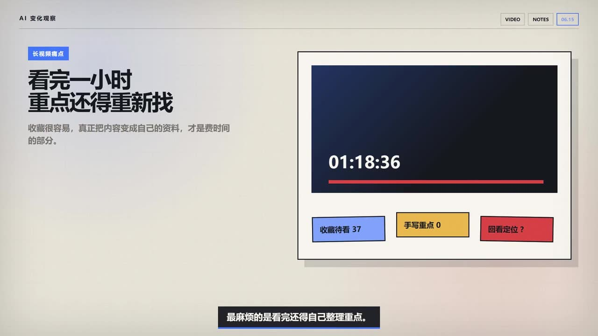
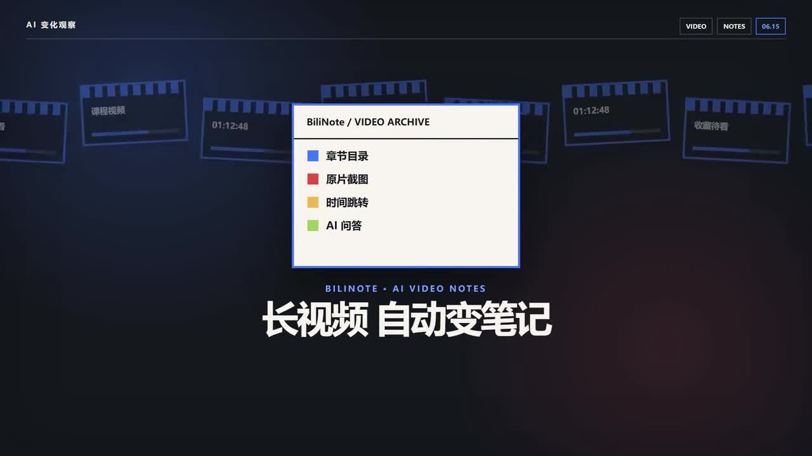
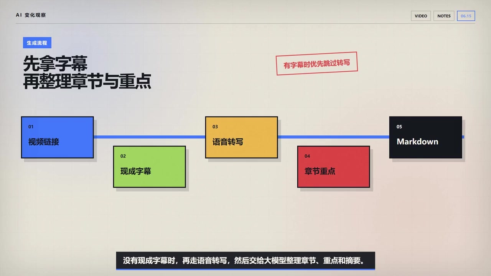
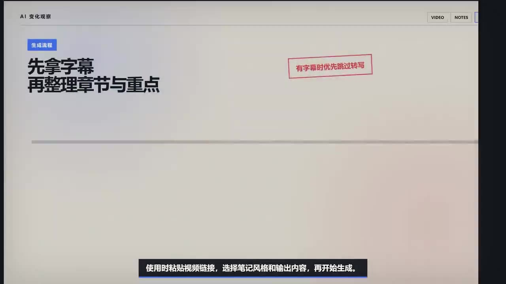

# BiliNote：把 B站和 YouTube 长视频自动整理成笔记

> 来源：[Bilibili 视频](https://www.bilibili.com/video/BV14fJ36cE9W) 
> UP 主：海言的AI自动化｜视频时长：02:08｜合集：AI视频总结  
> 视频简介中给出的入口：[BiliNote Pro 在线版](https://www.bilinote.app/)｜[GitHub 仓库](https://github.com/JefferyHcool/BiliNote)｜[官方文档](https://docs.bilinote.app/)

## 小结

BiliNote 是一款开源 AI 视频笔记工具，目标是把 B 站、YouTube、抖音、快手或本地视频转换为结构化 Markdown 笔记。视频从“长视频看完后仍要重新找重点、手工整理”的痛点切入，介绍其以字幕或语音转写为输入、再由大模型生成章节与摘要的基本链路。

视频强调，这类工具的价值不只是压缩内容：生成的笔记可插入原片截图和时间跳转，帮助读者从结论快速回到视频上下文；结果还可复制或导出为 Markdown、切换为思维导图，并可围绕笔记进行 AI 问答。

使用路径分为两类。偶尔处理少量视频的用户，可优先选择无需安装、无需下载模型的 BiliNote Pro 在线版；需要频繁整理课程、访谈、知识视频，且希望保留配置与历史的用户，则可考虑 Windows/macOS 客户端、浏览器插件或 Docker 自部署的开源方案。

视频同时明确了开源版的现实门槛：需要配置大模型和转写引擎；不同视频平台可能涉及 Cookie、代理或 FFmpeg；Windows 版还提示不要安装在中文路径。视频仅汇总了官网、仓库、文档和版本说明，**没有实际完成付费账号下的整条在线视频生成，也没有完整部署本地后端**，因此不能据此确认实际生成质量、费用、速度、平台可用性或部署成功率。

这是一条工具概览而非版本公告或实测评测。视频发布后，平台兼容性、模型供应商、部署要求、Cookie/代理需求及在线版规则均可能变化，实际使用前应以官方文档和产品页面为准。

## 思维导图

## 目录

- [背景：长视频“看完难整理”的问题](#背景长视频看完难整理的问题)
- [BiliNote 的定位与输入范围](#bilinote-的定位与输入范围)
- [生成流程：字幕优先，转写兜底，再由模型整理](#生成流程字幕优先转写兜底再由模型整理)
- [笔记输出：截图、时间跳转、Markdown、思维导图与问答](#笔记输出截图时间跳转markdown思维导图与问答)
- [在线版与开源版：两条使用路径](#在线版与开源版两条使用路径)
- [部署门槛、平台限制与选择建议](#部署门槛平台限制与选择建议)
- [结论、验证边界与时效性](#结论验证边界与时效性)
- [关键帧索引](#关键帧索引)
- [字幕比对](#字幕比对)
- [评论分析](#评论分析)
- [处理记录](#处理记录)

## [背景：长视频“看完难整理”的问题](https://www.bilibili.com/video/BV14fJ36cE9W?t=34)

视频描述的典型场景是：收藏夹中积累了许多长视频，刚开始观看时会认真听，但之后容易依赖拖动进度条寻找信息；即使看完视频，仍要自行整理重点。核心问题不是“是否看过”，而是内容能否被转化为可检索、可复看、可继续使用的资料。

画面以“长视频痛点”为标题，进一步呈现“看完一小时，重点还得重新找”的问题，并用“收藏待看 37”“手写重点 0”“回看定位？”等示意信息强化长视频积压、笔记缺失与回看困难的关系。

> 图：画面将一小时视频、待看数量、手写重点数量和“回看定位”并置，直观说明本视频所讨论的不是单纯的视频播放，而是长内容的知识沉淀与定位效率问题。

## [BiliNote 的定位与输入范围](https://www.bilibili.com/video/BV14fJ36cE9W?t=34)

视频将 BiliNote 定位为“把长视频直接整理成笔记”的 AI 工具。按视频陈述，它可处理以下来源：

- B 站视频；
- YouTube 视频；
- 抖音视频；
- 快手视频；
- 本地视频文件。

其目标输出是**结构化 Markdown 笔记**。视频简介还说明笔记可包含原片截图、时间跳转、思维导图及基于笔记的 AI 问答能力。

> 图：开场画面以“BiliNote / Video Archive”呈现“章节目录、原片截图、时间跳转、AI 问答”四项功能，并以“长视频自动变笔记”概括产品定位。这张图适合作为全文功能范围的视觉索引。

需要区分的是：

- **视频明确陈述**：工具面向上述平台与本地视频，输出结构化 Markdown，并提供截图、跳转、思维导图和问答等能力。
- **视频未展示或未验证**：各来源在当前版本中的实际成功率、登录要求、版权限制、最长时长、文件格式上限、生成耗时、模型费用与导出格式细节。
- **不能据此推断**：所有 B 站、YouTube、抖音、快手视频都能无条件访问或稳定生成笔记。视频后半段反而提示，部分平台可能需要 Cookie、代理等额外条件。

## [生成流程：字幕优先，转写兜底，再由模型整理](https://www.bilibili.com/video/BV14fJ36cE9W?t=34)

视频给出的最短操作路径是：

1. **粘贴视频链接**；
2. **选择笔记风格和输出内容**；
3. **开始生成**；
4. 工具先尝试获取视频的**现成字幕**；
5. 若没有现成字幕，再进行**语音转写**；
6. 将字幕或转写结果交给**大模型**，整理为章节、重点和摘要；
7. 输出 Markdown 笔记，并可使用其他笔记增强能力。

画面将处理过程拆分为“视频链接 → 现成字幕 → 语音转写 → 章节重点 → Markdown”，并明确标注“有字幕时优先跳过转写”。这说明字幕是优先输入，而语音转写是无可用字幕时的补充路径。

> 图：流程图明确展示五个步骤及顺序：视频链接、现成字幕、语音转写、章节重点、Markdown；红字“有字幕时优先跳过转写”是理解其效率逻辑的关键证据。

### 流程中的技术含义

| 环节 | 视频所述作用 | 可得出的实际含义 | 视频未给出的参数 |
| --- | --- | --- | --- |
| 视频链接 | 提供待处理内容 | 在线来源的视频入口 | 支持的 URL 规则、登录态要求、单次任务限制 |
| 现成字幕 | 优先使用 | 有字幕时可绕开语音转写步骤 | 字幕语言、质量筛选、字幕下载失败时的回退规则 |
| 语音转写 | 无字幕时补充 | 将音轨转换为文本，作为后续整理基础 | 使用的转写模型、语种、时间成本、准确率、是否收费 |
| 大模型整理 | 生成章节、重点、摘要 | 将线性文本组织为结构化笔记 | 提示词、上下文窗口、模型选择逻辑、幻觉控制方法 |
| Markdown | 输出笔记 | 便于复制、保存与二次编辑 | 完整字段结构、文件命名和导出限制 |

视频没有提供命令行、API、模型名称、温度、上下文长度、转写采样率或 Docker 配置等可复现实验参数。因此，上述流程可作为使用认知和操作顺序，不能替代官方部署文档。

## [笔记输出：截图、时间跳转、Markdown、思维导图与问答](https://www.bilibili.com/video/BV14fJ36cE9W?t=34)

视频特别强调，BiliNote 的实际价值不局限于“把一小时视频压缩成几段文字”。其所述的笔记增强能力包括：

1. **原片截图**  
   可让笔记插入来自原视频的截图，保留演示画面、图表、页面或上下文视觉信息。

2. **时间跳转**  
   在笔记中点击某个结论，可跳回原视频对应位置。它解决的是摘要脱离原始上下文后难以核对的问题，而不是取代观看原片。

3. **Markdown 导出或复制**  
   生成结果可以复制或导出为 Markdown，便于继续编辑、存入知识库或在其他支持 Markdown 的系统中使用。

4. **思维导图**  
   视频称结果可切换成思维导图，用于以层级关系浏览章节和重点。

5. **基于笔记的 AI 问答**  
   可以继续追问某个概念，而不需要重新拖动并观看完整视频。这里的问答对象是“笔记内容”，其回答质量仍受字幕/转写质量、摘要完整度和模型理解能力约束。

> 图：画面以“先拿字幕，再整理章节与重点”为主题，强调生成的中间基础是文本，而不是直接仅凭画面概括视频。它有助于理解后续笔记质量为何会受字幕与转写质量影响。

### 使用上的经验边界

- 时间跳转适合用于**核对结论、回看上下文、定位原始演示**，不能把 AI 摘要视作完整原片的无损替代。
- 截图可以补充纯文本难以表达的视觉信息，但视频未说明截图的抽帧频率、是否可手动选择、是否支持 OCR 或图片数量上限。
- “基于笔记”的 AI 问答依赖生成笔记中的信息；若原片关键信息没有进入字幕、转写或摘要，问答未必能覆盖。
- Markdown 便于迁移，但视频未展示实际导出的 Markdown 样例，不能确认具体是否包含 YAML 元数据、图片链接格式、时间戳链接规则或兼容的笔记软件。

## [在线版与开源版：两条使用路径](https://www.bilibili.com/video/BV14fJ36cE9W?t=58)

视频将用户路径分为在线版与开源版。

### BiliNote Pro 在线版

视频认为，对普通用户而言，最省事的入口是 **BiliNote Pro 在线版**。其特点是：

- 不需要本地安装；
- 不需要下载模型；
- 适合偶尔总结一两个视频的需求。

该结论是 UP 主给出的使用建议，前提是用户更看重低配置成本。视频未实际展示使用付费账号完成整条视频的在线生成，因此并未验证在线版的具体生成界面、额度、价格、排队时间或结果质量。

### 开源版

视频称开源版提供：

- Windows 客户端；
- macOS 客户端；
- 浏览器插件；
- Docker 部署。

开源版可自行配置的能力包括：

- 大模型服务；
- 转写服务；
- 视频处理所需的相关环境。

ASR 对具体模型供应商的识别存在错误，听写文本出现了“OpenAI、DeepSeq、Quant”等近似写法；由于站内字幕缺失，且素材未提供能够确认这些品牌名称的官方界面或文档截图，本文不将其作为准确的模型支持清单。可靠结论仅限于：**视频明确表示开源版允许自行配置大模型及本地或在线转写服务。**

## [部署门槛、平台限制与选择建议](https://www.bilibili.com/video/BV14fJ36cE9W?t=83)

视频明确提醒：**开源不等于零门槛**。本地版或自部署方案涉及以下限制与依赖：

| 类别 | 视频提到的要求或风险 | 对使用者的影响 |
| --- | --- | --- |
| 模型配置 | 需要配置大模型 | 需要自行准备兼容服务、密钥或本地模型环境，具体取决于所选方案 |
| 转写引擎 | 需要配置转写引擎 | 无现成字幕的视频依赖转写能力，部署和资源占用会增加 |
| 跨平台视频处理 | 可能需要 Cookie、代理或 FFmpeg | 某些平台视频获取、登录态、网络访问及媒体处理可能不是开箱即用 |
| Windows 路径 | 明确提醒不要安装在中文路径 | 需选择纯英文或 ASCII 路径，避免潜在兼容性问题 |
| 在线/本地选择 | 不同使用频率适合不同路径 | 应先根据任务量、维护意愿和隐私/历史保留需求选择 |

### 视频给出的选择建议

- **偶尔总结一两个视频**：先使用在线版，降低安装、模型和环境配置的负担。
- **经常处理课程、访谈、知识视频**，并且希望保留自己的配置和历史：再考虑桌面版或自部署。
- **不愿处理 Cookie、代理、FFmpeg、模型与转写引擎配置**：不应仅因“开源”而直接选择本地部署方案。

这里的“经常处理”是定性表述，视频没有给出视频数量、时长、成本阈值或硬件规格，不能将其换算为确定的选型标准。

## [结论、验证边界与时效性](https://www.bilibili.com/video/BV14fJ36cE9W?t=107)

视频最终将 BiliNote 的适用场景限定为：把真正值得看的长内容转为**可搜索、可回看、可继续追问**的资料，而不是替用户“刷短视频”。

### 可迁移的使用经验

1. **先用字幕降低处理成本**：有质量较好的现成字幕时，优先使用它可省去转写环节；无字幕时才转写。
2. **把笔记与原片链接保留在一起**：章节、截图和时间跳转共同减少摘要脱离证据来源的风险。
3. **按维护成本选择产品形态**：在线版降低初始门槛；桌面版/自部署增加控制权，但也增加配置和维护责任。
4. **把 AI 笔记视为导航与检索层**：它有助于快速复盘与定位，不应替代对重要原始内容的核对。

### 本视频未完成的验证

UP 主明确说明，本期只汇总了官方在线站点、代码仓库、文档和版本说明；未完成以下实测：

- 未使用付费账号生成完整在线视频；
- 未在本机完成后端完整部署；
- 未展示模型配置、转写服务配置或 Docker 实操；
- 未比较不同平台视频的可访问性、生成速度和笔记质量；
- 未展示费用、额度、硬件要求或隐私数据处理细则。

因此，本文不能把“支持”解读为“对所有视频、所有地区、所有账户均稳定可用”。涉及登录态、Cookie、代理和第三方模型服务的能力尤其具有环境依赖性。

### 时效性说明

视频元数据发布日期为 2026-06-14，素材获取时间为 2026-07-17。BiliNote 及其在线服务、仓库、模型兼容性、平台规则、安装包和文档均可能在此后更新。对于部署和付费相关决策，应以视频简介所列的官网、GitHub 仓库和官方文档中的最新信息为准。

## 关键帧索引

| 关键帧 | 正文用途 | 画面价值 |
| --- | --- | --- |
|  | 产品定位与功能范围 | 集中呈现章节目录、原片截图、时间跳转、AI 问答四项能力。 |
|  | 长视频整理痛点 | 用“看完一小时，重点还得重新找”的视觉文案解释工具的需求来源。 |
|  | 生成机制概览 | 说明笔记生成以字幕/文本处理为基础。 |
|  | 操作步骤与技术链路 | 展示链接、字幕、转写、章节重点、Markdown 的明确顺序，并标注字幕优先原则。 |

> 关键帧文件仅作为画面理解证据使用。素材未提供每一张关键帧的精确抽帧时间，因此本文不为这些图片额外编造秒级时间点；正文时间轴均来自 ASR 分段起始时间。

## 字幕比对

| 字幕来源 | 完整性 | 专有名词 | 时间轴 | 主要问题 |
| --- | --- | --- | --- | --- |
| Bilibili 站内字幕 | 不可用 | 无法评估 | 无法评估 | 素材明确标注“未提供可用站内字幕”；下载流程还返回 `Invalid URL` 警告。 |
| 本次 ASR 字幕 | 覆盖主要口播，诊断显示语音覆盖约 71.92% | 存在明显误识别 | 提供 5 段带起止时间的 SRT/分段结果 | 个别分段文本过长；SRT 与 ASR JSON 的后续时间边界不完全一致；产品名、Markdown、FFmpeg、模型名等专有词误识别较多。 |

### 本次 ASR 检查结果

- ASR 模型：`medium`
- 识别语言：中文（`zh`）
- 语言置信度：`0.9921875`
- 音频时长：约 `127.06` 秒
- 检测到的语音时长：约 `91.38` 秒
- 首段语音起点：`00:00:34.380`
- 末段语音终点：`00:02:05.760`
- 素材中**没有** `noAudioStream=true` 标记；同时提供了 `audio/audio.wav` 和 ASR 结果，说明源视频存在可供识别的音轨，不能将站内字幕获取失败误判为“视频无音轨”。

### 最终字幕选择与校正原则

本站没有可用字幕，最终以本次 ASR 的带时间分段作为内容与时间轴依据，并结合视频标题、简介、关键帧中可读文字进行有限校正：

| ASR 原文或近似写法 | 本文采用写法 | 校正依据 |
| --- | --- | --- |
| “BillyNode” | BiliNote | 视频标题、简介和开场关键帧均写作 BiliNote。 |
| “MyGaul 笔迹” | Markdown 笔记 | 视频简介明确写为“结构化 Markdown”，画面也出现“Markdown”。 |
| “FFMPick” | FFmpeg | 视频语境为本地视频处理环境依赖；本文采用常见工具名 FFmpeg，但仅用于表述视频所提依赖。 |
| “DeepSeq、Quant”等 | 不列为确认的模型清单 | ASR 无法可靠确认，且没有站内字幕或官方配置画面佐证。 |

### 时间轴使用说明

正文链接优先取 ASR JSON 分段起点：`34.38`、`58.88`、`83.04`、`107.32` 秒，并按链接参数取整为 `t=34`、`t=58`、`t=83`、`t=107`。需注意，提供的 SRT 后三段终止时间与 ASR JSON 的分段边界存在不一致；为避免根据文字顺序猜测位置，本文不自行重建或平移这些时间戳。

## 评论分析

素材仅获取到 1 条热评，未达到“热评前三条”的数量；以下仅分析可获取内容，不以其作为事实证据。

1. **用户「GPT等AI订阅-可开票13」：**“这波我认可”  
   - **观点概括**：评论者对视频介绍的工具或其使用价值表示认可。  
   - **补充信息**：未提供具体使用场景、功能验证、费用信息或部署经验。  
   - **可信度与争议**：这是简短态度表达，点赞数为 0，不能据此推导产品实际效果、稳定性或广泛用户评价。  
   - **其余热评**：素材未提供第 2、3 条可获取热评，因此不补写、不推测。

## 处理记录

- Worker ID：`worker-mrph3525-f07287b1`
- 模型：`gpt-5.6-terra`
- 使用的素材工具与产物：视频元数据、音频文件 `audio/audio.wav`、本次 ASR 结果 `asr/asr-result.json`、ASR SRT `asr/transcript.srt`、关键帧目录 `frames/`、评论文件 `comments/comments.json`。
- ASR 工具信息：`medium` 模型，CUDA，`float16`，中文自动识别。
- 字幕选择：站内字幕不可用；已检查本次 ASR，采用 ASR 分段时间作为正文时间轴依据，并以标题、简介和关键帧对 BiliNote、Markdown、FFmpeg 等明显误识别进行有限校正。
- 站内字幕异常：素材记录显示字幕工具报错 `Invalid URL`，且“站内字幕：未提供可用站内字幕”；该异常不影响本次已获得的音频和 ASR 结果。
- 关键帧选择依据：选用 `frame-001` 至 `frame-004`，因为其画面可直接支撑产品功能定位、长视频痛点、字幕优先原则与完整生成流程；未使用未展示画面内容的其余关键帧，避免超出素材推断。
- 缓存清理：提供的素材中没有缓存清理执行记录；本文不虚构已执行清理。
- 未解决问题：未取得可用站内字幕；ASR 对部分专有名词存在误识别；未提供关键帧精确时间；视频本身未完成在线付费生成或本地完整部署实测。
