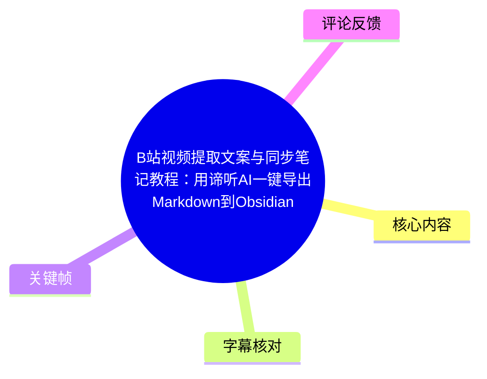
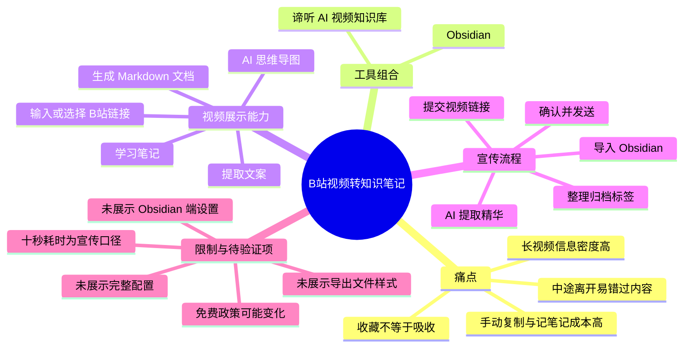
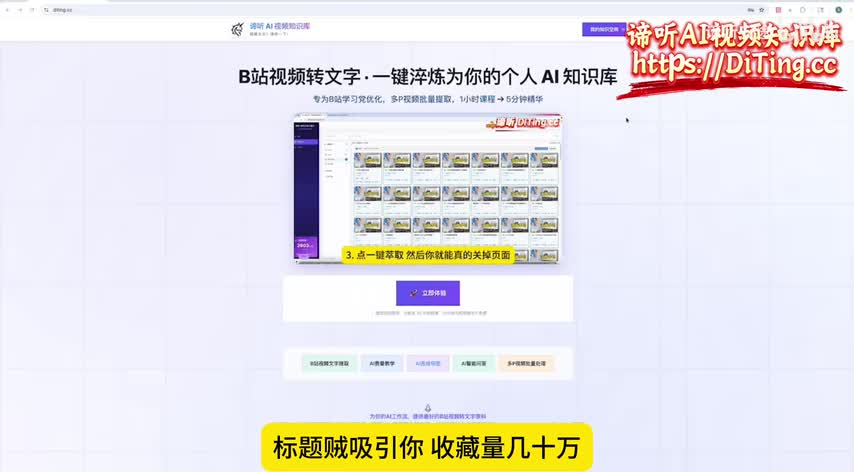
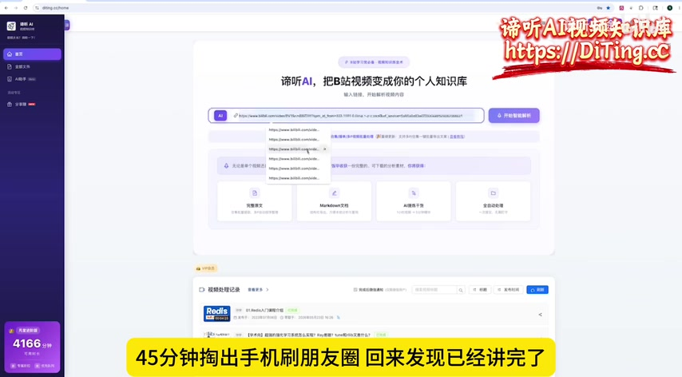
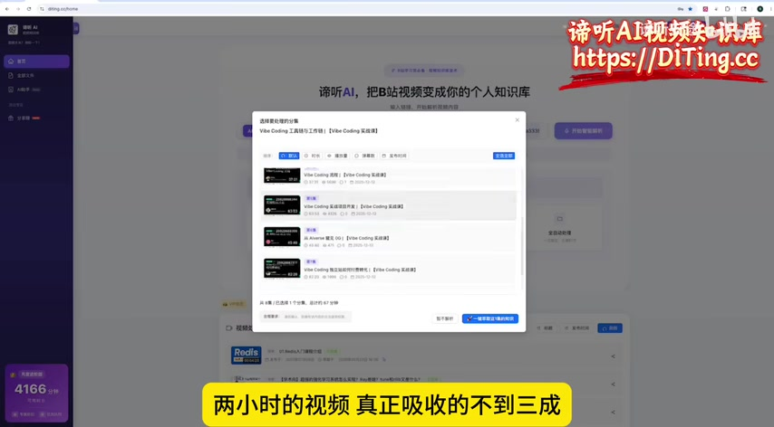

# B站视频提取文案与同步笔记教程：用谛听AI一键导出Markdown到Obsidian

> 来源：[Bilibili 视频](https://www.bilibili.com/video/BV16d7R6NEu7) 
> UP 主：谛听安途｜时长：01:10｜分辨率：1956×1080｜发布时间：2026-06-03 15:07:23 UTC

## 小结

视频推广的工作流是：将 B 站视频链接提交到“谛听 AI 视频知识库”，由其处理视频内容并提取重点，再将整理结果以 Markdown 形式发送或同步到 Obsidian。UP 主将该流程定位为解决长视频学习中“难以完整观看、难以手工抄录、收藏后未消化”的问题。

根据 ASR 语音，视频声称该工具可帮助用户提取视频精华，并在导出时预先整理归档标签；用户确认后点击发送，即可唤起 Obsidian，使笔记进入个人知识库。视频口播将从打开到保存的耗时宣传为“不超过 10 秒”。

画面展示了谛听 AI 的 B 站视频转文字页面：可输入或选择 Bilibili 链接，并提供“提取文案”“Markdown 文档”“AI 思维导图”“学习笔记”等能力入口。另有视频选择弹窗，显示其可能支持从视频列表中选择条目处理。

这是一支约 70 秒的产品介绍短片，而非完整操作实录。视频没有展示 Obsidian 端的具体插件、URI 协议、文件夹路径、授权步骤、Markdown 实际内容、失败处理或收费页面，因此“直接同步”“自动归档标签”和“10 秒完成”均应视为 UP 主的产品陈述，使用前仍需自行验证。

时效性方面，视频简介将服务称为“2026 爆火”的工具，并宣传“10 分钟内短视频永久免费、微信扫码免下载即开即用”。这些均属于发布者的营销信息，政策、免费额度、支持平台和导出能力可能随产品迭代而改变。

## 思维导图

## 目录

- [问题场景：长视频难以消化](#问题场景长视频难以消化)
- [产品界面与可见能力](#产品界面与可见能力)
- [视频所述操作流程](#视频所述操作流程)
- [参数、限制与时效性](#参数限制与时效性)
- [字幕比对](#字幕比对)
- [评论分析](#评论分析)
- [处理记录](#处理记录)

## 问题场景：长视频难以消化 [00:31](https://www.bilibili.com/video/BV16d7R6NEu7?t=31)

ASR 中的开场将目标用户描述为：刷到标题有吸引力、收藏量高且评论认为“干货”的视频后选择收藏；实际观看时，约 10 分钟便感到信息量大，若在较长课程中离开片刻，回来后可能已错过内容。UP 主用“两小时的视频真正吸收不到三成”概括长视频学习的低效体验。

此处提出的需求可以拆成四项：

1. **不必完整重看长视频**：希望先获得结构化浓缩内容。
2. **不手动复制粘贴**：降低转写、摘录和格式整理成本。
3. **将精华放入已有知识库**：视频明确点名 Obsidian。
4. **减少导出与归档步骤**：希望由工具代为处理标签等信息。

视频没有给出“吸收不到三成”的数据来源，因此它应理解为口播中的个人化、强调式表达，而不是可外推的统计结论。

> 图：该关键帧展示“B站视频转文字，一键淬炼为你的个人 AI 知识库”的页面主视觉。它将视频的核心定位——把观看对象转为可沉淀的知识资产——直接可视化。

## 产品界面与可见能力 [00:32](https://www.bilibili.com/video/BV16d7R6NEu7?t=32)

画面中的产品首页标题为“谛听 AI，把 B 站视频变成你的个人知识库”。中部有用于提交链接的输入区域，右侧可见“开始智能解析”按钮；输入区下方出现多个 Bilibili URL 的候选或历史记录。

页面中可辨识的能力卡片包括：

| 页面可见项目 | 可确认的含义 | 视频未展示的部分 |
| --- | --- | --- |
| 提取文案 | 可将视频内容处理为文字类结果 | 转写准确率、说话人区分、时间戳格式 |
| Markdown 文档 | 页面将 Markdown 作为一种产出形式 | 实际文件内容、YAML 字段、图片嵌入规则 |
| AI 思维导图 | 页面列出思维导图能力 | 导图格式、能否编辑、是否能导出 Mermaid |
| 学习笔记 | 页面列出学习笔记能力 | 笔记模板、引用出处与事实校验机制 |
| 开始智能解析 | 表明链接可触发解析任务 | 支持的视频类型、时长上限、排队与失败提示 |

> 图：该关键帧是判断产品可见功能边界的主要依据。它明确显示链接输入与四类产出入口，但没有显示生成结果的内容质量或导出配置。

## 视频所述操作流程 [00:32](https://www.bilibili.com/video/BV16d7R6NEu7?t=32)

### 1. 提交 B 站链接

ASR 明确提到“你丢给它一个 B 站链接”，对应页面中的链接输入框与“开始智能解析”按钮。视频画面还显示了一个选择弹窗，列表内含多个视频条目，顶部带有筛选标签或选项；这表明界面至少存在视频条目选择环节。

> 图：该帧补足了“提交链接”之外的选择界面信息。弹窗中可见多个视频条目，但画面分辨率不足以可靠确认全部筛选条件、数量限制与多选规则。

### 2. 由工具处理视频并提取精华

UP 主口播称：工具会“把视频听完，精华全提取出来”。这描述的是从视频内容到浓缩信息的处理过程。结合首页能力卡片，可合理确认视频在宣传文案提取、摘要/学习笔记和思维导图等知识整理产物。

需要区分的是：

- **视频明确陈述**：工具可提取精华，提供文案、Markdown、思维导图、学习笔记等能力。
- **画面可见事实**：页面有相应功能入口。
- **未被视频验证**：不同视频类型、专业领域、口音、背景音乐或多说话人场景下的提取质量；是否保留原视频时间戳和原话引用。

### 3. 检查归档标签与结果

口播称“导出的时候归档标签 AI 已经帮你看好了，你瞄一眼没毛病”。这说明 UP 主主张系统会在导出前提供标签或归档信息，并建议用户进行人工确认。

视频没有展示标签生成页面，也没有展示标签名称、层级、可修改方式或错误时如何处理。因此更稳妥的实践是：将自动标签视为初步分类建议，尤其对课程、法律、医学、新闻等需要准确分类的内容，应在进入知识库前进行复核。

### 4. 发送至 Obsidian

口播称“直接点发送，Obsidian 直接被唤醒了，笔记已经在你知识库里躺着了”。可确认的是视频将 Obsidian 作为目标知识库，并宣传点击发送的导入体验。

但下列决定能否复现的条件没有在素材中出现：

- 是否需要安装 Obsidian 桌面客户端；
- 是否需要设置 Vault（仓库）位置或目标文件夹；
- 是否依赖 Obsidian URI、浏览器协议授权、插件或本地同步组件；
- 移动端与桌面端是否均支持；
- 文件重名、标签冲突、网络中断和导入失败时如何处理。

因此，实际使用前应先以一个短视频测试：确认系统能否生成 Markdown、Obsidian 是否确实接收文件、文件进入哪个目录，以及内部链接、标签和中文文件名是否符合自己的 Vault 规范。

### 5. 耗时宣传与行动号召 [00:56](https://www.bilibili.com/video/BV16d7R6NEu7?t=56)

UP 主称“从打开到存好不超过 10 秒”，最后以“视频太长，谛听一下，点一下直接存进 Obsidian”总结，并引导访问服务、关注账号。

这里的“10 秒”应按宣传口径理解。由于视频没有呈现完整计时过程、视频长度、网络状态、解析排队情况或 Obsidian 首次授权状态，不能据此推断所有视频均可在 10 秒内完成处理。尤其对长视频而言，上传/抓取、转写、总结和导出通常可能分别产生耗时。

## 参数、限制与时效性

### 已知参数与元信息

| 项目 | 内容 |
| --- | --- |
| 视频时长 | 70 秒 |
| 视频分辨率 | 1956×1080 |
| ASR 语言识别 | 中文（`zh`） |
| ASR 模型 | `medium` |
| ASR 推理设备与精度 | CUDA / float16 |
| ASR 识别到的有声区间 | 00:31.420–01:01.910 |
| ASR 语音覆盖时长 | 30.49 秒 |
| ASR 语音覆盖率 | 44.08% |
| 视频简介中的免费宣传 | “10分钟内短视频永久免费” |
| 视频简介中的使用入口宣传 | DiTing.cc；微信扫码免下载即开即用 |

### 使用限制与风险

1. **素材并非完整教程**：标题含“教程”，但实际素材主要展示卖点、首页和选择界面，缺少从复制链接到 Obsidian 文件落地的完整逐步录屏。
2. **导出链路尚未验证**：没有 Obsidian 端画面，无法确认导出机制和所需配置。
3. **内容准确性未展示**：视频没有把原视频、转录稿、摘要、思维导图和 Markdown 成品放在一起对照，无法评价其转写或总结质量。
4. **AI 摘要存在遗漏风险**：即便工具可正常运行，自动提取“精华”仍会受到提示词、模型、原视频清晰度与内容结构影响。重要原理、公式、条件和反例不应只依赖摘要。
5. **免费与性能宣传具有时效性**：简介中的免费范围、10 秒处理速度及支持能力是发布时的宣传信息；截至本素材抓取时间，未提供独立产品文档用于交叉验证。
6. **发布时点异常需注意**：元数据发布时间为 2026-06-03，素材抓取时间为 2026-07-26；本文只记录该时间点获得的页面与文案，不代表后续仍保持一致。

## 字幕比对

站内未提供可用字幕。本次 ASR 已实际检查，且素材明确提供了 `audio/audio.wav`、中文 ASR 结果和带时间戳 SRT；诊断中**未标记** `noAudioStream=true`，因此不能将其视作无音轨视频。

| 字幕来源 | 完整性 | 专有名词 | 时间轴 | 主要问题 |
| --- | --- | --- | --- | --- |
| Bilibili 站内字幕 | 未提供，无法使用 | 无法评估 | 无法评估 | 素材清单明确为“未提供可用站内字幕” |
| 本次 ASR 字幕 | 识别出 3 段、约 30.49 秒语音；覆盖率 44.08% | 有明显同音/误识别 | 提供 SRT 起止时间，但首段文本量与 1.28 秒时长不匹配 | 断句极少、文本高度连写；部分产品名和词语需要依据画面与上下文校正 |

### ASR 校正与采用策略

本次笔记以 ASR 的真实 SRT 起止时间作为章节时间轴依据：00:31.420、00:32.700、00:56.700。由于第一条 ASR 分段仅持续 1.28 秒却包含大量内容，与文本长度明显不相称，时间轴可用于定位该段开始，但不宜把该段内部每句话视为精确逐字对齐。

结合产品标题、画面文字和上下文，对以下词语作了阅读校正：

| ASR 原文 | 本文采用写法 | 校正依据 |
| --- | --- | --- |
| 地听 AI / 地听 | 谛听 AI | 视频标题、UP 主名称“谛听安途”、画面品牌文字 |
| Obsidan | Obsidian | 视频标题及产品定位 |
| 知诗库 | 知识库 | 上下文语义与页面标题 |
| 全体取出来 | 全提取出来 | 语义通顺性；保留为口播意图，不视为逐字转写 |
| 剿碎了精华 | 提取/浓缩精华 | ASR 疑似识别误差；视频核心语义为提炼知识 |

画面中出现的“提取文案”“Markdown 文档”“AI 思维导图”“学习笔记”等文字，作为对 ASR 未覆盖界面信息的多模态补充；但未据此扩展出画面未明确显示的功能细节。

## 评论分析

仅获取到 2 条热评，少于“前三条”的上限；以下不将评论内容视为已验证事实。

1. **太空洗衣机（5 赞）**  
   评论称微软开源的 `markitdown` 具有“同样的功能”。这提供了替代工具线索，但可信度有限：评论没有说明其所指功能究竟是视频转文字、Markdown 转换、AI 摘要、Obsidian 同步还是其中某一部分。不同工具在输入格式、视频抓取、AI 总结和知识库集成方面可能差异很大，不能仅据此认定二者等价。

2. **谛听-B站视频转文字（3 赞）**  
   评论宣称多 P 合集可一键导出至 Obsidian，并可将考研课程变成随时阅读的电子书。这与视频的产品宣传方向一致，但评论账号名称与服务品牌高度相关，属于推广性补充信息。素材本身未展示多 P 合集、电子书成品或一键导出的完整过程，应在实际产品页面或测试中验证。

3. **第三条热评**  
   本次可获取的热评数据中不存在第三条，故不补写、不推测。

## 处理记录

- Worker ID：`worker-mrplns82-755ed24d`
- 模型：`gpt-5.6-terra`
- 使用素材与工具结果：视频元数据、关键帧、Bilibili 热评数据、本次 ASR 结果、ASR SRT 时间轴与 ASR 覆盖诊断。
- ASR 配置：`medium` 模型；语言自动识别结果为中文（置信概率 `0.9970703125`）；CUDA / float16。
- 字幕选择：站内字幕未提供可用内容；已检查本次 ASR。正文以 ASR 为口播依据，以其 SRT 时间戳生成时间轴；对品牌名和明显同音误识别结合画面、标题和上下文校正。
- 关键帧选择依据：选用 `frames/frame-001.jpg` 说明产品定位与学习痛点；选用 `frames/frame-003.jpg` 确认链接输入和功能入口；选用 `frames/frame-004.jpg` 说明视频条目选择界面。未将画面中无法清晰辨认的文字和未演示的配置扩展为事实。
- 缓存清理：素材未提供缓存清理执行记录，无法确认是否已清理；本文不虚构清理结果。
- 未解决问题：无法从现有素材确认 Obsidian 同步的技术实现、Markdown 文件实际结构、多 P 支持规则、免费额度细则、任务时长上限、解析质量与“10 秒完成”的可复现条件。
