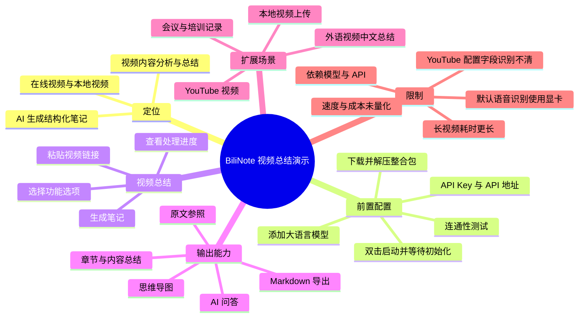
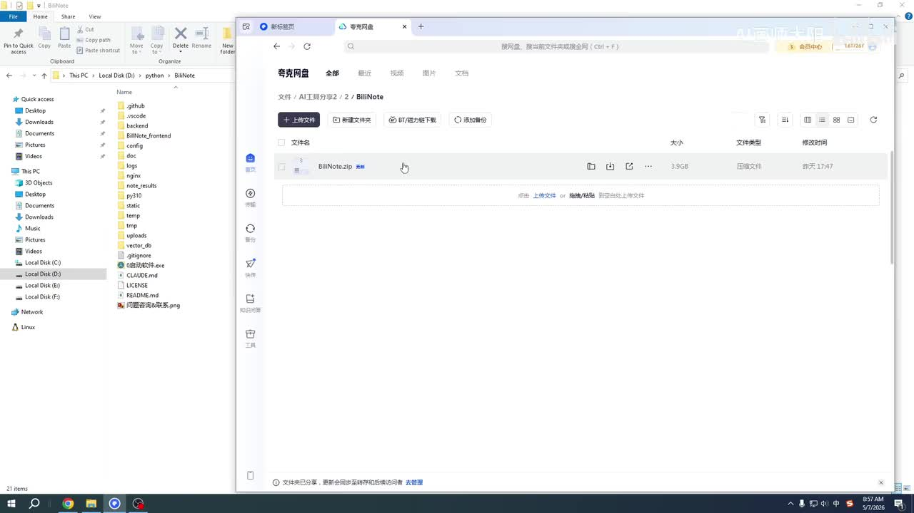
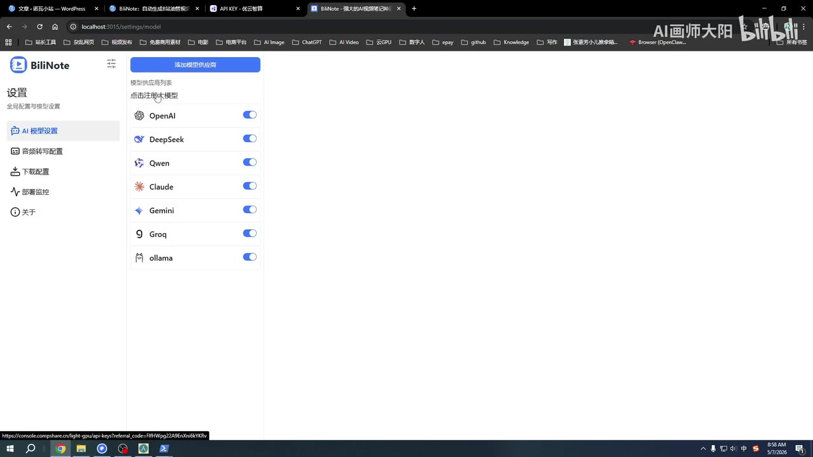
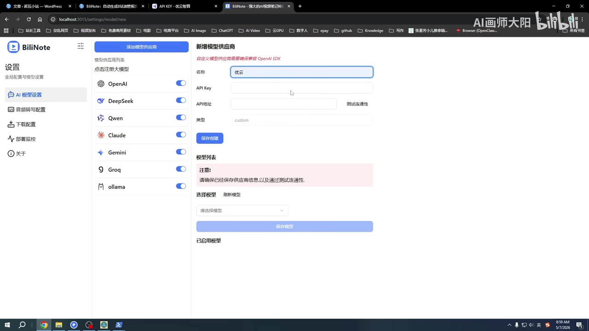
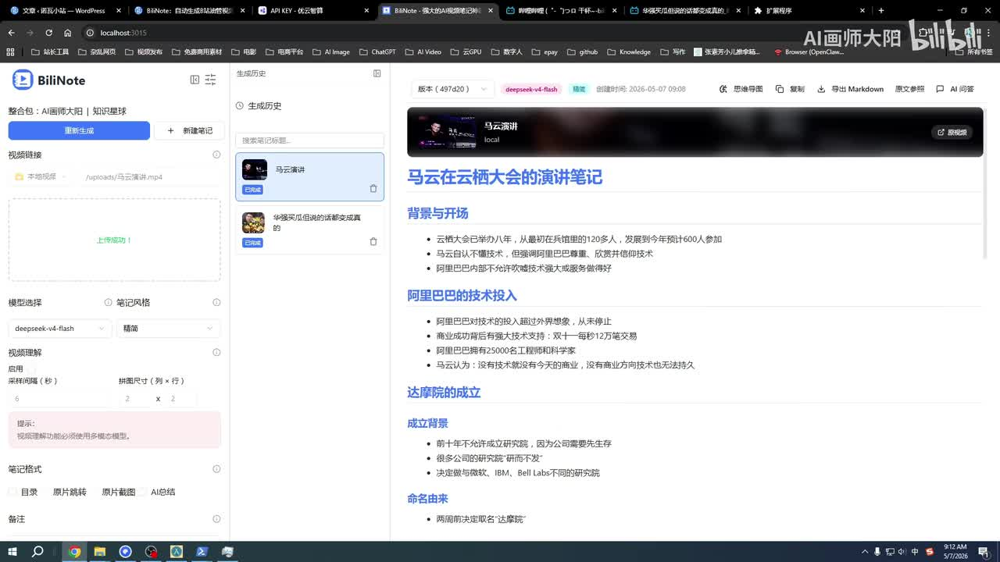

# B站学习党狂喜！BiliNote 超强 AI 总结功能演示：长视频秒变精华笔记，效率飙升1000%

> 来源：[Bilibili 视频](https://www.bilibili.com/video/BV11bRhBKEkc)  
> UP 主：AI画师大阳｜视频时长：5 分 07 秒｜合集：AI视频总结  
> 视频简介提供的软件链接：[夸克网盘](https://pan.quark.cn/s/6925c0b93409)

## 小结

视频演示的是 **BiliNote**：一款将在线视频或本地视频交给语音识别与大语言模型处理、生成结构化笔记的工具。UP 主展示了从下载整合包、配置大语言模型 API，到输入视频链接或上传本地视频并生成笔记的流程。

工具的核心依赖是用户自行配置的模型服务。演示界面显示可启用 OpenAI、DeepSeek、Qwen、Claude、Gemini、Groq、Ollama 等提供商，也支持自定义兼容 OpenAI SDK 的 API 地址。视频以界面中显示的 `deepseek-v4-flash` 为例，说明模型连通性测试通过后才能在首页用于生成笔记。

对于生成结果，视频明确展示/说明了章节化笔记、内容总结、思维导图、Markdown 导出、复制结果、原文参照与 AI 问答等入口；本地视频案例则使用一段约 37 分钟的马云演讲，说明长视频需要更久处理时间，且默认语音识别使用显卡。

适用对象包括：需要快速整理课程或学习视频的学习者、需要拆解脚本或提取信息的内容创作者、需要研究外语视频的研究人员，以及整理培训、会议视频/音频记录的职场人士。视频还声称可以将外语视频分析总结为中文，但未展示具体语言、翻译链路、准确率或收费标准。

标题中的“效率飙升 1000%”是宣传性表述，视频没有给出可复现实验、基准耗时或成本数据，不能将其视为可验证的性能结论。实际速度、费用、模型质量、显存/硬件要求及第三方 API 可用性仍取决于用户环境与所选模型。

## 思维导图

## 目录

- [工具定位与演示背景](#工具定位与演示背景-0035)
- [下载安装与启动](#下载安装与启动-0036)
- [配置大语言模型与 API](#配置大语言模型与-api-0100)
- [在线视频生成笔记](#在线视频生成笔记-0213)
- [结果查看、导出与再利用](#结果查看导出与再利用-0238)
- [YouTube 与本地视频处理](#youtube-与本地视频处理-0302)
- [长视频案例、硬件与适用人群](#长视频案例硬件与适用人群-0350)
- [结论、限制与时效性](#结论限制与时效性)
- [字幕比对](#字幕比对)
- [评论分析](#评论分析)
- [处理记录](#处理记录)

## 工具定位与演示背景 [00:35](https://www.bilibili.com/video/BV11bRhBKEkc?t=35)

从本次 ASR 的首个有效语音段开始，UP 主将 BiliNote 定义为“视频内容分析总结软件”。其目标不是替代视频播放，而是针对指定视频快速产生可阅读、可整理的内容摘要。

视频中明确提到的能力包括：

- 对视频内容进行 AI 分析与总结；
- 输出主要章节、主要内容和视频总结；
- 支持多个在线平台；
- 支持本地视频；
- 面向需要“总结、归纳”视频内容的用户；
- UP 主提供了基于“最新版”制作的免安装、一键启动整合包。

需要区分的是：视频展示的是工具工作流与界面结果，并没有公开其完整技术架构、开源地址、许可证、模型调用价格、数据保存策略或网络请求范围。因此，不能仅依据本视频判断其隐私性、离线能力或商业授权条件。

## 下载安装与启动 [00:36](https://www.bilibili.com/video/BV11bRhBKEkc?t=36)

视频给出的安装路径较直接：

1. 从视频简介所列网盘下载软件压缩包到本地电脑。
2. 解压压缩包。
3. 双击启动软件。
4. 等待初始化完成，进入操作界面。

> 图：该关键帧显示网盘文件列表与名为 `BiliNote.zip` 的压缩包；画面中可见大小约为 `3.9GB`。这说明 UP 主演示的整合包体积较大，下载、存储空间和解压时间应纳入部署准备。画面仅能证明演示时显示的文件信息，不能据此推断所有版本均为该体积。

视频未说明运行所需操作系统版本、CPU、内存、显卡型号、磁盘占用、是否需要管理员权限，以及整合包内是否已预置下载器或模型。因此，下载前应自行核对网盘文件来源、文件校验方式与可用存储空间。

## 配置大语言模型与 API [01:00](https://www.bilibili.com/video/BV11bRhBKEkc?t=60)

BiliNote 的生成能力依赖大语言模型。视频说明，首次使用时需要先添加模型；如果用户没有自己的 API，可通过界面入口注册，或选择界面列出的官方模型提供商进行配置。

> 图：关键帧展示“AI 模型设置”页面。界面列出了 OpenAI、DeepSeek、Qwen、Claude、Gemini、Groq、ollama 等服务开关，证明演示版本支持多提供商入口，而非仅绑定单一模型。

### 配置步骤

1. 进入设置中的“AI 模型设置”。
2. 选择已有提供商，或点击“添加模型供应商”创建自定义配置。
3. 填写服务名称、API Key、API 地址等字段。
4. 保存创建。
5. 重新打开添加模型界面。
6. 通过“测试连通性”验证 API。
7. 从返回的模型列表中选择要启用的模型并保存。
8. 返回首页，确认该模型出现在可选模型中。

> 图：该画面显示“新增模型供应商”表单，包含名称、API Key、API 地址、测试连通性、保存创建、选择模型与保存模型等控件。它说明自定义服务需要先完成供应商配置与联通测试，再选择具体模型。

### 参数与术语校正

本次 ASR 将多个字段误识别为“APK”，但结合界面文字可确认此处应为 **API Key**，即模型服务的访问密钥，而不是 Android 安装包文件。

视频中的口述还提及使用第三方聚合 API 平台时，可以自行填写该平台的相关信息，例如 API 地址与自己的 API Key。这里的关键限制是：

- API Key 属于敏感凭证，不应截图、公开或提交给不可信环境。
- “兼容 OpenAI SDK”只说明接口形式可能兼容，不代表任意模型、任意服务都能无配置直接调用。
- 连通性测试成功，不等于后续生成稳定，也不等于账户余额、并发配额或模型权限满足实际任务。
- 界面结果区域显示的模型名为 `deepseek-v4-flash`；ASR 对模型名识别为“Lipsic V4”，以画面文字为准。

## 在线视频生成笔记 [02:13](https://www.bilibili.com/video/BV11bRhBKEkc?t=133)

模型配置完成后，UP 主以“总结三分钟视频”为例演示在线视频处理。操作顺序如下：

1. 复制目标视频链接。
2. 将链接填入 BiliNote 的视频链接输入区域。
3. 根据需求启用页面提供的功能选项。
4. 点击“生成笔记”。
5. 在中间窗口查看处理进度。
6. 等待处理完成后查看生成结果。

视频口述称，结果会概括“核心设定、剧情概要、重点反转、结局”等内容。这些字段更适用于影视、故事或叙事性视频；对于课程、讲座、新闻等非剧情内容，最终笔记结构可能不同，取决于所选笔记风格、提示词与模型能力。

> 图：关键帧显示 BiliNote 的笔记结果页。左侧有生成历史与视频条目，右侧以“马云在云栖大会的演讲笔记”为标题生成层级化小节和项目符号内容。该画面直观说明工具试图把视频转为带标题层级的 Markdown 风格笔记，而不是仅返回一段摘要。

画面左侧还可见若干与视频理解有关的配置区域，例如模型选择、笔记风格、视频理解启用项、采样间隔（秒）与拼图尺寸（列 × 行）。不过视频没有完整解释这些参数的含义、可选范围或它们对速度和质量的影响，因此不应自行假定具体推荐值。

## 结果查看、导出与再利用 [02:38](https://www.bilibili.com/video/BV11bRhBKEkc?t=158)

生成完成后，视频介绍了多个结果处理入口：

- **思维导图**：将生成内容转为思维导图形式；
- **导出 Markdown**：导出笔记文本；
- **复制**：复制生成结果；
- **原文参照**：对照原始内容；
- **AI 问答**：围绕内容继续提问；
- **新建笔记**：开始下一条视频任务。

这些功能的价值在于把“视频摘要”转化为可继续编辑、归档和再利用的知识资产。例如，Markdown 可用于本地知识库、笔记软件或版本管理；原文参照有助于人工复核摘要是否遗漏或误解。

但视频没有展示导出的实际文件格式细节、思维导图格式、原文时间戳粒度、AI 问答是否引用视频原文、是否支持批量导出，也没有展示生成失败时的日志与重试机制。对于高准确度场景，应把 AI 笔记视为初稿，并回看原视频或原文参照进行校验。

## YouTube 与本地视频处理 [03:02](https://www.bilibili.com/video/BV11bRhBKEkc?t=182)

### YouTube 视频

视频称，若要总结 YouTube 视频，需要进入设置中的下载器配置，并安装一个用于获取浏览器信息的插件。随后在 YouTube 页面执行获取/复制操作，将得到的信息粘贴到 BiliNote 相关位置并保存，之后才能分析总结 YouTube 视频。

这里存在重要的素材限制：本次 ASR 将关键字段识别为 “Cocker”“Cockers”，无法可靠确定其准确拼写、对应插件名称或具体配置项。它可能涉及浏览器 Cookie，但视频提供的可用字幕与已给关键帧均无法确认，故不能将其写作确定事实。

可确认的操作逻辑仅为：

1. 在 BiliNote 设置中完成下载器相关配置；
2. 安装视频所说的浏览器插件；
3. 在 YouTube 页面获取并复制所需信息；
4. 将信息粘贴至工具配置中并保存；
5. 再执行 YouTube 视频分析。

**风险提示：** 若该流程确实涉及登录态、Cookie 或其他浏览器凭证，用户需要特别注意账户安全、授权范围和第三方工具可信度。视频未说明凭证是否本地保存、是否加密、是否上传，因此不宜直接把主账号高权限信息交给未经审计的软件。

### 本地视频 [03:26](https://www.bilibili.com/video/BV11bRhBKEkc?t=206)

处理本地视频时，视频给出的步骤更简单：

1. 将本地视频文件直接上传，或拖入上传区域；
2. 点击“生成笔记”；
3. 等待语音识别、视频分析和笔记生成完成。

UP 主以一段约 **37 分钟的马云演讲视频**为例，说明长视频可以被处理和概括，但时长更长会使处理时间增加。视频没有提供该案例的总耗时、源视频大小、分辨率、音频码率、使用模型、显卡型号或生成费用，不能据此量化长视频处理性能。

## 长视频案例、硬件与适用人群 [03:50](https://www.bilibili.com/video/BV11bRhBKEkc?t=230)

UP 主说明，视频语音识别“默认用显卡处理”，并建议用户在任务管理器中查看各类资源使用率。这意味着本地工作流可能存在 GPU 占用；但以下问题在视频中未被回答：

- 无独立显卡时是否可运行、速度如何；
- 所需 CUDA、驱动及显存版本；
- 显卡承担的是全部流程还是仅承担 ASR；
- 大语言模型调用是否本地执行，还是通过远程 API；
- 本地上传视频是否会被发送到第三方服务；
- 长视频任务是否支持暂停、断点续跑或队列管理。

视频归纳的适用人群与用途如下：

| 人群 | 视频所述用途 |
| --- | --- |
| 学习者 | 快速整理视频笔记、提取知识点 |
| 内容创作者 | 提取其他视频脚本、拆解视频内容 |
| 研究人员 | 研究外国/外语视频，并将内容总结为中文 |
| 职场人士 | 整理培训视频、会议视频、会议音频及记录自动化 |

“外语视频直接总结成中文”是视频的功能主张。其质量会同时受音频清晰度、源语言识别、转写准确性、翻译能力、提示词与模型能力影响。对于专业术语、引用数据、法律医疗金融内容或需要逐字准确的会议纪要，建议人工审校，不应直接作为唯一依据。

## 结论、限制与时效性

BiliNote 在视频中呈现的是一条清晰的视频知识整理流程：**视频输入 → 语音/视频理解 → 大语言模型生成 → 结构化笔记与导出**。对于需要把大量课程、讲座、演讲或会议材料转化为可检索笔记的用户，最有价值的是其将模型配置、视频输入、生成历史、Markdown 导出和原文参照集中在一个界面中。

使用前需要重点评估以下限制：

1. **模型依赖**：工具的核心输出依赖所配置的大语言模型和 API，用户可能需要自行注册、付费并维护 Key。
2. **质量不确定性**：视频没有给出摘要准确率、幻觉率、语言识别率、章节切分准确率或不同模型的对比。
3. **硬件与处理时间**：视频仅说明默认 ASR 使用显卡；长视频耗时会增加，但没有性能参数。
4. **数据与隐私**：视频未说明上传视频、转写文本、模型请求数据的本地/云端流向与保存周期。
5. **平台兼容性**：YouTube 流程需要额外的下载器配置和插件，具体字段在现有音频素材中无法可靠确认。
6. **版本时效性**：视频基于 UP 主所称“最新版”制作，但模型提供商、接口字段、下载器规则、第三方平台限制与整合包内容均可能随版本变化。
7. **宣传措辞**：标题中的“效率飙升 1000%”未提供测量方法与对照实验，应视作宣传，不作为量化承诺。

## 字幕比对

| 字幕来源 | 完整性 | 专有名词 | 时间轴 | 主要问题 |
| --- | --- | --- | --- | --- |
| Bilibili 站内字幕 `p01-ai-zh.srt` | 不适用于本视频 | 严重不匹配 | 有真实时间段，但仅覆盖约 00:11–02:49 | 内容为英雄联盟赛事解说，出现 Faker、Oner、Keria、宙斯、贾克斯等，与 BiliNote 软件演示无关 |
| 本次 ASR 字幕 | 覆盖 00:35.180–05:06.550，语音覆盖诊断为 88.45% | 多处误识别，但主题吻合 | 有时间戳；首段时长异常短、其余段落多为约 24 秒长句 | 将 API Key 识别成“APK”，将模型名及 YouTube 配置字段识别错误或不稳定，断句粒度较粗 |

### 最终字幕选择

正文以**本次 ASR**为主，因为其内容与视频标题、软件界面和关键帧一致；站内字幕虽带有有效 SRT 时间轴，但内容明显来自另一段英雄联盟赛事解说，不能用于本视频知识整理。

本次 ASR 诊断结果显示：

- 识别语言：中文；
- 语言置信度：`0.9990234375`；
- 音频总时长：`306.80525` 秒；
- 最早语音：`00:35.180`；
- 最后语音：`05:06.550`；
- 未标记 `noAudioStream=true`，因此源视频存在可识别音轨；
- 诊断未报告大间隔，但首个 ASR 片段仅覆盖 1.28 秒却包含大量口述内容，说明该段时间对齐存在异常，不能把该片段内部文字逐句对应到 00:35–00:36。

经界面关键帧校正的重要词语：

| ASR 结果 | 正文采用 | 校正依据 |
| --- | --- | --- |
| APK | API Key | 自定义供应商界面字段明确显示 `API Key` |
| Lipsic V4 | `deepseek-v4-flash` | 生成笔记页面顶部模型标签可见 `deepseek-v4-flash` |
| Cocker / Cockers | 未作确定性校正 | 缺少能确认拼写和具体含义的画面或可靠字幕，仅保留为待核实配置项 |
| 软体 / 软舰等 | BiliNote / 软件 | 视频标题、界面 Logo 与上下文一致 |

## 评论分析

以下仅分析当前可获取的热评前三条；评论属于用户经验或观点，并非对软件功能、成本或安全性的已验证事实。

### 1. 蒙蒙细雨Alsip：本地 ASR 与自动化工作流的替代实践

该评论获赞 9，评论者描述了一套个人自动化流程：通过飞书发送链接、本地 ASR、提示词生成笔记，再将结果发送至飞书文档并写入思源笔记。其自述使用“小米弄的一个月的 mimo2.5pro”，并称本地 ASR 占约 1GB、另一组件约 1GB、整体约 3GB 内存；20 分钟视频约 4 分钟完成。

可获得的补充价值：

- 说明“视频转笔记”并非只能依赖单一桌面工具，也可组合本地 ASR、工作流自动化和笔记系统完成；
- 提出了处理时长和内存占用这一视频未量化的关注点；
- 展示了飞书与思源笔记集成的个人使用方向。

可信度限制：这是评论者的个人设备、模型、提示词、视频内容和工作流下的自述，无法外推为 BiliNote 的性能数据，也无法据此验证其所提模型名称、内存占用或完成时间。

### 2. 吒学家：关注使用消耗与免费替代方案

该评论获赞 5，核心疑问是“消耗如何”，并提到 B 站可能存在可使用 Tabbit 模型生成总结的插件，且可通过提示词提出详细要求。

这条评论指出了视频没有回答的关键问题：模型 API 调用可能带来费用、额度或资源消耗。对于潜在用户而言，应在使用前确认：

- 选择模型的计费单位与价格；
- 视频下载、ASR、视觉分析与文本生成是否分别计费；
- 是否支持本地模型或免费额度；
- 长视频、多次重试和批量任务的成本上限。

评论所称插件及“Tabbit 模型”未在提供的视频素材中得到验证，不能据此确认其名称、可用性或免费性质。

### 3. nedle142：从 GitHub 部署遇到后端问题

该评论获赞 5。评论者感谢视频作者，但表示按照原 GitHub 项目部署时“永远用不到”、后端持续出现问题。

这反映出视频提供的整合包对部分用户可能具有降低部署门槛的价值：相比手动拉取代码、配置后端依赖和排查环境，免安装包可能更易启动。

但该评论没有提供报错日志、操作系统、Python/Node 版本、部署步骤或项目提交版本，因此无法判断问题是项目本身、依赖变更、网络配置、模型 API、端口冲突还是用户环境导致。若采用整合包，仍建议保留日志、确认版本来源，并避免将其等同于长期稳定的生产部署方案。

## 处理记录

- Worker ID：`worker-mrph3525-f07287b1`
- 生成模型：`gpt-5.6-terra`
- 已检查素材：视频元数据、视频简介、关键帧、站内字幕 `p01-ai-zh.srt`、本次 ASR 诊断与 SRT、可获取热评前三条。
- 调用/使用的素材工具结果：视频合并文件 `merged.mp4`、音频 `audio/audio.wav`、关键帧目录 `frames/`、ASR 输出 `asr/transcript.srt` 与 `asr/asr-result.json`、站内字幕目录 `subtitles/`、评论数据 `comments/comments.json`。
- 字幕选择：弃用站内字幕作为正文依据，原因是其内容为英雄联盟赛事解说，与本视频主题完全不符；采用本次 ASR 的时间轴和语义，并结合关键帧修正可确认字段。
- 关键帧选择依据：
  - `frames/frame-001.jpg`：展示生成后的结构化笔记及结果工具栏；
  - `frames/frame-002.jpg`：展示网盘压缩包与约 3.9GB 文件大小；
  - `frames/frame-003.jpg`：展示多模型提供商设置入口；
  - `frames/frame-004.jpg`：展示自定义供应商的 API Key、API 地址与连通性测试流程。
- 时间轴依据：正文链接优先采用本次 ASR SRT 的真实起始时间换算秒数，包括 35、36、60、133、158、182、206、230 秒；未依据文字顺序虚构时间点。
- 缓存清理：未提供可执行的缓存清理日志或结果；本记录不声称已执行缓存删除。
- 未解决问题：
  - YouTube 配置中被 ASR 识别为 “Cocker/Cockers” 的字段、插件名称与拼写无法从现有素材可靠确认；
  - 视频未披露 BiliNote 的开源地址、许可证、隐私策略、模型费用、硬件最低要求及长视频实测性能；
  - 当前元数据抓取时间为 2026-07-17，而发布时间 Unix 时间戳换算约为 2026-05-07，二者存在时间先后关系但未提供时区说明。
