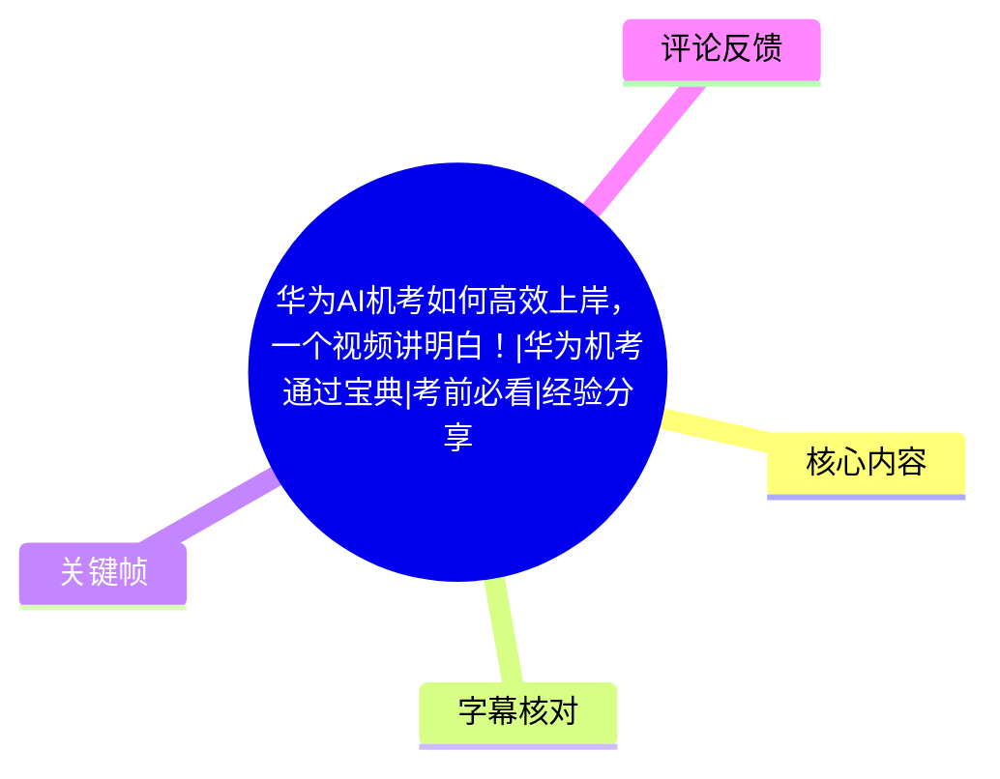
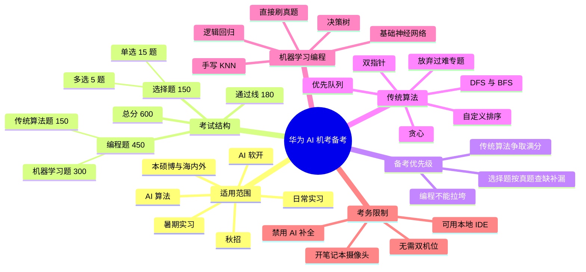
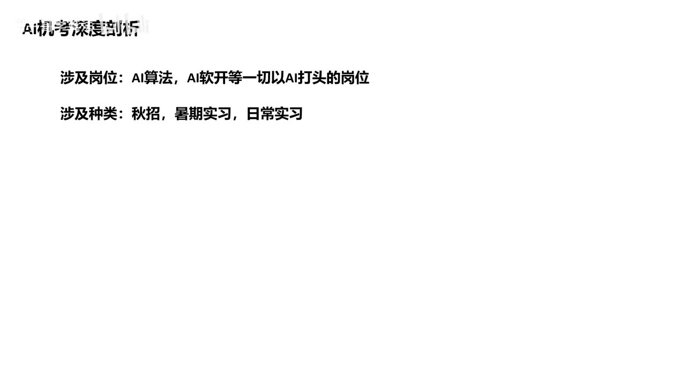
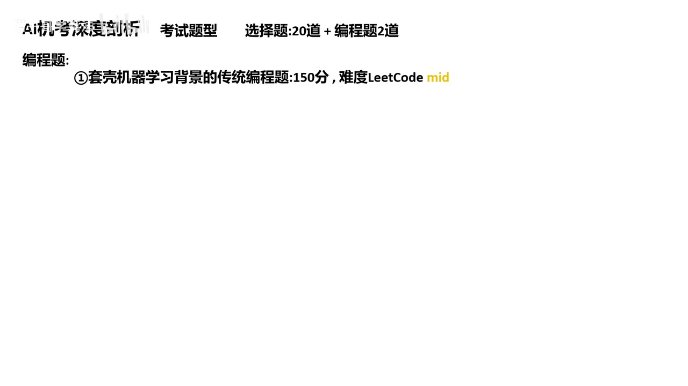

# 华为AI机考如何高效上岸，一个视频讲明白！|华为机考通过宝典|考前必看|经验分享

> 来源：[Bilibili 视频](https://www.bilibili.com/video/BV1L9YPzBEgM) 
> UP 主：塔子哥学算法｜发布时间：2025-09-09｜视频时长：11 分 31 秒｜分辨率：1920×1080  
> 视频简介题单链接：<https://rttxvuqg3f.feishu.cn/docx/PcBHdy3GsoIhxnx1RqucVqRdnAf?from=from_parent_docx>

## 小结

这是一份面向华为 AI 算法、AI 软开等岗位机考的考前经验梳理。视频将考试拆为**选择题 150 分 + 两道编程题 450 分，共 600 分**，并称 AI 机考的通过线为 **180 分**。其中，选择题共 20 道；编程题由一道带机器学习背景的传统算法题（150 分）和一道手写机器学习模型题（300 分）组成。

UP 主的核心策略是：**优先确保编程题不失守，尤其争取拿下 150 分传统算法题**。其理由是选择题存在基础题和一定随机性，但编程题的边界条件、变量或比较符错误都可能造成得分大幅下降；将希望主要放在选择题而不准备编程题，风险较高。

传统算法题的备考方向被归纳为：华为近两年真题、模拟题，以及优先队列、自定义排序、DFS、BFS、贪心、双指针等。UP 主明确建议时间有限时放弃高难动态规划、树状数组、组合数学、数论等方向。这是其基于若干场真题复盘得出的**经验性判断**，并非华为官方考试大纲。

机器学习编程题方面，视频建议直接刷真题，重点掌握手写 KNN、逻辑回归、决策树、基础神经网络等传统机器学习实现；不建议将 CNN、Transformer、XGBoost 等作为主要备考重点。视频的解释是岗位并不要求所有考生会 Python，试题需避免让不同语言考生因框架调用能力产生过大不公平。

视频还给出若干考务信息：若周三考试，通常可能在周一或周二晚收到邮件链接；示例考试时段为 19:00—21:00。视频称可使用本地 IDE，但不能使用 AI 补全；需要开启笔记本摄像头进行单机位录制，不需要双机位。以上均为视频转述和群友确认信息，实际考试以前应以当次邮件、考评系统和 HR 通知为准。

## 思维导图

## 目录

- [适用范围与信息边界](#适用范围与信息边界)
- [考试流程、题型与分数结构](#考试流程题型与分数结构)
- [两类编程题的考查重点](#两类编程题的考查重点)
- [核心策略：先守住编程题](#核心策略先守住编程题)
- [传统算法题：按高频知识点训练](#传统算法题按高频知识点训练)
- [机器学习编程题：重实现、轻框架](#机器学习编程题重实现轻框架)
- [时间紧张时的执行步骤](#时间紧张时的执行步骤)
- [考试环境与操作限制](#考试环境与操作限制)
- [结论、限制与时效性](#结论限制与时效性)
- [字幕比对](#字幕比对)
- [评论分析](#评论分析)
- [处理记录](#处理记录)

## [适用范围与信息边界](https://www.bilibili.com/video/BV1L9YPzBEgM?t=57)

### [覆盖岗位、招聘类型与人群｜00:57](https://www.bilibili.com/video/BV1L9YPzBEgM?t=57)

视频称，AI 机考覆盖的主要对象包括：

- **岗位**：AI 算法、AI 软开，以及“以 AI 打头”的岗位；
- **招聘类型**：秋招、暑期实习、日常实习；
- **候选人范围**：国内与海外留学生均可能参加；
- **学历层次**：本科、硕士、博士。

UP 主补充，部分具有专项方向的博士候选人可能参加“论文复现”或另一套机考，应单独向 HR 确认。对通用软件开发（通软）或嵌入式软件开发（嵌软）方向，他建议查看其合集中的其他视频，而不是将本视频的 AI 机考规则直接套用到其他方向。

> 图：画面列出“AI算法、AI软开等一切以 AI 打头的岗位”及“秋招、暑期实习、日常实习”等覆盖范围，是界定本视频适用对象的直接画面证据。

### 信息性质与适用边界

本视频不是华为官方公告，而是 UP 主根据其整理的真题、考生反馈及个人经验形成的备考建议。尤其是题型偏好、考点取舍、邮件发送节奏、软件限制等内容，都可能随批次、岗位、地区与考评平台调整。

视频中展示的若干日期集中在 2025 年 8 月至 9 月，页面示例中可见 2025-09-10 的考试信息。因此，本文保留其作为**当时经验**，不将其表述为长期固定规则。

## [考试流程、题型与分数结构](https://www.bilibili.com/video/BV1L9YPzBEgM?t=129)

### [邮件链接、时段与总分｜02:09](https://www.bilibili.com/video/BV1L9YPzBEgM?t=129)

视频举例：如果考试安排在周三，考生可能在周一晚或周二晚于邮箱收到考评链接。UP 主展示的示例页面中，考试开始时间为 19:00、结束时间为 21:00，总时长 120 分钟，总分 600 分；这只是视频中出现的一张页面，不能据此确认所有场次均相同。

> 图：画面展示“华为校园招聘 软件”考试页面，能直观看到示例中的总分 600 分、考试时段和时长，补足了 ASR 对页面文字识别不稳定的问题。

### [选择题：20 题、150 分｜02:09](https://www.bilibili.com/video/BV1L9YPzBEgM?t=129)

选择题部分总分为 **150 分**，组成如下：

| 题型 | 数量 | 单题分值 | 小计 |
| --- | ---: | ---: | ---: |
| 单选题 | 15 题 | 6 分 | 90 分 |
| 多选题 | 5 题 | 12 分 | 60 分 |
| 合计 | 20 题 | — | 150 分 |

视频列举的选择题知识范围包括：

1. 人工智能基础；
2. 机器学习基础；
3. 概率论；
4. 线性代数。

ASR 在“多选题每题分值”处识别为“15 分、12 分”并存，存在明显冲突；依据 15 道单选 × 6 分 = 90 分、选择题合计 150 分，以及画面所示“选择题 20 道”的结构，本文采用 **5 道多选 × 12 分 = 60 分** 的一致口径，并将其标注为结合上下文校正后的结果。

### [编程题与通过线｜02:58](https://www.bilibili.com/video/BV1L9YPzBEgM?t=178)

编程部分由两题构成：

| 编程题类型 | 分值 | 视频中的难度/特征描述 |
| --- | ---: | --- |
| 带机器学习背景的传统算法题 | 150 分 | 风格固定；UP 主以 LeetCode Medium 作为大致参照，但称难度会波动 |
| 手写机器学习模型题 | 300 分 | 难以直接对应 LeetCode；UP 主勉强类比为 LeetCode Hard 水平 |

据此，考试分数结构为：

\[
150\text{（选择）}+150\text{（传统算法）}+300\text{（机器学习）}=600\text{ 分}
\]

视频称 AI 机考通过线为 **180 分**，并对比称通软通过线为 150 分。考生应以自己收到的考试通知为最终依据。

> 图：画面直接写明“选择题：20道 + 编程题2道”，并标明第一道为“套壳机器学习背景的传统编程题：150分，难度 LeetCode mid”，用于核对题目数量和第一题定位。

## [两类编程题的考查重点](https://www.bilibili.com/video/BV1L9YPzBEgM?t=178)

### [第一题：AI 背景下的传统算法｜02:58](https://www.bilibili.com/video/BV1L9YPzBEgM?t=178)

UP 主称其复盘了 8 月 27 日、8 月 28 日、9 月 3 日和 9 月 4 日等场次，并归纳出一个规律：通常会有一道“套着机器学习外壳”的传统算法题。需要注意，视频随后也明确表示**不保证每一场的实际难度完全一致**；可理解为题目背景偏 AI，但底层解法仍偏传统数据结构与算法。

这类题的关键不应停留在“看懂机器学习故事”，而应完成两层转换：

1. 从题面抽取输入、输出、约束和目标；
2. 将其还原为可执行的传统算法模型，例如排序、搜索、贪心或图遍历。

### [第二题：手写传统机器学习模型｜03:22](https://www.bilibili.com/video/BV1L9YPzBEgM?t=202)

第二道题 300 分，视频称其主要考察手写机器学习模型。UP 主基于其整理的四场真题认为，范围“基本上都是传统机器学习的实现”。

视频没有给出完整题面、评分器规则、输入格式或所有模型清单，因此不能进一步推断具体 API、数据规模、测试点数量或容错方式。对于担心 ACM 模式/LeetCode 模式、样例数量、题面是否提供说明、评分细节的考生，UP 主将其引导至合集内通软机考相关视频；本视频本身未展开这些细节。

## [核心策略：先守住编程题](https://www.bilibili.com/video/BV1L9YPzBEgM?t=284)

### [“编程不能拉垮”的分数逻辑｜04:44](https://www.bilibili.com/video/BV1L9YPzBEgM?t=284)

视频给出的总策略是：**编程不能拉垮，优先争取拿下 150 分传统算法题**。

UP 主反对“重点准备选择题、编程题只拿一半甚至靠原有代码基础碰运气”的策略，理由包括：

- 选择题中有一部分基础题，短期可通过真题回顾弥补；
- 选择题即使存在不会的题，也有一定猜测概率；
- 编程题则是强确定性任务：不会写、边界条件漏掉、变量写错、比较符号错误，都可能使得分显著下降，甚至从满分变为零分。

这里的“选择题随便做也能拿 30 分”是 UP 主为强调编程题优先级作出的经验性表达，并非可保证的分数承诺。实际备考不应把猜题或“选 C”等说法当作方法，而应以掌握基础概念和真题复盘为主。

### [追求高分时：基础知识也要系统补足｜06:20](https://www.bilibili.com/video/BV1L9YPzBEgM?t=380)

对于希望获得高分、提升后续排序竞争力，或认为项目、实习、学历背景不占优的考生，视频建议在确保编程能力后进一步补齐基础。UP 主强调编程题考的是“基础知识”，这里的“基础”并不等于简单，而是指更偏底层原理和可手写实现的知识。

若时间不够，视频建议采用**自顶向下**方式：

1. 直接做已有选择题真题；
2. 对错题定位知识盲区；
3. 针对盲区拆解学习；
4. 回到题目验证理解。

视频称其当时已整理四场真题、约 80 道选择题；该题量是视频发布时的资源状态，不代表当前题单仍保持相同数量。

## [传统算法题：按高频知识点训练](https://www.bilibili.com/video/BV1L9YPzBEgM?t=417)

### [建议投入的方向｜06:57](https://www.bilibili.com/video/BV1L9YPzBEgM?t=417)

对传统编程题，UP 主建议多刷华为近两年真题，并在其题单模拟题中重点训练：

- 优先队列；
- 自定义排序；
- DFS；
- BFS；
- 贪心；
- 双指针。

如果只使用 LeetCode 训练，视频也建议围绕同类知识点筛题，而非无差别刷题。实操上可以按“题型识别—模板熟练—边界测试—限时复盘”推进：

1. **题型识别**：看到问题后先判断是否需要排序、堆、遍历、双指针或贪心；
2. **模板熟练**：确保能独立写出优先队列、图/树遍历、排序比较器等基本结构；
3. **边界测试**：检查空输入、单元素、重复值、极值、越界、相等比较等；
4. **限时复盘**：记录错误发生在建模、实现、复杂度还是输入输出处理。

上述四步是对视频“多刷真题、编程不能失误”的整理，不是视频逐字给出的固定流程。

### [建议暂不优先的方向｜07:21](https://www.bilibili.com/video/BV1L9YPzBEgM?t=441)

在时间有限的前提下，视频建议放弃或降低以下专题的优先级：

- 高难动态规划；
- 树状数组；
- 组合数学；
- 数论；
- 其他难度较高的数学题。

UP 主的依据是其对近期真题的观察：这些内容“不会考很多”，而某些其他大厂可能更常考。该结论只适用于其观察到的华为 AI 机考题目样本；如果目标岗位或批次有特殊要求，不能据此排除全部可能性。

### [为何传统算法仍然重要｜08:09](https://www.bilibili.com/video/BV1L9YPzBEgM?t=489)

针对“AI 机考改革后刷传统算法是否还有用”的疑问，UP 主的观点是：题目虽增加了 AI 背景，但题目风格和知识点偏好仍与此前通软机考有连续性；他将其概括为“换汤不换药”。同时，考生仍需理解机器学习基础，因为必要知识可能出现在题面中。

这属于对出题风格的推断，不能替代官方规则。更稳妥的执行方式是：用近期真题验证这一判断；如果发现实际题目已显著偏离，应及时调整训练比例。

## [机器学习编程题：重实现、轻框架](https://www.bilibili.com/video/BV1L9YPzBEgM?t=537)

### [优先模型与训练方式｜08:57](https://www.bilibili.com/video/BV1L9YPzBEgM?t=537)

机器学习编程题的首要建议是**直接刷真题**。若希望做更扎实的准备，视频建议优先掌握可手写的传统模型或基础模型，包括：

- KNN；
- 逻辑回归；
- 决策树；
- 基础神经网络。

ASR 在“常见的卷级逻辑回归角色数”处失真严重，结合上下文只能可靠确认视频在列举“逻辑回归、决策树、基础神经网络”等方向；本文不保留无法被音频可靠辨认的额外术语。

备考重点应放在理解模型计算过程，而非仅会调用库。例如：

- KNN：距离计算、邻居选择、投票或聚合；
- 逻辑回归：线性组合、概率映射、分类判断；
- 决策树：基于特征条件的划分逻辑；
- 基础神经网络：前向计算及题面要求的基础运算。

这些描述用于归纳“手写实现”的学习目标；视频并未给出每个模型的固定考法、损失函数、训练轮数或输入规模。

### [不作为主要方向的内容及其理由｜09:21](https://www.bilibili.com/video/BV1L9YPzBEgM?t=561)

视频建议不要把 CNN、Transformer、XGBoost 作为当前阶段的重点。UP 主提出的解释是：

- 华为 AI 软开与通软的岗位要求差别不大；
- 招聘并不要求候选人一定会 Python；
- 出题不应让 Python 选手只调用几行 PyTorch 就完成题目，同时让 Java/C++ 选手不得不手写复杂反向传播或大型网络。

因此，他判断试题更可能选取跨语言、更适合手写的基础机器学习实现，而不会要求手写 Transformer 或 SVM。这里应注意两点：

1. “不建议重点准备”不等于这些概念永远不可能出现在题面背景或选择题中；
2. 视频的 “SVM” 在 ASR 中多次误识别为 “SVN”，本文按机器学习语境校正为 **SVM**；但这仍是依据上下文进行的术语修正。

## [时间紧张时的执行步骤](https://www.bilibili.com/video/BV1L9YPzBEgM?t=634)

### [从真题出发的短期方案｜10:34](https://www.bilibili.com/video/BV1L9YPzBEgM?t=634)

视频反复强调：时间短时，不要试图从头完整学习所有基础，而应从真题出发、自顶向下准备。结合其具体建议，可整理为以下考前执行顺序：

1. **确认考试类别**  
   先向 HR 或邮件确认自己参加的是 AI 机考、通软/嵌软机考，还是博士专项的论文复现等其他形式。

2. **优先攻克 150 分传统算法题**  
   围绕优先队列、排序、DFS/BFS、贪心、双指针刷近期华为题和模拟题；至少做到能独立完成常见模板与调试。

3. **做选择题真题，按错因补课**  
   从人工智能基础、机器学习基础、概率论、线性代数四类内容中定位薄弱环节，而不是只背答案。

4. **练习手写机器学习实现**  
   通过真题和同风格题目熟悉 KNN、逻辑回归、决策树、基础神经网络等的输入输出和实现细节。

5. **模拟真实输入输出与边界条件**  
   避免因为变量、等号、比较方向、读写格式等实现错误损失编程题分数。

6. **考前核对考务要求**  
   从最新邮件和系统说明确认考试时段、链接、允许软件、摄像头、录屏和监考要求；不要仅以本视频为准。

## [考试环境与操作限制](https://www.bilibili.com/video/BV1L9YPzBEgM?t=658)

### [Python、IDE、AI 补全与机位｜10:58](https://www.bilibili.com/video/BV1L9YPzBEgM?t=658)

视频最后集中回答了三个常见问题：

| 问题 | 视频中的回答 | 使用时的注意事项 |
| --- | --- | --- |
| Python 选手是否可使用 NumPy | 视频称群友已确认“可以用 NumPy” | 非官方规则；以考试页面的软件环境、白名单和邮件说明为准 |
| 能否使用本地 IDE | 视频称可以 | 具体 IDE、版本、插件及联网限制需以当场规则为准 |
| 能否用 AI 补全 | 视频称不能使用 AI 补全，且全程录屏 | 应在考前关闭相关插件、云端助手和自动补全服务，避免误触 |
| 摄像头与机位 | 视频称需开启笔记本摄像头、单机位；不需锁手机，也不需双机位 | 实际监考要求可能变化，应以考评系统要求为准 |

ASR 将 “NumPy” 识别为“当 Py”，将 “PyTorch” 识别为“Prytorch”，均属于英文技术名词的语音识别误差。本文按上下文分别校正为 **NumPy** 和 **PyTorch**。

## [结论、限制与时效性](https://www.bilibili.com/video/BV1L9YPzBEgM?t=675)

### 可迁移的备考结论

- 用通过线思维规划：在 600 分、180 分通过的前提下，先把高确定性的编程能力建立起来；
- 将 AI 背景题还原成算法问题，避免被题目包装干扰；
- 选择题适合通过真题驱动式查缺补漏，编程题更需要完整实现和边界调试；
- 机器学习编程题应优先准备跨语言可手写的基础模型与计算过程；
- 临近考试时，近期真题比泛化、无边界的知识扩展更有价值。

### 重要限制

1. 视频信息主要来自个人真题整理、平台资源和考生反馈，未提供华为官方文件佐证。
2. 分数结构、通过线、题型风格、可用软件、机位和录屏要求都有批次变化风险。
3. 视频没有完整展示编程题题面、测试数据、评分策略、语言版本和系统软件清单，无法据此制定全部技术细节。
4. UP 主对“传统算法题必有一道”“不考某类高级模型”等表述，应理解为样本观察下的备考倾向，而非绝对承诺。
5. 视频发布于 2025 年 9 月，且所援引题目集中于当年 8—9 月；截至素材抓取时间（2026-07-17），其中考务规则和真题偏好均可能已更新。

## [字幕比对](https://www.bilibili.com/video/BV1L9YPzBEgM?t=32)

| 字幕来源 | 完整性 | 专有名词 | 时间轴 | 主要问题 |
| --- | --- | --- | --- | --- |
| Bilibili 站内字幕 | 未提供可用字幕 | 无法核验 | 无 | 字幕抓取过程返回 `Invalid URL`，因此没有可用于正文的站内字幕 |
| 本次 ASR 字幕 | 较高：31 段、覆盖约 643.79 秒，语音覆盖率 93.24% | 存在多处英文名词与数字误识别 | 可用：带 SRT 起止时间 | 个别长段落粘连；“NumPy / PyTorch / SVM”等术语失真；多选题单题分值存在“15/12”冲突；少数句子无法可靠辨认 |

本次 ASR 使用 `medium` 模型，识别语言为中文，语言置信度为 0.9985，音频总时长约 690.47 秒。ASR 结果**未标记** `noAudioStream=true`，且实际提供了音频文件和带时间戳的识别结果，因此可以确认素材存在可识别音轨；这不是无音轨视频，也不是工具失败。

最终正文以**本次 ASR 的 SRT 时间轴**为定位基础，并结合关键帧画面和算术一致性对以下信息进行了有限校正：

- “当 Py”校正为 **NumPy**；
- “Prytorch”校正为 **PyTorch**；
- “SVN”按机器学习语境校正为 **SVM**；
- 选择题结构采用 15 道单选 × 6 分、5 道多选 × 12 分，总计 150 分；
- 对无法稳定辨认的术语不作补写，以避免编造。

## [评论分析](https://www.bilibili.com/video/BV1L9YPzBEgM?t=675)

仅处理可获取热评前三条；评论反映观众疑问，不构成已验证事实。

1. **FlashCQU（7 赞）**：称自己编程基础薄弱、只会 LeetCode 简单题，询问下周机考是否能快速提升。  
   - 这与视频“时间紧张时从真题自顶向下准备、优先传统算法题”的建议高度相关。  
   - 但视频未承诺一周内可以从 LeetCode Easy 稳定提升到通过水平；对于基础薄弱者，应优先验证自身是否能独立完成排序、搜索、遍历和输入输出调试。

2. **身比碳钢硬（5 赞）**：询问深度学习 CV 相关岗位属于 AI 考还是普通软开考。  
   - 视频只给出“AI 算法、AI 软开等以 AI 打头岗位”这一概括，未对“深度学习 CV”岗位给出明确归类。  
   - 这条评论恰好说明岗位名称与考试类别不能仅凭技术方向推断，应以职位说明、HR 和考试邮件确认。

3. **姑苏废人（4 赞）**：询问当前论文复现的具体情况。  
   - 视频仅称部分专项博士可能是论文复现或另一套机考，具体需与 HR 沟通，没有展开规则、题目形式或评分要求。  
   - 因此，评论提出的问题在本视频中没有被充分回答，不能从本视频推导出论文复现考核的细则。

## [处理记录](https://www.bilibili.com/video/BV1L9YPzBEgM?t=32)

- Worker ID：`worker-mrph3ry8-07ea3483`
- 模型：`gpt-5.6-terra`
- ASR 模型与运行信息：`medium`；中文识别；CUDA；`float16`；带时间戳 SRT。
- 使用的素材与工具结果：视频元数据、音频 ASR 结果、ASR SRT、12 张关键帧、可获取热评前三条；站内字幕获取尝试返回 `Invalid URL`。
- 字幕选择：站内无可用字幕；采用本次 ASR 的时间戳作为章节定位依据，并以关键帧和上下文对少量明显术语/分数错误进行保守校正。
- 关键帧选择依据：
  - `frames/frame-002.jpg`：直接展示 AI 机考涉及岗位与招聘类型；
  - `frames/frame-003.jpg`：展示考评系统页面中的示例总分、时段和时长；
  - `frames/frame-004.jpg`：直接展示选择题数量、编程题数量及第一题分值与难度定位。
- 缓存清理：提供的素材未包含缓存清理执行日志或结果，无法确认是否已清理；本文不据此编造清理状态。
- 未解决问题：
  - 无法取得站内字幕以进行逐句交叉核验；
  - 无法从本视频确认当前批次的官方考务规则、完整题库、评分规则与语言环境；
  - ASR 个别词句失真，本文仅对能够由画面、算术关系或明确上下文支持的内容做了校正。

## 评论分析

- 热评 1：编程基础薄弱（只会做leetcode简单题），下周华为机考有没有快速提升的方法[笑哭][笑哭][笑哭]
- 热评 2：深度学习相关cv的相关岗位属于ai考还是普通软开考呢？
- 热评 3：塔子哥知道现在论文复现是什么情况吗？

以上内容是观众反馈摘录，只用于补充理解视频反响，不作为正文事实依据。
