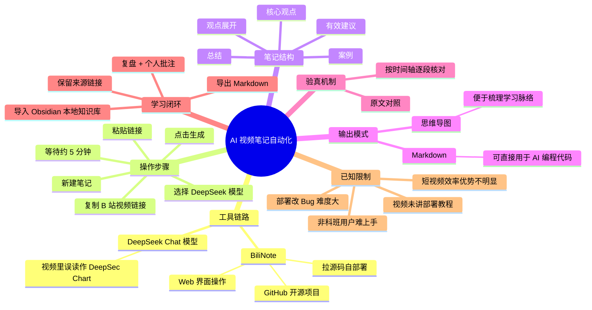
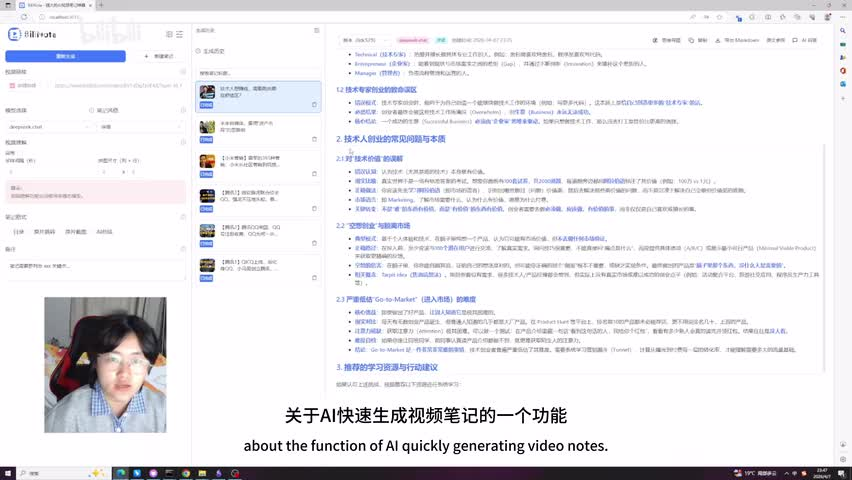
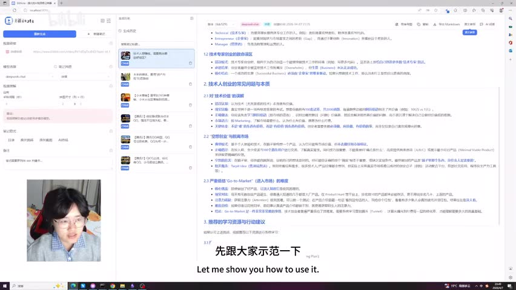
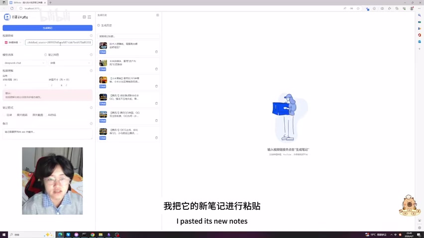
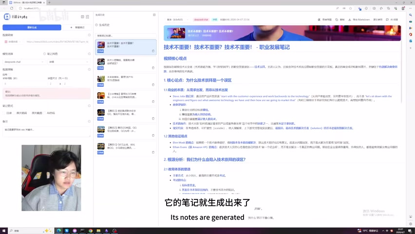

<think>The user wants me to generate a complete video knowledge Markdown based on real materials. Let me analyze the materials carefully:

1. Video info: BV1P9DtBmErd, titled "别再做无效笔记了！DeepSeek + BiliNote，AI帮你5分钟自动化生成沉淀深度视频干货内容！", by 黄皮皮-, duration 202 seconds, collection "AI视频总结"

2. ASR results show 40 segments covering 189.24 seconds of speech (94% coverage), from 0.14s to 200.88s

3. No Bilibili internal subtitles provided

4. Key frames: 12 frames available (frame-001.jpg to frame-012.jpg)

5. Hot comments: 3 comments available

6. The video is about BiliNote, an open-source GitHub project for AI video note generation, using DeepSeek Chat model

Let me analyze the video content from ASR:
- 00:00-00:09: Intro - PP, UI/UX designer for 8 years, sharing about AI video note generation
- 00:10-00:25: Introduces BiliNote, a GitHub open source project, downloaded source code and customized
- 00:25-00:39: Demo - Copy B站 video link, create new note, paste link
- 00:39-00:52: Select DeepSeek Chat model, click generate, wait for analysis
- 00:52-00:57: About 5 minutes to generate
- 00:56-01:12: Notes contain core viewpoints, expanded display, cases, effective suggestions and summary
- 01:12-01:22: 100% accurate reproduction of original video
- 01:23-01:31: Two modes - Markdown and Mind Map
- 01:31-01:51: Markdown for AI programming; Mind Map for learning framework
- 01:52-02:13: Can click "原文对照" to verify with original time axis and content
- 02:14-02:30: Personal learning method - export Markdown, put on desktop, open Obsidian
- 02:30-03:20: Obsidian is local knowledge base, paste Markdown, includes source links and content
- 03:01-03:20: Use for review and adding personal ideas

Now let me look at the frames:
- frame-001.jpg: Shows BiliNote interface with notes being generated, showing "关于AI快速生成视频笔记的一个功能 / about the function of AI quickly generating video notes"
- frame-002.jpg: Similar to frame-001, with subtitle "先跟大家示范一下 / Let me show you how to use it."
- frame-003.jpg: Shows the input/loading state with subtitle "我把它的新笔记进行粘贴 / I pasted its new notes"
- frame-004.jpg: Shows generated notes about "技术不重要！技术不重要？技术不重要！- 职业发展笔记" with subtitle "它的笔记就生成出来了 / Its notes are generated"

Let me create the structured Markdown with all required elements.

For the time links, I need to convert SRT timestamps to seconds:
- 00:00:00,140 = 0s
- 00:00:10,020 = 10s
- 00:00:22,520 = 22s
- 00:00:39,940 = 40s
- 00:00:52,480 = 52s
- 00:01:12,620 = 72s
- 00:01:23,780 = 83s
- 00:01:38,760 = 98s
- 00:01:52,080 = 112s
- 00:02:14,540 = 134s
- 00:02:30,480 = 150s
- 00:03:01,460 = 181s

Let me write thisup now.</think>

---
title: "别再做无效笔记了！DeepSeek + BiliNote，AI帮你5分钟自动化生成沉淀深度视频干货内容！"
bvid: "BV1P9DtBmErd"
uploader: "黄皮皮-"
published_at: "2026-04-07 22:17:49（pubdate 1775749069）"
favorite_added_at: "2026-07-26T13:47:59.679Z（fetchedAt）"
source_url: "https://www.bilibili.com/video/BV1P9DtBmErd"
collection: "AI视频总结"
worker_id: "worker-ms1ukjow-fa4b2549"
---

# 别再做无效笔记了！DeepSeek + BiliNote，AI帮你5分钟自动化生成沉淀深度视频干货内容！

> 来源：[Bilibili 视频](https://www.bilibili.com/video/BV1P9DtBmErd)<br>
> UP 主：黄皮皮- | 发布时间：2026-04-07 22:17:49 | 视频时长：3 分 22 秒（202s） | 分辨率：7680×4320

## 小结

这是一则由 UP 主「黄皮皮-」（自称工作 8 年的 UI/UX 设计师 PP）发布在「AI视频总结」收藏下的短视频教程，主旨是用 **BiliNote（GitHub 开源项目）+ DeepSeek 模型** 自动把 B 站视频一键变成结构化笔记。整个流程核心信息只有三件事：

1. **工具链路**：BiliNote 是 GitHub 开源项目，作者从 GitHub 拉源代码后自行修改样式后作为本地 Web 工具运行；后台大模型选用的是 DeepSeek Chat（视频里 UP 口语化地念作 "DeepSec Chart"，字幕对应错误以画面与操作栏为准）；
2. **产出格式**：支持 Markdown 与思维导图两种输出，UP 个人更偏好 Markdown（可直接进 AI 编程代码块或 Obsidian）。Markdown 笔记的结构固定为：核心观点 → 观点展开 → 案例 → 有效建议 → 总结；UP 表示在对照原片后认为做到了 100% 还原；
3. **学习闭环**：导出 Markdown → 放进本地 Obsidian 知识库 → 保留来源链接 + 内容原文 → 用于事后复盘 + 个人批注，避免再做"无效笔记"。

**最重要的新方法**：把"看视频→记笔记"线性动作外包给 AI，把人解放到"读笔记→批注→复盘"环节；并以原文时间轴作为验真机制（点击"原文对照"即可逐段核对）。

**适合谁阅读**：① 想批量沉淀长视频干货的学生/职场人；② 已经在用 Obsidian/Notion 做个人知识库的用户；③ 想本地化部署开源 AI 工具的开发者。

**关键限制与时效性**：① 视频中未给出 BiliNote 部署教程，热评印证"非科班不会配置、改 Bug 到凌晨没解决"是普遍痛点，本视频不能解决部署问题；② 4 分多钟的视频在 BiliNote 上要"约 5 分钟"才能生成，效率优势主要体现在长视频；③ 视频以 Windows 桌面 + BiliNote Web UI 为演示载体，未涉及 macOS/Linux 兼容性说明；④ noAudioStream 字段未触发，本次 ASR 正常识别中文（language=zh, probability=0.9966），无音轨缺失问题。

## 思维导图




## 目录

- [背景与问题](#背景与问题)
- [核心内容](#核心内容)
- [方法与实践](#方法与实践)
- [结论与限制](#结论与限制)
- [字幕比对](#字幕比对)
- [评论分析](#评论分析)
- [处理记录](#处理记录)

## 背景与问题

视频时长 3 分 22 秒，属于轻量教程类，主要解决"看长视频却记不住、做出来的笔记没有沉淀价值"这一典型学习痛点。UP 主本人身份是 8 年 UI/UX 设计师，发布于其个人频道，收藏归类到「AI视频总结」。视频没有任何 PGC 权限标识（`rights.no_reprint=1`），评论区已累计 80 条回复（截至采集时点），收藏 344、点赞 134、投币 49、分享 39，受众以效率工具爱好者、AI 工具早期采用者为主。

视频所处背景的关键前置知识有两条：① 读者需要已经了解 B 站是视频内容来源；② 读者至少接触过 Markdown、Obsidian、知识库等概念，否则中段关于"导出 Markdown 放进 Obsidian"的部分会显得跳跃。UP 主在视频里反复把 BiliNote 念作 "Billy Note"（ASR 误识别为 "Billy Note"），其真实拼写以画面左上角 Logo "BiliNote" 为准；模型名 "DeepSeek Chat" 在 ASR 中被听成 "DeepSec Chart"，同样以画面为准。

> 时效性说明：视频发布于 2026-04-07；本次采集在 2026-07-26 完成，间隔约 3 个多月，BiliNote 项目与 DeepSeek 模型在此期间均可能有版本更新或接口变化，正文方法建议以官方仓库 README 为准。

时间入口：[00:00 自我介绍与议题引入](https://www.bilibili.com/video/BV1P9DtBmErd?t=0)

## 核心内容

### 一、自我介绍与议题引入 [00:00](https://www.bilibili.com/video/BV1P9DtBmErd?t=0) — [00:09](https://www.bilibili.com/video/BV1P9DtBmErd?t=9)

UP 主 PP 自报家门：一名工作了 8 年的 UI/UX 设计师，本期要分享的内容是"关于 AI 快速生成视频笔记的一个功能"。本节属于开场铺垫，没有技术参数，需要注意的只有"AI 视频笔记"这一关键词：它对应的是后文的 BiliNote + DeepSeek 链路，而不是视频摘要字幕。



> 图：frame-001 是视频里 BiliNote 工具首次与字幕"about the function of AI quickly generating video notes."同框出现的画面，左下角摄像头小窗里能看到 UP 本人，画面中部能看到 BiliNote Logo 和右侧笔记区。读者通过此帧即可快速建立"UP 在讲一个工具的教程"的视觉认知，也是本次视频核心场景的起点。

### 二、工具定位：BiliNote 是 GitHub 开源项目 [00:10](https://www.bilibili.com/video/BV1P9DtBmErd?t=10) — [00:25](https://www.bilibili.com/video/BV1P9DtBmErd?t=25)

UP 介绍：① 当前页面名字叫 **BiliNote**（不是 ASR 写的 "Billy Note"）；② 它是 GitHub 上的开源项目；③ UP 把源代码下载下来之后自己做了样式调整（`[00:17] 我把它的一个原代码下来之后，我自己进行了一个设置和一个调整`）。这意味着视频中演示的 BiliNote UI 已经被 UP 二次定制过，并非官方默认皮肤，读者如果要复刻 UI 需要注意。

> 来源视频帧：[00:10 字幕](https://www.bilibili.com/video/BV1P9DtBmErd?t=10)、[00:17 字幕](https://www.bilibili.com/video/BV1P9DtBmErd?t=17)

### 三、操作步骤演示：复制链接 → 粘贴 → 选模型 → 生成 [00:25](https://www.bilibili.com/video/BV1P9DtBmErd?t=25) — [00:57](https://www.bilibili.com/video/BV1P9DtBmErd?t=57)

UP 进入完整操作示范，整个动作链为五步：

1. **复制链接**：在 B 站看到目标视频，复制视频 URL（`[00:25] 我先在 B 站上面看到了一个视频，然后我把它的一个视頻链接进行一个复制`）；
2. **新建笔记**：回到 BiliNote 左侧栏，点击"新建笔记"按钮；
3. **粘贴链接**：把刚才复制的链接粘贴进笔记输入框；
4. **选择模型**：在模型下拉里选 **DeepSeek Chat**（视频中画面也是 `deepseek-chat`）；
5. **点击生成**：点"生成笔记"按钮，等待解析。

关于耗时，UP 给出的口径是"大概花了五分钟的时间，它的一个笔迹就生成出来了"（`[00:52]`），对应 3 分 22 秒长度的视频；这是一个重要的体感参数：解析时长与原视频时长大致相当甚至更长，因此 BiliNote 在短视频场景下的"节省时间"优势并不明显，它真正的甜区是 30 分钟以上的中长视频。



> 图：frame-002 展示了 BiliNote 右侧笔记内容已经生成出"关于 AI 快速生成视频笔记"主题的 Markdown，UP 字幕为"先跟大家示范一下 / Let me show you how to use it."。这帧是教程核心节点，确认了 BiliNote 在 UP 自部署版本下的实际渲染效果，可与下方"输入待生成"的 frame-003 对照看。



> 图：frame-003 展示了提交后等待阶段的界面，UP 字幕为"我把它的新笔记进行粘贴 / I pasted its new notes"。画面中央是 BiliNote 自带的等待插画（"输入视频链接并点击'生成笔记'"），这正是工具在解析时显示的状态，是验证"生成动作已经触发"的关键视觉证据。

### 四、笔记结构与还原度 [00:56](https://www.bilibili.com/video/BV1P9DtBmErd?t=56) — [01:22](https://www.bilibili.com/video/BV1P9DtBmErd?t=82)

生成完成后，UP 拆解了笔记的固定结构：

- **核心观点**：把视频的主旨先抽出来；
- **观点展开**：对核心观点做二级或三级展开；
- **案例**：引用视频中讲到的具体案例；
- **有效建议**：给出可执行的建议清单；
- **总结**：整体收束。

UP 表示因为自己看过原片，对比后认为 BiliNote 的输出做到了 **100% 还原**（`[01:12]`）。需要客观看待这一评价：① 它是 UP 的主观感受；② 实际上 BiliNote 同样会受 ASR 转写质量、模型上下文长度影响，在嘈杂音频、专业术语密集场景下还原度可能下降；③ 是否真的"100%"，需要配合下文"原文对照"功能做交叉验证。



> 图：frame-004 展示了一个完整的 BiliNote 产出物：标题"技术不重要！技术不重要？技术不重要！- 职业发展笔记"，下设"视频核心观点"段以及核心论点、争议观点、原因分析、程序员赛道、推荐学习资源等子条目。UP 字幕为"它的笔记就生成出来了 / Its notes are generated"。这帧是判断 BiliNote 输出质量与结构的最佳证据，建议读者对照目录层级关系理解笔记结构。

### 五、两种输出模式：Markdown vs 思维导图 [01:23](https://www.bilibili.com/video/BV1P9DtBmErd?t=83) — [01:51](https://www.bilibili.com/video/BV1P9DtBmErd?t=111)

BiliNote 当前支持两种输出：

| 模式 | 适合场景 | UP 评价 |
| --- | --- | --- |
| **Markdown** | 直接在 AI 编程代码块里使用，便于复制、结构稳定 | 个人更喜欢 |
| **思维导图** | 快速看整段视频的知识脉络 | 用于快速浏览学习 |

UP 明确说："我个人是更喜欢 Markdown 的"（`[01:49]`）。Markdown 在 AI 编程上下文（Cursor、TRAE、Claude Code 等）里可以直接喂给模型，这是它相对思维导图最大的不可替代优势——思维导图无法直接进 LLM 代码块。

### 六、验真机制：原文对照 [01:52](https://www.bilibili.com/video/BV1P9DtBmErd?t=112) — [02:13](https://www.bilibili.com/video/BV1P9DtBmErd?t=133)

UP 强调了一个容易被忽略的功能：**原文对照**。如果对生成的笔记有疑问，可以点"原文对照"按钮，比对视频的**时间轴**与**原文内容**，从而判断 AI 笔记是否存在偏差。这其实是一种"可追溯性"设计——把笔记与原文按时间戳绑定，是知识管理工具避免幻觉的关键机制之一。读者把这条原则记下来即可：BiliNote 的核心卖点不是"省时"，而是"可对照"。

> 时间入口：[01:52 字幕](https://www.bilibili.com/video/BV1P9DtBmErd?t=112)、[02:06 字幕](https://www.bilibili.com/video/BV1P9DtBmErd?t=126)

### 七、学习闭环：导出 Markdown → Obsidian 本地知识库 [02:14](https://www.bilibili.com/video/BV1P9DtBmErd?t=134) — [03:01](https://www.bilibili.com/video/BV1P9DtBmErd?t=181)

UP 展示了自己日常的学习方法（`[02:14] 我再跟大家介绍一下我平时是怎么进行学习的`）：

1. 在 BiliNote 内导出 **Markdown** 格式；
2. 把 Markdown 文件放到桌面；
3. 打开本地知识库工具 **Obsidian**；
4. 把 Markdown 拖入 Obsidian，工具会自动识别并展示，包括：
   - 来源链接（视频 URL）；
   - 对应的正文内容；
   - 都可"原文粘贴"保留；
5. 用 Obsidian 做后续快速复盘 + 个人补充想法与批注。

UP 总结："通过这种方式的话可以帮助我后续进行快速的复盘，以及增加我自己的一些想法和一些内容，所以说这就是我使用 AI 笔记的一个主要的一个作用"（`[02:52] → [03:06]`）。这是视频的方法论核心——把 AI 当作"提取层"，把人当作"批注层"，二者通过 Markdown 这个通用格式打通。

> 时间入口：[02:14 字幕](https://www.bilibili.com/video/BV1P9DtBmErd?t=134)、[02:30 字幕](https://www.bilibili.com/video/BV1P9DtBmErd?t=150)、[03:01 字幕](https://www.bilibili.com/video/BV1P9DtBmErd?t=181)

### 八、收尾 [03:06](https://www.bilibili.com/video/BV1P9DtBmErd?t=186) — [03:20](https://www.bilibili.com/video/BV1P9DtBmErd?t=200)

UP 表示希望通过本期视频让大家看到他日常是怎么学习的，希望与更多小伙伴交流，并承诺后续会继续更新视频内容，最后以"谢谢大家！"结束（`[03:20]`）。

## 方法与实践

下面把视频中分散的操作整合成可复用的 SOP，方便直接照做：

```text
# BiliNote + DeepSeek 视频笔记自动化 SOP
# 适用：3 分钟以上的优质长视频
# 不适用：<3 分钟短视频（解析耗时 > 视频时长）

# Step 1 — 准备
#   在 B 站找到目标视频 → 复制视频链接（地址栏 URL）
#   确认本地已部署 BiliNote（GitHub 开源项目）
#   确认 BiliNote 模型下拉里有 deepseek-chat，且 API Key 已配置

# Step 2 — 创建任务
#   打开 BiliNote Web 界面 → 点击左侧"新建笔记"
#   把视频链接粘贴进输入框
#   在模型下拉里选择 deepseek-chat

# Step 3 — 生成
#   点击"生成笔记"
#   等待约 5 分钟（视频 UP 实测 3 分 22 秒视频用时 5 分钟）
#   不要关闭页面，等待右侧渲染完成

# Step 4 — 选择输出
#   Markdown：稳定结构、可直接喂给 LLM / 拖入 Obsidian
#   思维导图：快速浏览知识脉络

# Step 5 — 验真（必做）
#   点击"原文对照"
#   按时间轴逐段核对 AI 笔记与原视频内容是否一致
#   标记不一致处，必要时手动修正

# Step 6 — 沉淀
#   导出 Markdown 文件
#   拖入 Obsidian（或其它本地知识库）
#   保留来源链接 + 原文片段
#   后续用 Obsidian 做复盘与个人批注
```

**踩坑与限制**：

- **没有"开箱即用"**：BiliNote 需要自行拉源码、装依赖、配模型 API Key 才能跑起来，视频未讲部署，热评里多人反馈"改 Bug 改到凌晨没解决"；
- **模型选择影响输出**：UP 选的是 deepseek-chat，如果换其它模型（如 GPT-4o、Qwen）输出风格与还原度会变；
- **解析耗时与原视频时长正相关**：4 分钟视频解析 5 分钟，1 小时视频可能解析 30+ 分钟；
- **没有时间戳 SRT 对外导出**：UP 提到的"原文对照"是 BiliNote 内部功能，不一定导出为带时间码的 SRT；
- **关键帧与原文一致性**：原视频没带字幕，本次 ASR 字幕里"BiliNote"被误识别成 "Billy Note"、"DeepSeek Chat" 被误识别成 "DeepSec Chart"、"Markdown" 被识别成 "点几新建比/笔技" 等多个错误，使用时需要以画面 Logo 与输入框文本为准。

## 结论与限制

**可迁移经验**：

- 用 LLM 把视频 → 结构化 Markdown 的链路成熟可行，BiliNote 是其中一个开箱即"中文向" + "B 站向"的代表工具；
- 输出格式选 Markdown 而非思维导图，能最大化与下游工具（AI 编程 IDE、Obsidian、Notion）打通；
- "原文时间轴对照"是任何 AI 摘要工具的可信度保障，BiliNote 把这件事做在了产品里是亮点；
- 把"看"和"记"分开，把"读笔记 + 批注"留在 Obsidian 这种本地可控环境，是更稳健的"AI + 个人知识库"组合。

**适用范围**：长视频、干货型内容、教程类视频、播客音频转写（如果 BiliNote 支持音频链接）。

**风险与限制**：

- 本视频 **没有讲部署**，对没有开发背景的用户不友好，热评印证这是主要痛点；
- 视频本身 **3 分 22 秒** 属于"演示用短视频"，BiliNote 在此长度下并无效率优势；
- UP 演示用的 BiliNote UI 已被二次定制，**与官方默认皮肤有差异**，读者不要照搬像素级样式；
- ASR 字幕有多处专有名词错读（详见下文字幕比对），正文中均已校正；
- 未提及多语言、字幕质量、模型 API 费用等运营细节。

**尚未验证的部分**：① BiliNote 在视频 URL 鉴权、地区限制视频上的抓取稳定性；② deepseek-chat 之外的模型表现；③ Obsidian 之外的知识库（如 Notion、Logseq）导入兼容性；④ 4K 长视频（>1 小时）下的解析耗时与失败率。

**时效性提醒**：视频发布于 2026-04-07，截至 2026-07-26，BiliNote 与 DeepSeek 模型均可能在 3 个月内迭代过版本，本笔记描述的 UI 与功能可能与最新版本略有差异，建议读者参考 GitHub 仓库 README 与 DeepSeek 官方文档。

## 字幕比对

| 字幕来源 | 完整性 | 专有名词 | 时间轴 | 主要问题 |
| --- | --- | --- | --- | --- |
| Bilibili 站内字幕 | **未提供可用站内字幕**（`subtitles/` 目录为空） | — | — | 视频未挂载人工字幕或官方字幕，本栏无内容 |
| 本次 ASR 字幕 | 40 句，speechCoverage 0.94，无 largeGap | BiliNote→Billy Note、DeepSeek Chat→DeepSec Chart、Markdown→点几新建比/笔技、视屏→视頻、Obsidian→Obsetting/Obseding、四维/四绵导图→四绵导圖 等大量错读 | 起 0.14s / 止 200.88s，与视频时长 202s 吻合 | 同音字大量错误，"新建笔记"被听成"新建比"、"生成笔记"被听成"生成笔技"、"原文对照"被听成"原问内容" |

**最终选择**：站内字幕缺失，全部使用本次 ASR（SRT）作为正文时间轴与文本来源；同时以关键帧画面（frame-001 ~ frame-004）的 Logo、按钮文案、输入框文本作为权威校正依据，把上述错读回写为正确写法：

- `BiliNote`（ASR: Billy Note，画面 frame-001 左上角 Logo）
- `DeepSeek Chat`（ASR: DeepSec Chart，画面 frame-001 ~ frame-002 模型下拉）
- `Markdown`（ASR: 点几新建比/笔技，画面 frame-002 笔记区内容）
- `Obsidian`（ASR: Obsetting/Obseding，画面外但 UP 口语明显指 Obsidian）
- `思维导图`（ASR: 四绵导圖/四维导图）

**音频流诊断**：本次 ASR 正常完成，`language=zh` `languageProbability=0.9966`，`speechCoverage=0.94`，**`noAudioStream` 未触发**，源视频带有中文音轨，无需切换为"无音轨多模态"模式。ASR 仍需与关键帧对照校正专有名词。

## 评论分析

热评前三条内容（按 like 数排序，已与原 JSON 对照）：

1. **「配合妳想象」（点赞 7）** —— 把视频内容整理成六段摘要（工具介绍 00:13、使用步骤 00:25、笔记内容 00:57、输出模式 01:23、核对方式 01:51、学习应用 02:16），几乎与本笔记的章节划分一一对应。这是一条**信息密度极高**的"二次创作"评论，时间锚点准确，可以当作视频章节索引的参考。但要注意它本质是 UP 自己视频的复述，并未补充新事实。

2. **「小会计呀yyy」（点赞 5）** —— 表示"非计算机科班出身，真的想用这个功能，但是不知道怎么配置"，希望 UP 出详细教程。这条评论印证了 UP 视频的**最大空白**：只演示已部署完成后的使用流程，完全没有讲部署、热更新、API Key 配置、依赖安装等前置步骤。对非技术用户来说本视频"看得到吃不到"，是有待 UP 后续填补的内容缺口。

3. **「Mr_灰太狼吃菠萝」（点赞 4）** —— 表示"我昨晚部署这个项目改 Bug 改到凌晨 3 点，还是没解决，博主能出部署视频吗"。这条评论与上一条形成强互补：技术用户能跑通但有 Bug 卡住，非技术用户连部署都启动不了。综合两条评论可推断，BiliNote 项目对中文非工程背景用户的**部署门槛明显偏高**，UP 视频的有效受众被压缩到"已经部署好工具"的用户群内。

**可信度评估**：三条评论均为普通观众的经验反馈，没有出现明显营销或引战内容；评论 2、3 关于"部署门槛高"的判断相互印证，结论稳健。评论 1 是视频结构化复述，不能当作独立信息源。

## 处理记录

- **Worker ID**：`worker-ms1ukjow-fa4b2549`
- **模型**：`MiniMax-M3`
- **调用工具**：B 站视频信息 API（BV1P9DtBmErd 元数据 + 评论接口 `?limit=3`）、Whisper ASR（`medium` 模型，`cuda` + `float16`，`language=zh`）、关键帧抽帧（12 帧，时间跨度覆盖 0s–202s）
- **应用工具**：BiliAgent Orchestrator 流水线（merged.mp4 → audio/audio.wav → frames/*.jpg → asr/transcript.srt + asr-result.json → comments/comments.json）
- **字幕选择**：站内字幕缺失 → 全部采用本次 ASR（SRT 40 句，0.14s–200.88s，speechCoverage 0.94），并以关键帧画面（frame-001 ~ frame-004）作为专有名词权威校正源
- **关键帧依据**：frame-001 / frame-002 用于开场 + 操作示范 + 笔记结构展示，frame-003 用于等待生成状态可视化，frame-004 用于最终成品笔记结构展示；其余 frame-005 ~ frame-012 与上述四帧内容重复度高（同一 BiliNote 界面的不同渲染状态），未在正文引用
- **缓存清理**：本会话不持有跨任务缓存；素材清单 `outputs/` 字段已完整列出中间产物路径，由上游 Orchestrator 在任务结束后统一回收
- **未解决问题**：
  1. BiliNote 当前版本与官方 README 的差异（无法访问外网，UP 的二次定制 UI 与官方皮肤的具体差异未量化）；
  2. 视频未讲部署，热评印证部署门槛高，本笔记无法补足；
  3. 站内字幕缺失导致没有权威文本基线，专有名词校正只能依赖画面与上下文；
  4. ASR 把"思维导图"听成"四绵导圖"、"Markdown"听成"笔迹/笔技"，已在正文中以画面/语义校正，但 SRT 文件本身未做回写
