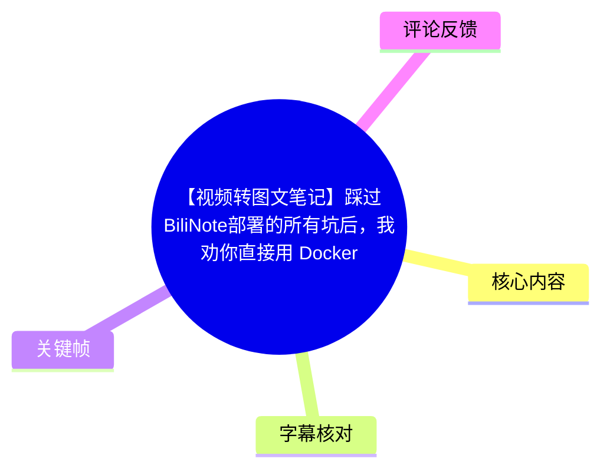
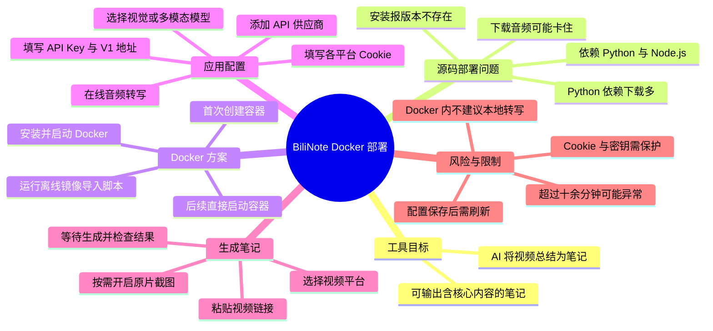
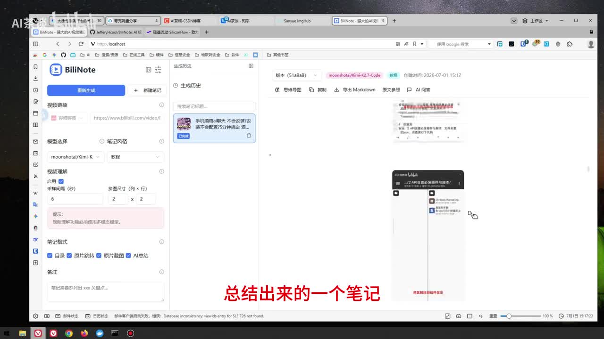
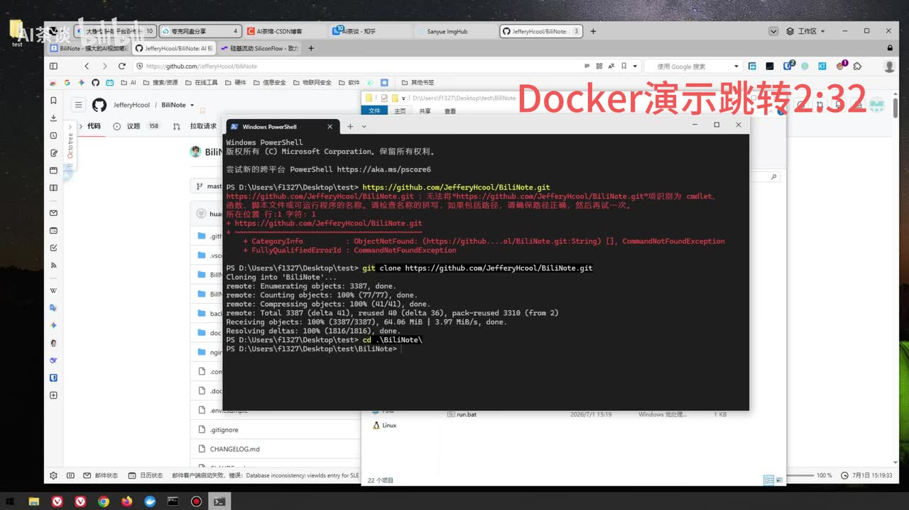
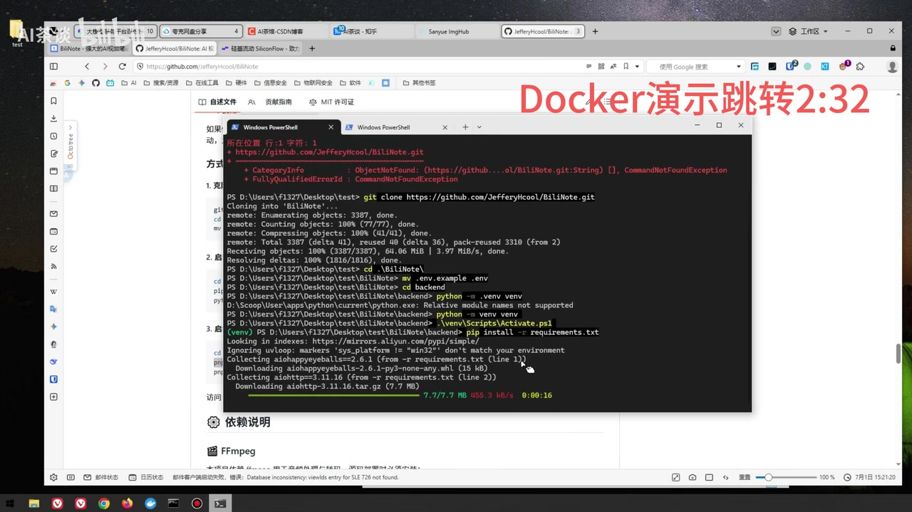
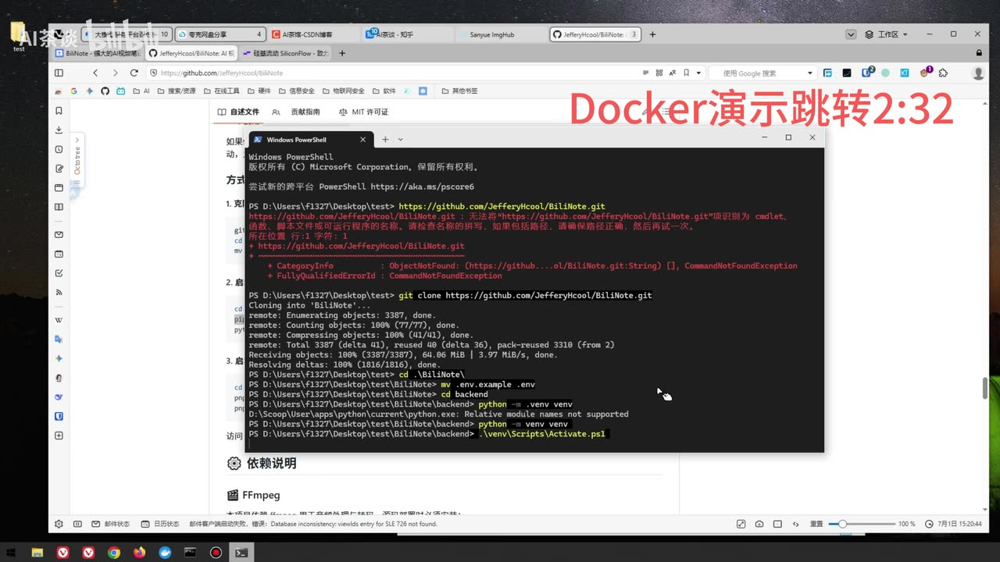

# 【视频转图文笔记】踩过BiliNote部署的所有坑后，我劝你直接用 Docker

> 来源：[Bilibili 视频](https://www.bilibili.com/video/BV1RmTq6nEhE)<br>
> UP 主：AI茶谈｜视频时长：6 分 32 秒｜分辨率：2560 × 1440  
> 项目地址：<https://github.com/JefferyHcool/BiliNote>  
> 视频简介提供的 Docker 部署包：<https://yun.139.com/shareweb/#/w/i/2w2KMet9J3Edu>

## 小结

BiliNote 是一个将视频内容自动整理为笔记的工具。视频先展示了其生成结果：对于 UP 主此前视频，系统能够抽取核心内容并组织成笔记；但作者认为其源码部署与实际使用中存在较多故障，因此建议普通使用者优先采用 Docker 方式部署。

作者演示的源码部署需要预先具备 Python 和 Node.js 环境，并涉及克隆仓库、创建 Python 虚拟环境、安装依赖等步骤。其现场遇到了依赖安装量大、安装报“版本不存在”等问题；即使成功启动，也可能在下载音频阶段长期卡住，无法生成笔记。

视频的主要方案是使用作者整理的 Docker 离线镜像与批处理脚本：安装并启动 Docker Desktop 后，运行包内脚本，由脚本检查 Docker 状态、导入本地镜像并启动容器。作者估计导入过程通常约需 1～2 分钟；首次运行会创建容器，后续运行则直接启动已有容器。

部署完成后，仍需在 BiliNote 中完成供应商 API、视觉/多模态模型、在线音频转写、平台 Cookie 等配置。视频特别指出：保存供应商配置后需要返回首页刷新；Docker 内不建议使用本地音频转写；视频生成时应先选对视频来源平台，若需要原片截图则开启相应视频理解/截图选项。

该视频属于基于作者当时环境的经验演示，不构成对 BiliNote、Docker、模型兼容性或 Windows 版本兼容性的普遍保证。模型名称、供应商能力、镜像内容、项目脚本及页面选项都可能随版本更新而变化；Cookie 和 API Key 属于敏感凭据，应避免写入公开笔记、截图或不可信脚本。

## 思维导图





## 目录

- [背景：BiliNote 的用途与作者结论](#背景biliNote-的用途与作者结论)
- [源码部署的步骤与故障](#源码部署的步骤与故障)
- [Docker 离线镜像的一键部署流程](#docker-离线镜像的一键部署流程)
- [BiliNote 配置：供应商、模型、转写与 Cookie](#bilinote-配置供应商模型转写与-cookie)
- [生成视频笔记与耗时判断](#生成视频笔记与耗时判断)
- [关键限制、风险与时效性](#关键限制风险与时效性)
- [字幕比对](#字幕比对)
- [评论分析](#评论分析)
- [处理记录](#处理记录)

## [背景：BiliNote 的用途与作者结论](https://www.bilibili.com/video/BV1RmTq6nEhE?t=0)

视频开头说明，BiliNote 的目标是让 AI 将视频总结为笔记。作者展示了一条已生成的笔记作为效果示例，并评价“总体效果还可以”。从画面可见，页面左侧是“重新生成”及视频链接、模型选择、视频理解、笔记格式等输入区域，右侧为生成历史和笔记正文区域。

作者随后明确提出问题：BiliNote 的 bug 较多，范围包括部署阶段与使用阶段。因此，本期不是从零讲解项目原理，而是以“踩坑”形式解释为什么更推荐 Docker 部署包。



> 图：画面展示 BiliNote 的主界面、视频链接输入区、模型选项与右侧生成笔记。它说明本视频讨论的不是单纯的命令行服务，而是一个会结合视频理解、转写和模型调用生成 Markdown 笔记的应用。

### 视频中的效果判断

- **作者观点**：BiliNote 的笔记总结效果“还可以”，能提取视频核心信息。
- **不能由视频直接推出的结论**：没有提供不同模型、不同视频长度、不同语言或不同机器条件下的成功率、成本、准确率对比，因此不能据此认定所有视频都能稳定得到同等质量的笔记。
- **实际依赖链**：根据后续配置内容，完整流程至少涉及视频获取、音频处理/转写、图片或视频理解、模型 API 调用与笔记输出；任一环节不可用都可能导致任务失败。

## [源码部署的步骤与故障](https://www.bilibili.com/video/BV1RmTq6nEhE?t=31)

作者从约 00:31 开始演示源码部署，并以实际报错说明其不推荐普通用户优先走这条路径。视频中可确认的源码部署准备项包括：

1. 已安装 **Python**；
2. 已安装 **Node.js**；
3. 克隆 BiliNote 项目仓库；
4. 进入后端目录；
5. 创建并激活 Python 虚拟环境；
6. 安装 Python 依赖。

从终端关键帧可辨识到作者使用 PowerShell，并执行了仓库克隆命令。画面还显示，首次把 URL 直接当作 PowerShell 命令输入会报“不是 cmdlet、函数、脚本文件或可运行程序”的错误；之后改为 `git clone` 才成功开始克隆。



> 图：关键帧直接保留了源码部署中的一个操作失误与修正过程：URL 本身不能作为 PowerShell 命令执行，需要以 `git clone` 调用 Git。它有助于区分“命令格式错误”和项目自身依赖问题。

### 画面可见的命令与操作

> 以下命令依据终端画面整理；视频并未展示一套完整且已验证成功的源码部署流程，不能将其视为官方安装文档。

```powershell
git clone https://github.com/JefferyHcool/BiliNote.git
cd .\BiliNote\
mv .env.example .env
cd backend
python -m venv venv
.\venv\Scripts\Activate.ps1
pip install -r requirements.txt
```

其中：

- `git clone`：拉取项目仓库。
- `mv .env.example .env`：将示例环境配置复制/改名为实际环境配置文件。
- `python -m venv venv`：在后端目录创建名为 `venv` 的虚拟环境。
- `.\venv\Scripts\Activate.ps1`：在 PowerShell 中激活 Windows 虚拟环境。
- `pip install -r requirements.txt`：按依赖清单安装 Python 包。



> 图：画面显示已激活 `(venv)` 环境，并正在运行 `pip install -r requirements.txt`、下载 `aiohttp` 等依赖。它为“源码部署依赖下载较多”的描述提供了可见依据。

### 作者遇到的具体问题

| 时间段 | 视频陈述或画面 | 对部署的影响 |
| --- | --- | --- |
| [00:50](https://www.bilibili.com/video/BV1RmTq6nEhE?t=50) | 源码部署需 Python 与 Node.js 两套环境。 | 增加前置安装与版本兼容性要求。 |
| [01:47](https://www.bilibili.com/video/BV1RmTq6nEhE?t=107) | Python 需下载较多依赖，作者展示依赖仍在下载。 | 安装时间、网络与磁盘占用可能增加。 |
| [01:56](https://www.bilibili.com/video/BV1RmTq6nEhE?t=116) | 安装中出现“版本不存在”类报错。 | 当前环境下依赖解析/版本匹配未成功。 |
| [02:07](https://www.bilibili.com/video/BV1RmTq6nEhE?t=127) | 作者称即使成功启动也可能有各种 bug。 | 源码“装完”不等于服务稳定可用。 |
| [02:17](https://www.bilibili.com/video/BV1RmTq6nEhE?t=137) | 添加供应商、选择模型后，任务仍可能卡在下载音频且不生成。 | 故障不只发生在安装阶段，也可能发生在实际生成链路。 |
| [02:24](https://www.bilibili.com/video/BV1RmTq6nEhE?t=144) | 无论是否选择原片截图，都可能遇到卡住情形。 | 关闭截图选项不一定能避开该问题。 |



> 图：画面显示创建虚拟环境时出现“Relative module names not supported”提示，随后仍继续使用 `python -m venv venv` 创建环境。该帧的价值在于说明 Windows/PowerShell 下的命令上下文也可能成为部署摩擦来源；但视频未进一步给出该提示的完整原因或通用解决方案。

## [Docker 离线镜像的一键部署流程](https://www.bilibili.com/video/BV1RmTq6nEhE?t=150)

作者在约 02:30 给出结论：推荐通过 Docker 部署。视频描述的部署包已提前准备好镜像和批处理脚本，意图是避免用户在本机逐项配置源码依赖、拉取镜像或手动输入 Docker 导入指令。

### 操作流程

1. **安装 Docker**
   - 作者演示的是双击安装 Docker 后按默认安装向导持续“下一步”。
   - 视频没有说明操作系统版本、Docker Desktop 具体版本、是否需要 WSL 2、虚拟化设置或管理员权限，因此这些仍是部署前应自行核对的前置条件。

2. **打开 Docker 并确认其处于运行状态**
   - 作者称不需要登录 Docker 账号，也无需在 Docker 中额外操作。
   - 这里的关键不是“打开安装程序”，而是保证 Docker 服务/桌面端已运行。

3. **以初始状态演示**
   - 作者先删除已有容器及镜像，以模拟首次部署环境。

4. **进入部署包目录，运行批处理脚本**
   - 脚本会检测 Docker 是否正在运行。
   - 若检测通过，脚本会查找本地镜像并导入，然后自动启动。

5. **等待导入完成**
   - 作者给出的经验时间是约 **1～2 分钟**。
   - 这是其测试环境中的估计，不是固定性能指标；镜像大小、磁盘速度、CPU、Docker 状态均会影响耗时。

6. **确认容器创建/启动**
   - 第一次导入成功后会自动创建容器。
   - 以后再次运行时，脚本会直接启动已有容器。
   - 随后在 Docker 中打开对应镜像/服务进入 BiliNote 页面。

### Docker 方案解决的是什么

Docker 的价值并非让 BiliNote 本身不再有 bug，而是将部分运行时依赖、镜像环境和启动命令封装起来，减少源码部署中 Python、Node.js、虚拟环境与依赖版本组合带来的安装摩擦。视频仍保留了后续应用配置、模型可用性、Cookie、转写和视频下载等问题，因此 Docker 是**简化部署路径**，不是对所有生成故障的绝对修复。

## [BiliNote 配置：供应商、模型、转写与 Cookie](https://www.bilibili.com/video/BV1RmTq6nEhE?t=218)

容器启动后，作者依次讲解全局配置、模型和视频平台凭据配置。这些步骤直接决定笔记任务能否调用模型并获取目标视频。

### 1. 添加模型供应商

进入“全局配置”后：

1. 选择“添加供应商”；
2. 名称可自行填写；
3. 填写最关键的 **API Key**；
4. API 地址填写至视频所说的 **`V1`** 位置；
5. 类型暂时不需要处理；
6. 保存配置。

视频指出一个已知界面问题：**保存修改后，需回到主界面刷新一次**，再返回全局配置继续刷新/选择模型。否则新配置或模型列表可能没有及时显示。

> 安全提示：API Key 可产生调用费用或访问权限。视频演示“填入密钥”不表示可以将密钥明文保存在公开配置、录像、截图、Git 仓库或他人可访问的机器中。

### 2. 选择视觉或多模态模型

作者建议优先选择 **多模态模型/视觉模型**，理由是 BiliNote 要理解视频中的图片内容，而不仅是处理文字。其判断是：这类任务不以代码生成能力为主，模型“性能不用太好”，能够理解图片即可。

视频中提到的模型范围如下，均为作者当时的口述，不应视为最新模型能力清单：

| 类别 | 作者提及内容 | 使用建议/限制 |
| --- | --- | --- |
| 海外模型 | “GPT”“Gemini”（ASR 对专有名词存在误识别） | 作者称基本属于多模态模型。具体型号、API 是否支持视觉输入仍应以供应商文档为准。 |
| 国内模型 | Kimi、MiniMax | 作者口述为可辨识的多模态模型示例。 |
| GLM | 作者称有一款支持视觉，但 GLM-5、5.1、5.2 不属于视觉模型。 | 型号与能力随产品版本变化快，部署前应在供应商控制台核实。 |

### 3. 音频转写配置

在“音频转写配置”中：

- 作者不推荐在 Docker 环境中使用**本地**音频转写；
- 建议使用**在线**转写；
- 视频称可在界面提供的三个在线选项中任选一个，然后保存并下载配置。

视频未给出这三个服务的具体名称、价格、语言支持、数据保留规则或准确率，因而无法据此比较服务优劣。若视频含敏感内容，还应关注在线转写服务的隐私政策与数据处理范围。

### 4. 平台 Cookie 配置

作者说明，平台视频源需要填入对应平台的 Cookie：

| 视频来源 | 视频中的对应 Cookie |
| --- | --- |
| Bilibili | Bilibili Cookie |
| YouTube | YouTube Cookie |
| 抖音 | 抖音 Cookie |
| 快手 | 快手 Cookie |

作者示范的 Bilibili 获取方式是：在浏览器打开 Bilibili，按 `F12` 打开开发者工具，在 Cookie 区域刷新/获取 Cookie，再填入 BiliNote。

> **重要风险**：Cookie 通常代表登录会话或账户身份。视频说明了获取路径，但未展示脱敏、有效期、最小权限或安全存储方法。不要向第三方、陌生脚本、公开聊天记录或截图泄露完整 Cookie；使用后应考虑定期更新、撤销异常会话，并遵守目标平台的服务条款。

### 5. 部署监控和依赖检查

作者称“部署监控”因已经安装在 Docker 中，可不必额外处理；但需要确认以下组件可用：

- 后端；
- 所选模型；
- FFmpeg。

这说明即便容器已启动，仍要验证关键服务链路。视频没有展示这些状态的精确名称、检测日志、端口、健康检查命令或异常修复步骤。

## [生成视频笔记与耗时判断](https://www.bilibili.com/video/BV1RmTq6nEhE?t=334)

完成配置后，作者回到首页演示生成任务。实际顺序如下：

1. **选择视频来源平台**：在填链接前先选平台，例如本地或 Bilibili。
2. **粘贴视频链接**：复制目标视频 URL 并填入。
3. **选择模型和笔记模式**：ASR 中“先选摄模型，递入精简”存在明显识别错误；结合前文，应理解为选择已经配置好的视觉/多模态模型及相应笔记设置，但具体控件名称无法仅凭素材可靠确定。
4. **决定是否使用原片截图**：如果需要原片截图，开启视频理解相关选项；作者本人勾选了原片截图。
5. **点击生成笔记**。
6. **等待任务完成并查看生成结果**。

### 生成时长的经验阈值

作者的时间判断为：

- 对于 1、2 分钟，乃至 5、6 分钟的视频，实际耗时还取决于任务复杂度；
- 正常生成过程可能在 **10 分钟以内**；
- 若超过 **十几分钟**仍未完成，作者认为“可能有问题”，即部署可能未成功。

该阈值只是作者的排障经验，不能作为严格 SLA。排队状态、模型 API 响应、网络下载、Cookie 有效性、视频时长、画面采样量、转写服务、硬件与 Docker 资源限制都会影响耗时。

在约 06:15，作者展示生成完成的笔记，并称结果基本提取了视频核心内容。这与开头的效果展示相呼应，但视频未展示完整输入视频、完整笔记正文或客观评分，因此只能确认作者在演示环境中得到了一次可查看的生成结果。

## [关键限制、风险与时效性](https://www.bilibili.com/video/BV1RmTq6nEhE?t=366)

### 已在视频中明确出现的限制

1. **源码部署复杂且可能失败**：需要 Python、Node.js、虚拟环境及大量依赖；作者现场遇到版本不存在类报错。
2. **运行并非必然稳定**：即使服务启动，下载音频阶段也可能卡住，且原片截图开关不一定能规避。
3. **配置刷新问题**：保存供应商后需返回主界面刷新，否则模型选择或配置显示可能异常。
4. **Docker 内不建议本地转写**：作者建议改用在线音频转写服务。
5. **核心依赖需要可用**：后端、模型与 FFmpeg 都需确认可用。
6. **生成时间仅为经验值**：作者以“10 分钟内”作为常见预期，以“超过十几分钟”作为疑似异常信号。

### 本笔记的边界

- 视频没有提供 Docker 镜像校验值、镜像来源许可证、镜像大小、端口映射、持久化目录、启动日志或停止/升级/备份方式。
- 视频简介虽提供第三方分享链接和 GitHub 项目地址，但本素材没有对分享包内容做安全审计；下载和执行批处理脚本前应自行核实来源、文件哈希和脚本内容。
- 热评中出现“Win10 不行？”的提问，但没有得到视频或评论区内的可验证答复，不能据此判断 Windows 10 是否兼容。
- 元数据获取时间为 2026-07-17，视频发布时间戳对应 2026-07-01；模型能力、项目版本和 Docker 环境均具有时效性，应以当前项目文档与实际界面为准。

## 字幕比对

| 字幕来源 | 完整性 | 专有名词 | 时间轴 | 主要问题 |
| --- | --- | --- | --- | --- |
| Bilibili 站内字幕 | 未提供可用站内字幕，无法比对正文。 | 无法评估。 | 无法使用。 | 本任务素材未包含站内 SRT 或可用字幕条目。 |
| 本次 ASR 字幕 | 较完整：57 段，覆盖约 336 秒语音；首段 00:00:00.020，末段 00:06:31.120。 | 误识别较多，如“bnote”“Dock”“elay”“FFMPG”“TPT”“Cmini”等。 | 可用：提供逐段起止时间，本文时间轴均据此换算秒数。 | 存在口语截断、术语同音误识别及 01:31.080～01:47.650 的较大无语音/无识别间隔。 |

### 最终字幕选择与校正

本次采用 **ASR 时间轴字幕为主**，并结合关键帧、视频标题、简介和画面中的终端文本校正表述。站内字幕未提供，因此不存在可合并的站内文本。

关键校正原则如下：

- ASR 中的“bnote / bnot”统一按标题、界面与项目链接写作 **BiliNote**。
- “Dock / 刀客”按语境统一为 **Docker**。
- 关键帧中可见 `git clone https://github.com/JefferyHcool/BiliNote.git`，因此源码仓库命令采用画面原文，而不是 ASR 的模糊转写。
- “FFMPG”按常见工具名称及视频语境写作 **FFmpeg**；画面未提供完整拼写，属于基于上下文的术语校正。
- “TPT”“Cmini”无法从 ASR 单独可靠还原。正文仅以“GPT、Gemini（ASR 可能误识别）”记录作者意图，并避免断言具体模型版本。
- `asr-result.json` 未标记 `noAudioStream=true`，且素材包含音频文件与可用 ASR 结果，因此本视频不是“无音轨视频”，无需改用纯画面转录方案。

## 评论分析

本次仅获取到 2 条热评，少于请求上限 3 条；以下不补写不存在的第三条，也不将评论视为已验证事实。

| 评论 | 点赞 | 观点与价值 | 可信度/待验证点 |
| --- | ---: | --- | --- |
| 无聊根号3：“已三连[星星眼]” | 1 | 表达对视频的支持，没有补充部署、兼容性或技术信息。 | 仅代表个人互动行为。 |
| 深圳Leslie：“win10不行？” | 1 | 提出 Windows 10 是否兼容的实际部署疑问，说明兼容性是潜在读者关注点。 | 这是提问而非结论；视频与已获取评论均未给出答案，不能据此认定 Win10 不支持。 |

## 处理记录

- **Worker ID**：worker-mrph3ry8-07ea3483
- **模型**：gpt-5.6-terra
- **素材与工具产物**：视频元数据、`audio/audio.wav`、ASR 结果 `asr/asr-result.json`、时间轴字幕 `asr/transcript.srt`、关键帧目录 `frames/`、评论文件 `comments/comments.json`。
- **ASR 模型与运行信息**：`medium`；语言识别为中文，置信度 0.99853515625；CUDA / float16；ASR 结果包含时间戳。
- **字幕选择**：检查后确认未提供可用 Bilibili 站内字幕；已检查并采用本次 ASR 时间轴字幕，结合画面、标题和项目链接校正明显术语错误。
- **关键帧选择依据**：
  - `frames/frame-001.jpg`：展示 BiliNote 视频转笔记界面与生成结果，用于说明工具目标和效果示例；
  - `frames/frame-002.jpg`：展示 PowerShell 中 URL 误执行与 `git clone` 修正，用于说明源码部署命令上下文；
  - `frames/frame-003.jpg`：展示虚拟环境相关提示，用于保留 Windows/PowerShell 部署摩擦的画面证据；
  - `frames/frame-004.jpg`：展示激活虚拟环境和 `pip install -r requirements.txt`，用于支撑依赖安装步骤。
- **评论处理范围**：按“热评前三条”要求检查可获取数据；实际仅返回 2 条，已全部分析，未虚构第三条。
- **缓存清理**：素材中未提供缓存清理执行记录；本次处理记录不声称已清理缓存。
- **未解决问题**：Docker 部署包的具体镜像内容与校验、Windows 10 兼容性、模型/转写服务的当前可用性、端口与持久化配置、卡在下载音频时的具体日志及修复路径，均未在给定素材中得到验证。
