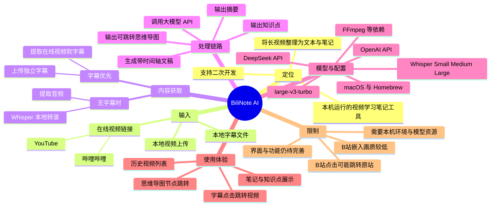
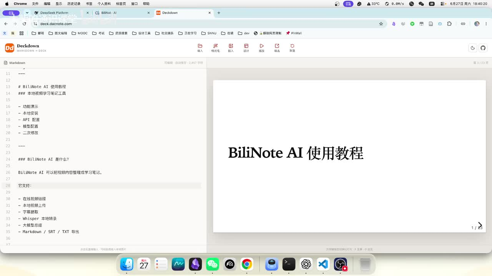

# 【BiliNote】长视频不想慢慢看？我做了个工具，自动转录并生成学习笔记

> 来源：[Bilibili 视频](https://www.bilibili.com/video/BV1KA7p6HEC7)  
> UP 主：大柴的通识课堂｜视频时长：14 分 12 秒｜合集：AI视频总结  
> 项目地址：<https://github.com/PrideWood/bilinote>  
> 发布时间以视频元数据为准；工具支持范围、第三方站点行为、模型/API 可用性及价格均可能随时间变化。

## 小结

这期视频介绍了 UP 主制作的本地化视频学习笔记工具 **BiliNote AI**。它接收在线视频链接或本地视频文件，优先提取原有软字幕；没有可用字幕时，则提取音频并通过 Whisper 转写为带时间轴的文本，随后调用用户自行配置的大模型 API，生成摘要、知识点、思维导图及可导出的学习笔记。

核心价值不只是“总结视频”，而是建立了**视频画面与转录文本/思维导图节点之间的时间对应**：用户点击右侧字幕语句或思维导图节点，可跳转到视频的相应位置。因此，它适合从长教程中快速检索某一知识片段，而不必从头观看。

该项目是需要本机部署的 Web 前端应用，而不是可直接在线使用的网页服务。视频以 macOS / Mac mini 的配置为主：需要 Homebrew，且依赖 FFmpeg 等组件；Windows 用户可能需要借助 AI 编程智能体完成环境配置。工具还需要用户下载 Whisper 模型，并自行提供 OpenAI 或 DeepSeek 等大模型 API Key。

视频给出的模型选择范围为 Whisper Small、Medium、Large 及 large-v3-turbo；UP 主认为较大的模型相对更准确，但资源占用更高。其口述的 Large 模型静置内存约为 1.6 GB，实际使用时约为 8–12 GB（又称约 8 GB 左右），这一组数值存在口述上的不一致，应当将其视为作者的经验估计，而非硬性系统需求。

平台支持方面，作者称主流在线视频站点主要是 YouTube 和哔哩哔哩，但 YouTube 链接体验更好；B 站嵌入视频可能画质较低，且点击非播放区域可能跳回 B 站原页面，影响字幕点击与播放器联动。若只需要总结或查看思维导图，仍可使用 B 站链接。

视频展示的是可继续二次开发的项目，而非功能已经稳定完备的成品。作者明确承认界面较简陋、部分功能尚不理想，并鼓励克隆仓库后改提示词、调整界面或按个人需求扩展。评论中还有“图片识别能力”和“是否采用 faster-whisper/CUDA”的讨论，但视频与现有评论均未证明这些能力已经实现。

## 思维导图

## 目录

- [项目背景、定位与适用对象](#项目背景定位与适用对象)
- [工作流：从视频到学习笔记](#工作流从视频到学习笔记)
- [平台支持、字幕优先与时间定位](#平台支持字幕优先与时间定位)
- [模型、硬件与运行环境](#模型硬件与运行环境)
- [大模型 API、提示词与可定制范围](#大模型-api提示词与可定制范围)
- [实操演示：启动、导入与查看历史任务](#实操演示启动导入与查看历史任务)
- [实操演示：字幕、笔记与思维导图联动](#实操演示字幕笔记与思维导图联动)
- [限制、适用边界与时效性](#限制适用边界与时效性)
- [字幕比对](#字幕比对)
- [评论分析](#评论分析)
- [处理记录](#处理记录)

## 项目背景、定位与适用对象 [00:00:01](https://www.bilibili.com/video/BV1KA7p6HEC7?t=1)

视频开头将 BiliNote AI 定位为一个“web coding 应用教程”。作者首先提示：这不是一个可以直接打开网页就使用的线上服务，用户需要从 GitHub 拉取仓库，并进行基础环境配置；但这些配置工作可以让 AI 工具协助完成。

在作者的描述中，BiliNote AI 的主要作用是把视频内容整理成学习笔记。作者也承认，“视频总结”本身并非新功能，甚至可视作对一般视频总结工具的重复实现；其差异在于：

1. **本机运行**：核心转录能力在本地环境执行。
2. **本地 Whisper 转录**：依赖 Whisper 模型，而非完全依赖在线转写服务。
3. **视频与文本联动**：转录语句和思维导图节点可以与视频时间点对应。
4. **支持导出与改造**：作者提到存在导出功能，且仓库可供进一步修改。

作者提出这一工具的个人使用动机，是经常在 B 站或 YouTube 观看软件教程、技巧类学习视频；此前曾使用飞书妙记转文字，但其免费额度缩减并很快用尽，因此转向自己用 Whisper 模型转录。

> 图：该关键帧显示演示文稿的教程目录，能够确认本视频不是单纯概念介绍，而是围绕功能、部署、API、模型与改造展开。

### 适合的人群 [00:00:45](https://www.bilibili.com/video/BV1KA7p6HEC7?t=45)

演示稿列出的目标用户包括：

- 希望快速整理 B 站知识视频的人；
- 希望将长视频转成笔记的人；
- 希望使用本地 Whisper 转录视频的人；
- 希望学习完整 AI 网页应用项目的人；
- 希望把项目二次修改为自用工具的人。

这里的“适合”是作者在演示稿中的产品定位，实际能否顺利使用仍取决于本机配置、模型资源、API 配置和平台视频兼容性。

> 图：此页直接呈现作者对适用人群的界定，有助于区分“普通视频观看者”与“愿意部署、配置或改造工具的用户”。

## 工作流：从视频到学习笔记 [00:01:19](https://www.bilibili.com/video/BV1KA7p6HEC7?t=79)

作者用流程图解释 BiliNote AI 的处理链路，可整理为以下六步：

1. **输入视频**：输入 Bilibili 链接，或上传本地视频。
2. **获取内容**：优先读取视频已有字幕；没有可用字幕时，提取音频。
3. **本地转录**：通过 Whisper，以及图中标注的 `ffmpeg / yt-dlp` 等工具完成音频处理和文字转录。
4. **生成文本稿**：形成类似 SRT 的、带时间信息的转录文本。
5. **调用大模型**：用户提供 API Key，由大模型处理文稿。
6. **输出学习笔记**：输出摘要、时间轴/文本关联、知识点和导出内容；视频中称思维导图是新增功能。

其中最重要的分流逻辑是：**有字幕时尽量直接使用字幕；无字幕时才从音频开始转录**。这样既能减少不必要的音频识别，也有利于保留已有的时间轴内容。

> 图：这是视频中最集中呈现技术架构的关键帧。图中还明确标出了 `Whisper / ffmpeg / yt-dlp`、用户自带 API Key，以及模型按需下载和 API Key 本地保存的设计信息。

### 输出内容与“时间可跳转”价值 [00:02:30](https://www.bilibili.com/video/BV1KA7p6HEC7?t=150)

大模型收到文本稿后，作者称可以生成：

- 视频摘要；
- 知识视频的知识点；
- 思维导图；
- 其他导出内容。

与一般摘要不同的是，作者重点强调：思维导图的所有节点都可以与视频时间戳对应。用户点击某个节点，即可跳到讲解该节点的视频位置。这个设计把“概览结构”与“返回原始证据片段”连接起来，适用于长视频中的定点复习和快速检索。

不过，视频没有展示具体的数据格式、时间戳绑定算法、导出文件格式细节，也未展示思维导图对转录错误的处理方式；这些均不能据此认定已经具备特定实现。

## 平台支持、字幕优先与时间定位 [00:03:53](https://www.bilibili.com/video/BV1KA7p6HEC7?t=233)

作者称工具面向在线视频，主要提到 YouTube 和哔哩哔哩：

| 场景 | 视频中的描述 | 对使用的影响 |
| --- | --- | --- |
| YouTube 视频 | 链接更友好；添加后视频较清晰；有软字幕时通常可提取字幕 | 更适合在工具内做视频播放与文本联动 |
| Bilibili 视频 | 嵌入后的画质往往较差；未点击播放键而点击其他区域，可能跳转回 B 站原网站 | 视频与右侧字幕联动的体验可能受影响 |
| Bilibili 仅总结/思维导图 | 仍可以使用 | 不依赖频繁播放器跳转时，限制较小 |
| 本地视频 | 上传本地视频，由本机提音频、转文字 | 可配合单独字幕文件，适合更可控的素材 |

### 字幕优先策略 [00:05:22](https://www.bilibili.com/video/BV1KA7p6HEC7?t=322)

作者再次强调“字幕优先”：

- 对在线视频：若有软字幕，则先使用字幕；
- 对本地视频：用户也可上传字幕文件；
- 字幕可以是软字幕或单独文件；
- 在播放页中，右侧字幕的某一句可被点击，左侧视频跳转到对应时间轴。

作者把这种体验比作 PotPlayer 一类的播放器：文本不只是阅读材料，也是控制视频定位的导航界面。

这项能力的前提是字幕本身具有可用时间轴，并且播放器嵌入、视频访问和前端跳转均正常。视频已明确说明 B 站嵌入场景存在跳转与清晰度问题，因此不应把“字幕点击跳转”理解为在所有网站、所有视频上均稳定可用。

### 本地视频的扩展方向 [00:04:37](https://www.bilibili.com/video/BV1KA7p6HEC7?t=277)

对于本地视频，作者描述的基础流程是：提取音频、转成文字、生成字幕文件。作者还提出可自行二次开发的方向：

- 让 AI 按个人需求将句子划分得更细；
- 扩展多语言支持；
- 改造成个人所需的工具。

这些是可探索方向，不代表视频已经演示或验证了所有细分、语言处理能力。

## 模型、硬件与运行环境 [00:05:58](https://www.bilibili.com/video/BV1KA7p6HEC7?t=358)

### Whisper 模型选择 [00:05:58](https://www.bilibili.com/video/BV1KA7p6HEC7?t=358)

作者表示应用中为多种“较好用”的 Whisper 模型预留了下载选择，口述范围包括：

- Small；
- Medium；
- Large；
- `large-v3-turbo`（作者称其为最大的、相对最准确的选项）。

视频的表述是“相对来说最准确”，但没有提供不同模型的测试集、准确率、速度、显存或硬件平台对比，因此不能把这一判断外推为独立的性能结论。实际选择应在识别质量、等待时间和机器资源之间权衡。

### 作者口述的内存参考 [00:06:31](https://www.bilibili.com/video/BV1KA7p6HEC7?t=391)

视频对 Large 模型给出两组经验参数：

| 状态 | 作者口述的资源占用 |
| --- | --- |
| 静置、未运行 | 约 1.6 GB 内存 |
| 实际使用 | 约 8–12 GB；随后又称“可能是 8 GB 左右” |

因此，视频能够确认的事实是：较大模型会占据明显的内存资源，作者建议按需下载；但“8–12 GB”与“8 GB 左右”并不完全一致。建议将其作为视频作者设备上的粗略观察，而不是部署门槛承诺。

### 系统与依赖 [00:06:55](https://www.bilibili.com/video/BV1KA7p6HEC7?t=415)

作者说明当前开发系统是 **Mac mini / macOS**，视频中的流程主要以 macOS 为准：

1. 在 macOS 中安装 Homebrew；
2. 安装或自动安装 FFmpeg 等组件和环境依赖；
3. 下载所需 Whisper 模型；
4. 配置大模型 API Key；
5. 启动本地应用。

Windows 方面，作者没有给出完整命令或逐步安装流程，只称“可能需要借助智能体”协助完成环境配置。因此，Windows 能否无障碍部署、需哪些依赖以及具体差异，均需要以项目仓库实际说明为准。

## 大模型 API、提示词与可定制范围 [00:07:19](https://www.bilibili.com/video/BV1KA7p6HEC7?t=439)

转录完成后的总结环节需要用户输入自己的 API Key。视频称当前 API 配置支持：

- OpenAI；
- DeepSeek。

作者个人建议使用 DeepSeek，理由是“成本比较低，效果也还好”。这是作者的主观使用建议，不构成对价格、效果、可用地区或隐私政策的长期保证；API 模型、计费标准和服务条款均可能变化。

### 可修改内容 [00:07:43](https://www.bilibili.com/video/BV1KA7p6HEC7?t=463)

克隆仓库后，作者称用户可以：

- 修改系统提示词；
- 按需要调整界面；
- 对项目目录和功能做进一步修改。

对已有 Web Coding 经验的用户，作者建议不理解目录用途时向 AI 提问。视频未展示仓库目录、具体配置文件、启动命令或提示词模板，故本笔记不补写未经展示的命令。

## 实操演示：启动、导入与查看历史任务 [00:08:50](https://www.bilibili.com/video/BV1KA7p6HEC7?t=530)

作者在本机展示启动过程：存在一个 `.command` 文件，点击后会打开浏览器界面。作者强调，界面看起来像普通网页，但仅能在本机运行，可理解为以浏览器呈现的本地前端界面。

进入首页后，用户可进行以下操作：

1. 在页面中间粘贴视频链接；
2. 或上传本地视频文件；
3. 若本地视频需直接使用字幕文件，则上传相应字幕；
4. 提交后，处理过的视频会出现在页面下方的历史视频列表；
5. 点击列表中的历史视频，打开详情页查看视频、转录文本、笔记、知识点与思维导图。

> 图：该画面说明视频先通过演示文稿概述，再转入本机工具演示；浏览器呈现不意味着它是公开在线服务，作者随后明确说明应用只能在本机运行。

### 历史任务与详情页 [00:10:16](https://www.bilibili.com/video/BV1KA7p6HEC7?t=616)

作者展示的详情页结构被形容为类似飞书妙记或腾讯会议：

- 左侧为视频播放器；
- 右侧为完整转录文本；
- 页面中还能查看笔记、知识点和思维导图；
- 历史任务可从列表中随时再次打开。

视频中打开的是一个关于 Mac 使用技巧的样例视频。该样例并非 BiliNote AI 的功能说明本身，而是用于演示“视频—转录文本—笔记—思维导图”的联动效果。

## 实操演示：字幕、笔记与思维导图联动 [00:11:05](https://www.bilibili.com/video/BV1KA7p6HEC7?t=665)

在播放页中，作者演示点击右侧文本可以跳到对应位置。随后展示笔记和知识点：

- 笔记会概括视频内容；
- 知识点会以条目方式列出；
- 作者认为当前生成内容“比较简单”；
- 其原因可能与大模型回复长度有关，后续可调整。

作者将更细的定位功能交给思维导图：样例视频中选择“显示电量百分比”这一节点后，视频跳转到讲解 Mac 菜单栏、电池设置和台前调度的具体片段。作者据此说明，面对较长的视频，用户不必从头观看，也不必依赖 UP 主提供但颗粒度较粗的进度条导航。

> 图：该关键帧突出最终输出层，与演示中的笔记、知识点和思维导图功能相互对应；它能帮助理解工具为何要先保留带时间轴的文本稿。

### 可迁移的使用方法

基于作者演示，可归纳为以下实际使用顺序：

1. **先判断素材来源**：在线视频使用链接；已有文件则上传本地视频。
2. **优先保留字幕**：若视频有软字幕或手头有字幕文件，优先使用，避免不必要转录。
3. **无字幕再转写**：通过音频提取与 Whisper 生成带时间轴的文本。
4. **按机器能力选模型**：先从能满足需求的较小模型试起，资源足够再选择更大模型。
5. **配置 API 后生成笔记**：使用个人 API Key 生成摘要、知识点和思维导图。
6. **以思维导图做“粗到细”检索**：先从节点定位主题，再回到视频原片段核对上下文。
7. **针对输出效果迭代**：若笔记过短，可检查大模型回复长度、系统提示词或后续实现配置。
8. **遇到 B 站嵌入问题时降低预期**：如果播放/点击联动受跳转影响，可将 B 站链接更多用于总结与结构浏览，或回到原站观看。

## 限制、适用边界与时效性 [00:12:53](https://www.bilibili.com/video/BV1KA7p6HEC7?t=773)

### 视频已明确说明的限制

1. **B 站嵌入体验有限**：画质可能较低，点击播放器非播放位置可能跳回 B 站原页面。
2. **YouTube 相对更适合联动播放**：这是作者基于当前实现的体验判断，不代表所有地区、视频或登录状态下都一致。
3. **本地部署有门槛**：需要 GitHub 拉取、环境依赖、模型下载以及 API 配置。
4. **硬件有要求**：尤其是较大 Whisper 模型会显著占用内存。
5. **生成笔记可能较简略**：作者将其与大模型回复长度关联，认为可后续调整。
6. **界面和部分功能尚未完善**：作者明确称界面较简陋、功能可能不完全称心如意。
7. **需要自行承担 API 与模型使用成本**：视频提到 DeepSeek 成本相对较低，但没有承诺免费。

### 未在视频中得到验证的事项

- 是否具备图片、幻灯片、屏幕内容等视觉理解/识别能力；
- 是否采用 `faster-whisper`，或是否支持 CUDA 加速的具体部署方式；
- 不同操作系统下的完整兼容性；
- 各 Whisper 模型的准确率、速度、显存和内存实测；
- 导出格式、数据存储位置、隐私保护与 API 文本上传范围；
- B 站、YouTube 链接抓取能力在登录、地区限制、反爬策略变化下的稳定性。

### 时效性说明

本视频元数据发布时间为 2026-06-27。项目仓库代码、依赖版本、YouTube/B 站嵌入与字幕策略、OpenAI/DeepSeek API 支持情况及价格都会变化。特别是作者称“当前支持”的模型和 API，属于视频发布时的说明；实际部署前应以 GitHub 仓库当前文档、依赖清单和代码为准。

## 字幕比对

本视频同时提供了 Bilibili 站内中文字幕与本次 ASR 结果。已检查本次 ASR：识别语言为中文，模型为 `medium`，音频时长约 851.328 秒，语音覆盖约 92.29%，共 47 段；诊断中**未标记** `noAudioStream=true`，说明源视频存在音轨，ASR 正常基于音频进行转写。

| 字幕来源 | 完整性 | 专有名词 | 时间轴 | 主要问题 |
| --- | --- | --- | --- | --- |
| Bilibili 站内字幕 | 覆盖从 00:00:01.220 至 00:14:10.350 的主要讲述，分段更细 | 多数专有名词较准确，如 GitHub、Whisper、Homebrew、OpenAI、DeepSeek；仍有“FMMMPEG”“APIP”等转写/口述问题 | 时间段细，适合章节定位 | 个别口误或识别错误，如“飞书妙计”被写作“飞梳妙计”，“字幕”偶有“字母” |
| 本次 ASR 字幕 | 47 个长分段，覆盖从 00:00:01.010 至 00:14:09.730；诊断语音覆盖 92.29% | 专有名词错误较多，如 “Billy Note”“DeepSec”“FMPJ”“PortPlayer”“API-K” | 带可靠起止时间，但单段较长 | 断句粗，存在同音误识别与中英文混写，如“时间车上”“罐站”“字母文件” |

### 最终字幕选择与校正原则

正文时间轴优先采用**站内 SRT 的细粒度起止时间**，因为它提供更细的真实分段；同时对照本次 ASR 的时间段与内容，确认讲述覆盖和章节位置。术语以视频上下文、站内字幕与关键帧中的可读文字综合校正：

- `Billy Note AI` / `BiliNote AI`：统一写作 **BiliNote AI**，依据视频标题、项目地址 `bilinote` 与演示画面；
- `FMMMPEG` / `FMPJ`：统一写作 **FFmpeg**，依据关键帧流程图；
- `DeepSec`：统一写作 **DeepSeek**，依据站内字幕与浏览器标签中的 “DeepSeek Platform”；
- `PortPlayer`：正文写作 **PotPlayer**，因作者意图是类比播放器，站内字幕同样写作 “pot player”；
- “字母文件”：按上下文校正为 **字幕文件**；
- “APIK / API-K / APIP”：按上下文统一为 **API Key**；
- “large-v3-turbo”：保留该名称，不补充视频未展示的模型参数或性能结论。

## 评论分析

仅处理可获取的热评前三条。评论观点均为用户或作者表达，不作为已验证的项目事实。

1. **UP 主关于项目重名的说明**  
   - 评论内容：UP 主称未注意到 GitHub 上已有同名项目，属于巧合；并强调与对方无关，核心环节同为 Whisper，但本项目特点是视频与转录文本的对应。  
   - 补充价值：明确了项目命名可能与既有仓库重名，也再次强调本项目的差异化定位是时间联动。  
   - 可信度与边界：这是项目作者的一手说明，但未提供既有项目链接、重名项目详情或功能对比，不能据此判断两个项目的实际关系与技术差异。

2. **关于图片识别缺失的质疑**  
   - 评论内容：评论者认为该产品“应该不能识别图片，只能识别文字”，因此存在较大缺陷。  
   - 补充价值：提出了长视频笔记工具的重要边界——仅依赖音频/字幕时，可能遗漏 PPT、代码画面、图表、操作演示等视觉信息。  
   - 可信度与边界：视频确实主要展示字幕、音频转写和大模型文本总结，没有展示视觉识别；但该评论的“不能识别图片”是推测，不能据此断言项目绝对不支持视觉能力。

3. **关于 faster-whisper 与 CUDA 的优化建议**  
   - 评论内容：评论者建议后端改用 `faster-whisper`，并配合 CUDA 加速的 `large-v3-turbo`，认为速度可能更快。  
   - 补充价值：指出可从推理后端与 GPU 加速方向优化转录速度。  
   - 可信度与边界：这是一项技术建议，不是对当前项目实现的描述；视频没有说明项目当前是否使用 `faster-whisper`，也未展示 CUDA 配置、测速数据或兼容性结果。

## 处理记录

- Worker ID：`worker-mrph3e8l-5b79b31e`
- 生成模型：`gpt-5.6-terra`
- 素材与工具：视频元数据、Bilibili 站内 SRT 字幕、`asr/transcript.srt`、`asr/asr-result.json`、12 张抽帧、热评 JSON。
- ASR 检查：已检查本次 ASR；使用 `medium` 模型、`cuda`、`float16`，识别语言为 `zh`，语言置信度约 `0.9995`；未出现 `noAudioStream=true`，故确认视频具有音轨。
- 字幕选择：以站内 SRT 的细粒度真实时间段作为章节时间链接依据；以本次 ASR 交叉验证全程语音覆盖、段落位置及术语语境；对明显误识别的专有名词结合关键帧和上下文校正。
- 关键帧选择依据：选用 `frame-001.jpg` 展示教程范围与演示文稿环境，`frame-002.jpg` 展示完整技术工作流，`frame-003.jpg` 强调学习笔记输出结构，`frame-004.jpg` 呈现适用对象；均服务于正文对应段落，不以未提供的画面细节推断功能。
- 评论范围：仅分析可获取热评前三条，共 3 条。
- 缓存清理：未提供缓存清理执行日志；本记录不声称已执行素材或模型缓存删除。
- 未解决问题：仓库当前版本的具体安装命令、Windows 完整支持情况、视觉识别能力、数据存储/隐私机制、导出格式、实际模型性能与 B 站嵌入稳定性均未由本视频素材充分证实。
