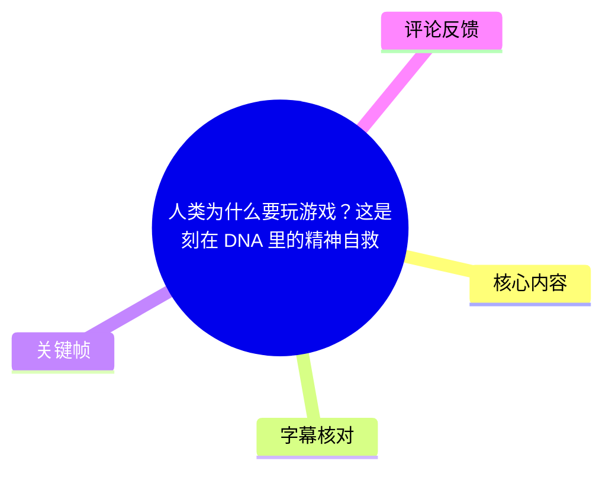
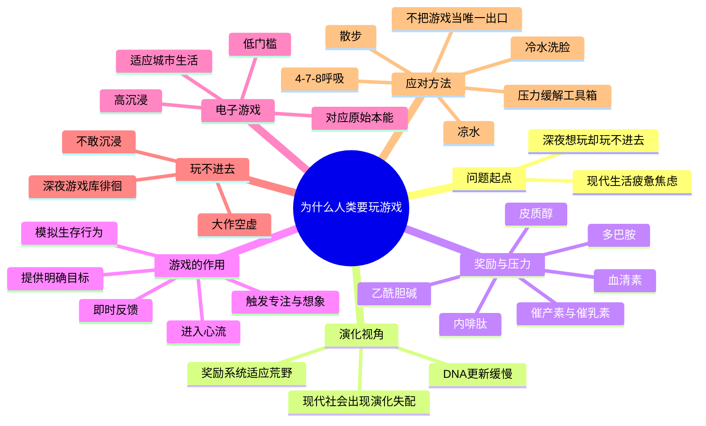
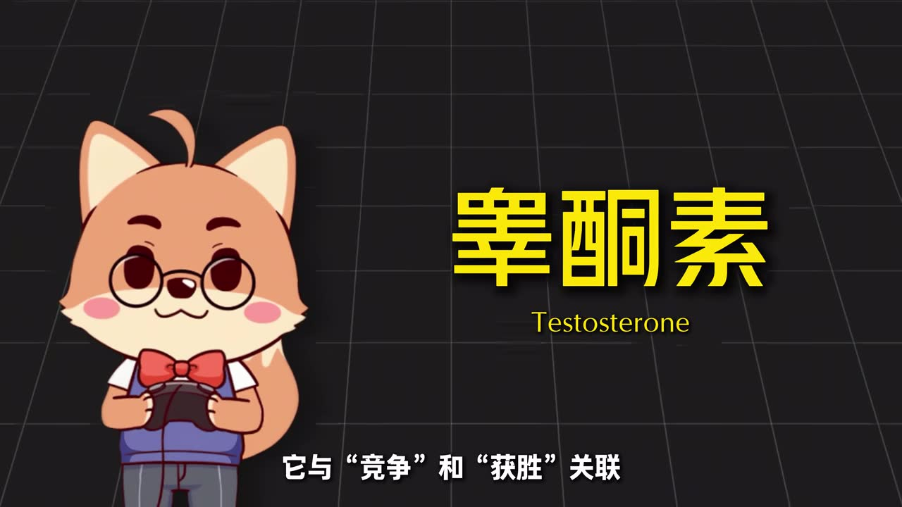
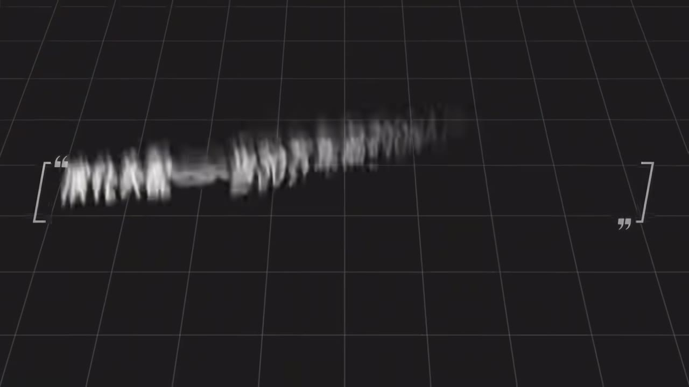

# 人类为什么要玩游戏？这是刻在 DNA 里的精神自救

> 来源：[Bilibili 视频](https://www.bilibili.com/video/BV1rYNs6sEdR) 
> UP 主：黑桐谷歌｜时长：37:37｜视频主题：从演化失配、奖励系统、心流与现代压力的角度解释游戏的意义，以及“玩不进去”时的应对方式。

## 小结

视频提出的核心解释是：**游戏并非单纯的低级消遣，而是人类以模拟方式满足古老奖励系统的一种手段。** 在作者的叙述中，人类的神经与内分泌系统原本适应狩猎、逃生、协作、探索等具有明确目标和即时反馈的环境；而现代工作、学业、通勤和社交压力往往周期长、终点模糊、反馈延迟，因此容易让人长期处于压力与焦虑之中。

游戏之所以有效，不只在于“获得奖励”，还因为它把抽象的压力转换为可操作的任务：目标明确、反馈迅速、挑战可见，并能通过专注与想象力带来沉浸感。作者将此描述为一种在现代社会中“重新启动奖励系统”的方式；电子游戏尤其因低场地要求、低体能门槛和随时可进入的特点，适合高密度城市生活。

视频同时反对把游戏神化为唯一解法。深夜反复翻游戏库却玩不进去、面对大作感到空虚、害怕沉浸后错过重要消息，都可能意味着疲劳、决策压力、碎片化刺激、外部奖励挤压兴趣或现实干扰正在影响状态。此时应优先识别自身处境，而非强迫自己“必须靠游戏回血”。

作者给出的实操方向是建立多元的“压力缓解工具箱”：游戏只是其中之一；短视频、酒精、吸烟等虽能带来短期刺激或麻痹，但分别存在抬高刺激阈值、健康损害或成瘾风险。视频推荐的低成本紧急措施包括 **4-7-8 呼吸法、饮用凉开水、散步 10 分钟、凉水洗脸**。

本文所整理的神经科学、演化与心理学表述，均为视频作者的科普性论证框架，不构成医学诊断、治疗方案或严格的因果定论。尤其是激素与神经递质对复杂心理状态的作用，现实研究中通常存在个体差异、多因素交互与适用条件，不宜据此自行判断疾病或替代专业帮助。

## 思维导图

## 目录

- [开场：疲惫却仍想玩游戏](#开场疲惫却仍想玩游戏)
- [奖励系统：游戏为何能带来驱动力](#奖励系统游戏为何能带来驱动力)
- [演化失配：30 万年前的系统与现代焦虑](#演化失配30-万年前的系统与现代焦虑)
- [压力、延迟反馈与专注力损耗](#压力延迟反馈与专注力损耗)
- [电子游戏为何特别有效](#电子游戏为何特别有效)
- [为什么会玩不进去](#为什么会玩不进去)
- [该怎么办：建立压力缓解工具箱](#该怎么办建立压力缓解工具箱)
- [关键帧](#关键帧)
- [结论与限制](#结论与限制)
- [字幕比对](#字幕比对)
- [评论分析](#评论分析)
- [处理记录](#处理记录)

## 开场：疲惫却仍想玩游戏 [00:00:00](https://www.bilibili.com/video/BV1rYNs6sEdR?t=0)

作者以一个常见经验开场：晚上已经困倦、疲惫，却仍觉得“不玩一把就睡不着”；真正打开游戏库后，又可能什么都不想启动。视频要回答的并不只是“游戏为什么好玩”，而是：

1. 游戏是否属于需要被克制的原始本能；
2. 为什么现代人明明生活忙碌，却仍容易感到空虚、焦虑和缺乏动力；
3. 电子游戏为什么能带来放松或“回血”；
4. 为什么有时即使期待一款游戏，也会觉得索然无味；
5. 当游戏失效时，还有哪些低风险的压力调节方式。

作者将“游戏”作广义理解：捉迷藏、放风筝、足球、摔跤、狩猎、扑克、围棋等，与现代电子游戏形式不同，但都存在某种共同性——它们并非直接生产食物，却能调动人类的行动、注意和情绪系统。

## 奖励系统：游戏为何能带来驱动力 [00:01:32](https://www.bilibili.com/video/BV1rYNs6sEdR?t=92)

作者以“奖励系统”概括神经系统与内分泌系统中推动生存行为的一组机制。视频强调，下述内容是为理解游戏而进行的简化介绍；各物质在现实生理中的作用并不等于单一标签。

### 皮质醇：危险警报与慢性压力 [00:01:56](https://www.bilibili.com/video/BV1rYNs6sEdR?t=116)

作者将皮质醇描述为压力反应的基础：它帮助身体进入“战或逃”准备状态，调动能量，但也会压低免疫、专注与深度思考等长期能力。

视频的关键对比是：

- **原始环境**：追猎、逃跑或战斗通常会在短时间内获得结果；
- **现代环境**：KPI、房贷、社交焦虑等压力缺乏清晰的胜负与终点；
- 因此，压力信号可能长期持续，形成慢性压力体验。

作者提到，长期高压力与海马体、前额叶皮层损伤以及抑郁相关；但也指出皮质醇并不全然有害，正常水平下与清晨觉醒等生理过程有关，合成糖皮质激素在特定医疗场景中也有用途。

### 多巴胺、内啡肽与血清素：期待、完成与稳定 [00:03:20](https://www.bilibili.com/video/BV1rYNs6sEdR?t=200)

作者区分了几种常被混用的体验：

- **多巴胺**：不是“快乐本身”，而更接近促使人追逐目标、期待奖赏的驱动力。看到猎物、宝箱或对局开始按钮，属于作者举例的“冲锋号”。
- **内啡肽**：作者将其联系到完成挑战后的舒畅、长跑后放松、攻克难关或击败 Boss 后的满足。
- **血清素**：视频将其描述为情绪稳定、平静、满足与被认同感的重要参与者；作者举例称，美食、日照和适度运动可与这类体验相关。

这里的逻辑是：游戏通过目标、追逐、完成和反馈，能够连续提供“想要做—投入做—完成后满足”的体验链条。

### 竞争、联结、完成与专注 [00:04:08](https://www.bilibili.com/video/BV1rYNs6sEdR?t=248)

作者继续用不同物质解释游戏体验的不同侧面：

| 视频提及要素 | 作者对应的游戏体验 | 视频提出的限制或提醒 |
| --- | --- | --- |
| 睾酮 | 竞争、获胜、排名上升带来的支配感与自信 | 前提是获胜；视频也提到特定情况下过量可能有负面影响 |
| 催产素 | 开黑、配合、救援、队友情谊与信任感 | 不只是“爱的激素”；强化内部联结也可能伴随对外排斥 |
| 催乳素 | 长线目标完成、通关后“长舒一口气”的满足 | 作者强调其与血清素不是同一概念 |
| 乙酰胆碱 | 长时间聚焦、处理复杂信息、进入心流 | 是对抗干扰、维持专注的重要条件 |

> 图：画面以不同设备上的游戏活动呈现“游戏形式不同但存在共性”的开场观点，有助于理解视频并不只讨论单一品类或单一平台。

作者最终将这套系统概括为：在荒野环境中极有效，能推动合作、探索、学习和储备；但它也有“不死不休”的缺陷——如果大脑无法确认危险已解除、任务已完成，警报就未必会自然关闭。

## 演化失配：30 万年前的系统与现代焦虑 [00:07:14](https://www.bilibili.com/video/BV1rYNs6sEdR?t=434)

### DNA 更新速度与现代环境 [00:07:14](https://www.bilibili.com/video/BV1rYNs6sEdR?t=434)

作者借用人类学家丹尼尔·利伯曼在 2013 年提出的“演化失配”概念：曾有利于原始环境生存的特征，到了现代富足与安全环境中，可能带来不适应。

视频主张，人类身体和大脑与约 30 万年前的智人祖先相比没有本质性的快速更新；DNA 层面的适应往往需要数千甚至上万年。作者举例提到高海拔适应、乳糖代谢和肤色相关选择等，但也明确说明这些并非覆盖所有人群的统一“版本更新”。

由此推导出的核心判断是：**现代社会变化远快于生物演化速度，人类仍带着适应荒野的奖励系统生活在城市与信息网络中。**

### 闲暇与游戏：用模拟欺骗“不会下班的大脑” [00:09:14](https://www.bilibili.com/video/BV1rYNs6sEdR?t=554)

作者认为，在狩猎采集时代，人类将大量时间用于觅食、逃命和制作工具；农业社会带来食物储存、未来规划，以及劳作后相对可用的闲暇。

但奖励系统并不会自动把闲暇识别为安全。依照视频的说法，当大脑不能确认自己在“为生存努力”时，可能继续发出焦虑信号。人类因而创造无直接功利目的、却能重新激活奖励机制的活动：

- 捉迷藏：模拟追踪与隐蔽；
- 摔跤、赛跑：模拟战斗与逃跑；
- 歌唱、舞蹈：模拟协作与节奏同步；
- 棋类：模拟推演与决策。

作者认为，游戏的作用不是直接填饱肚子，而是让大脑重新识别到“我在探索、应对、完成挑战”。

> 图：画面表现夜间办公和电话干扰，直观对应视频关于现代工作压力、任务无终点与注意力被侵蚀的讨论。

### 游戏不是唯一出口，酒精是高代价捷径 [00:12:28](https://www.bilibili.com/video/BV1rYNs6sEdR?t=748)

视频将艺术、音乐、文学、戏剧、电影等都视作可能回应古老神经需求的文化形式。作者特别讨论酒精：其可以短暂让人感觉压力消退，但视频认为这更接近麻痹对压力的感知，而非真正解决压力源；代价包括伤肝与成瘾风险。

这一段的实践含义是：缓解压力的手段需要看成本，不能把“短期感觉好一点”等同于长期有效或健康。

## 压力、延迟反馈与专注力损耗 [00:13:28](https://www.bilibili.com/video/BV1rYNs6sEdR?t=808)

### 为什么上班不一定像狩猎一样有奖励感 [00:13:28](https://www.bilibili.com/video/BV1rYNs6sEdR?t=808)

作者区分“生存奔波”与“能被奖励系统识别的具体行为”。远古狩猎有清晰链条：看见猎物、追踪、投掷、命中、获得食物；每一步都有可感知的进展。

现代项目则可能长达数月乃至数年，目标变化、反馈延后、完成感稀少。作者以游戏开发为例：一个项目可能持续四五年，团队每天处理代码、Bug 与需求变动，却长期看不到终点。作者据此解释，长期任务中动力下降未必是“不够努力”，也可能是大脑长期得不到明确反馈。

### 压力如何影响前额叶与年轻人 [00:15:29](https://www.bilibili.com/video/BV1rYNs6sEdR?t=929)

视频把前额叶皮层比喻为“将军”：它负责深度思考、指令和控制；压力过高时，皮质醇相关的应激反应可能削弱其功能，恐惧和本能反应则更容易占据主导。

作者还指出，年轻人的前额叶皮层大约到 25 岁左右才完全成熟，而情绪与奖励反应系统在青春期已较活跃。因而，年轻人既更需要即时确认，又常面对学习、练习、等待等长期积累任务。

视频的结论并非鼓励逃离学习或工作，而是认为适度游戏可以成为漫长积累期中的休息和补充；关键在于“张弛有度”，让人以更健康的状态面对长期目标。

## 电子游戏为何特别有效 [00:18:46](https://www.bilibili.com/video/BV1rYNs6sEdR?t=1126)

### 专注力与想象力构成沉浸 [00:19:35](https://www.bilibili.com/video/BV1rYNs6sEdR?t=1175)

作者承认电子游戏看似最“不真实”：玩家坐在椅子上，身体并未真正奔跑、投掷或搏斗。但作者认为，电子游戏主要依赖两种能力：

1. **专注力**：清晰目标、即时反馈、持续升级的挑战共同引导玩家接近心流；
2. **想象力**：大脑会把像素角色、NPC、过场动画和虚拟世界补全为可代入的经历。

视频引用心理学家米哈里·契克森米哈赖于 1975 年提出的“心流”概念：人在活动中高度沉浸，可能忘记时间、饥饿与疲惫。作者认为电子游戏是特别容易引发该状态的媒介之一。

作者进一步将乙酰胆碱称作专注的“开关”：它帮助玩家把注意力集中到目标、敌人、路线和操作，屏蔽窗外声音、通知和待办事项。当专注与想象同时运作，大脑会把虚拟追逐与真实挑战视作具有相似结构的信号。

### 游戏玩法与原始行为的对应 [00:23:13](https://www.bilibili.com/video/BV1rYNs6sEdR?t=1393)

作者强调，画质提升是辅助，真正决定游戏吸引力的是玩法内核能否对应某类生存行为：

| 游戏类型或例子 | 视频对应的原始行为/需求 |
| --- | --- |
| 动作冒险 | 追捕、狩猎 |
| FPS | 瞄准、投掷 |
| 格斗竞技 | 地盘争夺 |
| 潜行 | 伏击 |
| RPG | 身份认同 |
| RTS | 部落指挥 |
| 生存建造 | 建造居所 |
| 搜打撤 | 涉险、狩猎 |
| 《模拟山羊》 | 在安全环境中探索行为边界 |
| 恐怖片、过山车、动物园观看猛兽 | 安全条件下接触风险与刺激 |

> 图：画面直接标出“睾酮”及其与竞争、获胜的关联，是视频用神经内分泌概念解释竞技体验的代表性视觉素材。

视频还谈到“亲代保护”叙事：一些游戏通过长期角色塑造，使玩家对角色产生类似照料与守护的情感。作者举例包括《生化奇兵：无限》《最后生还者》《战神》《死亡搁浅》《底特律：变人》等，并将这种体验关联到催乳素、保护欲和对“自己人”的投入。

### 电子游戏的现实优势与边界 [00:26:02](https://www.bilibili.com/video/BV1rYNs6sEdR?t=1562)

相较于许多线下游戏，电子游戏通常不需要专门场地、较强体能或复杂运动技巧；在家坐下即可开始，也可以随时暂停。这是它适配城市生活的现实优势。

但视频也明确反对通过吸烟增强游戏专注。作者解释尼古丁会作用于与乙酰胆碱相关的受体，使人短暂觉得更集中；同时强调长期吸烟有害健康，也可能使自然专注状态更难获得，代价远大于短期提升。

## 为什么会玩不进去 [00:26:47](https://www.bilibili.com/video/BV1rYNs6sEdR?t=1607)

作者总结三种典型情形。它们不是诊断类别，而是帮助观众识别状态的叙述模型。

### 1. 深夜游戏库徘徊症 [00:27:11](https://www.bilibili.com/video/BV1rYNs6sEdR?t=1631)

表现是：下班很晚、已经疲惫，却难以入睡；不断点击游戏库，却没有一款想玩。

视频解释为双重拉扯：

- 身体需要释放积累的压力；
- 进入新游戏又意味着学习规则、集中注意、投入时间。

因此，选择本身变成新的负担；犹豫进一步消耗能量，形成恶性循环。作者给出的“妥协办法”是重玩熟悉的老游戏，因为学习成本已被支付；但也提醒这种方法久了依然会腻。

### 2. 大作空虚症：碎片刺激与外部奖励 [00:28:03](https://www.bilibili.com/video/BV1rYNs6sEdR?t=1683)

表现是：周末终于有空打开期待很久的大作，却很快觉得无聊。

作者提出两个机制：

- **高频碎片刺激**：短视频、即时通信和短消息不断带来快速刺激与快速消退，可能让人越来越难等待慢热作品的铺垫、塑造和沉浸。
- **过度理由效应**：当原本“因为喜欢”做的事，逐渐被“通行证快到期、每日任务未清、朋友都在冲段位”等外部目标接管时，游戏会更像工作；外部奖励可能挤压内在动机。

作者援引爱德华·德西 1971 年关于外部奖励影响内在动机的实验，并提到后续相关研究。视频的设计启示是：每日任务、通行证等机制若过于功利化，可能维持活跃，却也可能损耗玩家对活动本身的兴趣。

### 3. 不敢沉浸症：害怕错过现实信息 [00:31:16](https://www.bilibili.com/video/BV1rYNs6sEdR?t=1876)

表现是：一旦沉浸游戏就担心漏接电话、快递、工作或家庭中的重要信息；经历过一次“静音后错过重大事件”后，转而只敢玩短平快游戏或刷短视频。

作者认为，这种情况不同于前两种内部疲劳或刺激阈值问题：外部世界的突袭可能让大脑把“深度沉浸”与“错过重要信息、造成灾难”绑定，进而形成对投入状态的恐惧。

这一模型的重点是：不是简单地“不爱玩”，而是现实环境尚未提供足够的安全感让人放下警戒。

## 该怎么办：建立压力缓解工具箱 [00:32:25](https://www.bilibili.com/video/BV1rYNs6sEdR?t=1945)

### 原则：玩不进去时，可以先不玩 [00:32:25](https://www.bilibili.com/video/BV1rYNs6sEdR?t=1945)

视频的直接答案是：**玩不进去，就先选择不玩。**

作者不认为游戏、短视频或酒精应该成为唯一出口，而是建议建立多种工具并按状态使用。视频列出的成本—效果对照如下：

| 方式 | 作者认为的短期作用 | 视频提示的代价或限制 |
| --- | --- | --- |
| 游戏 | 深度沉浸、获得挑战与反馈 | 需要时间和专注；可能错过重要信息 |
| 短视频 | 快速刺激 | 可能抬高刺激阈值 |
| 酒精 | 短暂麻痹压力感 | 伤肝、成瘾风险 |
| 吸烟 | 短暂感觉专注 | 健康危害、可能影响自然专注 |
| 低成本身体调节 | 打断警报循环 | 不替代对长期压力源的处理 |

作者强调，真正关键的能力是识别“我现在需要什么”，并在了解压力来源与环境限制后作出选择。

### 四个紧急暂停步骤 [00:33:37](https://www.bilibili.com/video/BV1rYNs6sEdR?t=2017)

视频给出四种简单、低成本、低风险、几乎不依赖设备的做法。以下保留作者给出的具体参数与顺序：

1. **4-7-8 呼吸法**
   - 吸气 **4 秒**；
   - 屏息 **7 秒**；
   - 缓慢呼气 **8 秒**。
   - 作者解释：这一节奏模拟威胁解除后出现的深长、缓慢呼吸，向神经系统传递“现在安全”的信号。

2. **大口饮用凉开水**
   - 作者将其解释为与“发现安全水源”的古老联想有关；
   - 视频认为冷水经过咽喉可能帮助身体从紧张状态撤出。

3. **散步 10 分钟**
   - 作者认为行走与迁徙、巡视领地的行为结构相关；
   - 如果可延长至 **40 分钟、约 2 公里**，视频称还可能具有不错的燃脂效果。
   - 这里的“10 分钟”“40 分钟”“2 公里”均为视频中直接出现的参数，不应理解为针对所有人的运动处方。

4. **凉水洗脸**
   - 作者以哺乳动物“潜水反射”解释冷水接触面部可能带来的心率下降、代谢放缓等反应；
   - 视频观点是：若目标只是给身体一个放松信号，洗脸已经足够，不必为了同一目的进行更复杂的操作。

> 图：该画面呈现视频在“理论与引文”段落中的视觉风格，适合提示观众：视频大量使用演化、神经科学和社会心理学框架，但应将作者的科普性归纳与严格学术结论区分开来。

## 关键帧

| 关键帧 | 正文对应 | 画面价值 |
| --- | --- | --- |
|  | 开场与游戏共性 | 以多人在不同设备上游玩的画面，支持“游戏不限于单一平台或单一形式”的论述。 |
|  | 奖励系统与竞争 | 清晰呈现“睾酮 / Testosterone”及竞争、获胜的主题，是理解竞技体验段落的直接视觉锚点。 |
|  | 理论引用与限制 | 提醒视频采用科普化的理论串联，适合与“不要把单一物质等同于单一心理结果”的限制共同阅读。 |
|  | 现代压力与不敢沉浸 | 夜间工作、电话与电脑同框，形象呈现现实任务和通知侵入对专注的干扰。 |

## 结论与限制 [00:36:50](https://www.bilibili.com/video/BV1rYNs6sEdR?t=2210)

作者最终回答“人类为什么要玩游戏”：为了快乐；而快乐不是奢侈品，而是古老神经系统维持正常运转所需要的体验之一。游戏是通往这种体验的一条路径，但不是唯一、也不必在任何时刻都有效。

可迁移的经验有三点：

1. **将“玩不进去”视作状态信号，而非人格缺陷。** 疲劳、长期无反馈任务、选择成本、碎片刺激和现实警戒都可能影响沉浸。
2. **优先减少单一出口依赖。** 游戏、短视频、酒精和吸烟的成本不同；工具越多，越不必强迫某一种方式持续生效。
3. **先让身体退出警报模式，再决定是否游戏。** 对作者而言，呼吸、喝水、散步和冷水洗脸的价值在于低成本地中断压力循环。

需要保留的限制：

- 视频是跨越演化、人类学、神经科学、心理学与游戏设计的综合性解释，部分说法是作者为了叙事而作的简化连接，不能据此推导个体层面的确定因果。
- 视频中关于皮质醇、多巴胺、催产素、催乳素、乙酰胆碱等的功能描述，应理解为作者的科普框架；真实生理机制复杂，通常不能用单一激素解释情绪、成瘾、专注或社会行为。
- “4-7-8 呼吸”“凉水洗脸”等属于视频推荐的日常调节方式；若长期失眠、抑郁、焦虑、恐慌或功能受损，应寻求合格医疗或心理专业人员帮助。
- 视频资料的参考书目与论文主要集中于 1949—2013 年及此前后，适合作为作者论证来源，但不代表已覆盖后续所有研究进展。因此本文不将其包装为实时更新的医学或科学共识。

## 字幕比对

| 字幕来源 | 完整性 | 专有名词 | 时间轴 | 主要问题 |
| --- | --- | --- | --- | --- |
| Bilibili 站内字幕 `p01-ai-zh.srt` | 与本视频不匹配 | 大量人物、剧情名词，与主题无关 | 仅约 14 分钟，且内容为另一部剧情解说 | 明显串片：开头即出现“女人刑满释放”“露丝”“凯蒂”等，与本视频不符，不能采用 |
| 本次 ASR 字幕 | 高：97 段，语音覆盖约 98.15% | 多个术语存在同音误识别 | 全片带真实起止时间，覆盖约 0.69—2245.13 秒 | “游戏、皮质醇、乙酰胆碱、催乳素”等频繁被错写，但可由语境、视频标题、作者参考书目校正 |

### 最终字幕选择

本次整理以 **ASR 时间轴字幕** 为唯一时间定位依据。ASR 诊断显示：

- 音频存在，未标记 `noAudioStream=true`；
- 识别语言为中文，置信度约 `0.9990`；
- 时长 `2256.77` 秒，与视频总时长 `2257` 秒基本一致；
- 语音覆盖率约 `98.15%`，无大型空白段。

站内字幕虽可获取，但内容与本视频完全不符，因此未作为正文事实或时间轴依据。本文结合视频标题、上下文、视频给出的引文来源及关键帧，对 ASR 中部分明显错字做了最小必要校正，例如：

- “渠戏 / 游西 / 游行”统一校正为“游戏”；
- “皮质纯”校正为“皮质醇”；
- “内肥胎”校正为“内啡肽”；
- “以前胆碱 / 以线胆碱”校正为“乙酰胆碱”；
- “崔乳素 / 崔涝素”校正为“催乳素”；
- “高酮素”依据画面与语境校正为“睾酮”；
- “星流”校正为“心流”。

## 评论分析

仅处理可获取热评前三条；以下均为评论者的玩笑、感受或态度，不是可验证事实。

1. **江钦瑜｜266 赞**  
   > “感觉上班有点影响我玩游戏了，打算把工作辞了”

   该评论以反转方式呼应视频“工作压力与游戏动力”的论点：不是游戏影响工作，而是工作影响玩游戏。其语气明显带有夸张和玩笑性质，不应理解为对辞职的实际建议。

2. **阿御想放假｜53 赞**  
   > “所以倒罐子是对的[大哭]”

   评论可能在借某种具体游戏行为调侃视频的“生存模拟”解释，即看似无意义的操作也能对应整理、建造、完成任务等反馈机制。由于未提供具体游戏上下文，不能进一步确定“倒罐子”所指作品或玩法。

3. **特工Z｜7 赞**  
   > “懂了。galgame对应的是人的繁殖本能。[滑稽]”

   评论借视频“不同游戏类型可对应原始本能”的框架进行戏谑延伸。视频正文并未将 Galgame 直接等同于繁殖本能，因此这只是观众的玩笑性推论，不应视为视频结论或科学主张。

## 处理记录

- **Worker ID**：`worker-mrph3e8l-5b79b31e`
- **模型**：`gpt-5.6-terra`
- **调用工具与素材**：视频元数据、ASR 诊断与 SRT 时间轴、站内字幕文件、热评 JSON、关键帧素材。
- **字幕选择**：检查了站内字幕与本次 ASR。站内字幕内容明显串片，未采用；本次 ASR 具备完整时间轴与高覆盖率，作为章节链接和内容整理的主依据。源视频存在音频，未出现 `noAudioStream=true`。
- **关键帧选择依据**：选取 `frame-001`（多人游戏）、`frame-002`（睾酮科普卡）、`frame-003`（理论引文视觉）、`frame-004`（夜间工作压力）分别服务于游戏共性、奖励机制、论证边界与现实干扰四个正文节点。
- **缓存清理**：未提供可执行的缓存清理日志；本记录不虚构清理结果。
- **未解决问题**：关键帧清单仅提供路径与部分预览，未提供每帧精确抽帧时间；因此未将关键帧时间强行写入正文。视频中部分神经科学表述为作者的科普简化，本文已保留其论述边界。
