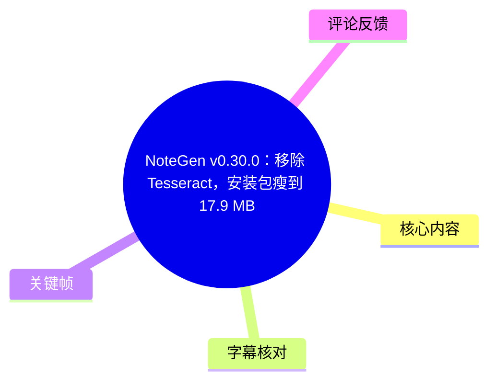
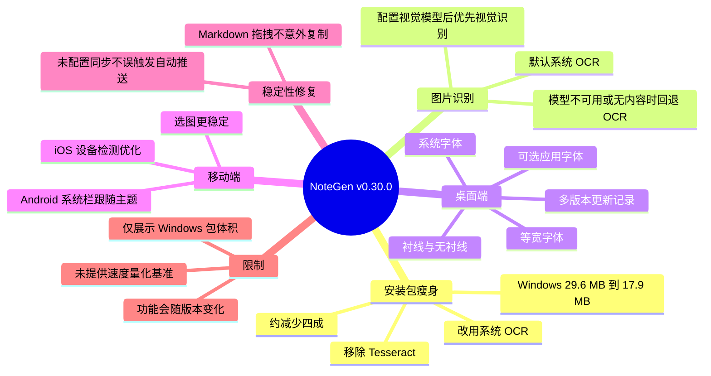
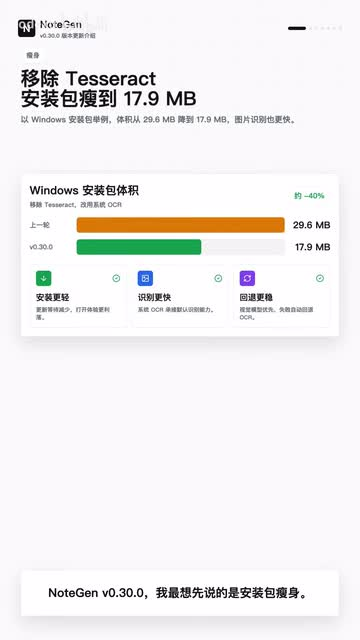
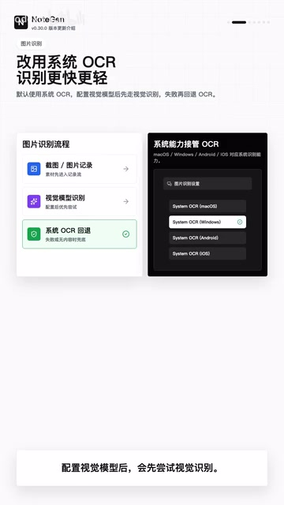

# NoteGen v0.30.0：移除 Tesseract，安装包瘦到 17.9 MB，识别更快

> 来源：[Bilibili 视频](https://www.bilibili.com/video/BV1617N6ZEGC)  
> UP 主：codexu｜视频时长：98 秒｜分辨率：1080 × 1920  
> 标签：AI 笔记、NoteGen、安装包优化、版本更新、效率工具、Markdown、图片识别

## 小结

NoteGen v0.30.0 的更新重点是**基础体验优化而非新增大量入口**。最显著的变化是移除 Tesseract，改为调用系统 OCR；以 Windows 安装包为例，体积从约 **29.6 MB** 降至约 **17.9 MB**，减少约 **11.7 MB**，按原始体积计算约缩小 **39.5%**，画面标注为“约 -40%”。

图片与截图识别采用分层策略：未配置视觉模型时默认使用系统 OCR；配置视觉模型后优先尝试视觉识别，若模型不可用或没有返回内容，则自动回退至 OCR。这种设计的核心是兼顾视觉模型能力与本地识别的可用性，而不是保证视觉模型始终成功。

桌面端新增应用字体选择，可在系统字体、衬线、无衬线和等宽字体间切换；更新模块则由仅显示单个新版本，调整为展示当前版本至最新版本之间的多版本更新记录。移动端方面，Android 系统状态栏和导航栏会随亮暗主题调整，iOS 设备检测与选图体验获得稳定性优化。

视频还提到两项稳定性修复：Markdown 拖拽节点时不应意外复制内容；未配置同步时不应误触发文件自动推送。对已经使用 NoteGen、且重视安装体积、图片识别与跨平台体验的用户而言，这是一次偏“减负”和“补齐细节”的版本更新。

需注意：视频只给出了 Windows 安装包的体积对比，未提供识别速度的量化测试环境、耗时数据或准确率数据；“识别更快”应理解为作者的版本结论，不能据此推导所有设备、所有图片场景均有相同比例的性能提升。软件功能和下载方式也可能随版本迭代改变。

## 思维导图





## 目录

- [版本定位与安装包瘦身](#版本定位与安装包瘦身-000000)
- [图片识别：视觉模型优先与 OCR 回退](#图片识别视觉模型优先与-ocr-回退-000024)
- [桌面端：字体与多版本更新记录](#桌面端字体与多版本更新记录-000048)
- [移动端适配与稳定性修复](#移动端适配与稳定性修复-000072)
- [可执行的使用流程](#可执行的使用流程)
- [关键参数、限制与时效性](#关键参数限制与时效性)
- [字幕比对](#字幕比对)
- [评论分析](#评论分析)
- [处理记录](#处理记录)

## 版本定位与安装包瘦身 [00:00](https://www.bilibili.com/video/BV1617N6ZEGC?t=0)

视频开篇将 v0.30.0 定位为一次“先把基础体验变轻”的更新。作者明确表示，本版移除了 **Tesseract**，并改用**系统 OCR**。

以 Windows 安装包为例，更新前后体积为：

| 指标 | 更新前 | 更新后 | 变化 |
| --- | ---: | ---: | ---: |
| Windows 安装包体积 | 约 29.6 MB | 约 17.9 MB | 减少约 11.7 MB |
| 相对缩减比例 | — | — | 约 39.5%，画面标示约 -40% |

视频同时称图片识别“更快”，但没有展示测试设备、图片样本、平均耗时、P95 延迟或准确率对比。因此可确认的事实是：**作者将体积缩减和识别体验改善作为此次更新的主要卖点**；无法从视频进一步确认具体性能增幅。



> 图：关键帧直接展示“移除 Tesseract、安装包瘦到 17.9 MB”的标题，以及 29.6 MB 与 17.9 MB 的对比柱状图。这是核验包体积参数和约 -40% 标注的主要画面依据。

## 图片识别：视觉模型优先与 OCR 回退 [00:24](https://www.bilibili.com/video/BV1617N6ZEGC?t=24)

这一部分覆盖截图与图片记录的识别策略。根据视频口播与画面，流程可整理如下：

1. 对截图或图片记录进行识别时，系统 OCR 是基础能力。
2. 在**未配置视觉模型**的情况下，默认走系统 OCR。
3. 在**配置视觉模型**后，应用会优先尝试视觉识别。
4. 若视觉模型不可用，或模型没有返回内容，则自动回退到 OCR。

可将其表达为以下条件逻辑：

```text
输入：截图 / 图片记录

若未配置视觉模型：
    使用系统 OCR
若已配置视觉模型：
    先进行视觉识别
    若视觉模型不可用，或返回内容为空：
        回退至系统 OCR
```

该机制的实际价值在于减少单一识别路径不可用带来的中断：视觉模型可用时优先利用其识别能力；异常或空返回时，仍可以交由 OCR 继续处理。视频画面还列出 macOS、Windows、Android、iOS 的系统能力接管 OCR，说明该更新面向多平台使用场景。

不过，视频没有说明以下实现细节，因此不宜自行补充：

- 视觉模型具体支持哪些服务商、模型名称或接口协议；
- OCR 的语言包、离线能力与准确率；
- “模型不可用”如何判定，例如超时、鉴权失败、网络异常或内容安全拦截；
- 回退后的结果是否会提示用户、是否支持手动重试或强制指定识别方式。



> 图：画面将“截图/图片记录—视觉模型识别—系统 OCR 回退”并列呈现，并展示系统 OCR 的平台选项。这有助于理解本版并非单纯替换 OCR 引擎，而是建立视觉模型优先、OCR 兜底的识别链路。

## 桌面端：字体与多版本更新记录 [00:48](https://www.bilibili.com/video/BV1617N6ZEGC?t=48)

### 应用字体选择

桌面端现在可在设置中选择应用字体。视频列出的可选类型包括：

- 系统字体；
- 衬线字体；
- 无衬线字体；
- 等宽字体。

作者给出的使用语境是：写长文、看代码、整理资料时，界面字体可以更贴合个人习惯。这里的更新属于界面可读性与工作偏好适配，并非 Markdown 内容格式、导出格式或编辑器语法能力的改变。

对于使用建议，可以按内容类型进行选择，但这属于基于视频信息的合理应用，而非视频公布的强制规则：

| 场景 | 可优先尝试的字体类型 | 原因 |
| --- | --- | --- |
| 长文阅读、连续叙述 | 系统字体、衬线或无衬线字体 | 可按个人阅读习惯调整 |
| 代码、命令、表格对齐内容 | 等宽字体 | 字符宽度一致，便于观察对齐 |
| 多类资料混合整理 | 先使用系统字体，再按需求切换 | 降低迁移成本 |

### 更新记录可跨多个版本查看

设置中的更新模块不再只显示一个新版本，而会列出**当前版本到最新版本之间**的更新记录。其用途是让用户在跨多个版本升级时，直接查看每个版本发布过什么内容。

视频没有展示该更新模块的具体界面、筛选能力、是否支持跳转版本详情，或离线读取机制；可以确认的边界仅是：更新记录的展示范围扩展为多个版本，而非单一最新版本。

## 移动端适配与稳定性修复 [01:12](https://www.bilibili.com/video/BV1617N6ZEGC?t=72)

### Android 与 iOS 的移动端细节

Android 侧，状态栏和导航栏颜色会跟随亮色、暗色主题调整。其目标是减少应用内容区域与系统栏之间的视觉割裂。

iOS 侧，视频称设备检测得到优化，选图体验更稳定。这里“更稳定”是作者的概括性描述，视频未提供崩溃率、失败率、支持的系统版本或设备机型范围，不能扩大解释为所有 iOS 选图问题均已解决。

### 两项稳定性修复

视频最后列出两类交互/同步问题修复：

1. **Markdown 拖拽节点**时，不应意外复制内容。
2. **未配置同步**时，不应误触发文件自动推送。

这两项修复都针对“意外行为”：前者关系到编辑内容的完整性与操作预期，后者关系到文件同步边界。对于依赖 Markdown 组织笔记、或对文件自动推送较敏感的用户，这类修复虽然不表现为新功能入口，却直接影响日常使用的可控性。

视频的最终判断是：v0.30.0 的重点不是增加许多入口，而是依次降低安装包体积，并减少识别、界面、更新与移动端使用中的打断。

## 可执行的使用流程

以下流程只整理视频已明确提到的能力与条件，不补充未展示的菜单路径、账号要求或模型配置参数。

### 1. 更新后先确认平台与版本

- 确认当前使用的是 NoteGen v0.30.0 或后续包含相同改动的版本。
- Windows 用户如关注安装包体积，可将本版约 17.9 MB 的安装包作为视频中的参考值。
- 不应将该数值直接套用到 macOS、Android 或 iOS，因为视频没有给出这些平台的包体积。

### 2. 选择图片识别策略

- 未配置视觉模型：使用系统 OCR。
- 已配置视觉模型：优先使用视觉识别。
- 当视觉模型不可用或不返回内容：让系统自动回退 OCR。

使用时应特别留意：视频没有给出视觉模型的配置入口、密钥格式、网络要求与费用信息，因此需要以软件当前版本的实际设置说明为准。

### 3. 按任务调整桌面端字体

- 阅读普通文本或写作时，可尝试系统字体、衬线字体或无衬线字体。
- 阅读代码或需要观察字符对齐时，可尝试等宽字体。
- 若切换后影响阅读习惯，恢复系统字体即可；视频没有说明字体会改变文档文件本身的内容。

### 4. 升级跨度较大时检查更新记录

- 进入设置中的更新模块。
- 查看当前版本至最新版本之间的逐版本更新记录。
- 对涉及识别、同步或编辑行为的更新，建议先阅读记录再调整原有工作流。

### 5. 在移动端重点复测相关场景

- Android：在亮色与暗色主题间切换，观察状态栏、导航栏是否随主题协调变化。
- iOS：复测常用选图流程。
- Markdown 用户：复测拖拽节点，确认没有出现意外复制。
- 未使用同步功能的用户：留意是否仍存在自动推送行为。

## 关键参数、限制与时效性

### 视频中明确给出的参数

| 项目 | 内容 |
| --- | --- |
| 视频时长 | 98 秒 |
| ASR 有效语音覆盖 | 约 93.62 秒 |
| Windows 安装包更新前 | 约 29.6 MB |
| Windows 安装包更新后 | 约 17.9 MB |
| 绝对减少 | 约 11.7 MB |
| 相对缩减 | 约 39.5%，画面标示约 -40% |
| OCR 改动 | 移除 Tesseract，改用系统 OCR |
| 视觉识别策略 | 配置视觉模型后优先尝试；不可用或无内容时回退 OCR |
| 字体选项 | 系统、衬线、无衬线、等宽 |
| 涉及平台 | Windows、macOS、Android、iOS（按画面中的系统 OCR 支持提示） |

### 信息边界

- **体积数据仅明确针对 Windows 安装包**，不代表其他系统安装包大小。
- 视频没有给出“识别更快”的测速数据、样本集、设备配置或识别准确率。
- 没有提供 Tesseract 移除后具体依赖结构、许可变化、离线可用性或系统 OCR API 兼容性说明。
- 没有展示视觉模型的具体配置项、服务提供商、模型类型、调用成本与隐私策略。
- iOS“选图更稳定”、Android“主题跟随”、拖拽与同步修复均为版本说明，具体修复覆盖范围尚未在视频中展开。
- 本视频对应 v0.30.0；软件后续版本可能修改功能路径、平台支持、包体积或识别策略，应以当前发布说明和实际应用界面为准。

## 字幕比对

站内未提供可用字幕，因此仍对本次 ASR 结果进行了检查。素材中存在 `audio/audio.wav`，ASR 诊断也给出 0.27 秒至 93.89 秒的连续语音片段；`asr-result.json` 未标记 `noAudioStream=true`，故本视频属于**有音轨且 ASR 可用**的情况。

| 字幕来源 | 完整性 | 专有名词 | 时间轴 | 主要问题 |
| --- | --- | --- | --- | --- |
| Bilibili 站内字幕 | 未提供可用字幕，无法比较文本完整性 | 无法核验 | 无可用分段 | 无站内字幕文件可供采用 |
| 本次 ASR 字幕 | 较完整；4 段覆盖 0.27–93.89 秒，语音覆盖率约 96.36% | 存在转写误差 | 有可直接使用的 SRT 起止时间 | 个别术语、断词与表述出现错误或不自然转写 |

最终采用**本次 ASR 的真实时间轴**作为章节定位依据，并结合视频元数据、标题、简介与关键帧校正术语。关键校正如下：

| ASR 表述 | 采用表述 | 校正依据 |
| --- | --- | --- |
| `Teseract` | `Tesseract` | 视频标题、简介与关键帧标题均明确为 Tesseract |
| `安裝保` | `安装包` | 上下文、元数据简介与画面对比图 |
| `圖記錄` | `图片记录` | 结合前后语义及简介中的“截图和图片识别” |
| `系系統OCR` | `系统 OCR` | 语音重复导致的转写瑕疵 |
| `不是指甲功能` | `不是只加功能` | 语义应为“不是只加功能，而是先把基础体验变轻” |
| `一組穩固性修復` | `一组稳定性修复` | 中文语义校正，视频结尾上下文一致 |

ASR 的第 3 段、4 段 SRT 时间分别为 `00:00:48,510 --> 00:01:12,870`、`00:01:12,870 --> 00:01:33,890`，与诊断 JSON 的 48.51–72.87 秒、72.87–93.89 秒一致，故正文时间轴链接按这些真实分段换算为 48 秒与 72 秒。

## 评论分析

仅处理当前可获取的热评前三条。评论反映的是个别用户态度或补充线索，不作为软件质量、下载安全性或功能真实性的独立证据。

1. **一个人De奋斗**（1 赞）  
   评论：“不得不评论下，一个好软件，作者辛苦了”。  
   观点是对软件和作者的正面认可，但没有说明使用版本、功能场景或可复现体验，因此只能作为用户好评信号。

2. **挽句芒**（0 赞）  
   评论：“已下载支持”。  
   该评论说明评论者表示已下载并支持项目，但未反馈安装过程、平台、识别效果或遇到的问题，信息量有限。

3. **瞎琢磨先生**（0 赞）  
   评论指出视频简介或个人介绍中未放链接，并附上 `https://github.com/codexu/note-gen`。  
   这提供了一个可能的项目地址线索，也反映出视频的信息分发存在“下载入口不够显眼”的反馈。但该链接来自用户评论，未在本任务素材中得到独立验证；访问、下载或使用前仍应核对仓库归属、发布页、版本号与文件来源。

## 处理记录

- Worker ID：`worker-mrplns82-755ed24d`
- 模型：`gpt-5.6-terra`
- 使用素材与工具结果：视频元数据、视频简介、ASR 诊断、ASR SRT、关键帧、热评 JSON。
- 字幕检查：站内字幕未提供可用文件；已检查本次 ASR。ASR 语言为中文，语言置信度 `0.9970703125`，使用 `medium` 模型、CUDA、`float16` 推理。
- 字幕选择：采用本次 ASR 的 SRT 时间分段定位章节；用标题、简介和关键帧校正 `Tesseract`、安装包、系统 OCR 等误识别文本。
- 音轨判断：存在音频文件且 ASR 有连续语音结果；未见 `noAudioStream=true` 标记，未将字幕缺失归因于工具失败。
- 关键帧选择依据：
  - `frames/frame-001.jpg`：包含 Tesseract 移除、Windows 包体积 29.6 MB→17.9 MB、约 -40% 的核心量化信息。
  - `frames/frame-004.jpg`：展示视觉模型识别与系统 OCR 接管/回退关系，适合说明图片识别流程。
- 评论处理：仅分析可获取热评前三条，未扩展至其他评论。
- 缓存清理：提供的素材未包含缓存清理执行记录，无法验证是否已清理；本整理不据此虚构清理结果。
- 未解决问题：未提供视觉模型配置细节、系统 OCR 的具体接口与性能基准、各平台包体积、iOS/Android 修复覆盖范围，以及官方项目链接的独立验证结果。
