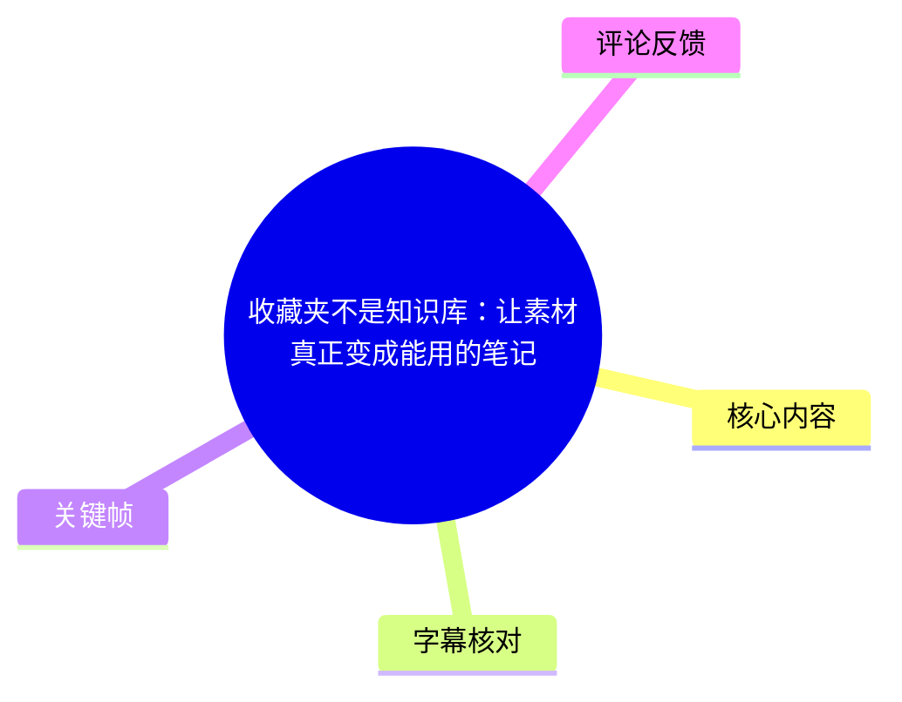
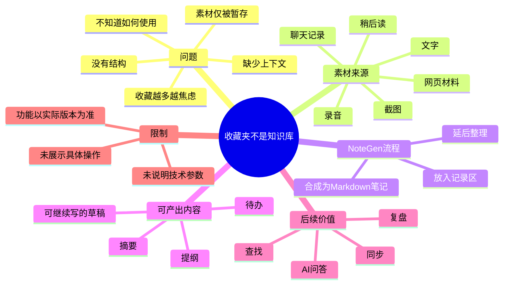

# 收藏夹不是知识库：让素材真正变成能用的笔记

> 来源：[Bilibili 视频](https://www.bilibili.com/video/BV1YMME6FEb6)<br>
> UP 主：codexu｜视频时长：62 秒｜收藏夹：AI视频总结<br>
> 标签：AI 笔记、NoteGen、知识管理、效率工具、Markdown

## 小结

视频围绕一个知识管理误区展开：**收藏夹、稍后读、截图、聊天记录和网页材料的“已保存”，不等于这些内容已经成为可用知识**。素材若仅停留在入口处，往往缺少来源关联、上下文和明确的下一步用途，积累越多反而越容易造成焦虑。

作者以 NoteGen 为例给出了一条轻量工作流：先将文字、截图、录音与网页资料放入记录区；之后在有时间时统一整理为 Markdown 笔记。素材在整理后可被进一步转化为摘要、提纲、待办事项，或可继续写作的草稿。

视频强调的核心不是“多收藏”，而是让素材进入后续的**查找、同步、AI 问答与复盘**流程。复盘时，用户面对的应当是具有结构、来源和下一步行动的内容，而不是一堆分散的平台入口。

这是一条理念与产品流程介绍短视频，并未演示 NoteGen 的具体界面操作、导入格式、同步协议、AI 模型、收费方案、数据存储位置或隐私策略。因此，“可查找、可同步、可 AI 问答”等能力应视为视频中的产品定位描述，使用前仍需以当时的官方文档和实际版本为准。

视频发布于 2026-07-09；其中的方法论具有较强普适性，但 NoteGen 的功能名称、支持的素材类型及功能可用性可能随版本更新变化。

## 思维导图





## 目录

- [问题：保存不等于知识化](#问题保存不等于知识化-000000)
- [素材为何会失去可用性](#素材为何会失去可用性-000024)
- [NoteGen 的整理流程与产出](#notegen-的整理流程与产出-000024)
- [从收藏到复盘的闭环](#从收藏到复盘的闭环-000048)
- [可执行的实践步骤](#可执行的实践步骤-000024)
- [限制、适用范围与时效性](#限制适用范围与时效性-000048)
- [字幕比对](#字幕比对)
- [评论分析](#评论分析)
- [处理记录](#处理记录)

## 问题：保存不等于知识化 [00:00](https://www.bilibili.com/video/BV1YMME6FEb6?t=0)

视频开篇提出明确判断：**收藏夹不是知识库，它只是把内容暂时放在那里。** 这里的“收藏夹”不是指某一款软件的特定页面，而是泛指各种只承担暂存作用的入口。

作者列举了常见素材来源：

- 截图；
- 稍后读内容；
- 聊天记录；
- 网页材料。

这些材料表面上均已被保存，但视频指出，它们通常尚未经历整理过程，因此不能自然转化为可以调用的知识。视频中的问题链条是：

1. 素材被放入某个入口；
2. 素材没有经过整理；
3. 素材没有上下文；
4. 用户不知道未来该如何使用；
5. 收藏持续增加，焦虑也随之增加。


> 图：画面以 NoteGen 的“收藏夹不是知识库”为主标题，并用手机、网页、视频卡片等视觉元素呈现素材来源的碎片化；下方还出现“收藏夹、截图、聊天记录、稍后读”等入口。这张图直接支撑了视频对“素材被保存但未被组织”的问题定义。

视频的关键判断是：真正的问题不是“记录得太少”，而是素材停留在知识处理流程的第一步——**收集**。换言之，收集本身只是输入，不能替代加工、组织和复用。

## 素材为何会失去可用性 [00:00](https://www.bilibili.com/video/BV1YMME6FEb6?t=0)

作者进一步解释了暂存素材难以复用的原因：它们缺少整理，也缺少足以支持未来理解的上下文。画面将这一状态概括为“没有上下文就用不上”。


> 图：画面标题为“没有上下文就用不上”，中间的内容卡片以虚线连接、问号和拼图缺口呈现信息关系断裂；下方状态卡标出“上下文断裂”。这有助于理解视频所说的“保存了却用不上”并不只是检索问题，也是信息关系缺失的问题。

根据视频的表述，未整理素材至少存在三类缺口：

| 缺口 | 视频中的含义 | 对复盘的影响 |
| --- | --- | --- |
| 缺少来源关系 | 材料只是散落的入口，没有被归入具体主题或任务 | 回看时难以判断材料为什么被保存 |
| 缺少上下文 | 记录没有附带背景、问题或使用场景 | 即使找到内容，也可能无法快速理解其价值 |
| 缺少下一步 | 素材未被转为可执行或可写作的形态 | 内容容易继续沉没在收藏夹中 |


> 图：该画面沿用“没有上下文就用不上”的主题，并在底部直接呈现“所以收藏越多，人反而越焦虑”。它说明视频并非反对收藏，而是反对让收藏成为没有出口的堆积行为。

## NoteGen 的整理流程与产出 [00:24](https://www.bilibili.com/video/BV1YMME6FEb6?t=24)

从 00:24 起，视频给出以 NoteGen 为例的处理方式。作者描述的流程为：

1. 将文字、截图、录音、网页资料先放进“记录区”；
2. 在有时间整理时，再将这些素材合成为 Markdown 笔记；
3. 将单条素材继续转化为不同形式的工作产物。

视频明确提到的输入类型与输出类型如下。

| 环节 | 视频明确提及的内容 |
| --- | --- |
| 输入素材 | 文字、截图、录音、网页资料 |
| 暂存位置 | 记录区 |
| 整理结果 | Markdown 笔记 |
| 进一步产出 | 摘要、提纲、待办、一段可继续写的草稿 |

这里的“有时间再整理”反映出一个分阶段策略：**采集与整理不必在同一时刻完成**。先快速接住信息，避免遗漏；再在合适时间将其加工成有组织的笔记。视频并未说明“记录区”是否支持自动分类、批量导入、OCR、音频转写或网页抓取，因此不能据此推断这些具体实现已经存在。


> 图：开篇界面下方展示“素材状态”“Markdown flow”以及多个素材入口，配合底部“截图、稍后读、聊天记录和网页材料，看起来都被保存了”的字幕，直观呈现视频从多种输入到 Markdown 整理流程的叙述起点。

## 从收藏到复盘的闭环 [00:48](https://www.bilibili.com/video/BV1YMME6FEb6?t=48)

作者将整理后的价值概括为：素材不再只是被保存，而是进入后续的**查找、同步和 AI 问答流程**。在回头复盘时，用户不再面对一堆入口，而是面对已经具备以下特征的内容：

- 有结构；
- 有来源；
- 有下一步。

视频结尾的行动建议是：不要让收藏夹变成另一个垃圾箱；先接住素材，再将其整理成真正可用的笔记。结尾口号为“先收藏，之后复盘时更好找”。

可以将视频表达的目标状态整理为以下闭环：

```text
素材输入
  → 暂存到记录区
  → 合成为 Markdown 笔记
  → 生成摘要 / 提纲 / 待办 / 草稿
  → 查找、同步、AI 问答
  → 复盘与继续行动
```

其中，“Markdown”在视频中承担的是整理后的笔记载体。视频没有说明 Markdown 的具体字段规范、文件命名规则、目录结构、链接策略或元数据格式；因此，上述流程可作为工作框架，而不是可直接照搬的产品配置指南。

## 可执行的实践步骤 [00:24](https://www.bilibili.com/video/BV1YMME6FEb6?t=24)

以下步骤依据视频的明确流程整理，并补充为可执行的最小实践。补充部分仅是对视频方法论的操作化，不代表视频演示过这些具体界面或自动化功能。

### 1. 统一接住碎片素材

优先将分散在截图、稍后读、聊天记录、网页、文字与录音中的材料汇入一个固定的记录入口。此阶段目标是防遗漏，而不是立即写成完整文章。

### 2. 给素材保留最小上下文

视频强调“没有上下文就用不上”。因此，在整理时应至少补齐：

- 这条素材来自哪里；
- 为什么保存它；
- 它对应什么问题、主题或项目；
- 下一步希望把它用于什么。

其中“来源、问题、下一步”与视频末尾提出的“有结构、有来源、有下一步”相对应。

### 3. 在整理时间转为 Markdown 笔记

将同主题或同任务的素材合并成 Markdown 笔记。视频没有提供模板；可按其表达的三个目标，采用如下最小结构：

```markdown
# 主题

## 来源
- 素材链接或出处

## 要点
- 关键信息

## 我的理解
- 这条素材解决什么问题

## 下一步
- 待办、写作方向或需要验证的问题
```

该模板仅用于落实视频的结构化主张，不是视频中展示的 NoteGen 固定格式。

### 4. 根据任务选择产出形态

视频指出，一条素材可转化为摘要、提纲、待办或可继续写的草稿。应根据当前目标选择，而非把每条素材都加工成同一种笔记：

| 当前目的 | 可优先形成的产物 |
| --- | --- |
| 快速回顾 | 摘要 |
| 组织观点或学习框架 | 提纲 |
| 推进具体任务 | 待办 |
| 准备输出内容 | 可继续写的草稿 |

### 5. 以复盘验证整理是否有效

复盘时可检查三个问题：是否能快速找到内容、是否能看懂当初保存的原因、是否存在明确下一步。若仍只是打开一串入口，则说明素材仍停留在“收藏”阶段，尚未完成知识化整理。

## 限制、适用范围与时效性 [00:48](https://www.bilibili.com/video/BV1YMME6FEb6?t=48)

### 视频已说明的边界

- 视频定位为 62 秒的概念与流程介绍，不是完整教程。
- 视频只说明可处理的素材类别和目标产出，没有展示实际导入、整理或导出过程。
- “查找、同步、AI 问答”被作为后续流程提及，但没有给出功能条件、效果示例或准确率指标。
- 视频没有提供 NoteGen 的版本号、系统平台、价格、账号要求、网络要求、隐私政策或数据存储方式。

### 使用时应额外确认的问题

若计划将此流程用于真实知识库或工作资料，仍应核实：

1. 素材是否能被可靠导入，尤其是网页、录音与图片；
2. 原始来源链接、附件与版权信息是否会被保留；
3. 同步是否支持所需设备与协作场景；
4. AI 问答是否基于全部笔记、指定笔记，还是需要额外配置；
5. 涉及聊天记录、录音及网页资料时，是否符合个人隐私、团队保密和平台规则。

### 时效性说明

视频发布时间为 2026-07-09。视频所倡导的“先收集、后整理、再复盘”方法不依赖特定版本，具有持续参考价值；但 NoteGen 的具体功能、界面、支持格式和 AI 能力可能变化。应以使用时的官方产品信息为准。

## 字幕比对

站内未提供可用字幕，因此无法进行逐句的站内字幕对照；本次仍已检查 ASR 结果。ASR 检测到音轨且时间戳完整，未出现 `noAudioStream=true` 标记。

| 字幕来源 | 完整性 | 专有名词 | 时间轴 | 主要问题 |
| --- | --- | --- | --- | --- |
| Bilibili 站内字幕 | 未提供可用字幕 | 无法评估 | 无法评估 | 无可用站内 SRT 或字幕文本 |
| 本次 ASR 字幕 | 较完整；覆盖约 58.82 秒语音，语音覆盖率约 98.93% | “NoteGen”识别正确 | 完整；首段 00:00:00.400，末段至 00:00:59.220 | 存在同音/错字、简繁混用及断句不完整问题 |

本次 ASR 使用中文识别，识别语言置信度为 0.994140625，共 3 个时间分段：

| 时间段 | ASR 内容要点 | 采用与校正 |
| --- | --- | --- |
| 00:00:00.400–00:00:24.720 | 收藏夹不是知识库；截图、稍后读、聊天记录和网页材料虽被保存但未整理 | 将“收藏家”“收藉”按语义及画面标题校正为“收藏夹”“收藏”；将“他们”按指代校正为“它们” |
| 00:00:24.720–00:00:48.780 | 文字、截图、录音、网页资料进入记录区，后续整理成 Markdown | 将“罢页”校正为“网页”；将“纪录区”统一写作“记录区”；保留专有名词“NoteGen” |
| 00:00:48.780–00:00:59.220 | 整理后的内容可查找、同步、AI 问答，并用于复盘 | 将“素杌”“笔迹”按上下文校正为“素材”“笔记” |

最终正文以**本次 ASR 的真实时间戳**作为时间轴依据，并结合关键帧中文字和前后语义进行有限校正。由于视频总时长为 62 秒、ASR 最后语音结束于约 59.22 秒，末尾约 2.78 秒未识别出新增语音内容。

## 评论分析

未获取到可分析的热评。提供的评论数据中 `items` 为空，且视频元数据显示回复数为 0，因此不存在“热评前三条”可供概括、补充或评估。

## 处理记录

- Worker ID：`worker-mrplns82-755ed24d`
- 生成模型：`gpt-5.6-terra`
- ASR 模型：`medium`（CUDA / float16，识别语言：中文）
- 使用的素材：视频元数据、ASR 时间轴字幕、ASR 诊断信息、12 个关键帧路径清单、已提供的关键帧画面、评论数据。
- 字幕选择：站内无可用字幕；采用本次 ASR 的 3 个带时间戳分段作为时间轴依据，并对明显错字进行上下文校正。
- 关键帧选择依据：
  - `frames/frame-001.jpg`：展示主题、NoteGen 标识及“收藏夹、截图、聊天记录、稍后读”等分散素材入口；
  - `frames/frame-002.jpg`：补充“材料已保存”的问题场景及 Markdown 流程入口；
  - `frames/frame-003.jpg`：展示“没有上下文就用不上”与“上下文断裂”；
  - `frames/frame-004.jpg`：展示“收藏越多，人反而越焦虑”的结果。
- 缓存清理：未提供缓存目录、清理工具调用或清理结果，无法确认是否执行缓存清理。
- 未解决问题：未提供 NoteGen 的具体版本、功能配置、导入方式、同步机制、AI 问答实现、数据隐私与定价信息；这些内容未在视频中展示，未作推断。
