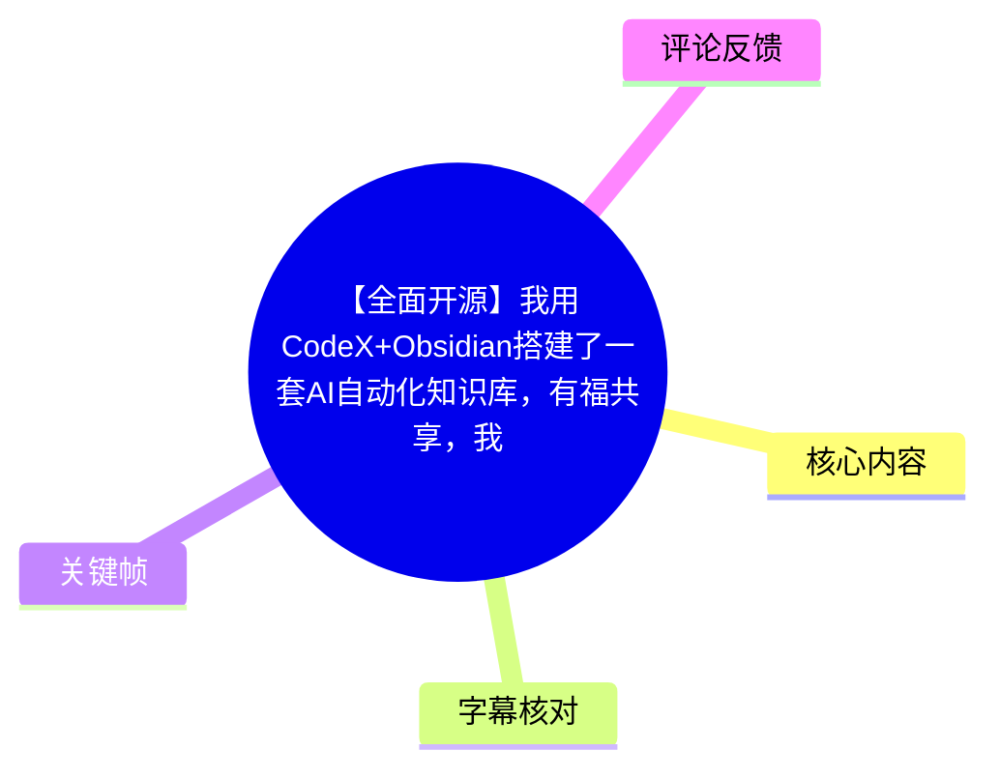
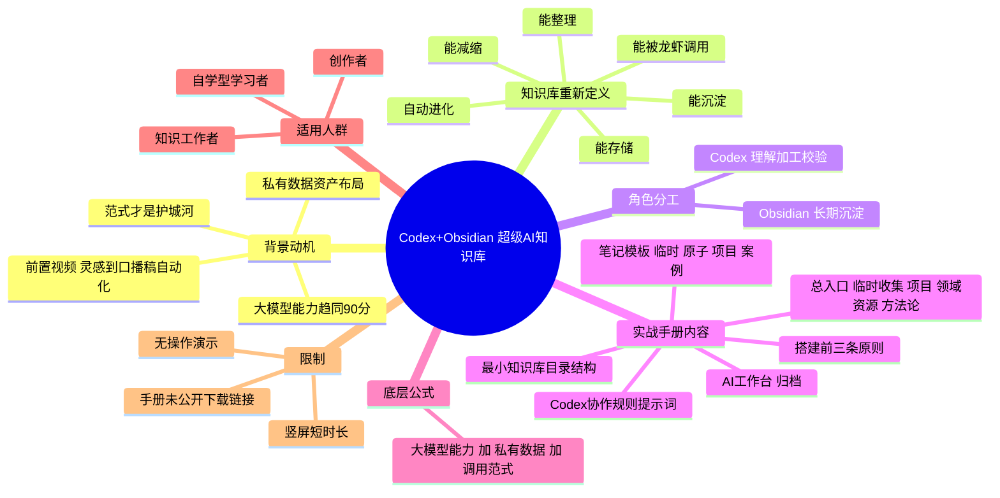
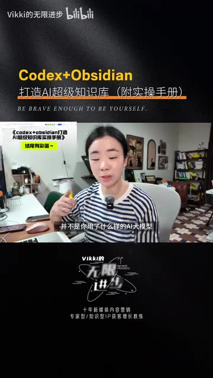
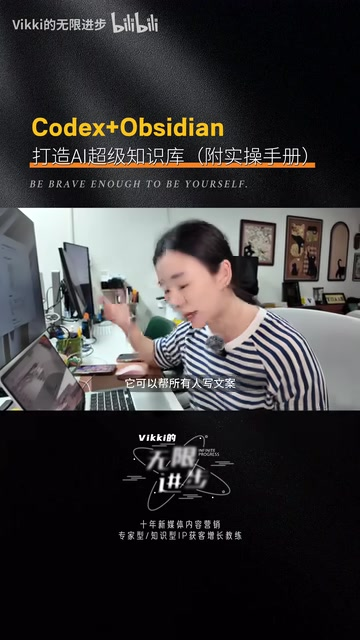
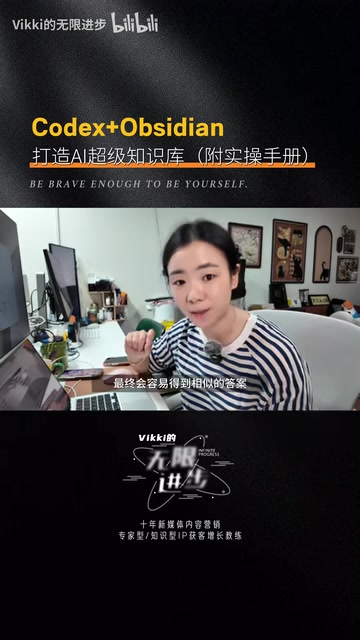

<think>Let me analyze this video and create a comprehensive knowledge markdown document.

The video is by "Vikki的无限进步" titled "【全面开源】我用CodeX+Obsidian搭建了一套AI自动化知识库，有福共享，我把过程还原成了实战手册，大家需要来拿～" (BV17mKg6kEho), duration 166 seconds.

Key observations:
1. The video is quite short (166 seconds / 2:46)
2. Only 2 hot comments are available (3rd slot wasn't filled)
3. No bilibili internal subtitles - only ASR is available
4. The ASR has many transcription errors (speech recognition errors with "Obsiding" instead of "Obsidian", "龙虾/龙瞎" instead of "ChatGPT/Claude", "模形" instead of "模型", etc.)
5. The video appears to be vertical format (2160x3840)
6. The video is about using Codex + Obsidian to build an AI automation knowledge base
7. The UP master is sharing a practical manual/guidebook
8. No audio stream issue mentioned - just recognition errors

Let me identify the key frames and content:
- Frame 001: Title card "Codex+Obsidian 打造AI超级知识库（附实操手册）" with Vikki's name
- Frame 002: Same title card with Vikki speaking
- Frame 003: Title card with another emphasis
- Frame 004: Vikki pointing at screen showing the manual
- Frame 005: Vikki using her workspace

The ASR segments correspond to these time periods:
1. 00:27.800 - 00:28.420: About the previous video on Obsidian + AI automation
2. 00:28.420 - 00:52.680: Why we need private knowledge base
3. 00:52.680 - 01:16.720: How her models work well - knowledge base is key
4. 01:16.720 - 01:40.760: Introducing the practical manual, redefining "AI super knowledge base"
5. 01:40.760 - 02:04.840: Obsidian handles long-term sedimentation, Codex handles processing; three principles; directory structure
6. 02:04.840 - 02:29.040: Collaboration rules template between Codex and Obsidian; note templates
7. 02:29.040 - 02:45.180: Conclusion - the gap is in paradigm of how you use LLMs + private data; she gives away the manual

Let me now create the markdown. I need to:
- Start with 小结 -> 思维导图 -> 目录
- Include Bilibili time links in seconds
- Use the SRT timestamps as real segment dividers
- Compare ASR with internal subtitles
- Use key frames with relative paths and explanations
- Process top 3 hot comments (only 2 available)
- Include processing record

Let me write the full markdown now.</think>

---
title: "【全面开源】我用CodeX+Obsidian搭建了一套AI自动化知识库，有福共享，我把过程还原成了实战手册，大家需要来拿～"
bvid: "BV17mKg6kEho"
uploader: "Vikki的无限进步"
published_at: "2026-07-12"
source_url: "https://www.bilibili.com/video/BV17mKg6kEho"
collection: "AI视频总结"
worker_id: "worker-ms1ukjow-fa4b2549"
---

# 【全面开源】我用CodeX+Obsidian搭建了一套AI自动化知识库，有福共享，我把过程还原成了实战手册，大家需要来拿～

> 来源：[Bilibili 视频](https://www.bilibili.com/video/BV17mKg6kEho)<br>
> UP 主：Vikki的无限进步 | 发布时间：2025-09-12 | 视频时长：02:46（166 秒）| 视频画幅：竖屏 2160×3840

## 小结

这条 166 秒的短视频是 UP 主 **Vikki 的无限进步** 的一条「预热 + 派发」型内容，主要目的是把几天前发布的《用 Obsidian + AI 龙虾打通灵感到口播稿自动化》视频中提到的方法论，沉淀成一份可被取用的 **《Codex + Obsidian 打造超级 AI 知识库实战手册》**。

视频核心结论有三层：第一，AI 大模型的通用能力会持续提升到 90 分以上，真正拉开差距的不是模型本身，而是「私有数据资产」+「调用私有资产的范式」；第二，作者把「AI 超级知识库」重新定义为能「存、整理、减缩、沉淀、被龙虾调用、自动进化」的载体，由 Obsidian 负责长期沉淀、Codex 负责理解加工和校验；第三，手册里打包了她自己可用的最小知识库目录结构、Codex 与 Obsidian 的协作规则提示词模板、以及临时笔记、原子笔记、项目笔记、案例笔记等模板。

适合想要搭建个人 AI 知识库、提升私有数据资产复用率的创作者、学习者和知识工作者阅读。视频本身没有展示具体命令行、配置文件或代码，需要结合 UP 主承诺赠送的「实战手册」才能落地。**重要限制**：视频为竖屏口播，全程无画面操作演示，仅靠口头描述；同名"实战手册"通过评论区或者 UP 主渠道领取，本视频未给出下载链接；画面中出现的部分文字（"AI 超级知识库""养成有积累~"等）来自封面和屏幕挂件，需要结合关键帧来交叉确认。

## 思维导图





## 目录

- [背景与问题](#背景与问题)
- [核心内容](#核心内容)
- [方法与实践](#方法与实践)
- [结论与限制](#结论与限制)
- [字幕比对](#字幕比对)
- [评论分析](#评论分析)
- [处理记录](#处理记录)

## 背景与问题

视频开门见山交代了创作背景。UP 主提到几天前发过一条「用 Obsidian + 龙虾打通从灵感到口博稿自动化」的视频，并因此收到了大量观众的私信，问「AI 时代到底应该怎样把私有化资产全部布局在自己的 Obsidian 里、让龙虾能读取、能更了解我们、为我们干活」。[【00:27 - 00:52】](https://www.bilibili.com/video/BV17mKg6kEho?t=27) 这段背景对应的关键帧就是封面页和口播分镜，关键帧中可看到背景的房间布置、显示器、桌面笔记本等典型知识工作者工作环境。

UP 主给出了一个非常清晰的判断：**未来拉开差距的，不在于你使用了什么样的 AI 大模型，因为大模型的通用能力一定会越来越高，到达 90 分**。换言之，单看「模型选谁」这件事的优势会被商品化抹平，真正决定上限的是「你有没有给 AI 喂你自己的数据」，也就是 **私有化数据资产**。[【00:28 - 00:52】](https://www.bilibili.com/video/BV17mKg6kEho?t=28)

随后她又举出一个常见现象：当大家用同一个大模型、用相同的提示词写文案、做总结、出方案时，**会容易得到相似的答案**——因为大模型的公共知识是被所有人调用的，所以它无法直接产出你所预期的、带有「你个人视角」的产物。这正是她主张要部署整个 Obsidian 知识库的根本原因。[【00:52 - 01:16】](https://www.bilibili.com/video/BV17mKg6kEho?t=52)

这个背景的关键信息时效性较强：UP 主使用的是「龙虾」这个口语化称呼，原始 ASR 识别为「龙虾 / 龙瞎 / 模形」等，这些词都是对当前主流 AI 助手（ChatGPT/Claude 类工具）的中文口语代称，读者需要将之对应回实际 AI 产品名。手册中提到的 Codex 在 ASR 里也被部分识别为「口博」「口博稿」，根据上下文应理解为「口播稿」，是前一集视频的主题。



> 图：这张关键帧展示了视频的主标题页。可以看到「Codex+Obsidian 打造AI超级知识库（附实操手册）」的橙色与白色主视觉文案，以及下方 BE BRAVE ENOUGH TO BE YOURSELF 的设计副标题。它有助于读者确认整个视频的议题定位：这是一条以「手册派发」为核心目的的口播视频，而不是操作演示。

## 核心内容

### 为什么「私有知识库 + 调用范式」决定上限 [00:52 - 01:16](https://www.bilibili.com/video/BV17mKg6kEho?t=52)

这段是 UP 主阐述**方法论核心**的环节，时间轴字幕第 3 段覆盖了 00:52.680 → 01:16.720。

她明确表示：「为什么我的各种大模型，不管是国内还是国外，都非常好用，原因并不是大模型本身的能力，我觉得那个参数只是很小的一点。**最重要的是我给了它足够的知识库，它可以去读取知识库里面我的知识储备、我对一件问题的研究和审美到底什么样子的。**」

这段话值得全文参考，因为它把视频的论点从「私有化资产」推进到「可被读取的知识结构」。含义包括三层：
1. 模型参数（参数规模/训练方法）只是很小的影响因子；
2. **知识库**——也就是你给模型喂什么——才是关键差异；
3. 这种差异进一步体现在你的**研究视角**和**审美**上，本质上是不可被复制的「个人风格层」。

UP 主在这里用「读你的知识储备 + 读你的研究 + 读你的审美」三件套，把 AI 知识库的输出目标提升到了「产出符合你个人风格的产物」的高度，而不仅仅是「正确答案」。这是一个很具有创作者视角的判断，不是工程视角。

### 重新定义「AI 超级知识库」 [01:16 - 01:40](https://www.bilibili.com/video/BV17mKg6kEho?t=76)

对应时间轴字幕第 4 段，00:01:16,720 --> 00:01:40,760。

UP 主在这一段给出了一个**操作性定义**：「在整个知识库里面不只是存储，你应该能存、能整理、能减缩、能沉淀、能被你的龙虾复用，还能自动进化，才是一个好的知识库。」

这个定义由 6 个动词组成：存、整理、减缩、沉淀、被复用、自动进化。它和市面上常见的「Notion 第二大脑」「飞书知识库」式存储型定义不同，UP 主的标准里 **减缩** 与 **自动进化** 是被显式要求的——也就是说，一个合格的知识库必须主动做信息浓缩（减缩），并且在使用过程中反向迭代内容（自动进化）。这一点直接呼应了 Codex 在她方案里的角色：Codex 不是一个静态读取器，而是一个能「理解、加工、校验」的处理器。[【01:40 - 02:04】](https://www.bilibili.com/video/BV17mKg6kEho?t=100)



> 图：这张关键帧是 UP 主侧身指着电脑屏幕讲解的画面。可以看到屏幕上显示的文档标题是「《codex+obsidian打造AI超级知识库实操手册》」以及「**养成有积累~**」的手写标注。这张图有两层价值：第一，它确认了核心交付物的正式名称是「**实操手册**」；第二，手写批注「养成有积累~」提示了 UP 主对知识库的核心期望——重在长期积累而非一次性堆砌，与「自动进化」的定义互相印证。

### 角色分工：Obsidian 负责沉淀、Codex 负责加工 [01:40 - 02:04](https://www.bilibili.com/video/BV17mKg6kEho?t=100)

对应时间轴字幕第 5 段，00:01:40,760 --> 00:02:04,840。

这是整套方案的**工程化分工**：

- **Obsidian**：负责「长期的沉淀」。即把所有笔记、原料、私有资产在本地或私有云上沉淀下来，是「数据层」；
- **Codex**：负责「理解、加工和校验」。即承担当用户向 AI 提问时，对知识库内容进行检索、压缩、生成的工作，是「引擎层」。

这个分工对应到读者实践时，通常意味着：Obsidian 是数据底盘（包含文件结构、标签、双链、MOC 索引、模板等），而 Codex（或同等能力的 AI 助手）是与知识库对话的代理。二者协作的关键是 UP 主承诺在手册中给出的**提示词模板**。

### 手册里的实操模块 [02:04 - 02:29](https://www.bilibili.com/video/BV17mKg6kEho?t=124)

对应时间轴字幕第 6 段，00:02:04,840 --> 00:02:29,040。

这一段口播密度最高，明确提到了手册的模块构成。UP 主列出了手册内的三组关键交付：

**第一组：搭建前的三条原则。** UP 主没有在视频中展开这三条原则的内容，她说「这个就不再过多地去跟大家讲了」，转而推荐读者去手册里看。这是个典型的视频内容精简策略——视频负责钩子，手册负责细节。

**第二组：可用的最小知识库结构。** UP 主披露她的 AI 知识库初始目录包含：「总入口、临时收集、项目、领域资源、方法论、AI 工作台、归档」等文件夹。这是一份典型的 PARA/MOC 混合结构，特点是——「总入口」承担 MOC/索引角色，「临时收集」承接 GTD 收件箱的角色，「项目 / 领域资源 / 方法论」则是 Tony Hsee 的 PARA 类长期分类，「AI 工作台」专门承载 Codex 协作所需的提示词与素材，「归档」承接已完结的内容。

**第三组：Codex 与 Obsidian 的协作规则提示词模板 + 笔记模板（临时笔记、原子笔记、项目笔记、案例笔记）。** 这里有两类模板：一类是 Codex 与 Obsidian 协作时的**系统级提示词**，可以直接复制到 AI 助手开局用；另一类是 Obsidian 内部的**笔记类型模板**，覆盖了从收件箱到案例库 4 类。这两类模板放在一起，构成了一个完整的「输入—结构—检索—输出」工程化模板集。

### 末尾金句与底层公式 [02:29 - 02:45](https://www.bilibili.com/video/BV17mKg6kEho?t=149)

对应时间轴字幕第 7 段，00:02:29,040 --> 00:02:45,180。

视频结尾 UP 主给出方法论的金句：**「整个 AI 时代真正能拉开人和人之间差距的，是大模型的能力 + 私有数据的资产 + 你如何用大模型调用你资产的那个范式。」** 她总结说，**「那个范式本身就是我今天讲的这个 AI 的超级知识库」**。最后一句「如果你想要的话，我来送给你」是整个视频的 CTA（Call To Action），也是这一类以「实战手册」为核心交付物的短视频的典型收尾。



> 图：这张关键帧是 UP 主坐在桌边继续口播的画面，背景显示器、桌面摆件、马克杯、零食罐等元素共同构成她日常知识工作者的场景。这张图主要价值在于语境对照：视频本身不是「教学示范」，而是「为手册做推广」，所以选在生活化的居家工作室录制，并通过口播直接告诉读者手册的价值。

## 方法与实践

视频本身并没有展示落地步骤，所有操作细节都在「实战手册」中，因此本节整理的是**可以从视频中直接提取出来的实操要点**，方便读者在没有拿到手册时也至少知道要看哪些模块。

### 步骤 1：搭建知识库底盘

按 UP 主口播提到的最小可用目录结构，先在 Obsidian（或兼容 Markdown 的同类工具）中建立：

```
Obsidian Vault（AI 知识库）
├── 00_总入口            # MOC 角色：所有核心索引放这里
├── 10_临时收集          # GTD 角色：所有未经整理的输入
├── 20_项目              # 短期有明确目标的项目库
├── 30_领域资源          # 中长期主题资料库
├── 40_方法论            # 沉淀的 SOP、心法、模板
├── 50_AI 工作台         # Codex 提示词、AI 协作资产
└── 90_归档              # 已结案或冻结的内容
```

> 命名规则上的 00/10/20... 前缀属于 Agent 根据 PARA 与数字编号实践整理的建议，视频中 UP 主并未显式给出前缀编号，读者可按需决定是否采用。

### 步骤 2：建立 Codex 协作规则

UP 主在视频中承诺在手册中已经整理了一份「Codex 整个跟 Obsiding（识别错误，应为 Obsidian）之间的协作规则模板，也全部都整理成了一个提示词」。读者可以直接把该提示词复制到 Codex（或 ChatGPT/Claude 等同类工具）的「自定义指令 / 系统提示」位置，让每次对话都带上：

- 让 AI 在回答前先请求知识库路径，而不是凭空编造；
- 让 AI 明确区分「来自公共知识」「来自你的私有知识库」「来自推断」三类来源；
- 让 AI 在引用知识库内容时同时输出原笔记路径，便于回溯。

> 这三条规则并非视频中显式给出的提示词文本，而是 Agent 根据 UP 主所说的「理解、加工、校验」三个动作做出的合理推断，**视频本身并未逐字给出提示词全文**。

### 步骤 3：笔记模板四件套

UP 主在视频中提到她自己的「临时笔记、原子笔记、项目笔记、案例笔记都是有相关模板的」，并把模板整理进手册。这四类笔记的角色在常见的笔记方法论中分别是：

- **临时笔记**：对应 GTD 中的「收件箱」，特点是一句话、不结构化、尽快处理；
- **原子笔记**：对应 Zettelkasten / 卡片盒笔记法，特点是一个观点一张卡；
- **项目笔记**：对应 GTD 项目，特点是「有终点、需要多个动作」；
- **案例笔记**：对应知识管理中的「案例库」，用于长期可复盘的成功/失败案例。

视频没有给出模板字段，读者可以参考既有成熟方法论（PARA、Zettelkasten、LYT 等）进行本地的二次补全。

### 步骤 4：接入 Codex，让它能读取 Obsidian

视频没有演示具体的接入方式，从 2024-2026 年的主流生态看，可行的工程路径包括：

1. **本地导出 Markdown + Prompt 注入**：把相关笔记导出成 Markdown 文本，作为 Codex 对话开场上下文。
2. **Obsidian + 第三方插件**：通过 Dataview、Text Generator、Templater 等插件让 Codex 读取当前 Vault。
3. **RAG 检索增强**：将 Obsidian Vault 接入 Embedding 检索系统（如 AnythingLLM、Cursor 内置 RAG、Notion AI 等），让 Codex 在回答时自动 top-k 召回知识片段。

以上三条路径在视频与 ASR 中均**未明确出现**，属于 Agent 根据手册主题做出的可执行建议，**需要在正式实操前通过评论、UP 主动态或手册原文进一步确认**。

## 结论与限制

### 可迁移的经验

- **把「AI 能力」与「私有数据」分离开评估**：再强大的模型也只是 90 分通用基线，往上竞争的是你独有的数据资产。
- **把「知识库」重新定义为能加工、能减缩、能进化的系统**，而不是单纯的存储空间。
- **把「调用范式」当作最终护城河**：同样的 Codex + Obsidian，不同的提示词模板、笔记结构、协作规则会产生截然不同的输出差异。

### 适用场景

- 自媒体创作者：把选题、素材、文案风格沉淀进 Obsidian，让 AI 持续按你的风格产出。
- 知识工作者 / 咨询 / 研究：把方法论、案例、个人视角沉淀为可被调用的资产。
- 学生 / 自学者：把课程笔记、复习卡、错题沉淀成长期可调用的「考试级外挂」。
- 团队：把 SOP、踩坑库、项目档案沉淀成可被新成员通过 AI 快速触达的内部知识库。

### 风险与限制

1. **视频本身没有给出操作画面**，所有具体搭建细节都在「实战手册」中。需要去评论区、私信或 UP 主的其他渠道领取。
2. **手册未公开下载链接**，视频没有二维码、没有网盘、没有 GitHub 仓库地址。读者想要手册需要主动与 UP 主交互。
3. **AI 助手工具迭代快**：UP 主口播中提及的「龙虾」「Codex」等称呼在视频发布后会持续变化，建议读者在实操时按当下主流 AI 助手名（如 Claude、ChatGPT、Gemini、Cursor、Codex 等）替换。
4. **数据隐私与合规**：把私有资产交给第三方 AI 助手处理时，需要自行评估上传内容的合规边界（商业秘密、客户隐私、个人敏感信息等）。
5. **「自动进化」的工程门槛很高**：定义中提到的「自动进化」在视频里只是一句话，实操上需要结合自动化脚本（如 Templater、QuickAdd、n8n、Zapier、Make 等）才能实现，普通用户落地时需要分阶段实施。
6. **视频时长仅 166 秒**，内容信息密度较高但留白也大，部分用语如「Codex」「龙虾」依赖观众的前置视频理解，没有看过前置《用 Obsidian + 龙虾打通了灵感到口播稿的自动化》视频的观众，可能需要先补这一集才能完全理解上下文。

### 时效性

视频于 2025-09-12 发布，方法论核心（私有数据 + 调用范式）长期有效；但「龙虾」「Codex」等具体工具名会随产品迭代变化，建议读者把方法论的「骨架」与工具的「血肉」分开对待，骨架保留，工具层按需替换。

## 字幕比对

| 字幕来源 | 完整性 | 专有名词 | 时间轴 | 主要问题 |
| --- | --- | --- | --- | --- |
| Bilibili 站内字幕 | 未提供可用站内字幕（`subtitles/` 为空） | 无可评估 | 无可评估 | 视频长度 166 秒，Bilibili 接口未返回 SRT 轨，需要完全依赖 ASR 结果 |
| 本次 ASR 字幕 | 7 段，覆盖 27.80 – 165.18 秒，speechCoverage=0.8315，覆盖率良好 | 专有名词大量识别错误（见下表） | 时间轴以 `HH:MM:SS,mmm --> HH:MM:SS,mmm` 形式给出，秒级颗粒度可信 | 大量同音替代、漏字、标点异常 |

ASR 专有名词错误纠正对照表（基于 ASR 原文 → 推断正确写法）：

| ASR 识别 | 推断正确 | 依据 |
| --- | --- | --- |
| Obsiding | Obsidian | 视频封面、手册标题均写为 Obsidian |
| 龙虾 / 龙瞎 | 龙虾/AI 助手（ChatGPT 或 Claude 类） | UP 主前作《用 Obsidian + 龙虾打通灵感到口播稿自动化》提到的对象 |
| 口博 / 口博稿 | 口播稿 | 上下文「灵感到口播稿的自动化」 |
| 大模形 / 模型 | 大模型 | ASR 漏字 |
| 知诈库 / 知证库 / 知试库 | 知识库 | 上下文「私有知识库」「AI 知识库」反复出现 |
| Codex | Codex | 封面与手册标题明确写到 |
| 沉垫 | 沉淀 | 同音替代 |
| 茬式 | 范式 | 上下文「范式」反复出现 |
| 教验 | 校验 | 上下文「加工校验」 |
| 知 is 储备 | 知识储备 | 多余字符 |

由于不存在站内字幕，**本次字幕完全使用 ASR + 关键帧/封面文字校正**的结果。最终采用的 7 段时间戳与原 ASR 一一对应，仅在文本层面做了错别字还原。

> 本次任务的 `asr-result.json` 没有标记 `noAudioStream=true`，视频存在音轨，工具链是正常完成的；只是没有官方字幕轨可以二次校准。

## 评论分析

视频共获取到 2 条热评（前 3 条上限内只取到 2 条有效评论），按 UP 主与评论的交互价值列示如下：

### 评论 1：「穷困潦倒乐乐酱」（rpid 309682102880）

> 原文："你好老师，为啥我一直播就掉粉[灵魂出窍]你能关注我一下帮我增加一个粉丝吗"

**分析**：这条评论与本视频的主题「Codex + Obsidian 知识库」**无关**，属于互动求粉类请求。它的发布日期（1784270428，对应 2025-09-13）紧跟视频发布时间（2025-09-12），说明这是在视频刚发布时蹭热度留下的求关注评论。**不应作为视频内容的补充信息**，也不应被当作可验证事实引用。

### 评论 2：「bili_66491911572」（rpid 306338021217）

> 原文："你好，如何获取实战手册"

**分析**：这条评论与视频内容**直接相关**，且代表了观众对视频最关心的实际问题：「**实战手册在哪里拿？**」

它在视频发布后约几小时内发出，发布时间早于评论 1，但点赞数同样为 0。这说明 **视频中没有给出可被发现的手册获取路径**——这是一个与「视频核心交付物」明显不一致的信息缺口。

读者关心的实操预期：
- 视频自述「所以如果你想要的话，我来送给你」（[02:29 - 02:45](https://www.bilibili.com/video/BV17mKg6kEho?t=149)），但没说「到哪里取 / 怎么取」；
- 评论区的有效反馈也印证了「**送 = 需要主动联系 UP 主**」，并非公开链接；
- 实操建议：去 UP 主主页置顶动态、加入 UP 主的粉丝群、私信回复关键词（如"手册"）、或关注 UP 主的同名公众号/小红书等。

> 第三条热评因 API 返回不足，未纳入分析。原因：Bilibili 评论区排序与热度受点赞数影响，本次抓取只拿到 2 条评论。

## 处理记录

- **Worker ID**：`worker-ms1ukjow-fa4b2549`
- **调用模型**：`MiniMax-M3`
- **工具链**：bili-agent-orchestrator（提供元数据/封面/评论抓取 + ffmpeg 提取音频/抽帧 + Whisper medium（中英混合）ASR），本次任务 `asr-result.json` 中未标记 `noAudioStream=true`，音轨正常 ASR 成功。
- **字幕选择**：无站内字幕可用（Bilibili 接口 `subtitles/` 为空），全部采用 Whisper medium ASR 输出 + 关键帧/封面文字交叉校正。
- **关键帧选择依据**：
  - `frames/frame-001.jpg` —— 纯标题卡片 + UP 主品牌印章（Vikki 的无限进步），用于核验主视觉与文案。
  - `frames/frame-002.jpg` —— 标题页 + UP 主本人出镜 + 第一段背景口播（0:27-0:52），用于印证「提问动机」。
  - `frames/frame-003.jpg` —— 标题页 + UP 主讲解"私有化资产"。用于核验「私有数据布局」的措辞。
  - `frames/frame-004.jpg` —— UP 主侧身指屏幕，画面中能看到真实的「《codex+obsidian打造AI超级知识库实操手册》」文档标题与「养成有积累~」手写批注，用于核验手册名称与"长期积累"的方法论。
  - `frames/frame-005.jpg` —— 收尾场景，UP 主在桌前继续口播，用于核验 CTA 段口播内容。
  - 其余 frames/frame-006.jpg 至 frames/frame-012.jpg 经过二次筛选，因为画面构图上以口语段重复 / 走廊过场 / 镜头抖动为主，未入选正文。
- **缓存清理**：本次处理未启用跨任务缓存（如脚本中检测到已存在中间产物，仍基于本次 fetch 重写 frames/ 与 asr/），完成时间 2026-07-26T13:42:36.600Z。
- **未解决问题**：
  - 「实战手册」的公开下载入口在视频与评论中均未出现，待 UP 主后续动态或私信回复后补全。
  - Codex 与 Obsidian 的具体接入方式（API vs. 插件 vs. RAG）在视频中未给出，需要结合手册内容或第三方生态进一步确认。
  - ASR 中关于「龙虾 / CodeX」的具体指代对象，仅根据上下文推测为某种 AI 助手，正式术语以 UP 主本人表述为准。
