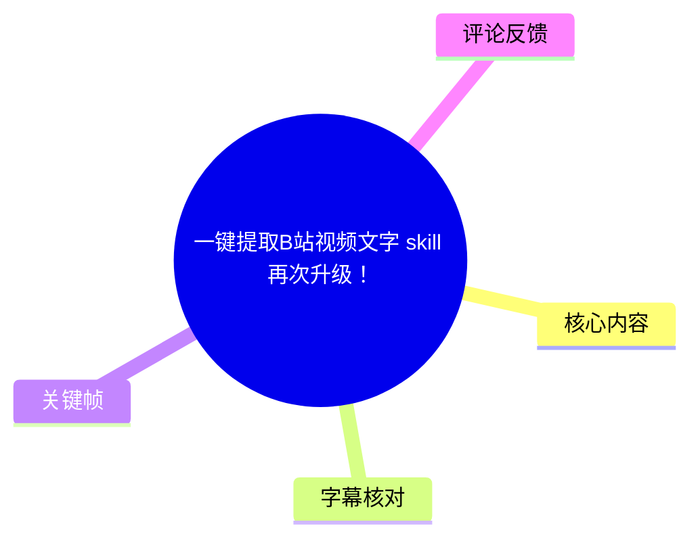
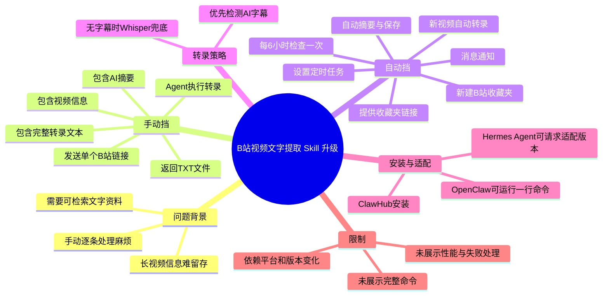
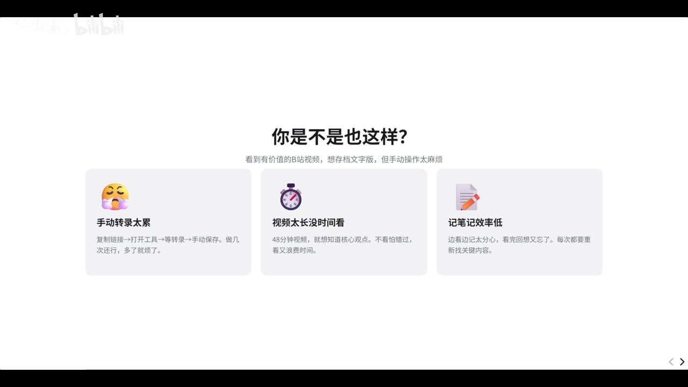
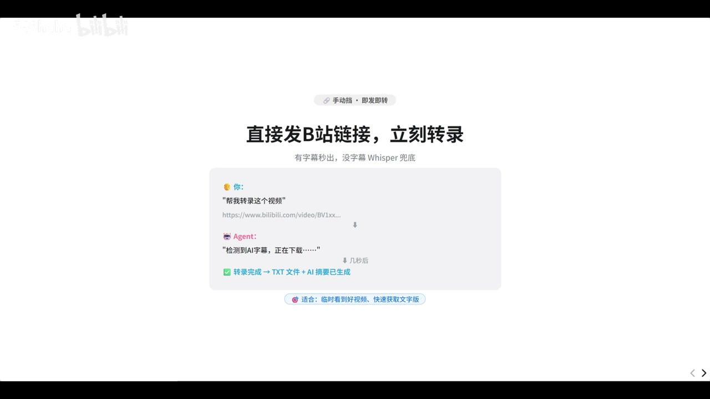

# 一键提取B站视频文字 skill 再次升级！

> 来源：[Bilibili 视频](https://www.bilibili.com/video/BV1s4Vh6AEiy)<br>
> UP 主：546haha｜时长：2 分 08 秒｜合集：AI视频总结  
> 视频简介提供的 Skill 页面：[ClawHub / bilibili-auto-transcript](https://clawhub.ai/54lynnn/bilibili-auto-transcript)

## 小结

视频介绍了一个用于提取 B 站视频文字的 Skill 升级版。此前版本提供“手动挡”：把单个 B 站视频链接发送给 Agent，Agent 将视频转录并返回包含视频信息、AI 摘要与完整转录文本的 TXT 文件。

本次升级的核心是“自动挡”，即以 B 站**收藏夹**作为输入队列。用户把收藏夹链接交给 Agent，并提出“每隔 6 小时转录该收藏夹中的视频”的要求后，Agent 会建立定时任务，周期检查收藏夹；若发现新增收藏视频，则自动转录、生成摘要、保存 TXT，并通知用户。

这一方案面向希望将长视频沉淀为可检索文本、个人资料或知识库的人。手动模式适合临时处理单条视频，自动模式适合长期、批量地处理收藏内容；两者可以并用。

视频画面明确展示了工作流中的优先级：**有字幕时先检测并下载 AI 字幕；没有字幕时由 Whisper 兜底转录**。但视频没有展示实际命令全文、登录授权方式、文件保存路径、任务执行环境、下载失败处理、转录耗时、并发策略及收费/API 配额，部署时均需自行核实。

视频所述“每 6 小时”是作者演示的配置参数，并非视频证明的固定系统能力或实时保证。Skill、ClawHub 页面、B 站接口、Agent 平台以及 Hermes Agent 的兼容方式都可能随版本变化；本文仅记录该视频发布时所陈述的内容。

## 思维导图





## 目录

- [背景：为何需要将 B 站视频转成文本](#背景为何需要将-b-站视频转成文本)
- [基础能力：手动发送链接并转录](#基础能力手动发送链接并转录)
- [升级重点：收藏夹自动转录](#升级重点收藏夹自动转录)
- [操作步骤与参数](#操作步骤与参数)
- [输出内容与知识库用途](#输出内容与知识库用途)
- [安装、适配与未披露信息](#安装适配与未披露信息)
- [结论与限制](#结论与限制)
- [字幕比对](#字幕比对)
- [评论分析](#评论分析)
- [处理记录](#处理记录)

## 背景：为何需要将 B 站视频转成文本 [00:00:00](https://www.bilibili.com/video/BV1s4Vh6AEiy?t=0)

作者说明，该 Skill 是此前 B 站视频转录 Skill 的升级版本。本期要解决的主要痛点是：B 站存在大量长视频，用户看到有价值的内容时，可能希望转成文字以便保存、回看或进一步整理；但逐条复制链接、手动请求 AI 转录的流程较繁琐。

画面将痛点概括为三项：

1. **手动转录太累**：重复“复制链接—打开工具—等待转录—手动保存”，频繁操作成本高。
2. **视频太长、没时间看**：长视频不利于快速浏览和定位重点。
3. **记笔记效率低**：即便边看边记，也可能遗忘，需要重新查找。



> 图：该帧直接列出作者设定的三类使用痛点，是理解为何从“单链接转录”升级到“收藏夹自动化”的背景依据。

这里的“转成文字”并不只指提取字幕。结合后续画面，Skill 会优先尝试使用已有 AI 字幕；在没有字幕的情形下，再通过 Whisper 进行音频转录。因此，它试图覆盖“视频已有字幕”与“视频没有可用字幕”两种来源。

## 基础能力：手动发送链接并转录 [00:00:17](https://www.bilibili.com/video/BV1s4Vh6AEiy?t=17)

作者先回顾基础功能，即“手动挡”：

- 安装 Skill 后，将一个 B 站视频链接发送给 Agent；
- 用自然语言提出转录请求，例如“帮我转录这个视频”；
- Agent 完成处理后，返回一个 TXT 文件；
- TXT 中包含视频信息、AI 摘要和完整转录文字。

画面中给出的交互示例为：

```text
你：
“帮我转录这个视频”
https://www.bilibili.com/video/BV1xx...

Agent：
“检测到 AI 字幕，正在下载……”
↓ 几秒后
转录完成 → TXT 文件 + AI 摘要已生成
```

同时，画面写明转录来源策略为：**“有字幕秒出，没字幕 Whisper 兜底”**。这意味着视频陈述的流程不是单纯依赖本地语音识别，而是会先检测可用的 AI 字幕；没有字幕时才进行 Whisper 转录。



> 图：该帧展示单链接输入、字幕检测、完成转录及生成 TXT/摘要的完整交互链路，并补充了“有字幕优先、无字幕 Whisper 兜底”的关键策略。

### 手动挡的适用边界

作者将手动挡定位为“临时看到好视频、快速获取文字版”的方式。它适合：

- 临时需要处理一条具体视频；
- 不希望维护定时任务；
- 希望由自己决定每次转录什么内容。

视频未给出以下细节，不能据此推断其默认行为：

- 是否支持合集、多 P 视频、直播回放或付费内容；
- 是否需要 B 站登录 Cookie；
- Whisper 使用本地模型、远端服务还是其他实现；
- 无字幕视频的处理速度、硬件需求与准确率；
- TXT 的确切文件命名、保存位置与编码格式。

## 升级重点：收藏夹自动转录 [00:00:40](https://www.bilibili.com/video/BV1s4Vh6AEiy?t=40)

本次升级在原有手动模式基础上增加“自动挡”，作者称其为“收藏夹自动转录”。


> 图：封面帧明确标注“v3.0 重大升级”“B站收藏夹自动转录”，并列出“收藏即转录、AI 摘要、定时执行、自动通知”，概括了升级的产品目标。

其机制可整理为：

1. 用户新建一个 B 站收藏夹；
2. 用户将该收藏夹链接发送给 Agent；
3. 用户要求 Agent 按指定周期处理该收藏夹，视频示例为**每隔 6 小时**；
4. Agent 设置定时任务，并每 6 小时检查一次收藏夹；
5. 若发现新收藏的视频，则自动执行转录；
6. 随后自动生成摘要、保存 TXT，并向用户发送通知。

作者强调，使用自动挡后，用户只需将希望沉淀的内容收藏到指定收藏夹，余下环节交给自动任务完成。相比逐条复制链接，这相当于将“收藏行为”作为触发后续知识整理的输入动作。

### 自动模式的实际含义

视频所称的“自动”至少包括以下已明确展示的动作：

| 环节 | 视频陈述 |
| --- | --- |
| 输入来源 | 指定的 B 站收藏夹 |
| 扫描频率 | 示例为每 6 小时一次 |
| 新内容识别 | 检查是否有新收藏的视频 |
| 转录 | 对新视频自动转录 |
| 后处理 | 自动写摘要、自动保存 TXT |
| 反馈 | 发消息通知用户 |

但“自动”不等于作者已证明以下结果：任务绝不会漏检、每条视频一定成功、转录一定在 6 小时内完成、通知一定送达，或可以绕过平台访问限制。这些能力及稳定性均未在视频中展示验证过程。

## 操作步骤与参数 [00:00:46](https://www.bilibili.com/video/BV1s4Vh6AEiy?t=46)

### 自动挡：按收藏夹建立转录队列

依据作者演示，操作步骤如下。

1. **创建新的 B 站收藏夹**  
   建议将其作为自动转录的专用入口，以避免把不需要处理的收藏内容混入队列。视频未规定收藏夹必须公开、私密或如何授权访问。

2. **将收藏夹链接发送给 Agent**  
   用户需要把目标收藏夹的链接明确提供给 Agent。

3. **提出周期任务要求**  
   视频中的示例参数为：

   ```text
   每隔 6 小时转录这个收藏夹里的视频
   ```

4. **由 Agent 设置定时任务**  
   作者称 Agent 会据此创建定时任务，按 6 小时周期检查收藏夹。

5. **持续收藏视频**  
   后续只需把视频收藏进该收藏夹。检测到新内容后，Agent 应自动转录、写摘要、保存 TXT 并通知用户。

### 手动挡：随时处理单条视频

作者在回顾自动模式后再次区分了两种用法：

| 模式 | 输入 | 用户动作 | 适合场景 |
| --- | --- | --- | --- |
| 手动挡 | 单条 B 站视频链接 | 发链接并要求 Agent 转录 | 临时、即时处理 |
| 自动挡 | B 站收藏夹链接 | 初始配置周期任务，之后持续收藏 | 长期积累、批量整理 |

视频明确给出的唯一调度参数是“每 6 小时”。未展示是否可以调整为其他周期、是否支持立即补扫历史收藏、是否可指定数量上限，也没有说明任务重复执行时以何种规则去重。因此，实际部署前应向所使用的 Agent 或 Skill 文档确认。

## 输出内容与知识库用途 [00:01:28](https://www.bilibili.com/video/BV1s4Vh6AEiy?t=88)

作者展示了 AI 输出文件的结构，按从上到下的顺序包括：

1. **视频信息**；
2. **AI 摘要**；
3. **完整原文/完整转录文本**。

作者提出的用途包括：

- 将视频内容留存，便于日后回看；
- 为个人知识库提供文本素材；
- 通过摘要快速了解内容；
- 在完整转录文本中进一步检索、引用或整理。

这里应区分“视频中的功能陈述”和“可进一步实现的效果”：

- 视频明确陈述会输出信息、摘要和完整文字；
- “能否被知识库检索、支持何种格式、是否自动入库、是否有时间戳或章节”等，则取决于用户后续接入的知识库系统，视频没有展示。

## 安装、适配与未披露信息 [00:01:40](https://www.bilibili.com/video/BV1s4Vh6AEiy?t=100)

作者给出两类获取或适配路径：

1. **OpenClaw 用户**  
   作者称“跑一行命令就行”，也可以通过链接进入 ClawHub 官网安装。  
   但本视频素材没有展示那一行命令的具体文本，本文不补写或猜测命令。

2. **Hermes Agent 用户**  
   作者建议将其 ClawHub 链接发送给 Hermes Agent，让 Hermes Agent 制作一个“能在 Hermes 里运行的版本”。  
   这表明 Hermes Agent 的方案是请求 Agent 进行适配，而不是视频中已经展示了一个经过验证的统一安装命令。

作者称 Skill 名称和 ClawHub 链接放在评论区；本视频简介也提供了以下链接：

<https://clawhub.ai/54lynnn/bilibili-auto-transcript>

### 部署前应核实的限制

以下问题对实际可用性有重要影响，但视频素材均未给出答案：

- **字幕可得性**：部分 B 站视频可能没有可下载的字幕，需依赖 Whisper 或其他音频转录路径。
- **计算与时间成本**：无字幕时的本地转录速度与设备性能、模型大小、音频时长密切相关。
- **平台访问条件**：私密收藏夹、需登录视频、地区限制内容及接口限制如何处理，视频未说明。
- **版权与使用范围**：视频文本的保存、再利用和分享应遵守平台规则与作品权利人的授权条件。
- **任务可靠性**：定时任务是否在设备关机、网络中断、Agent 离线后恢复，以及失败重试如何实现，均未展示。
- **数据位置与隐私**：TXT、视频音频、中间文件是否在本地或上传至服务端，视频未披露。

## 结论与限制 [00:02:02](https://www.bilibili.com/video/BV1s4Vh6AEiy?t=122)

该视频的主要价值在于把“视频转文字”拆为两个可选择的工作流：

- **手动挡**：以单个链接为输入，按需转录；
- **自动挡**：以收藏夹为输入，定时发现并处理新增视频。

可迁移的工作流经验是：为持续输入的信息源建立一个明确的“收集入口”，再用定时任务完成提取、摘要、保存和通知，从而降低知识沉淀的操作摩擦。对于该 Skill 而言，这个入口就是专用 B 站收藏夹。

同时，不应把宣传画面或作者口述直接等同于完整的工程验证。视频没有提供完整安装命令、实际日志、失败案例、性能测试或成本数据；“每 6 小时”仅是视频演示的任务频率。对于无字幕视频，Whisper 兜底意味着需要承担额外的音频下载与识别成本，实际体验仍受设备性能和视频可访问性影响。

时效性方面，视频发布于 2026 年 5 月；ClawHub Skill、B 站字幕能力、Agent 的工具调用权限与 Hermes Agent 的适配结果均可能在之后变化。使用前应以链接页面和当前运行环境中的实际文档、安装输出为准。

## 字幕比对

| 字幕来源 | 完整性 | 专有名词 | 时间轴 | 主要问题 |
| --- | --- | --- | --- | --- |
| Bilibili 站内字幕 `p01-ai-zh.srt` | 与本视频内容完全不匹配 | 出现“温度差、火锅店、桑拿、脑出血”等医学话题，无本视频的 Skill、收藏夹、ClawHub 等术语 | 0:00–2:17，长度接近视频但语义错误 | 属于另一段“冬季温度差健康科普”内容，不能用作本视频文本依据 |
| 本次 ASR 字幕 | 15 段，语音覆盖约 119.66 秒，占视频时长约 94.08% | 能识别 B 站、Skill、Agent、Whisper、ClawHub、Hermes Agent，但“收藏夹”“转录”等词有多处错字或误识别 | 0.37–125.34 秒，带真实分段时间 | 有“转路、收藻家、铁接、言文”等同音/乱码；部分句子因识别断裂而不通顺 |

### 最终字幕选择与校正原则

最终采用**本次 ASR 的时间轴**作为章节定位依据，因为其语义与视频主题、视频简介以及关键帧画面一致；站内字幕虽然存在，但内容明显属于无关视频，予以排除。

本次 ASR 诊断结果显示：

- 识别语言：中文；
- 语言置信度：`0.98291015625`；
- 音频时长：约 `127.19` 秒；
- 首段语音：`0.37` 秒；
- 末段语音：`125.34` 秒；
- 未标记 `noAudioStream=true`，即源视频**存在音轨**，并非无音轨视频；
- 无大段语音间隔警告。

根据关键帧画面、视频简介与上下文，对 ASR 中的重要误识别作如下阅读校正：

| ASR 表述 | 本文采用的校正 | 校正依据 |
| --- | --- | --- |
| “转路” | 转录 | 视频标题、上下文和画面中的“自动转录” |
| “收藻家 / 收藯家” | 收藏夹 | 封面文字“B站收藏夹自动转录”及上下文 |
| “铁接” | 链接 | 上下文为向 Agent 提供 B 站或收藏夹 URL |
| “言文” | 原文/完整转录文本 | 作者展示输出结构时的上下文 |
| “旧白 skill” | 旧版 Skill | 上下文为对此前版本的升级说明 |
| “高级大视频” | 有价值的 B 站视频 | 关键帧中的文字“看到有价值的B站视频” |
| “虾” | OpenClaw（语义推定） | 元数据标签含 Openclaw；但视频音频未清晰给出完整产品名，故不将其作为逐字引文 |

## 评论分析

本次可获取热评设定上限为前三条，实际仅获得 **2 条**，以下仅分析这两条，不补充或虚构第三条。

### 热评 1：字幕缺失与本地转录性能是现实瓶颈

- 评论者：`jimengzhe`
- 点赞：27
- 主要观点：其尝试过类似功能，遇到两个问题：部分 B 站视频提取不到字幕；下载音频后在本地转录速度较慢，受限于飞牛小主机性能。
- 补充信息：评论者提到“得到大脑”可能提供每月约 600 分钟免费额度，并认可本地方案的数据自主性。
- 与视频的关系：该评论具体印证了视频中“无字幕 Whisper 兜底”所隐藏的成本问题——没有字幕时，不只要能运行，还要面对音频获取与语音识别的性能压力。
- 可信度边界：这是评论者的个人实践与产品体验，不构成对 B 站字幕总体可用率、特定 App 免费额度或本 Skill 性能的独立验证；“600 分钟”及产品能力需以当前官方信息为准。

### 热评 2：提出 CapsWriter-Offline 作为替代工具

- 评论者：`Z哥拉一把`
- 点赞：3
- 主要观点：推荐使用 `CapsWriter-Offline`，认为“更好用”。
- 补充信息：该评论提供了一个可能的离线转录工具方向。
- 可信度边界：评论未说明与本视频 Skill 相比的功能维度，例如是否支持 B 站链接解析、收藏夹轮询、自动摘要、定时任务或通知。因此，“更好用”只是主观建议，不能据此判断其可替代本视频的完整自动化流程。

## 处理记录

- Worker ID：`worker-mrph3e8l-5b79b31e`
- 模型：`gpt-5.6-terra`
- 调用工具与素材：视频元数据、视频简介、关键帧、站内 SRT、ASR 结果 JSON、ASR SRT、热评 JSON。
- ASR 工具信息：`medium` 模型，`cuda` 设备，`float16` 计算类型；识别语言为中文，ASR 结果含时间戳。
- 字幕选择：检查了站内字幕与本次 ASR。站内 SRT 的医学科普内容与本视频主题完全不符，未采用；采用 ASR 的真实时间段作为时间轴，并以关键帧、标题、简介和上下文校正 ASR 错词。
- 关键帧选择依据：
  - `frames/frame-001.jpg`：明确展示“B站收藏夹自动转录”及收藏即转录、AI 摘要、定时执行、自动通知四项升级信息；
  - `frames/frame-002.jpg`：展示手动转录、长视频、笔记效率低三项问题；
  - `frames/frame-003.jpg`：展示单链接转录、AI 字幕优先与 Whisper 兜底策略。
- 评论处理：请求上限为热评前三条，素材实际仅返回 2 条；已全部分析，未虚构缺失评论。
- 缓存清理：提供的素材未包含缓存清理执行记录；本次仅基于已提供的结构化素材生成文档，无法确认或声称已执行工作目录缓存清理。
- 未解决问题：完整安装命令、运行环境、账号授权、转录引擎具体配置、保存路径、任务去重和重试策略、实际性能与费用均未在素材中提供。
