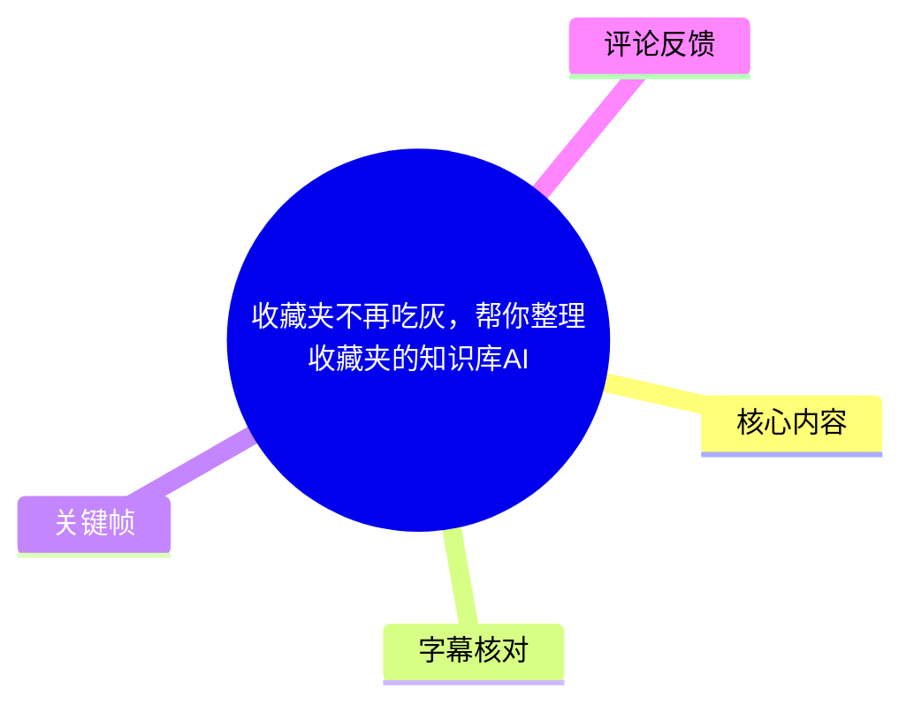
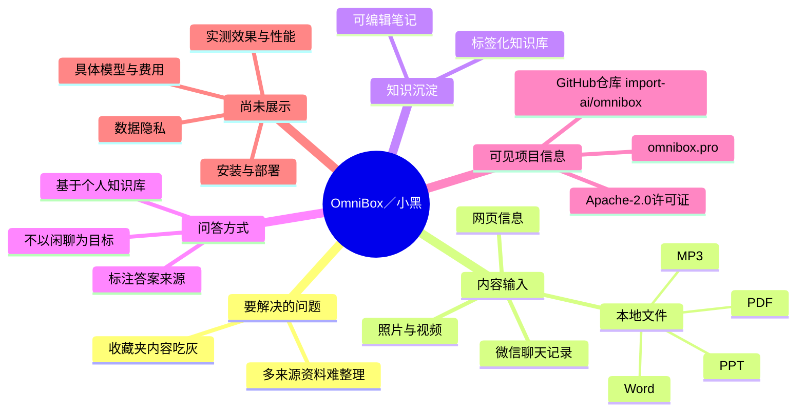
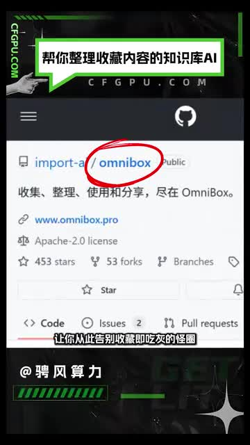
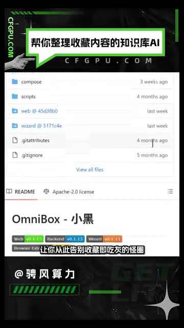
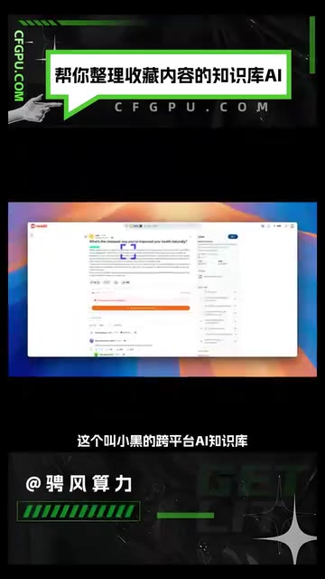
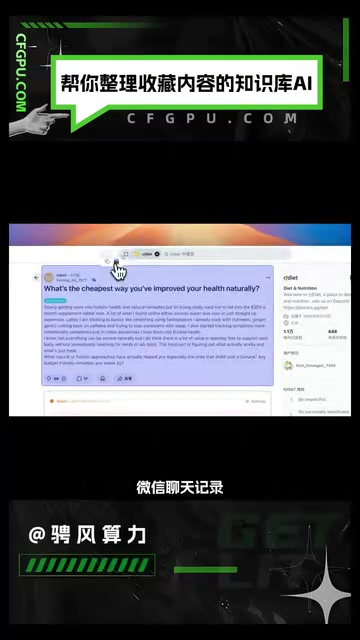

# 收藏夹不再吃灰，帮你整理收藏夹的知识库AI

> 来源：[Bilibili 视频](https://www.bilibili.com/video/BV1pv2VBfEDw) 
> UP 主：骋风算力｜发布时间：2025-12-05｜视频时长：26 秒｜画面规格：1080×1920（竖屏）

## 小结

视频介绍了一个名为 **OmniBox（小黑）** 的开源跨平台 AI 知识库，主张解决“收藏内容不断积累、最终吃灰”的问题。其核心思路不是单纯保存链接，而是把不同来源的内容收集、整理为可编辑笔记，并组织成带标签的知识库。

按视频口述，该工具可接收网页信息、微信聊天记录、照片、视频等内容；还支持上传本地文件，列举的格式包括 **PDF、Word、PPT、MP3**。视频中的 GitHub 画面显示仓库名为 `import-ai/omnibox`，README 标题为“OmniBox - 小黑”，并显示项目网站 `www.omnibox.pro` 与 Apache-2.0 许可证信息。

视频强调的问答机制是“基于个人知识库回答并标注答案来源”，而非泛化闲聊。这意味着它的目标是让用户围绕自己收集、导入的资料进行检索与问答；但视频未展示具体的安装流程、部署环境、模型提供方、数据存储位置、隐私策略、OCR/视频解析细节或实际问答结果，因此这些关键实现条件不能仅凭本视频确认。

适合有大量网页收藏、本地文档、聊天记录或多媒体资料，并希望将其沉淀为可检索个人知识库的用户阅读。视频发布于 2025-12-05，开源仓库的星标数、分支、版本、支持格式和功能边界均可能在之后变化，应以项目当前文档和代码为准。

## 思维导图

## 目录

- [项目定位：让收藏内容进入知识库](#项目定位让收藏内容进入知识库)
- [内容收集与本地文件导入](#内容收集与本地文件导入)
- [知识库问答与来源标注](#知识库问答与来源标注)
- [从视频可提炼的使用步骤](#从视频可提炼的使用步骤)
- [关键参数、限制与时效性](#关键参数限制与时效性)
- [字幕比对](#字幕比对)
- [评论分析](#评论分析)
- [处理记录](#处理记录)

## [项目定位：让收藏内容进入知识库](https://www.bilibili.com/video/BV1pv2VBfEDw?t=0)

视频从“收藏夹吃灰”的常见问题切入，推荐一个开源项目，并将其称为“小黑”。ASR 口述为“这个开源项目让你从此告别收藏及吃灰的怪圈”，表达的重点是：把散落的收藏内容转变为可被后续使用的知识资产。

关键帧中的 GitHub 页面可对项目身份作出画面层面的补充确认：

- 仓库路径显示为 `import-ai / omnibox`；
- 页面 README 标题显示为 **“OmniBox - 小黑”**；
- 页面可见项目简介：“收集、整理、使用和分享，尽在 OmniBox。”；
- 画面中可见项目网站 `www.omnibox.pro`；
- 画面中可见许可证为 **Apache-2.0 license**；
- 截图当时显示 **453 stars、53 forks**，这些是画面录制时的状态，不应视为当前实时数据。

> 图：画面展示 `import-ai/omnibox` 仓库入口、项目网站、许可证及当时的 Star/Fork 数。这一帧用于核实视频所说“小黑”对应的项目名称与开源仓库，而不是用于判断当前仓库热度。

> 图：README 画面直接显示“OmniBox - 小黑”。它为 ASR 中“小黑”这一名称提供了视觉校验，也显示了项目代码目录与版本标识的存在；但视频未讲解这些目录或版本的具体含义。

## [内容收集与本地文件导入](https://www.bilibili.com/video/BV1pv2VBfEDw?t=0)

视频口述将 OmniBox 描述为“跨平台 AI 知识库”，并列出两类信息进入知识库的路径。

### 1. 收集外部与日常内容

视频称可以收集并整理以下内容：

| 内容类型 | 视频口述/画面依据 | 可确认的作用 |
| --- | --- | --- |
| 网页信息 | ASR 口述；画面展示网页内容界面 | 作为可收集资料来源之一 |
| 微信聊天记录 | ASR 口述；关键帧中出现“微信聊天记录”字幕及聊天式页面 | 可被纳入资料整理流程 |
| 照片 | ASR 口述 | 属于可处理内容类型，但未展示照片导入操作 |
| 视频 | ASR 口述 | 属于可处理内容类型，但未展示视频解析结果 |

> 图：画面显示桌面端网页内容界面，并叠加“这个叫小黑的跨平台AI知识库”字幕。其价值在于说明视频确实以实际产品界面而非纯概念页介绍该工具；但截图文字过小，无法据此确认具体按钮、字段或操作流程。

> 图：画面明确标出“微信聊天记录”，并展示一段聊天/内容记录式页面。这一帧可用于校正 ASR 对“微信聊天记录”的识别，但没有展示导入授权、导出格式或隐私处理方式。

### 2. 上传本地文件

视频还称用户可以上传本地文件，并明确列出以下格式：

- PDF
- Word
- PPT
- MP3

这是一份视频明确说出的支持清单，但应注意其边界：

1. 视频未说明 Word、PPT 分别对应 `.doc`、`.docx`、`.ppt` 或 `.pptx` 中的哪些扩展名。
2. 视频未说明单文件大小、总存储空间、上传数量、音频时长或解析速度限制。
3. 视频未展示扫描版 PDF 的 OCR 效果，也未说明图片、视频或 MP3 的转写机制。
4. “支持”在视频语境中可理解为能够上传或纳入整理流程，不能进一步推断为所有文件均可完整提取、索引或准确问答。

### 3. 整理后的产物

按视频描述，内容被收集后会被整理为：

- **可以编辑的笔记**；
- **标签化的知识库**。

这一区别值得保留：可编辑笔记意味着用户理论上可以对整理结果进行人工修订；标签化知识库则意味着资料可能通过标签进行归类或检索。视频没有展示标签创建规则、自动标签准确率、层级目录、重复内容合并或笔记导出能力，因此不能把这些功能补充为既定事实。

## [知识库问答与来源标注](https://www.bilibili.com/video/BV1pv2VBfEDw?t=0)

视频将该产品与一般聊天机器人区分开来，原意为：**“它不会和你闲聊；每次提问都会基于你的知识库给出答案，并标注答案来源。”**

可以将这一机制理解为两个明确主张：

1. **回答范围有资料库约束**：问答应围绕用户已收集或上传进知识库的内容进行。
2. **答案应携带来源标注**：用户能够追溯回答所依据的资料来源，而非只接收无出处的生成文本。

这对于个人知识管理的意义在于：收藏和导入动作不再只产生存档，而是为之后的检索、问答与回溯提供资料基础。尤其当用户需要复查原文、判断 AI 总结是否可靠时，来源标注是重要环节。

不过，视频并未展示一次完整的“提问—生成—查看引用—跳转原文”过程。因此以下问题仍未验证：

- 引用来源是网页链接、文件页码、笔记片段，还是其他粒度；
- 一个答案能否引用多份资料；
- 当知识库没有相关资料时，系统会拒答、提示资料不足，还是给出模型通用回答；
- 来源标注是否足以支持用户快速定位原始段落；
- 回答的准确性、幻觉控制与中文资料兼容性如何。

因此，“基于知识库回答并标注来源”应被记录为视频的产品主张，而不是已通过本素材独立复测的性能结论。

## [从视频可提炼的使用步骤](https://www.bilibili.com/video/BV1pv2VBfEDw?t=0)

视频时长仅 26 秒，未提供可复现的安装教程。以下流程是对其**明确描述的使用链路**进行整理，不补充未出现的命令、账号配置或部署方式。

1. **确定要沉淀的资料范围**  
   从网页信息、微信聊天记录、照片、视频以及本地文件中选择需要长期保存和利用的内容。

2. **将资料收集或上传到 OmniBox**  
   视频明确提到可收集多种内容，并可上传 PDF、Word、PPT、MP3 等本地文件。具体入口、授权方式与文件限制未展示。

3. **将收集结果整理为可编辑笔记**  
   视频主张系统会将内容整理成笔记。对于自动整理后的错误、缺漏或表述不准确，应优先依赖“可编辑”特性进行人工复核和修订；视频未演示具体编辑器。

4. **通过标签建立知识库组织方式**  
   视频称会形成标签化知识库。实际标签由系统自动生成、用户手工添加，还是二者结合，视频未说明。

5. **围绕已入库资料提问**  
   根据视频说法，提问时系统应以个人知识库为依据生成回答，并附带答案来源。实际使用时应检查引用是否真正支持回答内容。

6. **回到原始资料验证关键结论**  
   这一步是根据“标注来源”这一视频主张得出的必要使用建议：对于决策、引用、学习笔记等高准确性场景，不能只看 AI 结论，还应核验其标注的原始材料。该建议属于 Agent 的审慎实践建议，不是视频展示的功能步骤。

## [关键参数、限制与时效性](https://www.bilibili.com/video/BV1pv2VBfEDw?t=0)

### 视频中明确出现的参数与信息

| 项目 | 内容 | 依据与说明 |
| --- | --- | --- |
| 视频时长 | 26 秒 | 元数据；ASR 有效语音覆盖至 25.14 秒 |
| 视频画面 | 1080×1920 竖屏 | 元数据 |
| 项目名称 | OmniBox／小黑 | ASR 与 README 关键帧相互印证 |
| 仓库标识 | `import-ai/omnibox` | GitHub 关键帧 |
| 项目网站 | `www.omnibox.pro` | GitHub 关键帧 |
| 开源许可证 | Apache-2.0 license | GitHub 关键帧 |
| 支持内容来源 | 网页、微信聊天记录、照片、视频 | 视频口述 |
| 明确列举的本地文件格式 | PDF、Word、PPT、MP3 | 视频口述 |
| 知识组织形式 | 可编辑笔记、标签化知识库 | 视频口述 |
| 问答特点 | 基于知识库回答、标注答案来源 | 视频口述 |
| 截图中的仓库热度 | 453 stars、53 forks | 仅为录屏画面当时数值，不代表当前状态 |

### 重要限制

- **没有安装与部署说明**：无法从本视频确认是否支持本地部署、云端服务、Docker、浏览器扩展或移动端安装。
- **没有隐私与权限说明**：视频提到微信记录、照片、视频等潜在敏感资料，但未交代数据传输、加密、保留周期、第三方模型调用或删除机制。
- **没有性能指标**：未提供最大文件体积、索引耗时、并发、成本、准确率、硬件需求或语言范围。
- **没有功能实测闭环**：画面展示了项目与界面，但没有完整演示文件导入、标签生成、提问、引用查看和错误纠正。
- **项目状态会变化**：视频发布日为 2025-12-05；GitHub 截图里的 Stars、Forks、分支、目录和版本均是录制时信息。使用前需查看项目当前仓库、发布说明和隐私政策。

## [字幕比对](https://www.bilibili.com/video/BV1pv2VBfEDw?t=0)

| 字幕来源 | 完整性 | 专有名词 | 时间轴 | 主要问题 |
| --- | --- | --- | --- | --- |
| Bilibili 站内字幕 | 未提供可用字幕，无法比对正文 | 无法核验 | 无可用时间段 | 素材明确标注“未提供可用站内字幕” |
| 本次 ASR 字幕 | 覆盖较完整：1 个片段覆盖 00:00:00,000—00:00:25,140 | 存在同音/识别错误，需结合画面校正 | 有真实 SRT 时间段；但整段仅 1 个片段，无法细分功能出现时点 | “收藏及吃灰”“一件收藉”“知诲库”“知词库”“答点”等表述不够准确 |

本次 ASR 使用 `medium` 模型，识别语言为中文，语言置信度为 `0.994140625`；诊断显示有效语音约 `25.14` 秒，语音覆盖率 `0.9988`，没有检测到大间隔。诊断中**未标记** `noAudioStream=true`，且素材提供了音频文件，因此本视频属于有音轨且已完成 ASR 的情况，并非无音轨素材。

最终以**本次 ASR 为时间轴基础**，并使用关键帧校正部分明显误识别的词语：

| ASR 原文片段 | 本文采用的表达 | 校正依据 |
| --- | --- | --- |
| “这个叫小黑的跨平台AI知识库” | “OmniBox（小黑）的跨平台 AI 知识库” | README 关键帧显示“OmniBox - 小黑” |
| “一件收藉” | “一键收集” | 结合上下文，属于明显语音识别错字；未将其扩展为具体操作按钮 |
| “知诲库”“知词库” | “知识库” | 上下文语义一致，且与视频标题、标签、项目定位一致 |
| “标注出答点的来源” | “标注答案来源” | 语义校正；视频强调回答附来源 |
| “收藏及吃灰” | “收藏夹吃灰” | 视频标题与首帧主视觉中的“让你从此告别收藏即吃灰的怪圈”共同支持其表达主题 |

由于唯一的 SRT 分段从 0 秒持续到 25.14 秒，本文所有内容章节均链接至 `t=0`，而没有按照文字先后猜测精确秒点。视频总时长为 26 秒，ASR 结束点与总时长之间约有 0.86 秒差异，可能是片尾或无语音画面。

## [评论分析](https://www.bilibili.com/video/BV1pv2VBfEDw?t=0)

本次素材中可获取的热评列表为空：`items: []`，且视频元数据中的评论数为 `0`。因此没有可分析的热评，也不存在可处理的“热评前三条”。

评论缺失不影响对视频口述与画面的整理，但也意味着没有来自用户侧的部署经验、使用反馈、兼容性问题或争议信息可供交叉参考。

## [处理记录](https://www.bilibili.com/video/BV1pv2VBfEDw?t=0)

- **Worker ID**：`worker-mrplns82-755ed24d`
- **生成模型**：`gpt-5.6-terra`
- **ASR 模型**：`medium`，CUDA / `float16`，自动识别为中文。
- **使用的素材与工具产物**：视频元数据、音频 `audio/audio.wav`、ASR 结果 `asr/asr-result.json`、时间轴字幕 `asr/transcript.srt`、关键帧目录 `frames/`、评论结果 `comments/comments.json`。
- **字幕选择**：站内字幕未提供可用内容；已检查本次 ASR，并以其唯一的真实 SRT 分段 `00:00:00,000 --> 00:00:25,140` 作为时间轴依据。正文通过关键帧对“小黑／OmniBox”“知识库”“答案来源”等词进行有限校正。
- **关键帧选择依据**：选用 `frame-001.jpg` 核验仓库、网站、许可证与录制时热度；选用 `frame-002.jpg` 核验“OmniBox - 小黑”名称；选用 `frame-003.jpg` 展示产品网页界面；选用 `frame-004.jpg` 核验“微信聊天记录”作为视频明确提及的资料来源。未对未提供画面内容作推断。
- **评论处理**：已检查可获取热评前三条；结果为空，未虚构评论观点。
- **缓存清理**：提供的素材清单未包含缓存清理执行记录或结果，故无法确认是否完成清理，未作完成性声明。
- **未解决问题**：项目当前版本、安装入口、部署方式、数据隐私、模型与费用、文件大小限制、引用粒度及实际效果均未在本视频中展示，需以项目当前官方资料或实测为准。

## 评论分析

本次流程未获取到可用热评，因此不推断观众态度或额外结论。
