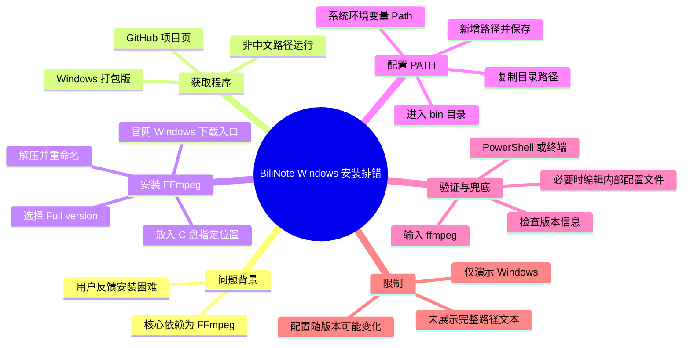
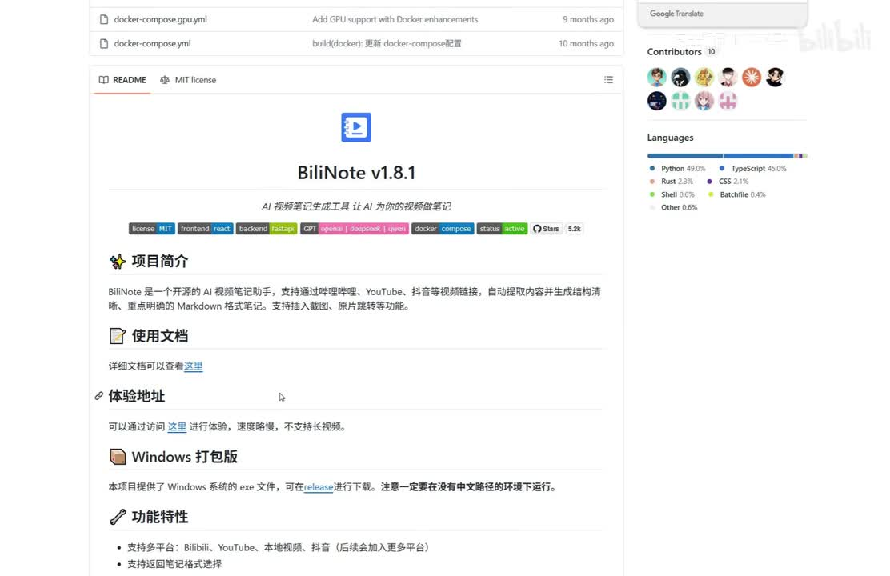
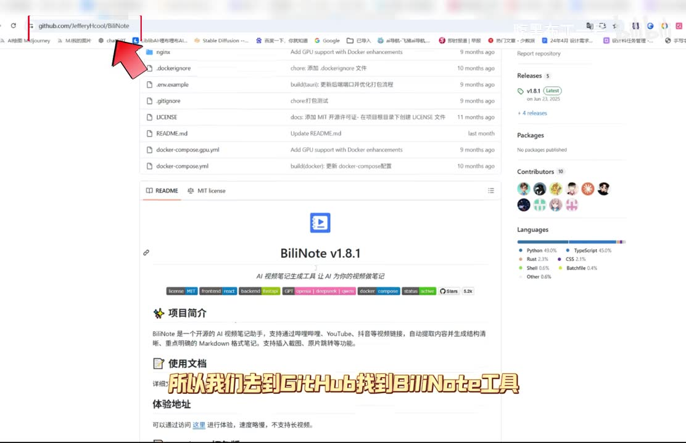
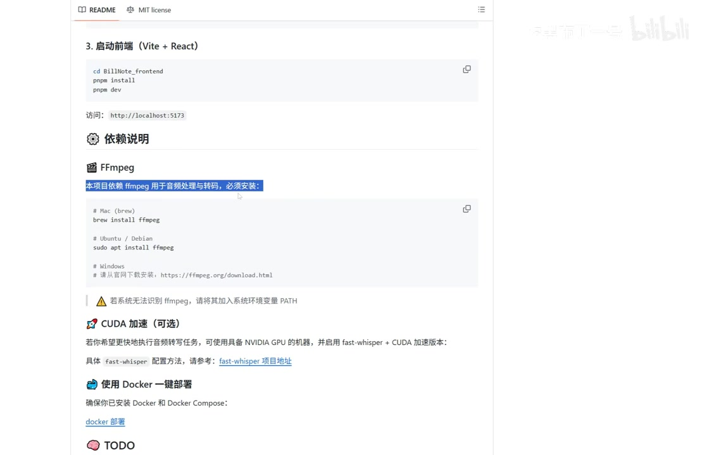
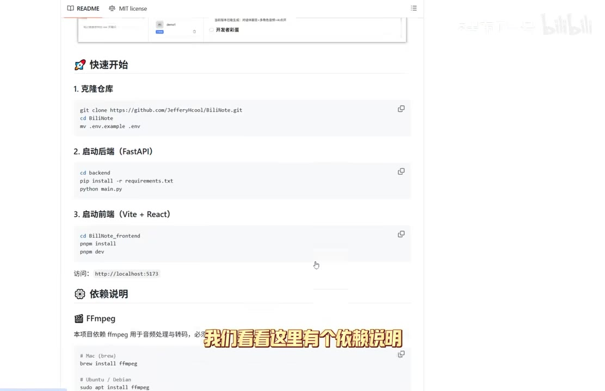

# AI自动看视频写总结，视频笔记神器bilinote安装技巧

> 来源：[Bilibili 视频](https://www.bilibili.com/video/BV1YnDMBBEPg)<br>
> UP 主：腹黑布丁一号｜发布时间：2026-04-04 07:17:30｜视频时长：1 分 41 秒｜分辨率：1670×1080

## 小结

本视频是一个面向 Windows 用户的 BiliNote 安装排错短教程。UP 主针对“BiliNote 难以安装”的留言，聚焦该工具运行所依赖的 **FFmpeg**：先安装 FFmpeg、将其加入系统 `PATH`，再通过终端输出版本信息验证配置是否生效。

视频给出的主线是：从 BiliNote 的 GitHub 项目页面获取 Windows 打包版，并特别要求程序放在**不含中文字符的路径**中运行；随后按项目文档的依赖说明安装 FFmpeg。画面中的 README 明确写有“本项目依赖 ffmpeg 用于音频处理与转码，必须安装”。

Windows 下的 FFmpeg 安装步骤包括：从官网进入 Windows 下载入口、选择第一个链接中的 **Full version** 压缩包、解压后将文件夹重命名为 `ffmpeg`（此处由画面与上下文校正）、复制到视频所示的 C 盘位置，并把其 `bin` 目录加入系统环境变量 `Path`。

验证环节是在任意文件夹打开 PowerShell 或终端，输入 `ffmpeg`。若终端回显 FFmpeg 的版本信息，说明命令行路径配置成功。若仍不能被 BiliNote 正确识别，视频还给出第二层处理方式：使用记事本编辑 BiliNote 内部的环境配置文件，将 FFmpeg 地址填写进去。

适合对象是希望在本机使用 BiliNote、但遇到“找不到 FFmpeg”或无法启动相关功能的 Windows 用户。视频没有演示 BiliNote 的完整安装、模型/API 配置、视频总结效果，也没有说明价格、账号权限或各平台支持细节；热评中关于是否收费的提问未获视频或评论材料证实。

这是一份与软件版本、项目目录结构和 FFmpeg 下载镜像相关的时效性教程。视频发布于 2026 年 4 月，后续 BiliNote 的文件结构、配置项名称和 GitHub Release 内容都可能改变；操作时应以当前项目 README 和发行说明为准。

## 思维导图




## 目录

- [背景、适用范围与前置限制](#背景适用范围与前置限制)
- [获取 BiliNote Windows 打包版](#获取-bilinote-windows-打包版)
- [识别 FFmpeg 依赖与下载 Full version](#识别-ffmpeg-依赖与下载-full-version)
- [配置系统 PATH 并验证安装](#配置系统-path-并验证安装)
- [FFmpeg 已安装但仍无法识别时的处理](#ffmpeg-已安装但仍无法识别时的处理)
- [完整操作清单与参数](#完整操作清单与参数)
- [结论、限制与时效性](#结论限制与时效性)
- [字幕比对与术语校正](#字幕比对与术语校正)
- [评论分析](#评论分析)
- [处理记录](#处理记录)

## 背景、适用范围与前置限制 [00:00](https://www.bilibili.com/video/BV1YnDMBBEPg?t=0)

视频开头说明，UP 主看到留言认为 BiliNote “很难安装”，因此录制此演示。教程实际处理的重点并不是 BiliNote 全流程部署，而是解决其音频处理、转码依赖 **FFmpeg** 的安装与识别问题。

从 GitHub README 的画面可见，BiliNote 被描述为 AI 视频笔记生成工具，页面展示了项目版本 `BiliNote v1.8.1`、Windows 打包版说明及依赖文档。该页面内容仅反映视频录制时所见状态，不应视为当前版本仍完全一致。



> 图：关键帧展示 BiliNote 的 GitHub README、`BiliNote v1.8.1` 标题和“Windows 打包版”区域。它用于确认视频讲解的对象是 BiliNote 项目页面，而非泛泛的 AI 视频总结产品。

### 视频明确的前置条件

1. **操作系统范围**：视频实际演示 Windows 下载、Windows 环境变量与 PowerShell；没有展示 macOS、Linux 的完整操作。
2. **安装路径限制**：BiliNote Windows 打包版应在**没有中文路径**的环境运行。这是 UP 主明确提醒的条件。
3. **关键依赖**：FFmpeg 是 BiliNote 进行音频处理与转码所需的依赖；缺失时可能出现错误提示或功能不可用。
4. **管理员权限未说明**：视频没有说明是否需要管理员权限。若系统不允许写入目标目录或修改系统环境变量，应按本机权限策略处理，不能据此断言视频方案必然可直接执行。

## 获取 BiliNote Windows 打包版 [00:07](https://www.bilibili.com/video/BV1YnDMBBEPg?t=7)

UP 主先进入 GitHub 上的 BiliNote 项目，并指出页面提供 **Windows 打包版**。在 ASR 对应的 00:14–00:18 片段中，明确强调下载后应避开含中文字符的文件路径。



> 图：关键帧用红色箭头标出浏览器地址栏中的 GitHub 项目地址，并显示项目 README。这有助于将“去 GitHub 找工具”的口述落实为项目页面操作，而不是其他软件下载站。

### 此阶段应完成的事

- 找到 BiliNote 的官方 GitHub 项目页或其当前 Release 页面。
- 选择适用于 Windows 的打包版本。
- 解压或放置程序时，避免使用带中文字符的目录层级。
- 阅读 README 中的依赖说明，再继续配置 FFmpeg。

视频没有展示 Windows 打包版的具体压缩包文件名、下载版本号、解压步骤或启动文件名；这些信息不能从现有素材补全。

## 识别 FFmpeg 依赖与下载 Full version [00:18](https://www.bilibili.com/video/BV1YnDMBBEPg?t=18)

README 的“依赖说明”区域写明：项目依赖 FFmpeg 进行音频处理与转码，**必须安装**。UP 主在安装主程序前先处理 FFmpeg，并表示若不安装，将会弹出错误提示；素材未保留该错误提示的完整文本，因此不能确定具体报错内容。



> 图：关键帧高亮了“本项目依赖 ffmpeg 用于音频处理与转码，必须安装”，并列出 Windows 下载地址与“无法识别 ffmpeg 时加入系统环境变量 PATH”的提示。这是视频方案的核心证据。

### 下载与解压流程 [00:28](https://www.bilibili.com/video/BV1YnDMBBEPg?t=28)

根据视频讲述，Windows 下的流程如下：

1. 复制 README 提供的 FFmpeg 下载网址，进入官网。
2. 点击或选择 **Windows** 系统图标。
3. 在下载页面选择**第一个链接**。
4. 选择 **Full version**。
5. 下载压缩包后解压。

其中“第一个链接”是视频录制时页面的选择顺序，并不是跨版本可靠的永久规则。下载站页面、镜像排序和包名可能已发生变化；更可靠的判断是确认下载内容确为 Windows 可用的 FFmpeg 完整构建版本。

### 文件夹命名与放置 [00:38](https://www.bilibili.com/video/BV1YnDMBBEPg?t=38)

解压后，UP 主将文件夹重命名为 `ffmpeg`，再复制至视频演示的 C 盘位置。随后进入该文件夹的 `bin` 目录并复制目录路径。

> **注意：**视频画面与口述确认了“重命名”“复制到 C 盘指定位置”“进入 `bin` 目录”这些动作，但现有可读素材未提供完整目标路径字符串。为避免编造，本文不把目标路径写成某个确定的 `C:\...` 地址。实际使用时，应以你保存 FFmpeg 文件夹的位置为准，后续加入 `Path` 的必须是其 `bin` 目录。

## 配置系统 PATH 并验证安装 [00:49](https://www.bilibili.com/video/BV1YnDMBBEPg?t=49)

在 FFmpeg 文件夹放置完成后，视频开始配置 Windows 环境变量。其目的，是让系统在任意工作目录中都能找到 `ffmpeg` 命令，而非仅在 FFmpeg 所在目录可以运行。

### 设置环境变量的操作顺序

1. 进入 FFmpeg 文件夹中的 `bin` 目录，复制该目录的完整路径。
2. 右键“此电脑”。
3. 进入“属性”。
4. 打开“高级系统设置”。
5. 进入“环境变量”。
6. 在系统变量列表中找到 `Path`，点击“编辑”。
7. 点击“新建”，粘贴刚才复制的 `bin` 目录路径。
8. 连续点击“确定”保存设置。

视频在 00:58–01:05 的 ASR 中将 `Path` 误识别为“Puzz”等文字，但结合 Windows 环境变量界面和下一步“新建路径”的操作，可校正为 `Path`。

### 在终端验证 [01:08](https://www.bilibili.com/video/BV1YnDMBBEPg?t=68)

视频建议在任意文件夹空白处按住 **Shift** 并右键，选择“在此处打开 PowerShell 窗口”或“在终端中打开”。不同 Windows 版本的右键菜单名称可能不同，Windows 11 也可能需要先点“显示更多选项”。

在打开的终端中输入：

```powershell
ffmpeg
```

预期结果：终端输出 FFmpeg 的版本信息。UP 主以此作为 FFmpeg 安装和 `PATH` 配置成功的判断标准。



> 图：关键帧同时展示项目的“依赖说明”、FFmpeg 标题、Windows 下载提示及“若系统无法识别 ffmpeg，请将其加入系统环境变量 PATH”的文字。它解释了为什么后续不是只下载文件，而必须修改环境变量。

### 验证失败时先检查什么

视频明确展示的判断链条是“执行 `ffmpeg` → 是否出现版本信息”。如果没有出现，优先复查：

- 加入 `Path` 的是否是 FFmpeg 的 **`bin` 目录**，而非上层解压目录；
- 环境变量窗口是否已通过“确定”保存；
- 打开的终端是否在保存环境变量后重新启动；
- 实际文件夹位置是否与加入 `Path` 的路径一致。

前两项由视频步骤直接支持；后两项属于依据 Windows 环境变量生效机制给出的常规排查建议，并非视频逐字说明。

## FFmpeg 已安装但仍无法识别时的处理 [01:23](https://www.bilibili.com/video/BV1YnDMBBEPg?t=83)

UP 主补充：如果仍然没有正确配置，还需要在“原文件”中填写 FFmpeg 地址。随后演示进入 BiliNote 的内部目录，找到一个环境配置文件，以记事本打开并修改配置内容。

ASR 将目录和文件名识别为 “BillionNote Internal” 与 “End”，但这两个词明显受语音识别影响。结合关键帧中的项目快速启动命令：

```bash
mv .env.example .env
```

以及“用记事本打开、填地址”的上下文，视频所说文件更可能是 **`.env` 环境配置文件**；内部目录名称则无法仅凭现有文本可靠还原。因此，以下保留可确定的操作逻辑，不虚构目录名或配置键名。

### 兜底配置的可靠做法

1. 在 BiliNote 安装目录中寻找视频所指的环境配置文件，优先核对项目 README、`.env.example` 及当前版本安装说明。
2. 用记事本或其他纯文本编辑器打开该配置文件。
3. 按当前项目提供的配置键，将 FFmpeg 的实际地址填入对应位置。
4. 保存后重新启动 BiliNote，再检查是否已能识别 FFmpeg。

视频未清晰给出：
- 配置项的**确切键名**；
- FFmpeg 路径是否应填写可执行文件完整路径或 `bin` 目录路径；
- 是否需要使用正斜杠、双反斜杠或引号；
- 修改后是否需要重启电脑。

因此，不能将视频末尾模糊画面扩写为可直接复制的确定配置代码。应以当前 BiliNote 版本的 `.env.example`、README 或报错提示为准。

## 完整操作清单与参数 [00:07](https://www.bilibili.com/video/BV1YnDMBBEPg?t=7)

### 最短执行路径

| 阶段 | 视频操作 | 关键结果/检查点 |
| --- | --- | --- |
| 获取 BiliNote | GitHub 下载 Windows 打包版 | 程序所在目录不含中文字符 |
| 阅读依赖 | 查看 README 的 FFmpeg 依赖说明 | 确认 FFmpeg 为必装依赖 |
| 下载 FFmpeg | 官网 → Windows → 第一个链接 → Full version | 获得完整构建压缩包 |
| 整理文件 | 解压、重命名为 `ffmpeg`、复制到 C 盘演示位置 | 可定位到其中的 `bin` 目录 |
| 配置路径 | 将 `bin` 目录加入系统变量 `Path` | 环境变量保存成功 |
| 命令验证 | PowerShell/终端输入 `ffmpeg` | 输出版本信息 |
| 兜底配置 | 编辑 BiliNote 环境配置文件 | 填写 FFmpeg 地址后重启应用验证 |

### 视频中出现的关键名称与参数

| 项目 | 视频内容 | 说明 |
| --- | --- | --- |
| 主工具 | BiliNote | AI 视频笔记生成工具；画面显示版本 `v1.8.1` |
| 系统 | Windows | 视频仅演示 Windows 下载和环境变量设置 |
| 必装依赖 | FFmpeg | 用于音频处理与转码 |
| 下载构建 | `Full version` | 视频要求选择的完整版本 |
| 文件夹名 | `ffmpeg` | 解压后按视频重命名 |
| 环境变量 | `Path` | 需添加 FFmpeg 的 `bin` 目录 |
| 验证命令 | `ffmpeg` | 回显版本信息即命令行配置成功 |
| 备用方式 | 编辑环境配置文件 | 用于 BiliNote 仍找不到 FFmpeg 的场景 |

## 结论、限制与时效性 [01:23](https://www.bilibili.com/video/BV1YnDMBBEPg?t=83)

视频的可迁移经验是：当桌面应用依赖外部命令行工具时，仅下载依赖程序通常不够；还需要让系统或应用知道可执行文件的位置。这里分别对应两条路径：

- **系统层面**：将 FFmpeg 的 `bin` 目录加入 Windows `Path`，使终端能够执行 `ffmpeg`。
- **应用层面**：若应用仍无法自动发现 FFmpeg，则在其环境配置中显式填写 FFmpeg 地址。

但应注意以下限制：

1. **仅覆盖依赖排错**：视频没有完整演示 BiliNote 从下载、安装到生成视频笔记的所有环节。
2. **路径信息不完整**：视频提到复制到 C 盘某位置，但现有素材无法可靠读取完整目录，不能照抄为固定路径。
3. **配置字段不完整**：末尾修改的环境配置键和值未被清晰保留，需查当前版本文档。
4. **版本会变化**：GitHub Release、FFmpeg 下载镜像、Windows 右键菜单以及 BiliNote 的配置结构都可能与录制时不同。
5. **未回答付费问题**：视频和可获取热评没有提供 BiliNote 是否收费的确认答案。
6. **未覆盖安全校验**：视频未说明如何验证下载文件来源、校验哈希或处理安全软件告警。实际下载安装应优先使用项目 README 指向的官方来源。

## 字幕比对与术语校正 [00:00](https://www.bilibili.com/video/BV1YnDMBBEPg?t=0)

站内未提供可用字幕；本次任务仍检查了 ASR 结果。ASR 诊断显示：识别语言为中文，语言概率 `0.99853515625`，共 27 段，覆盖时长约 81.54 秒，占视频时长约 `81.21%`；起始语音在 00:00，最后语音至 01:40.19，且未报告大间隔警告。

诊断中**没有** `noAudioStream=true` 标记，且素材已生成 `audio/audio.wav` 与带时间轴的 ASR 结果，因此该视频不是“无音轨”情形。

| 字幕来源 | 完整性 | 专有名词 | 时间轴 | 主要问题 |
| --- | --- | --- | --- | --- |
| Bilibili 站内字幕 | 未提供可用字幕 | 无法评估 | 无法使用 | 本任务素材中没有可用站内字幕文件 |
| 本次 ASR 字幕 | 较高，27 段覆盖主要讲解 | 存在多处误识别 | 可用，提供真实 SRT 起止时间 | 工具名、目录名和 `Path` 等术语识别错误 |

### 最终字幕选择

正文以**本次 ASR 的 SRT 时间轴**作为章节链接依据，并以关键帧中的 GitHub README 文本、Windows 操作上下文进行术语校正。所有章节时间均取自 ASR 真实分段的起始秒数，没有按照文字顺序估算时间。

### 重要术语校正

| ASR 原文/近似识别 | 校正结果 | 校正依据 |
| --- | --- | --- |
| 白绿Note、白维诺、BillionNote | BiliNote | 视频标题、GitHub 页面标题 `BiliNote v1.8.1` |
| FanPad、FFMPad、Fanpad | FFmpeg | README 的依赖标题与正文明确写有 `ffmpeg` |
| Puzz | `Path` | Windows 环境变量操作上下文 |
| 是非键 | Shift 键 | 视频讲述“按住……并右键”以打开 PowerShell 的标准 Windows 操作 |
| End | `.env`（高概率校正） | 关键帧快速启动命令出现 `.env.example` 与 `.env`；但未将其视为绝对可证实的文件名 |
| Internal | 未作确定还原 | 现有画面与 ASR 均不足以可靠确认内部目录名 |

## 评论分析 [00:00](https://www.bilibili.com/video/BV1YnDMBBEPg?t=0)

仅分析本次可获取的热评前三条，不将评论内容当作已验证事实。

1. **和散宝一起凿翻提瓦特（2 赞）：“您好，需要付费吗”**  
   - 反映潜在使用者关心成本或订阅门槛。  
   - 这是一项提问，不提供付费与否的事实信息。视频正文、简介和其余可获取评论均未给出回答，因此不能据此判断 BiliNote 是否收费。

2. **老街深巷的猫浪够了（1 赞）：“@MilkyAi 帮我总结并发到我的邮箱”**  
   - 该评论表达了用户对“自动总结并发送邮件”的工作流期待。  
   - 它不是对 BiliNote 已支持邮箱发送功能的证明；视频也没有演示邮件发送或自动化投递能力。

3. **杰西11111（1 赞）：“优秀啊”**  
   - 这是对教程的正向评价。  
   - 未补充具体安装成功经验、错误信息或可复现条件，信息价值主要是反馈认可度，不能用于验证教程在不同系统上的成功率。

## 处理记录 [00:00](https://www.bilibili.com/video/BV1YnDMBBEPg?t=0)

- **Worker ID**：`worker-mrph3525-f07287b1`
- **模型**：`gpt-5.6-terra`
- **调用工具与素材**：视频元数据读取、媒体音频提取（`audio/audio.wav`）、关键帧提取（`frames/`）、ASR 转写与 SRT 时间轴生成（`asr/transcript.srt`、`asr/asr-result.json`）、热评抓取（`comments/comments.json`）。
- **ASR 设置**：`medium` 模型、CUDA、`float16`、自动语言识别；识别结果为中文。
- **字幕选择**：站内字幕未提供可用内容；采用本次 ASR 的真实 SRT 时间轴，并通过关键帧文本校正 `BiliNote`、`FFmpeg`、`Path` 等误识别术语。ASR 诊断未标记 `noAudioStream=true`。
- **关键帧选择依据**：选择 `frame-001`、`frame-002`、`frame-003`、`frame-004`，因为其分别可验证 BiliNote 项目页、GitHub 地址定位、README 依赖段落、FFmpeg 必装与 `PATH` 提示；图片用于术语校正与支撑操作逻辑。
- **缓存清理**：素材清单未提供缓存清理执行结果或日志；本文不虚构“已清理”结论。已保留相对路径关键帧引用以保证笔记可追溯。
- **未解决问题**：无法从现有素材可靠确认 FFmpeg 的完整 C 盘目标路径、BiliNote 内部目录名、环境配置键名及最终填写格式；未获得 BiliNote 是否收费的有效答复。

## 评论分析

- 热评 1：您好，需要付费吗
- 热评 2：@MilkyAi 帮我总结并发到我的邮箱
- 热评 3：优秀啊

以上内容是观众反馈摘录，只用于补充理解视频反响，不作为正文事实依据。
