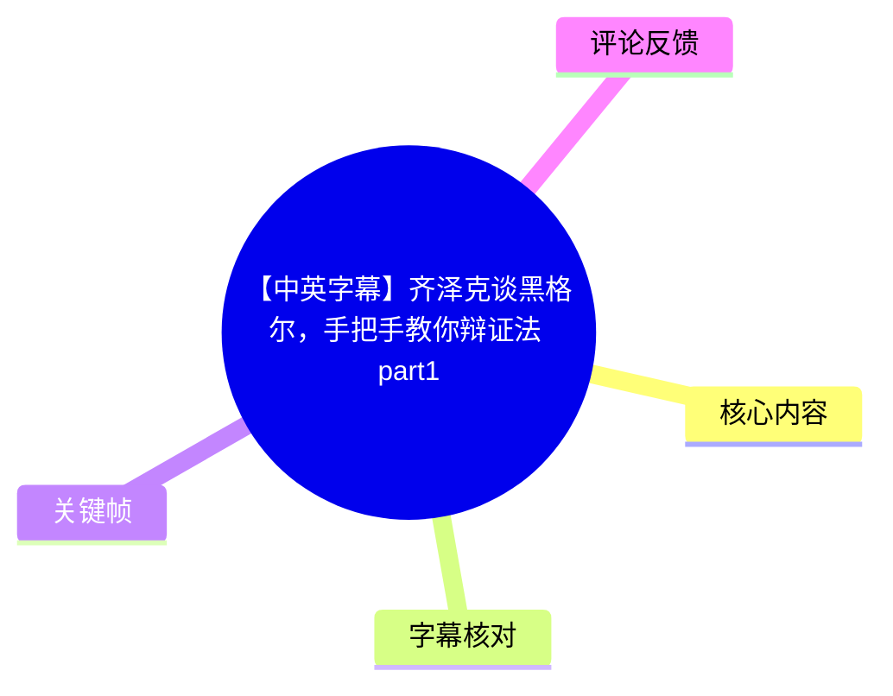
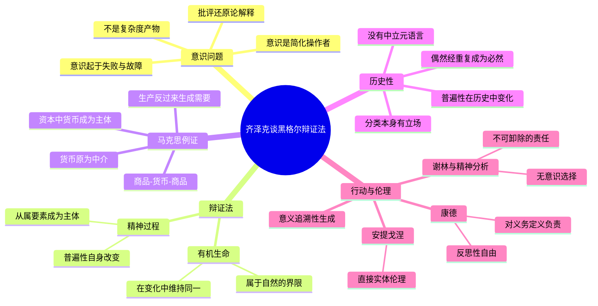
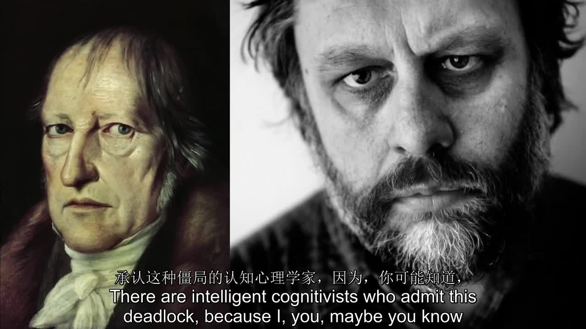
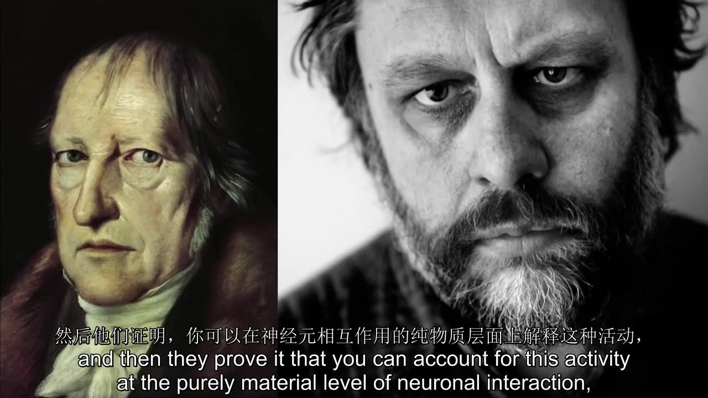
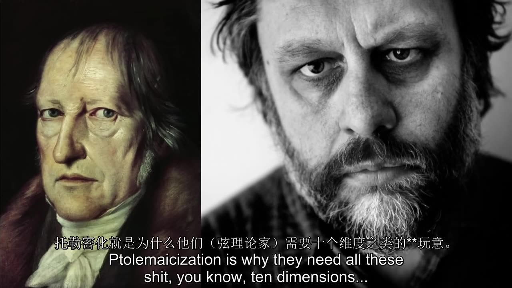
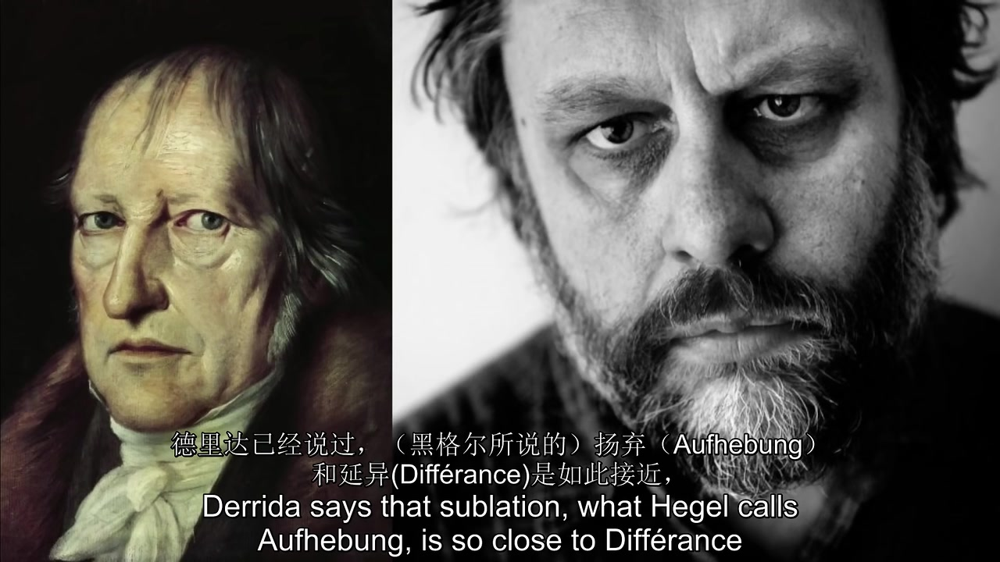

# 【中英字幕】齐泽克谈黑格尔，手把手教你辩证法 part1

> 来源：[Bilibili 视频](https://www.bilibili.com/video/BV1qY411c7K4)<br>
> UP 主：拉黑字幕组｜发布时间：2022-05-09｜时长：01:00:12｜分 P：齐黑1  
> 原始说明中附有 YouTube 来源链接；本视频为齐泽克讲授黑格尔相关内容的片段，含中英双语画面字幕。

## 小结

这是一段以讲座口语形式展开的黑格尔导读。齐泽克并未把辩证法讲成“事物在变化中保持同一”的普通发展观，而是强调真正的黑格尔辩证法发生在**普遍性／总体性本身改变**之时：原本只是从属中介的要素，会在过程里变成组织整体的主体。

视频前约 17 分钟先从意识问题切入。齐泽克反对把意识理解为复杂度达到某个阈值后的附带产物；他提出两个带有理论立场的“教条”：意识是简化的操作者，且意识在其零度上是对“故障、失败、不能运作”的意识。这不是神经科学结论，而是他用以对抗还原论解释的哲学构想。

讲座的主轴从 [16:52](https://www.bilibili.com/video/BV1qY411c7K4?t=1012) 开始：有机生命可以在变化中维持自身，但这只是自然过程的界限；精神性的辩证过程则让“同一者”或普遍原则失去原有身份。齐泽克以马克思的商品—货币—资本关系说明：货币原先只是交换媒介，进入资本过程后却转为整个过程的主体。

在历史与政治问题上，视频把“没有中立元语言”作为关键方法论。无论给哲学流派分类，还是描述左右政治，分类者都已处在某一哲学或政治立场内部；因此，历史不是一个固定普遍概念逐步实现自身，而是普遍性概念本身被斗争、偶然行动和重复不断重构。

最后一段以《安提戈涅》、爱情、谢林与康德讨论行动意义、自由和责任。齐泽克的解释是：行动的意义不是先被主体内在意图完全规定，而是在行动后才追溯性地显现；偶然事件经由重复可以被确立为必然性。安提戈涅代表直接的实体伦理，康德则代表现代反思性自由——人不仅要履行义务，也必须为“何为自己的义务”负责，不能以“这只是职责”卸责。

适合已有黑格尔、马克思、康德、精神分析或当代欧陆哲学阅读兴趣的观众。需要注意：这是齐泽克带有鲜明个人诠释的课堂讲述，不是对黑格尔原典、意识科学、弦论或洛克比事件的中立综述；其中科学与时事性插话需要独立核查，尤其不应直接当作已证实事实。

## 思维导图





## 目录

- [讲座背景、材料范围与阅读方式](#讲座背景材料范围与阅读方式)
- [意识：简化、故障与还原论难题](#意识简化故障与还原论难题)
- [从有机生命到辩证过程](#从有机生命到辩证过程)
- [货币、资本与“从属者成为主体”](#货币资本与从属者成为主体)
- [历史性：没有中立分类与元语言](#历史性没有中立分类与元语言)
- [偶然、重复与行动意义的追溯性](#偶然重复与行动意义的追溯性)
- [安提戈涅、爱情与现代自由](#安提戈涅爱情与现代自由)
- [方法、学习步骤与适用边界](#方法学习步骤与适用边界)
- [结论与限制](#结论与限制)
- [字幕比对](#字幕比对)
- [评论分析](#评论分析)
- [处理记录](#处理记录)

## 讲座背景、材料范围与阅读方式 [00:00:31](https://www.bilibili.com/video/BV1qY411c7K4?t=31)

视频开头可识别到一句政治性玩笑式口号：“Long live comrade Stalin, no freedom for the enemies of freedom.”其后讲座进入此前关于“事件”与忠诚的问题，但这部分没有展开成完整主题。齐泽克随即表示，理论在被迫面对不一致、摇摆与死结时才真正有趣；一个“运行得过于平滑”的理论反而不值得讨论。

这为全片的讲法定下基调：

1. **不把矛盾当作应立即消除的缺陷**：理论的死结可以是需要解释的对象。
2. **用跨学科类比推进黑格尔阅读**：讲座涉及认知科学、神经科学、物理学、马克思政治经济学、哲学史、悲剧、精神分析与伦理学。
3. **用简化公式替代术语炫耀**：齐泽克明确说，面对拉康和黑格尔这类常被视为难读的理论家，若不能清楚说明，就不应以晦涩自居。
4. **讲者立场强烈且口语化**：大量玩笑、插话、人物评价与挑衅性措辞属于讲座现场表达；整理时应区分它们与论证核心。



> 图：画面将黑格尔肖像与齐泽克肖像并置，是视频稳定使用的视觉结构；它直观提示本片不是黑格尔原典朗读，而是以齐泽克的解释为中心的导读。

## 意识：简化、故障与还原论难题 [01:21:37](https://www.bilibili.com/video/BV1qY411c7K4?t=97)

### 1. 意识不是“复杂度阈值”的产物

齐泽克讨论认知主义与意识的“难问题”时，先认可大卫·查尔默斯提出的一个反问：即使复杂意识活动能够在某种意义上还原为神经元过程，仍然要问——**为什么还需要意识？为什么系统不能像盲目的复杂机器那样运作？**

他反对一种常见答案：系统在任务足够复杂时，就需要意识或一个中央机构来维持秩序。齐泽克的立场是，意识并非复杂性的升级，反而是“简化的操作者”（operator of simplification）。

其含义不是说现实本身简单，而是说：

- 现实和无意识层面的过程可以极其复杂；
- 意识活动的关键不在于复制全部复杂性；
- 意识通过抓取、隔离一个决定性特征，使复杂情形可以被处理；
- 他以巴迪欧所谓的“点”（*le point*）说明：复杂情境在某一点上需要作出“是／否”的决断，这是一种强力简化。

齐泽克借此调侃一种只会不断补充“事情其实更复杂”的理论姿态：承认复杂本身并不等于完成思考；思考还要能指出“问题真正关乎什么”。

### 2. “意识起于失败”的类比

齐泽克提出第二个“教条”：意识在零度层面上可能首先是对失败的意识。他的日常例子是写字：

- 当写字已成为自动化的神经—身体习惯时，人并不特别意识到自己在写；
- 当动作出错、笔不出墨、手部无法顺利动作时，人忽然注意到原本透明运行的过程；
- 因而，人注意到事物，往往是在它们**不再正常运作**的时候。

他把这个例子推广为哲学猜想：意识本身是否在根源上与某种终极失败、不能运作或断裂相连？他提及海德格尔式的“死亡”或非功能状态，作为可能的关联方向，但未在本片中展开严密论证。



> 图：关键帧的双语字幕直接呈现“可在神经元相互作用的纯物质层面解释活动”的还原论命题，有助于定位齐泽克提出“为何仍需要意识”的问题。

### 3. 与查尔默斯、丹尼特及“第五种力”说法的距离

齐泽克对查尔默斯的态度是部分赞同、部分反对：

- 他赞同查尔默斯不把意识问题简单归结为复杂度；
- 他认可“意识的原初事实”（raw fact of awareness）仍构成难题；
- 但他不同意把意识添加为与物理基本力并列的另一种基本自然力。

视频中，齐泽克把这种思路讽刺性地称为从唯心主义滑向“最粗俗的唯物主义”：仿佛在已知基本相互作用之外，再增加“意识”这一第五本质（quintessence）。这是一种哲学批评，而非对查尔默斯理论的完整文献综述。

### 4. 弦论插话与认识论警告

[10:39](https://www.bilibili.com/video/BV1qY411c7K4?t=639) 起，齐泽克以弦论作类比，提到“托勒密化”（Ptolemaization）：面对不符合模型的新数据，为维持旧框架而不断添加辅助假设。他用十维等说法说明一种担忧——理论并不真正激进，只是在原模型上越来越复杂。

这段的知识边界尤其重要：

- 视频记录的是讲者当时听闻与推测，不提供实验、论文或具体来源；
- 关于弦论的学术地位、可检验性及其在物理学中的讨论，不能仅凭本片判断；
- “时间或空间必须消失”的表述是齐泽克提到的激进猜想，不是视频证明出的科学结论。

## 从有机生命到辩证过程 [16:52](https://www.bilibili.com/video/BV1qY411c7K4?t=1012)

这是视频最核心的概念区分：**有机演化并不等于黑格尔意义上的辩证过程。**

### 1. 有机生命：变化服务于同一性的持续

齐泽克先刻画一种通常被误认为“辩证法”的图式：

- 个体有机体在代谢、与环境接触、生成和腐败中持续变化；
- 但这些变化的结果是有机体作为一个整体继续存在；
- 在物种层面，个体出生、死亡、竞争，物种却通过这种动态持续维持自身；
- 因而，“变化”在这里是维持同一者的媒介。

他承认这个图式看起来很辩证：恰恰因为变化，事物才保持同一；不再变化反而意味着死亡。但他强调：对黑格尔而言，这正是自然过程的界限，而不是精神辩证法的充分形式。

### 2. 外在否定与内在否定

齐泽克说，物种因较强动物攻击而灭绝，属于外在、偶然的否定：某个外力碰撞、破坏了原有生命过程。它不改变生命原则本身。

与之相对，黑格尔式的关键是**内在否定**：

- 一个理念并非只是通过变化维持自身；
- 理念在实现自己的过程中会破坏或瓦解自身的原有形态；
- 变化并不只发生在内容、经验材料或外部媒介上；
- 变化发生在原本统摄过程的普遍性、理念或总体性层面上。

齐泽克用通俗话概括：理念似乎回到自身，但回来的已不再是“同一个理念”。旧理念消失，原先只在其中占一席之地的另一要素成为新的统摄原则。

### 3. 可用于阅读黑格尔的判断问题

面对任何自称“辩证”的描述，可以按视频提出的区分追问：

| 判断问题 | 仅是有机／一般变化 | 齐泽克所说的黑格尔式过程 |
| --- | --- | --- |
| 什么在变？ | 属性、个体、经验内容 | 普遍性、总体组织原则本身 |
| 什么保持不变？ | 统一体或生命原则持续 | 原统一体不再原样持续 |
| 否定来自何处？ | 外在冲击、偶然破坏 | 过程自身的内在实现 |
| 结果是什么？ | 同一者经变化复现 | 原从属环节成为新的主体 |

## 货币、资本与“从属者成为主体” [23:12](https://www.bilibili.com/video/BV1qY411c7K4?t=1392)

齐泽克用马克思的货币与资本关系，给出最清晰的辩证法例证。

### 1. 前资本主义交换：货币是中介

在简单交换中，讲者将商品置于主导位置：

```text
商品 → 货币 → 商品
C → M → C
```

个人出售一种商品，是为了购买另一种使用物。此时：

- 商品交换是过程目的；
- 货币承担媒介功能；
- 货币是从属环节，而非过程主体。

### 2. 资本过程：中介反转为主体

进入资本逻辑后，先前只是媒介的货币成为统摄过程的主体。齐泽克的重点不在经济公式的完整推导，而在结构反转：

- 原来服务于交换的货币，现在把商品过程包裹在自身运动中；
- 原本从属的要素取得总体化地位；
- “主体”不是预先固定的人格实体，而是实际组织、推动、支配整个过程的环节。

这正是他所说的真正辩证变化：不是一个不变主体经历若干变化，而是**谁／什么是过程的主体**改变了。



> 图：虽然该帧来自此前的物理学插话，但其“托勒密化”字样可与本节形成对照：辩证变化不是给同一框架不断补丁，而是追问统摄框架是否已经发生变位。

### 3. 生产与需要的倒置

齐泽克继续转述马克思式观点：

- 从单个生产者角度看，生产似乎是为了满足需要；
- 从总体过程看，需要反而可能被生产出来，以维持生产过程的运行；
- 历史过程的真实目标不再是满足既有需要，而是生产本身的发展与延续。

现场有人以“萨伊定律”（Say’s Law）和刘易斯·芒福德的技术决定论联想回应。齐泽克接受它们可作例子，但迅速拉回主线：重点不是为这些理论贴标签，而是理解“从属环节成为统摄主体”的结构。

## 历史性：没有中立分类与元语言 [29:07](https://www.bilibili.com/video/BV1qY411c7K4?t=1747)

### 1. 哲学分类从不完全中立

齐泽克列举分析哲学、现象学、解构主义、德国观念论、认知科学等哲学取向，随后提出黑格尔式挑战：**任何哲学地图都已预设某种哲学立场。**

例如：

- 一种分析哲学导向的地图，可能把当代分析哲学描述为哲学终于成为严格的正面知识；
- 在这种叙述中，欧陆哲学就容易被降格为具有隐喻洞见的“诗”；
- 另一种黑格尔或海德格尔导向的叙述则可能认为，分析哲学只是某种正面描述，未触及哲学应当反思的存在显现、开显与历史条件。

因此，争点不是哪一份分类表更“客观”，而是：分类者不可能站到自身立场之外，提供对整体的无位置描述。齐泽克用“不能踩着自己的肩膀站起来”表达这一点。



> 图：该画面呈现齐泽克此前讨论德里达与黑格尔时的核心术语“扬弃（Aufhebung）”与“延异（Différance）”；它说明本片在进入黑格尔主讲前，已拒绝把“黑格尔＝封闭总体性、德里达＝剩余”做成简单二分。

### 2. “没有元语言”与历史的含义

齐泽克由此说明“具体普遍性”或“历史性”：

- 并非不存在普遍性；
- 而是“生命在普遍性自身中”；
- 历史不是固定普遍概念在经验世界中展开；
- 历史是普遍性概念、总体性框架和可说之物本身的历史。

所以，任何包罗万象的历史观本身已是历史的一部分。哲学的定义也不能由一个中立总概念预先决定；理解“什么是哲学”，要经过哲学的诸多实际形态，因为不存在先验中立的哲学普遍性。

### 3. 左右政治的示例

[36:03](https://www.bilibili.com/video/BV1qY411c7K4?t=2163) 起，齐泽克以左／右政治说明分类不可中立：

- 左右并非同一中性政治空间里的两个对称位置；
- 对政治空间整体的理解，会随左翼或右翼立场而改变；
- 他以高度简化的方式说，右翼的基本动机倾向于有机稳定、中心与极端的区分；
- 左翼则把斗争本身视为基本事实。

这不是一份经验政治学分类，也不是穷尽左右传统的定义，而是为说明：政治空间的“总体性”并不先于立场而存在。

## 偶然、重复与行动意义的追溯性 [38:00](https://www.bilibili.com/video/BV1qY411c7K4?t=2280)

### 1. 历史英雄：拒绝封闭的“理性狡计”版本

齐泽克先概述对黑格尔历史英雄的常见理解：凯撒等人物表面上追随个人野心，实际上却是历史理性的无意识工具。随后他明确表示，自己不认为这个版本“按原样”成立。

他的替代读法更开放：

1. 某种历史形式正在解体；
2. 此时出现真正的偶然性；
3. 历史人物作出行动；
4. 如果行动“幸运地”取得效果，才可能进入新的历史组织；
5. 行动的结果与伦理地位不能只由行动前的纯粹意图判定。

他援引伯纳德·威廉斯的“道德运气”（moral luck）概念：行动的道德地位部分取决于其后来如何发展，而非只取决于行为者起初的意图纯度。

### 2. 偶然经重复被设定为必然

凯撒的例子集中体现这一点：

- “凯撒”先是一个个体的名字；
- 经过重复，凯撒成为头衔；
- 个别行动因被重复而获得普遍形式；
- 一个东西要确立为“必然”，必须重复自身。

齐泽克还提到黑格尔关于拿破仑两次失败的趣味性例子，但 ASR 中年份说法存在明显语音／识别风险，且视频没有给出原典出处；不宜将其当作已核验的历史表述。

### 3. 行动意义不预先存在

[41:33](https://www.bilibili.com/video/BV1qY411c7K4?t=2493) 起，齐泽克提出反意向主义立场：

- 主体当然可以带着意图行动；
- 但行动的意义不是在行动前已完整地藏在主体内心；
- 人往往通过行动及其后果，才追溯性地发现自己“真正想做什么”；
- 这不意味着有一个全知的神圣理性从开始就知道真相；
- 相反，意义生成与历史过程保持偶然、开放和事后性。

其阅读方法是：解释一个行动时，不能只问“主观上本来是什么意思”；还必须考察行动在实践、重复、他人回应和后果中实际成为什么。

## 安提戈涅、爱情与现代自由 [47:35](https://www.bilibili.com/video/BV1qY411c7K4?t=2855)

### 1. 安提戈涅与直接实体伦理

齐泽克说，《安提戈涅》展示了主体在“直接实体性的伦理习俗”（immediate substantial custom / ethical substance）前提下行动的情况。

安提戈涅反抗克瑞翁，并不是按现代方式权衡彼此冲突的伦理主张；她依赖的是不可成文化、仿佛出自自身本性的伦理确定性——她“不能不如此做”。视频引述她关于宙斯、地下诸神、未成文且永恒法律的台词，以强调这种行动并非先经反思选择，而是由直接的伦理实体性支撑。

齐泽克特别提醒：黑格尔并不简单把这种直接性与自由对立。因为只有当主体能占据一个最低限度的外部位置时，某种力量才会被体验为“强迫”；完全身在其中的伦理实体性，并不以现代主体的方式显现为外来强制。

### 2. 爱情的悖论：最自由，也最像不可选择

齐泽克把安提戈涅也称作爱的形象，并用爱情说明自由的复杂性：

- 爱情不能被命令；若由外力命令，就不再是爱情，因此它是自由的；
- 但真正坠入爱河的人又并不感觉自己随意选择了它；
- 人不是在一个清晰的当下主动决定“现在开始爱”，而常常是在事后才发现“原来我已经爱上了”；
- 这种追溯性与前面关于行动意义的论点一致。

这里的“没有选择”不等于免责。齐泽克正是借此转向谢林。

### 3. 谢林、无意识选择与责任

齐泽克概述谢林的一个思想：最高自由未必是意识清楚地选择，反而可能是无意识的根本决定。主体在经验时间中会把某些选择体验成“我的本性，我无法不如此”，但在更根本的层面仍对自己的存在计划负责。

他举了犹大背叛基督的神学例子，并自己承认例子带有反犹问题，随后改用“真正邪恶的人”的例子说明：即使某种性格看起来像自然禀性，主体仍不能以“我就是这样”完全卸除责任。

齐泽克还将其连接到精神分析：

- 谢林的先验先天行动，接近精神分析中“基本幻想的选择”；
- 在精神分析里，人不仅要为已知且做过的事负责；
- 还可能被要求面对自己不知道、甚至自以为未做之事所牵连的责任。

这仍是理论性解释，不应直接转化为法律责任或心理诊断原则。

### 4. 康德：没有“履行义务”的免责条款

[56:16](https://www.bilibili.com/video/BV1qY411c7K4?t=3376) 起，齐泽克把康德视为现代伦理的典范，并与安提戈涅形成对照。

| 安提戈涅式直接伦理 | 康德式现代伦理 |
| --- | --- |
| 行动依托未成文、实体性的伦理确定性 | 道德规范不是被动给予的现成外物 |
| “我不能不这样做”具有本性般直接性 | 主体必须反思并承担自己的义务 |
| 重点是与伦理实体的内在一致 | 重点是自主、责任与对规范的认领 |

齐泽克强调，康德的主观自主并不是“我随心所欲”。恰恰相反，它禁止一种常见借口：当人以职责伤害朋友时，不能说“对不起，这不是我的选择，这是我的义务”。

康德式要求是：

1. 人必须履行义务；
2. 人也必须对“自己认定为何义务”负责；
3. 人必须站在义务背后，而不能把义务当作推卸行为后果的外部权威；
4. 因此，除了“没有不尽义务的借口”，还存在“没有以尽义务为借口”的另一层要求。

视频末尾提及一位苏格兰司法部长和洛克比相关媒体报道，齐泽克表示自己并不接受阴谋论，但对报道中可能被压制的信息感到疑虑。该段在 [58:39](https://www.bilibili.com/video/BV1qY411c7K4?t=3519) 后被截断，且没有提供可核查来源，不应据此确认任何事件事实。

## 方法、学习步骤与适用边界 [28:16](https://www.bilibili.com/video/BV1qY411c7K4?t=1696)

视频不是操作教程，但可提炼出一套阅读黑格尔与分析理论问题的步骤。

### 步骤 1：先辨认“变化”维持了什么

遇到“变化即辩证法”的说法，先问：

- 变化后是否仍是同一个统一体在维持自身？
- 变化是否只是生命、系统或制度的自我再生产？
- 否定是外部事故，还是过程自身使原原则失效？

若答案是“同一原则依旧统摄变化”，按视频标准，这还不是充分意义上的黑格尔辩证法。

### 步骤 2：寻找从属环节是否翻转为统摄环节

用“货币—资本”例子检查结构：

```text
原有结构：整体/目的 → 中介工具
辩证翻转：原中介工具 → 组织整体的新主体
```

可将这一问题用于分析生产、技术、制度、组织流程或知识分类，但必须以具体材料证明，不能因为任何要素变得重要就草率宣布“辩证反转”。

### 步骤 3：检查分类是否偷偷预设立场

面对“哲学流派图谱”“左右政治光谱”“中立事实框架”等表述，追问：

- 此分类把什么当作中心、正常或成熟形态？
- 哪些传统被降为边缘、诗性、过时或非理性？
- 分类所用的标准属于谁的理论语言？
- 是否假定存在站在所有立场之外的元语言？

这一步不是否定分类的必要性，而是拒绝把分类的历史条件和立场条件隐藏起来。

### 步骤 4：从后果与重复理解行动

解释行动时，不只停在“主体原本意图为何”：

1. 区分行动前意图与行动后实际形成的意义；
2. 考察行动如何被他人接受、制度化、重复或失败；
3. 判断偶然结果是否通过重复取得普遍形式；
4. 避免把追溯性理解成“历史早已被神秘理性预定”。

### 步骤 5：不把理论类比误作实证结论

视频中意识、镜像神经元、神经可塑性、弦论和历史事件均服务于哲学讨论。使用时应标注层级：

- **讲座的哲学判断**：可作为理解齐泽克／黑格尔的材料；
- **科学或史实断言**：需要回到论文、原始文献、实验或可靠历史资料核验；
- **讲座现场玩笑与夸张措辞**：不应提炼为正式概念命题。

## 结论与限制 [59:52](https://www.bilibili.com/video/BV1qY411c7K4?t=3592)

### 可迁移的核心经验

- 不要把辩证法缩减为“变化中保持同一”；关键问题是统一性和普遍性自身是否改变。
- 理论中的不一致、死结和失败不必立即被视作缺陷；它们可能暴露了旧框架无法覆盖的对象。
- 主体不必是预先固定的人或实体；在过程里取得统摄功能的环节，才可能成为实际主体。
- 不存在完全中立的哲学分类和历史总览；任何总体视角都在历史之中。
- 行动意义具有追溯性，但追溯性不等于宿命论：偶然、后果、重复与责任共同构成意义。

### 视频的限制

1. **内容形式**：视频为讲座节选，包含对前一天课程、现场听众和未展开背景的多次指涉；部分论证需结合上下文或原典阅读。
2. **字幕限制**：无可用站内字幕文件；ASR 时间完整但专名、术语和个别句子有明显误识别，不能逐字依赖。
3. **科学内容的时效性**：关于意识、神经科学、镜像神经元、弦论及实验可检验性的说法，主要反映讲座发言中的讨论，未给出文献链；截至本次素材抓取时间（2026-07-29），不能把它们视作最新科学综述。
4. **历史与新闻内容的限制**：末段涉及洛克比、希思罗行李区入侵及媒体压制的推测，讲者自己亦表明不愿落入阴谋论；视频片段在话题未完成时结束，不能据其作事实判断。
5. **文本与翻译边界**：本整理依据英语 ASR 的时间段、画面中的中英字幕和上下文校正形成中文概述；它不是黑格尔、康德、谢林、马克思或索福克勒斯原著的替代品。

## 字幕比对

| 字幕来源 | 完整性 | 专有名词 | 时间轴 | 主要问题 |
| --- | --- | --- | --- | --- |
| Bilibili 站内字幕 | 未提供可用文件；字幕工具返回 `Invalid URL` | 无法系统核验 | 无独立 SRT 可用 | 无法作为文本底本；但关键帧可见视频画面含中英字幕 |
| 本次 ASR 字幕 | 较高：3474.98 秒语音、覆盖率 96.23%，首段 00:00:00.270，末段 01:00:11.240 | 中等偏低：人名、术语、口音词存在误识别 | 高：260 段均带起止时间，可直接换算 B 站秒数链接 | 识别语言被标为 `nl`，置信度仅 0.245；实际转写主体为英语；存在约 27.13 秒与 24.50 秒的较大空档 |

### 最终字幕选择

最终以**本次 ASR 的带时间戳英文转写**作为时间轴底本，并以关键帧中可见的中英画面字幕、上下文及常见哲学术语进行有限校正。未检测到 `noAudioStream=true`；素材明确提供了 `audio/audio.wav`，ASR 也取得 96.23% 语音覆盖，因此源视频并非无音轨。

以下是整理中需要特别谨慎处理的词语或说法：

| ASR 形式 | 本整理采用／说明 | 依据 |
| --- | --- | --- |
| `Badu` | 阿兰·巴迪欧（Badiou） | 语境涉及 *le point*，为巴迪欧常用术语 |
| `heart problem` | 意识的“难问题”（hard problem） | 查尔默斯相关语境；ASR 将 hard 误为 heart |
| `Danet` | 丹尼特（Dennett） | 意识哲学语境 |
| `Ptholomization` | 托勒密化（Ptolemaization） | 关键帧字幕可见“托勒密化” |
| `Julian James` | 朱利安·杰恩斯（Julian Jaynes） | 提及《意识的起源与双脑心智的崩塌》 |
| `Malabout` | 凯瑟琳·马拉布（Catherine Malabou） | 随后逐字拼写 M-A-L-A-B-O-U |
| `Difference` | 延异（Différance） | 关键帧画面直接出现“延异（Différance）” |
| `Kegel` / `Hitler` | 多处应为 Hegel／黑格尔 | ASR 对齐泽克口音及音节识别不稳；需依上下文校正 |
| “Napoleon…1813…1850” | 不作为已核验历史判断引用 | ASR 可能误听，且视频未展示原始出处或完整上下文 |

关键帧中的画面字幕证明视频实际带有中英字幕视觉轨，但由于没有可提取、可检索、带时间码的站内字幕文件，无法逐段完成站内字幕与 ASR 的文本级一致性校验。

## 评论分析

以下仅处理可获取热评前三条；评论内容反映评论者观点，不作为已验证事实。

1. **张正午｜321 赞**  
   评论称“拉黑字幕组正式开始组织运行”，并邀请有兴趣者私信加入字幕组。  
   - 补充信息：反映评论区对字幕组组织化运作的关注。  
   - 可信度边界：这是用户自述式信息，无法据此确认具体招募规则、成员资格或组织状态。

2. **哎呀哎呀哼哼哼｜105 赞**  
   评论调侃齐泽克的口音像“不可知的语言”或多种语言混合体。  
   - 补充信息：说明观众普遍感受到齐泽克英语口音与表达节奏的理解门槛。  
   - 与素材的对应：本次 ASR 的语言识别被误判为荷兰语、专名亦多有错识，客观上印证了音频自动识别存在困难；但不能把单条玩笑评论当作语言学结论。

3. **IIllIIlIlIlllIIl｜85 赞**  
   评论要求“把开幕词也翻译了”。  
   - 补充信息：观众注意到开场政治性口号可能未被完整翻译或未被充分处理。  
   - 与内容的关系：ASR 识别到开头约 4 秒的英语口号，之后有约 27 秒空档才进入持续讲述；仅凭现有素材不能判断画面字幕是否漏译、原视频是否故意保留或是否存在剪辑。

## 处理记录

- Worker ID：`worker-mrplns82-755ed24d`
- 模型：`gpt-5.6-terra`
- 调用工具与素材：视频元数据、关键帧目录、ASR 结果 JSON、ASR SRT 时间轴字幕、评论 JSON；未提供可用站内字幕文本。
- 字幕检查结果：站内字幕抓取工具报错 `Invalid URL`，故无可用站内 SRT；已检查本次 ASR。ASR 使用 `medium` 模型、CUDA、`float16`，自动语言结果为 `nl`、置信度 `0.2451171875`，但转写内容实为英语讲座。
- 字幕选择：以 ASR SRT 的真实起止时间为时间轴依据；中文内容依据 ASR、画面双语字幕和上下文进行审慎整理；不将未经确认的 ASR 专名当作确定文本。
- 时间轴依据：所有章节链接均按 ASR SRT 起始时间换算为秒数，例如 16:52.620 对应 `t=1012`，47:35.320 对应 `t=2855`。
- 关键帧选择依据：选择 `frame-001` 呈现讲座视觉主体；`frame-002` 对应神经元还原论段落；`frame-003` 对应托勒密化与弦论插话；`frame-004` 对应扬弃与延异的德里达—黑格尔讨论。图片均使用相对路径，且均具有正文定位价值。
- 缓存清理：素材中未提供缓存清理执行日志；本记录不虚构清理结果，标记为“未提供／无法确认”。
- 未解决问题：
  - 无法取得站内字幕文件，不能完成逐句文本比对；
  - 关键帧仅覆盖部分前段画面，未能以画面核验后半段安提戈涅、康德与新闻插话；
  - 部分人名、原典、物理学表述及洛克比相关信息需回到原始文献和独立可靠来源核查。
