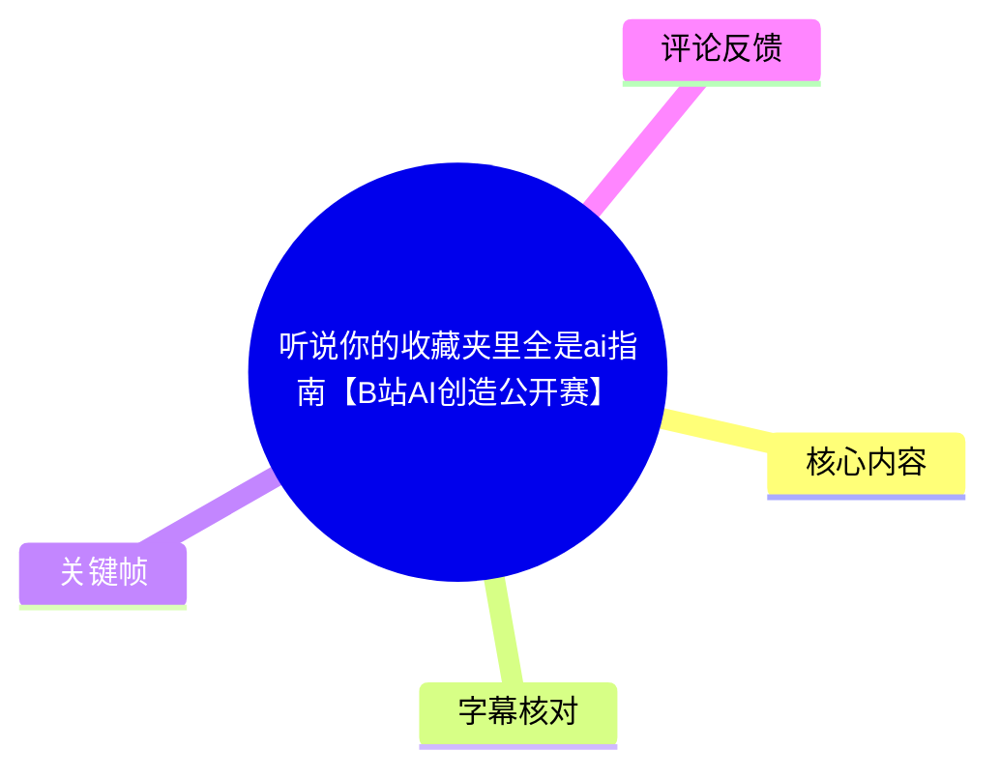
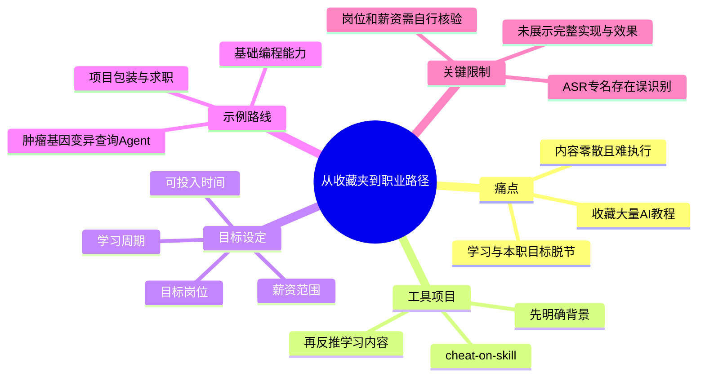

# 听说你的收藏夹里全是ai指南【B站AI创造公开赛】

> 来源：[Bilibili 视频](https://www.bilibili.com/video/BV1vbTP6sEB2) 
> UP 主：他们都叫我蜗牛学长｜发布时间：2026-06-28｜视频时长：02:10｜画面规格：2160×3840（竖屏）

## 小结

视频针对“收藏了大量 AI 教学视频，却没有形成实际学习和求职成果”的问题，介绍了 UP 主开发的一个名为 **cheat-on-skill** 的工具／项目。其核心不是继续推荐零散教程，而是从目标岗位所需能力反向推导个人应该学习什么。

UP 主以自己“AI for Bios（ASR 识别如此，具体英文专业名称未能完全确认）博士背景”为例：先向工具说明个人背景，再由工具结合招聘信息平台上的岗位信息，推荐与 AI Agent 开发相关的职位，并根据其提出的“月薪 3 万元以上”目标筛选岗位方向。

方法论可概括为：**背景盘点 → 目标岗位与薪资约束 → 结合现实可投入时间制定周期 → 分阶段项目化学习 → 记录、复盘并用于求职**。视频强调，学习内容应服务于明确的职业目标，避免把修图、视频、科研等互不相连的 AI 教程全部收藏和学习。

展示的学习路线有三步：先做一个与“肿瘤基因变异查询”相关的 Agent（术语以 ASR 为准，名称存在识别不确定性）、再补足基础编程技能、最后把成果包装为完整案例／项目。这里的“路线”是作者给出的示例，不是适用于所有背景的通用岗位方案。

视频未展示完整操作界面、数据抓取规则、岗位真实性校验、学习计划生成细节或实际求职结果。因此，工具推荐的岗位、薪资和路线均应由使用者自行核验；招聘市场、岗位名称、薪资区间及 GitHub 仓库内容都具有时效性。

## 思维导图

## 目录

- [问题：收藏很多，实际没学](#问题收藏很多实际没学)
- [工具与反向规划方法](#工具与反向规划方法)
- [案例：从背景到 AI Agent 岗位](#案例从背景到-ai-agent-岗位)
- [学习计划：三步项目化路径](#学习计划三步项目化路径)
- [实践建议、限制与时效性](#实践建议限制与时效性)
- [关键帧索引](#关键帧索引)
- [字幕比对](#字幕比对)
- [评论分析](#评论分析)
- [处理记录](#处理记录)

## 问题：收藏很多，实际没学 [00:00:32](https://www.bilibili.com/video/BV1vbTP6sEB2?t=32)

视频在可识别语音开始处直接提出典型问题：观众可能收藏了不少 AI 教学视频，但“一个都没看过”。UP 主将原因归结为学习资料分散、没有与个人目标建立连接，而不是单纯把责任归于学习者缺乏自律。

他也用自身经历佐证这一点：即使自己从事相关开发、学习相关内容，收藏／整理的 AI 教学视频仍可能没有被真正完成。这一表述属于个人经验，不构成对所有学习者的因果解释。

> 图：画面中的字幕强调“教学的视频”，用于对应视频开场所讨论的 AI 教程收藏现象，帮助理解该工具试图解决的不是“缺少资源”，而是“资源无法转化为行动”的问题。

> 图：画面字幕为“怪我没有早点开发出来这个 skill 啊”。这张帧说明视频将解决方案指向一个名为“skill”的项目／工具；“skill”与后续仓库名的关系需结合画面和评论理解，不能仅以 ASR 的“scale”转写为准。

### 这里要避免的学习模式

根据视频原话，问题不在于 AI 教程类别本身，而在于把不同目标的资料混在一起学习。例如：

- 为修图而学的 AI 工具；
- 为视频制作而学的 AI 工具；
- 为科研而学的 AI 工具；
- 但学习者实际从事或希望从事营销等其他工作。

这些技能可能各自有价值，但如果它们不服务于当前职业任务或目标岗位，就容易形成“学了一大堆、却彼此连不上”的状态。视频主张先确定最终用途，再决定课程和项目的取舍。

## 工具与反向规划方法 [00:00:32](https://www.bilibili.com/video/BV1vbTP6sEB2?t=32)

UP 主将自己的方法概括为：**先看 AI 时代需要什么样的人，再倒推个人应该学什么。** 这与通过信息流持续接收教程、再随机学习的方式相反。

画面中展示了 GitHub 页面，仓库归属为 `XBuilderLAB`，仓库名为 `cheat-on-skill`。热评第一条也提供了同一仓库链接：

<https://github.com/XBuilderLAB/cheat-on-skill>

不过，视频素材没有提供仓库 README、安装步骤、版本号、许可证、运行环境或源码功能的完整证据。因此，本文仅将其记录为视频和评论中出现的项目线索，不据此推断其具体技术实现。

> 图：关键帧直接展示 GitHub 的组织名与仓库名，是校正 ASR 将工具名称识别为“scale”的重要多模态证据，也为读者定位视频所指项目提供了可核对线索。

### 视频中呈现的输入与输出关系

| 环节 | 视频所述输入／动作 | 期望输出 |
| --- | --- | --- |
| 个人盘点 | 告知工具自己的背景、现实情况 | 对个人能力与约束的初步理解 |
| 职业目标 | 指定期望岗位方向及薪资范围 | 可参考的岗位目标 |
| 时间约束 | 告知每天可投入的时间、学习周期 | 可执行的学习安排 |
| 能力补齐 | 围绕目标岗位安排学习内容与项目 | 分步骤的技能成长路径 |
| 结果沉淀 | 在同一工具／工作区记录与复盘 | 可用于求职的项目／案例材料 |

需要注意，表中的“期望输出”是对 UP 主口述逻辑的结构化整理；视频没有展示实际表单字段、算法规则或生成结果的全貌。

## 案例：从背景到 AI Agent 岗位 [00:00:56](https://www.bilibili.com/video/BV1vbTP6sEB2?t=56)

UP 主以自身为例，称自己具有“AI for Bios 博士”背景；该短语来自 ASR，发音与具体拼写不够清晰，故不进一步扩展为某个确定学科。他说，即使具备这一背景，自己也不确定在 AI 时代可以具体做什么。

随后，他将个人信息提供给工具。按视频口述，工具会到 **BOSS 直聘**“扒”岗位信息，并推送一个 AI Agent 开发岗位。这里应区分三层信息：

1. **视频陈述**：工具可以基于背景推荐 AI Agent 开发岗位；
2. **作者主观判断**：如果由他自己找工作，会倾向寻找该岗位；
3. **未被视频验证的部分**：是否真的实时抓取平台、抓取是否合法合规、岗位是否仍在招聘、匹配质量如何，均未展示。

### 薪资约束

UP 主提出的薪资目标是**月薪 3 万元以上**。据其说法，工具为其找到一个可能达到该范围的岗位。

这一数字仅是视频个案中的个人目标和作者对岗位的描述，不能理解为 AI Agent 开发岗位的普遍薪资，也不能视为该岗位的确定报价。岗位薪酬通常受城市、经验、学历、业务方向、社保结构、绩效与面试结果等因素影响，应以招聘方发布和实际沟通为准。

## 学习计划：三步项目化路径 [00:01:20](https://www.bilibili.com/video/BV1vbTP6sEB2?t=80)

视频认为，工具的重点不止于“找岗位”，还在于根据个人现实条件安排一份逐步推进的学习计划。UP 主提到计划形成前会询问：

1. 学习者的现实情况；
2. 一个大致学习周期；
3. 每天可以投入的时间。

据此生成详细计划。视频没有给出具体周期长度、每天时长、课程清单、验收标准或项目代码，因此不能补写为确定参数。

### 作者展示的三步示例

1. **先完成一个垂直领域 Agent**  
   ASR 将项目描述为“肿瘤基因变异查询 Agent”，但“肿瘤”“基因”“变异”等词在长句 ASR 中存在一定不确定性。可以确定的是：第一步是先做一个具体业务场景的 Agent，而不是只学习抽象概念。

2. **补齐基础编程技能**  
   视频明确提到学习“基础编程”的技能，但没有指定语言、框架、数据库、部署方式或学习资源。对初学者而言，具体技术栈仍需按目标岗位 JD 与项目需求确定。

3. **包装为完整案例／项目**  
   第三步是把前两步成果包装成完整案例或项目，用于后续展示和求职。视频未明确“包装”的交付格式；可合理理解为需要具备可说明、可演示、可复盘的成果，但简历形式、作品集链接、部署地址等细节并未出现。

### 该路线的可执行化模板

以下是基于视频逻辑整理的执行框架，不是视频已经提供的具体功能或参数：

| 阶段 | 应回答的问题 | 可形成的产出 |
| --- | --- | --- |
| 定位 | 我有什么背景？想进入什么岗位？薪资和时间约束是什么？ | 个人能力盘点、目标岗位描述 |
| 拆解 | 该岗位真正需要哪些能力，哪些是优先级最高的缺口？ | 能力清单与学习顺序 |
| 项目 | 能否用一个具体场景证明目标能力？ | 最小可用项目或 Agent 原型 |
| 补基础 | 为完成项目缺哪些编程与工程能力？ | 定向学习记录、代码与复盘 |
| 包装 | 如何向招聘方说明问题、方案、贡献和结果？ | 项目案例、演示材料、求职表达 |

## 实践建议、限制与时效性 [00:01:44](https://www.bilibili.com/video/BV1vbTP6sEB2?t=104)

视频的落点是：把学习、记录和复盘集中在同一套路径或工作区中完成，而不是继续积累“有的没的”的资料。UP 主认为，掌握与目标岗位有关的内容并形成项目经验，比广泛但零散地学习更接近实际求职需求。

> 图：字幕“结果我一个我都没有看过”强化了视频的经验前提：即便内容生产者或技术从业者，也可能陷入收藏与行动脱节。这为“以目标反推学习”的方案提供了问题背景，而非效果证明。

### 可迁移的经验

- **先定义岗位，再选教程。** 将岗位 JD、目标工作内容和个人现有能力作为筛选依据。
- **将时间作为硬约束。** 视频明确提到每日投入时间与学习周期；计划若不与可投入时间匹配，通常难以执行。
- **用项目作为学习容器。** 相比无目标地观看教程，围绕一个具体 Agent 或业务问题学习，更容易形成技能间的连接。
- **记录与复盘不能省略。** 视频称所有内容可在一个工作区完成记录和复盘；即使不使用该项目，也应保留学习决策、问题、代码版本和项目成果。
- **求职前自行验证。** 岗位内容、薪资、招聘状态和平台信息必须回到官方招聘页面及招聘方沟通进行确认。

### 重要限制

- 视频从 **00:00:00 到 00:00:32** 没有 ASR 识别出的语音文本，本文不对这段内容作语义补写。
- ASR 的第 1 段异常长但仅覆盖 0.34 秒，且出现“制度程讲”“scale”“AFI BIOS”等明显误识别；关键专名采用画面与评论所能支持的最保守表述。
- 视频没有展示 cheat-on-skill 的完整界面、源码逻辑、模型、提示词、数据来源、登录／付费要求和部署过程。
- “BOSS 直聘抓取岗位”的说法来自 UP 主口述。平台条款、数据权限、反爬机制与自动化使用的合规性，均需要实际使用者另行核查。
- “月薪 3 万元以上”是个案目标，不应当作行业基准或收入承诺。
- 视频发布于 2026-06-28；仓库可用性、岗位信息和薪资市场均可能在此后变化。

## 关键帧索引

| 关键帧 | 正文用途 | 画面价值 |
| --- | --- | --- |
|  | 开场痛点 | 以画面字幕确认视频讨论 AI 教学内容与收藏行为。 |
|  | 工具动机 | 提供“skill”这一工具称呼的可见证据。 |
|  | 经验背景 | 说明 UP 主也将自己置于“收藏未学”的问题之中。 |
|  | 项目核对 | 明确显示 `XBuilderLAB / cheat-on-skill`，用于校正 ASR 专名。 |

## 字幕比对

| 字幕来源 | 完整性 | 专有名词 | 时间轴 | 主要问题 |
| --- | --- | --- | --- | --- |
| Bilibili 站内字幕 | 未提供可用字幕 | 无法核验 | 无法核验 | 素材明确标注“未提供可用站内字幕”。 |
| 本次 ASR 字幕 | 覆盖 32.26—129.10 秒；诊断语音覆盖约 74.81% | 存在多处不稳定识别 | 有 5 段带时间戳 SRT，可直接定位 | 首段时间仅 0.34 秒却承载过长文本；“scale”“AFI BIOS”“总流基因便宜查询”等词疑似误识别。 |

### 最终字幕选择与校正原则

最终以**本次 ASR 的带时间戳 SRT**作为章节定位依据，因为没有可用站内字幕。ASR 诊断显示音频语言为中文，置信度约 0.995，音频时长约 129.45 秒；未标记 `noAudioStream=true`，因此不能将字幕问题归因为源视频无音轨。

对正文中的关键词采取如下校正策略：

- ASR 的“scale”不直接采用。关键帧清晰显示 GitHub 仓库 `XBuilderLAB / cheat-on-skill`，热评第一条也给出同名链接，因此正文使用 `cheat-on-skill` 作为仓库名。
- 对“AI for Bios”“肿瘤基因变异查询”等无法由现有画面完全确认的内容，保留 ASR 来源及不确定性，不擅自扩展为具体学科、产品或项目名称。
- 章节时间均来自 ASR SRT 的真实起止时间：32.26 秒、56.60 秒、80.64 秒、104.70 秒；未按文字顺序臆测未识别片段的时间。

## 评论分析

仅处理可获取的热评前三条。评论属于用户观点或线索，不作为已验证事实。

1. **普通的-易辰p｜48 赞**  
   评论指出视频中已经贴出 GitHub 仓库名，并提供链接 `https://github.com/XBuilderLAB/cheat-on-skill`。这为项目定位提供了补充线索，也与关键帧中的 `XBuilderLAB / cheat-on-skill` 一致。  
   可信度边界：该评论只能证明评论者提供了这一链接，不能独立证明仓库当前可用、内容安全、功能与视频描述完全一致。

2. **提莫灬料理｜5 赞**  
   评论询问是否有人能提供“加速器”，理由是 GitHub 下载速度较慢。它反映出部分观众可能面临 GitHub 网络访问或下载速度问题。  
   风险提示：评论未提供任何具体服务、方法或安全说明；不应据此使用来源不明的网络工具或下载渠道。

3. **不穿衣服的祢老弟｜2 赞**  
   “进收藏夹吧你”是对视频主题的调侃：观众可能继续收藏本视频而不行动。  
   该评论没有额外技术信息，但准确呼应视频对“收藏多、执行少”的批评。

## 处理记录

- Worker ID：`worker-mrplns82-755ed24d`
- 模型：`gpt-5.6-terra`
- 调用工具与模型：素材编排流程提供的视频元数据、关键帧、ASR SRT／JSON 诊断、评论 JSON；ASR 模型为 `medium`，运行于 `cuda`，计算类型为 `float16`。
- 使用的素材文件：`frames/`、`asr/transcript.srt`、`asr/asr-result.json`、`comments/comments.json`、视频元数据与封面信息。
- 字幕选择：未发现可用 Bilibili 站内字幕；已检查本次 ASR，采用其带时间戳 SRT 进行定位，并以关键帧和热评中可核对的仓库名校正明显专名误识别。
- 关键帧选择依据：选用 `frame-001` 至 `frame-004`，因为这些画面分别包含“教学视频”、开发动机、“未看完收藏”与 GitHub 仓库名，能直接支撑正文中的问题、方案和专名校正；其余关键帧未在提供素材中附带可确认画面信息，未强行解释。
- 评论范围：仅分析了可获取热评前三条，未扩展至其他评论。
- 缓存清理：本次仅使用任务已提供的素材清单与文件引用，未生成需要额外清理的临时下载缓存；未报告残留缓存。
- 未解决问题：工具完整功能、源码实现、BOSS 直聘数据获取方式、岗位真实性、薪资构成、学习计划参数及项目实际求职效果均未在素材中展示，无法据此确认。
